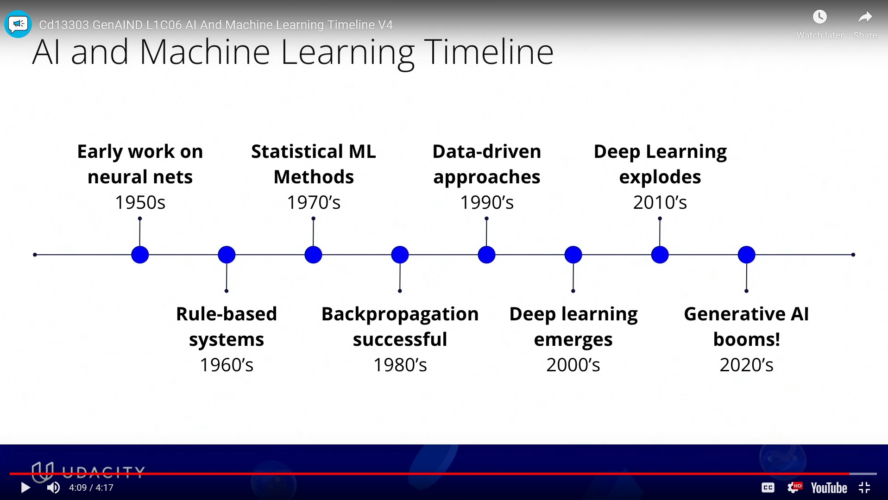
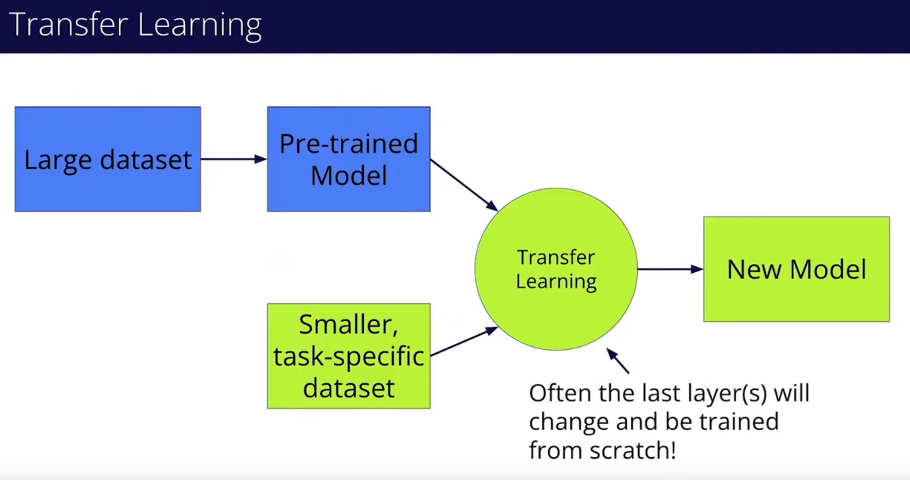
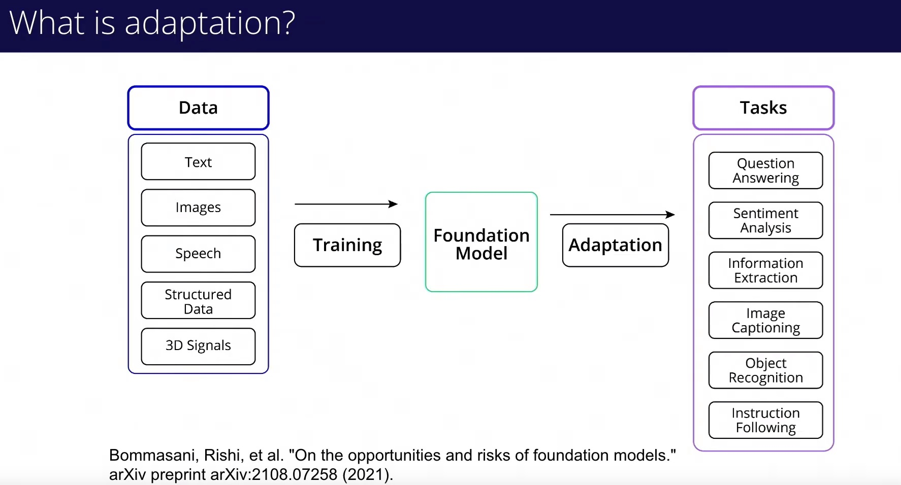
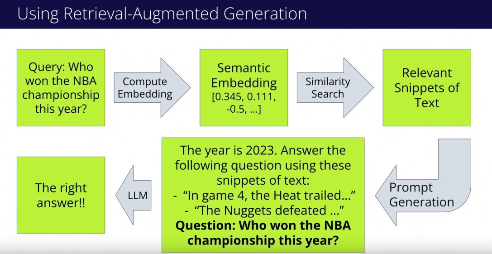
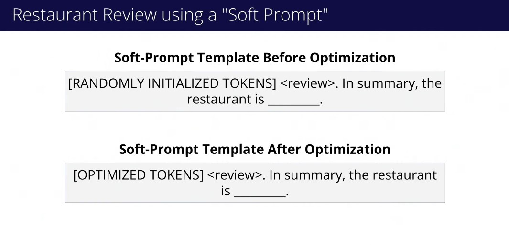

# Udacity Generative AI Nanodegree: Generative AI Fundamentals

These are my personal notes taken while following the [Udacity Generative AI Nanodegree](https://www.udacity.com/course/generative-ai--nd608).

The Nanodegree has 4 modules:

1. Generative AI Fundamentals.
2. Large Language Models (LLMs) & Text Generation.
3. Computer Vision and Generative AI.
4. Building Generative AI Solutions.

This folder & guide refer to the **first module**: Generative AI Fundamentals.

Mikel Sagardia, 2024.
No guarantees.

Overview of Contents:

- [Udacity Generative AI Nanodegree: Generative AI Fundamentals](#udacity-generative-ai-nanodegree-generative-ai-fundamentals)
  - [1. Introduction to Generative AI](#1-introduction-to-generative-ai)
    - [What Is Generative AI?](#what-is-generative-ai)
    - [Applications of Generative AI](#applications-of-generative-ai)
      - [Note on LLMs](#note-on-llms)
      - [Links of Examples](#links-of-examples)
    - [AI and Machine Learning Timeline](#ai-and-machine-learning-timeline)
    - [Training Generative AI Models](#training-generative-ai-models)
    - [Generation Algorithms](#generation-algorithms)
    - [Exercise: Generate Text using HuggingFace + GPT2](#exercise-generate-text-using-huggingface--gpt2)
    - [Other Generative AI Architectures](#other-generative-ai-architectures)
  - [2. Deep Learning Fundamentals](#2-deep-learning-fundamentals)
    - [Machine Learning and Deep Learning](#machine-learning-and-deep-learning)
    - [Notebooks: Machine Learning](#notebooks-machine-learning)
    - [Hugging Face](#hugging-face)
      - [Example: Sentiment Analysis, IMDB Dataset](#example-sentiment-analysis-imdb-dataset)
      - [Example: Trainer](#example-trainer)
    - [Notebooks: Pytorch + Hugging Face](#notebooks-pytorch--hugging-face)
    - [Transfer Learning](#transfer-learning)
    - [Notebook: Transfer Learning with MobileNetV3](#notebook-transfer-learning-with-mobilenetv3)
  - [3. Foundation Models](#3-foundation-models)
    - [Notebook: Foundation Model as Email Spam Classifier](#notebook-foundation-model-as-email-spam-classifier)
    - [GLUE and SuperGLUE Benchmarks](#glue-and-superglue-benchmarks)
      - [GLUE](#glue)
      - [SuperGLUE](#superglue)
    - [Training Data](#training-data)
      - [Biases](#biases)
      - [Links to Some Data Sources](#links-to-some-data-sources)
    - [Risks and the Bad Side of LLMs](#risks-and-the-bad-side-of-llms)
  - [4. Adapting Foundation Models](#4-adapting-foundation-models)
    - [RAG = Retrieval Augmented Generation](#rag--retrieval-augmented-generation)
    - [Prompt Design Techniques](#prompt-design-techniques)
      - [Prompt Tuning](#prompt-tuning)
      - [Exercises, Examples: Improving Prompts](#exercises-examples-improving-prompts)
    - [Using Probing to Train a Classifier Head](#using-probing-to-train-a-classifier-head)
    - [Exercise: Train a BERT Sentiment Classifier](#exercise-train-a-bert-sentiment-classifier)
    - [Fine-Tuning](#fine-tuning)
    - [Exercise: Fine-Tuning a BERT Model on New Data](#exercise-fine-tuning-a-bert-model-on-new-data)
  - [5. Project: Applying Lightweight Fine-Tuning to a Foundation Model](#5-project-applying-lightweight-fine-tuning-to-a-foundation-model)
  - [Introduction to PEFT](#introduction-to-peft)
    - [LoRA = Low Rank Adaptation](#lora--low-rank-adaptation)
    - [Training with PEFT-LoRA](#training-with-peft-lora)
    - [Additional Functionalities](#additional-functionalities)
      - [ONNX](#onnx)
      - [Tensorboard](#tensorboard)
      - [Custom Datasets](#custom-datasets)
      - [Pushing to the HuggingFace Hub](#pushing-to-the-huggingface-hub)
    - [Tasks, Suggested Models and Configurations](#tasks-suggested-models-and-configurations)
    - [Text Classification Datasets](#text-classification-datasets)
    - [Useful Links](#useful-links)
    - [Notebooks](#notebooks)
    - [Project Requirements](#project-requirements)


## 1. Introduction to Generative AI

Lesson objectives:

> - Identify industry applications, trends, and opportunities of Generative AI
> - Contextualize Generative AI within the broader history and landscape of machine learning and artificial intelligence
> - Describe the general process that popular Generative AI models use to generate outputs

Instructor: [Brian Cruz](https://www.linkedin.com/in/briancruzsf/).

### What Is Generative AI?

Examples of Generative AI:

- Text generation; e.g., ChatGPT
- Image generation; e.g., DALL-E
- Code generation; e.g., Github Copilot
- Audio generation: music and speech; e.g., [Meta's AudioCraft](https://ai.meta.com/resources/models-and-libraries/audiocraft/)

### Applications of Generative AI

In general, Generative AI has accelerated the ease to produce some content that previously required much more time. That implies people have become more productive; however, we should use it responsibly to avoid destroying jobs, among other risks.

- Creative content generation
  - Artwork synthesis: visual art pieces
  - Music composition: original musical pieces
  - Literary creation: written content
- Product development
  - Design optimization: refine designs
  - Rapid prototyping: concepts, visualization
  - Material exploration: predict and explore new materials
- Scientific research
  - Experiment simulation: physical testing less required
  - Data analysis and prediction
  - Molecular discovery: drug discovery
- Data augmentation
  - Image enhancement: new image varations
  - Text augmentation: diverse new texts
  - Synthetic data creation: new datasets from scratch
- Personalization
  - Content recommendation based on preferences and behavior
  - Bespoke product creation: tailored to individual specs
  - Experience customization: suit individual user preferences

#### Note on LLMs

> LLMs are able to create sentences that sound like they are written by humans, but they can struggle with questions that involve basic logic.
> This is because LLMs are primarily trained to be able to fill in missing words in sentences from the large corpora of text they are trained on.

Also, LLMs often avoid saying a simple *I don't know*, instead they try to hallucinate a made up answer. That is so because the principle they work on is precisely the hallucination of predicting the next word given the previous context.

#### Links of Examples

- [DeepMind: Millions of new materials discovered with deep learning](https://deepmind.google/discover/blog/millions-of-new-materials-discovered-with-deep-learning/)
- [Audi: Reinventing the wheel? “FelGAN” inspires new rim designs with AI](https://www.audi-mediacenter.com/en/press-releases/reinventing-the-wheel-felgan-inspires-new-rim-designs-with-ai-15097)
- [Paper: May the force of text data analysis be with you: Unleashing the power of generative AI for social psychology research](https://www.sciencedirect.com/science/article/pii/S2949882123000063)
- [Udacity Course on Small Datasets and Synthetic Data](https://www.udacity.com/course/small-data--cd12528)

### AI and Machine Learning Timeline

[Video: AI And Machine Learning Timeline](https://www.youtube.com/watch?v=W_n7kXdaC1Q)



### Training Generative AI Models

[Video: How Generative AI Models Are Trained](https://www.youtube.com/watch?v=cJ0VbfrN0iA)

Generative AI models are trained to learn an internal representation of a vast dataset. Then, after training, they can sample in the learned distribution to generate new but convincing data (images, text, etc.).

There are many ways to train generative AI models; we focus on two:

- LLMs: given a sequence of words (context) predict the next one; we reward the correct word and penalize the rest.
- Image generation models (e.g., diffusion models): they use the techniques in Variational Autoencoders; images are encoded into a latent space and then decoded back to reconstructued images. Bad reconstructions are penalized, good ones rewarded. Then, we use only the decoder part to generate new images feeding a latent vector.

### Generation Algorithms

Some generation algorithms:

- **Autoregression** for text generation: predict next word in a sequence, based on an initial seed and the previously detected words.
  - For each sequence, the probability of the words in a vocabulary to be the next word is predicted.
  - The models are trained to predict the next word or a word in between; i.e., we mask or remove some part of information and the model needs to find the original piece of information.
- **Latent Space Decoding**: we have trained an encoder and a decoder. We use the decoder to input random or manual vectors (latent vectors) and the decoder generates an expanded human-understandable representation.
- **Diffusion** models, often for images: they remove noise from a noisy (random) map. They iteratively remove noise to create a noise-free image.
  - The training consists in learning how to remove small steps of noise.
  - Again, we introduce small pieces of noise and try to find out the original piece of information without noise.

Common theme: we often take some information and add noise or mask it, and force the model to learn the obscured piece of information.
Then, the resulting models are able to generate new in-distribution information.

### Exercise: Generate Text using HuggingFace + GPT2

Notebook: [`lab/Exercise2-generating-one-token-at-a-time.ipynb`](./lab/Exercise2-generating-one-token-at-a-time.ipynb).

* Loads a pretrained causal language model and tokenizer using Hugging Face Transformers.
* Demonstrates how input text is tokenized into subword tokens.
* Computes next-token probabilities manually and appends the most likely token step-by-step.
* Allows interactive token-by-token generation to observe how text evolves.
* Compares manual generation with the model's built-in `.generate()` method for multi-token output.

### Other Generative AI Architectures

- **Generative Adversarial Networks (GANs)**
  - Generator + Discriminator.
  - Generator is trained to create new data samples; it takes random noise as input.
  - Discriminator is trained to discriminate whether the input is a real or generated sample.
  - They are able to generate very realistic images.
- **Recurrent Neural Networks (RNNs)**:
  - They predict the next element for an input sequence.
  - With each input, the RNN updates a hidden inner state, which is a combination of long and short-term memory.
- **Transformers**:
  - Text generation, translation.
  - They learn long-range dependencies in sequential data, and can generate new data, too.
  - Main difference & benefit of Transformers wrt. RNNs: they can work with the entire sequence in parallel! Thus, their training is much faster and scalable.

## 2. Deep Learning Fundamentals

See these resources of mine for deeper explanations:

- [mxagar/deep_learning_udacity](https://github.com/mxagar/deep_learning_udacity)
- [mxagar/machine_learning_coursera](https://github.com/mxagar/machine_learning_coursera)
- [mxagar/machine_learning_ibm](https://github.com/mxagar/machine_learning_ibm)
- [mxagar/tool_guides/hugging_face](https://github.com/mxagar/tool_guides/tree/master/hugging_face)

### Machine Learning and Deep Learning

**Machine Learning** concepts introduced in the videos of the GenAI course:

- Binary classifier
- Perceptron
- Weights and biases
- Activation function: sigmoid, ReLU
- Multi-Layer Perceptron
- Input, output and hidden layers
- Labeling a dataset
- Cost function
- Gradient descend
- Backpropagation
- Learning rate

**Pytorch** concepts introduced in the videos:

- Tensors
  - Multidimensional arrays: vectors, matrices, etc.
  - Several types
  - Linear algebra operations can be performed
- Neural nets as derived classes: `nn.Module`
- Loss functions: error computation between target/expected and model output
  - Classification: cross-entropy loss
  - Regression: Mean-Squared Error (MSE)
- Optimizers: adjust model parameters to minimize the cost/error
  - Gradients
  - Stochastic Gradient Descend
  - Learning rate
  - Momentum: add past weights
  - Adam: very good results, without much hyperparameter tuning
- Datasets and Data Loaders
  - Dataset class: represents and enables access to data in disk
  - Dataset loader class: loads samples from Dataset, e.g., in batches, shuffled, in parallel, etc.
- Training loop
  - Epochs, batches
  - 

Simple code examples:

```python
import torch
import torch.nn as nn
import torch.optim as optim
from torch.utils.data import Dataset, DataLoader


class MLP(nn.Module):
    def __init__(self, input_size):
        super(MLP, self).__init__()
        self.hidden_layer = nn.Linear(input_size, 64)
        self.output_layer = nn.Linear(64, 2)
        self.activation = nn.ReLU()

    def forward(self, x):
        x = self.activation(self.hidden_layer(x))
        return self.output_layer(x)

# Loss functions
ce_loss_function = nn.CrossEntropyLoss()
target_tensor = torch.tensor([1])
predicted_tensor = torch.tensor([[2.0, 6.0]])
loss_value = ce_loss_function(predicted_tensor, target_tensor)  # tensor(0.0181)

mse_loss_function = nn.MSELoss()
predicted_tensor = torch.tensor([320000.0])
actual_tensor = torch.tensor([300000.0])
loss_value = mse_loss_function(predicted_tensor, actual_tensor)
print(loss_value.item())  # 400000000.0

# Optimizers
sgd_optimizer = optim.SGD(model.parameters(), lr=0.01, momentum=0.9)
adam_optimizer = optim.Adam(model.parameters(), lr=0.01)

# Create a toy dataset
class NumberProductDataset(Dataset):
    def __init__(self, data_range=(1, 10)):
        self.numbers = list(range(data_range[0], data_range[1]))

    def __getitem__(self, index):
        number1 = self.numbers[index]
        number2 = self.numbers[index] + 1
        return (number1, number2), number1 * number2

    def __len__(self):
        return len(self.numbers)

# Instantiate the dataset
dataset = NumberProductDataset(
    data_range=(0, 11)
)

# Access a data sample
data_sample = dataset[3]
print(data_sample)
# ((3, 4), 12)

# Instantiate the dataset
dataset = NumberProductDataset(data_range=(0, 5))

# Create a DataLoader instance
dataloader = DataLoader(dataset, batch_size=3, shuffle=True)

# Iterating over batches
for (num_pairs, products) in dataloader:
    print(num_pairs, products)
# [tensor([4, 3, 1]), tensor([5, 4, 2])] tensor([20, 12, 2])
# [tensor([2, 0]), tensor([3, 1])] tensor([6, 0])

# Training loop
for epoch in range(10):
    total_loss = 0.0
    for number_pairs, sums in dataloader:  # Iterate over the batches
        predictions = model(number_pairs)  # Compute the model output
        loss = loss_function(predictions, sums)  # Compute the loss
        loss.backward()  # Perform backpropagation
        optimizer.step()  # Update the parameters
        optimizer.zero_grad()  # Zero the gradients

        total_loss += loss.item()  # Add the loss for all batches

    # Print the loss for this epoch
    print("Epoch {}: Sum of Batch Losses = {:.5f}".format(epoch, total_loss))
```

### Notebooks: Machine Learning

Notebook: [`lab/Exercise1-classification-of-handwritten-digits-using-an-mlp.ipynb`](./lab/Exercise1-classification-of-handwritten-digits-using-an-mlp.ipynb)

* Loads the MNIST digit dataset using `sklearn.datasets.fetch_openml`.
* Trains a Multi-Layer Perceptron (MLP) classifier using `sklearn.neural_network.MLPClassifier`.
* Evaluates the model on both training and test datasets, reporting accuracy.
* Visualizes predictions on a sample of test images to manually inspect results.

### Hugging Face

**Hugging Face** concepts introduced in the videos of the GenAI course:

- Tokenizers
  - BERT
  - cased/uncased
  - Vocabulary
  - Subword tokenization
- Models
- Datasets
- Trainers
  - Truncating: shortening longer pieces of text to fit a certain size limit.
  - Padding: Adding filler data to shorter texts to reach a uniform length.
  - Batches: small, evenly divided parts of data.

#### Example: Sentiment Analysis, IMDB Dataset

```python
from IPython.display import HTML, display
from datasets import load_dataset
from transformers import BertForSequenceClassification, BertTokenizer
import torch

# Load the IMDB dataset, which contains movie reviews
# and sentiment labels (positive or negative)
dataset = load_dataset("imdb")

# Fetch a review from the training set
review_number = 42
sample_review = dataset["train"][review_number]

display(HTML(sample_review["text"][:450] + "..."))
# WARNING: This review contains SPOILERS. Do not read if you don't want some points revealed to you before you watch the
# film.
# 
# With a cast like this, you wonder whether or not the actors and actresses knew exactly what they were getting into. Did they
# see the script and say, `Hey, Close Encounters of the Third Kind was such a hit that this one can't fail.' Unfortunately, it does.
# Did they even think to check on the director's credentials...

if sample_review["label"] == 1:
    print("Sentiment: Positive")
else:
    print("Sentiment: Negative")
# Sentiment: Negative

# Load a pre-trained sentiment analysis model
# IMPORTANT: the model was fine-tuned specifically for binary sentiment classification
# If we pass num_labels != 2 to it, it delivers random values, because the head needs to be re-trained
model_name = "textattack/bert-base-uncased-imdb"
model = BertForSequenceClassification.from_pretrained(model_name, num_labels=2)

# Tokenize the input sequence
tokenizer = BertTokenizer.from_pretrained(model_name)
inputs = tokenizer("I love Generative AI", return_tensors="pt")

# Make prediction
with torch.no_grad():
    outputs = model(**inputs).logits
    probabilities = torch.nn.functional.softmax(outputs, dim=1)
    predicted_class = torch.argmax(probabilities)

# Display sentiment result
if predicted_class == 1:
    print(f"Sentiment: Positive ({probabilities[0][1] * 100:.2f}%)")
else:
    print(f"Sentiment: Negative ({probabilities[0][0] * 100:.2f}%)")
# Sentiment: Positive (88.68%)
```

#### Example: Trainer

```python
from transformers import (DistilBertForSequenceClassification,
    DistilBertTokenizer,
    TrainingArguments,
    Trainer
)
from datasets import load_dataset

model = DistilBertForSequenceClassification.from_pretrained(
    "distilbert-base-uncased", num_labels=2
)
tokenizer = DistilBertTokenizer.from_pretrained("distilbert-base-uncased")

def tokenize_function(examples):
    return tokenizer(examples["text"], padding="max_length", truncation=True)

dataset = load_dataset("imdb")
tokenized_datasets = dataset.map(tokenize_function, batched=True)

training_args = TrainingArguments(
    per_device_train_batch_size=64,
    output_dir="./results",
    learning_rate=2e-5,
    num_train_epochs=3,
)
trainer = Trainer(
    model=model,
    args=training_args,
    train_dataset=tokenized_datasets["train"],
    eval_dataset=tokenized_datasets["test"],
)
trainer.train()
```

### Notebooks: Pytorch + Hugging Face

Notebook: [`lab/Exercise2-pytorch-and-hugging-face-scavenger-huntscavenger-hunt.ipynb`](./lab/Exercise2-pytorch-and-hugging-face-scavenger-huntscavenger-hunt.ipynb)

Here is a summary of the notebook **“Exercise: PyTorch and HuggingFace scavenger hunt!”** in 5 bullet points:

* Introduces **basic PyTorch concepts**, including tensor creation, neural network layers (`torch.nn`), loss functions, and optimizers.
* Walks through constructing a simple training loop using PyTorch, with practice exercises and solutions.
* Transitions to **Hugging Face**, guiding the user to load a pretrained sentiment analysis model.
* Demonstrates how to use Hugging Face's Transformers library to tokenize text, run inference, and interpret sentiment predictions.
* Shows how to load a dataset from the Hugging Face `datasets` library for further experimentation.

### Transfer Learning

**Transfer Learning** concepts introduced in the videos of the GenAI course:

- Trasnfer learning: we train a model in a large domain dataset and then we train the head of that model on a smaller task-specific dataset.
  - The new head has the number of outputs we require for our task.
- Example large datasets: Common Crawl, ImageNet, LibriSpeech



### Notebook: Transfer Learning with MobileNetV3

Paper: [MobileNetV3](https://paperswithcode.com/method/mobilenetv3)

Notebook: [`lab/Exercise3-transfer-learning-using-mobilenetv3.ipynb`](./lab/Exercise3-transfer-learning-using-mobilenetv3.ipynb)

* Loads the **Fashion-MNIST** dataset and defines helper functions to map label indices to names.
* Visualizes example training images to verify dataset integrity before training.
* Loads a **pretrained MobileNetV3 model** and modifies its classifier head for the Fashion-MNIST classification task.
* Trains the model using PyTorch, with device support for GPU, MPS, or CPU.
* Evaluates the trained model and visualizes correct and incorrect predictions on the test set.

## 3. Foundation Models

Characteristics of **Foundation Models**:

- Trained on several tasks
- Large/huge datasets used
- They require large amounts of resources to be trained
- They can generalize to new, unseen data
- They can perform tasks they were not trained for
- They can be adapted to specific domains and tasks
- Example: (Chat-) GPT model family, Bard/Gemini model family, etc.

In contrast, **traditional models** are trained on smaller and task-specific datasets, and require less resources.

The Foundation Model architecture is based on the **Transformer**:

- They handle sequential data in parallel, all at once, in contrast to previous RNNs.
- They have the novel **self-attention** mechanism, which is important for language modeling, where the relationship between words in a sequence are important to understand the sentence/sequence.

Some sizes of foundation models:

- Llama (2023) was trained on 4.7 TB of data
- Llama (2023) parameters: 6.7B - 65.2B

### Notebook: Foundation Model as Email Spam Classifier

Notebook: [`lab/Exercise1-use-a-foundation-model-to-build-a-spam-email-classifier.ipynb`](./lab/Exercise1-use-a-foundation-model-to-build-a-spam-email-classifier.ipynb)

* Loads a spam dataset (e.g., SMS spam) from Hugging Face using the `datasets` library.
* Defines label mappings and helper functions to preprocess and format SMS messages.
* Builds a **prompt-based classifier using a large language model (LLM)** to identify spam vs. ham.
* Evaluates classifier accuracy by comparing model outputs to true labels from the dataset.
* Iteratively improves the prompt and reruns evaluation to check for better accuracy and analyze misclassifications. **The improvement comes by adding some examples in the query/prompt, which increases the performance!**

### GLUE and SuperGLUE Benchmarks

Key points:

- GLUE = General Language Understanding Evaluation
- It is a collection of tests/tasks
- SuperGLUE is the successor of GLUE: it's more advanced and it appeared when models started achieving human parity in GLUE

#### GLUE

*Alex Wang, Amanpreet Singh, Julian Michael, Felix Hill, Omer Levy & Samuel R. Bowman.*  
[**GLUE: A Multi-Task Benchmark and Analysis Platform for Natural Language Understanding** (April 2018).](https://arxiv.org/abs/1804.07461)


| Short Name | Full Name                              | Description                                                           | Example                                                                                                                                  |
| ---------- | -------------------------------------- | --------------------------------------------------------------------- | ---------------------------------------------------------------------------------------------------------------------------------------- |
| **CoLA**   | Corpus of Linguistic Acceptability     | Determine if a sentence is grammatically acceptable.                  | ✅ *"The boy is playing outside."*<br>❌ *"The boy playing is outside."*                                                                   |
| **SST-2**  | Stanford Sentiment Treebank            | Predict sentiment of a sentence (positive/negative).                  | *"This movie was fantastic!"* → **Positive**<br>*"The plot was boring and predictable."* → **Negative**                                  |
| **MRPC**   | Microsoft Research Paraphrase Corpus   | Classify if two sentences are paraphrases.                            | *"He is a doctor."* / *"He works as a medical professional."* → **Paraphrase**                                                           |
| **STS-B**  | Semantic Textual Similarity Benchmark  | Score how semantically similar two sentences are (0–5).               | *"A man is playing guitar."* / *"A person plays a musical instrument."* → **4.8**                                                        |
| **QQP**    | Quora Question Pairs                   | Determine if two questions are semantically equivalent.               | *"How can I learn Python?"* / *"What's the best way to study Python?"* → **Duplicate**                                                   |
| **MNLI**   | Multi-Genre Natural Language Inference | Decide if hypothesis is *entailment*, *neutral*, or *contradiction*.  | Premise: *"A man is playing a piano."*<br>Hypothesis: *"A man is making music."* → **Entailment**                                        |
| **QNLI**   | Question Natural Language Inference    | Determine if a passage answers a given question.                      | Question: *"Where is the Eiffel Tower?"*<br>Sentence: *"The Eiffel Tower is located in Paris, France."* → **Entailment**                 |
| **RTE**    | Recognizing Textual Entailment         | Binary entailment task: does one sentence logically follow the other? | Sentence1: *"Dogs bark loudly."*<br>Sentence2: *"Dogs make noise."* → **Entailment**                                                     |
| **WNLI**   | Winograd Natural Language Inference    | Resolve pronoun references based on nuanced context.                  | *"The city council refused the demonstrators a permit because they feared violence."*<br>**Who feared violence?** → **The city council** |

#### SuperGLUE

*Alex Wang, Yada Pruksachatkun, Nikita Nangia, Amanpreet Singh, Julian Michael, Felix Hill, Omer Levy & Samuel R. Bowman.*
[**SuperGLUE: A Stickier Benchmark for General-Purpose Language Understanding Systems** (May 2019)](https://arxiv.org/abs/1905.00537)


| Short Name  | Full Name                                        | Description                                                                           | Example                                                                                                                                                              |
| ----------- | ------------------------------------------------ | ------------------------------------------------------------------------------------- | -------------------------------------------------------------------------------------------------------------------------------------------------------------------- |
| **BoolQ**   | Boolean Questions                                | Answer a *yes/no* question given a passage.                                           | Passage: *"The Great Wall of China is over 13,000 miles long."*<br>Q: *"Is the Great Wall in Japan?"* → **No**                                                       |
| **CB**      | CommitmentBank                                   | Classify entailment, contradiction, or neutral based on a premise and hypothesis.     | Premise: *"John might go to the party."*<br>Hypothesis: *"John will definitely go to the party."* → **Contradiction**                                                |
| **COPA**    | Choice of Plausible Alternatives                 | Choose the more plausible cause or effect.                                            | Premise: *"The man broke his toe."*<br>Q: *"What was the cause?"*<br>A1: *"He dropped a hammer on his foot."*<br>A2: *"He got a promotion."* → **A1**                |
| **MultiRC** | Multi-Sentence Reading Comprehension             | Answer multi-choice questions from a passage, possibly with multiple correct answers. | Passage: *"...Alice and Bob went hiking... Bob packed food, Alice brought water..."*<br>Q: *"Who brought supplies?"*<br>Answers: ✅ **Alice**, ✅ **Bob**              |
| **ReCoRD**  | Reading Comprehension with Commonsense Reasoning | Fill in a blank with the correct entity from the passage.                             | Passage: *"...Marie Curie won two Nobel Prizes for her work on radioactivity..."*<br>Q: *"\_\_\_ won two Nobel Prizes for work on radioactivity."* → **Marie Curie** |
| **RTE**     | Recognizing Textual Entailment                   | Decide whether one sentence entails the other.                                        | Sentence1: *"A man is playing a piano."*<br>Sentence2: *"A man is making music."* → **Entailment**                                                                   |
| **WiC**     | Words in Context                                 | Determine if a word has the same meaning in two different contexts.                   | Sentence1: *"She gave him a ring."*<br>Sentence2: *"The phone began to ring."*<br>Word: *"ring"* → **Different**                                                     |
| **WSC**     | Winograd Schema Challenge                        | Resolve pronoun references using commonsense reasoning.                               | *"Emma thanked Julie because she helped her with the project."*<br>Q: *"Who helped Emma?"* → **Julie**                                                               |
| **AX-b**    | Broad Coverage Diagnostic                        | Diagnostic test for evaluating linguistic capabilities.                               | No fixed format — includes tasks like coreference, negation, and quantifiers to probe model behavior.                                                                |
| **AX-g**    | Winogender Schema Diagnostics                    | Diagnostic set to assess gender bias in coreference resolution. Coreference: when two words refer to the same concept.                      | *"The doctor hired the nurse because she was experienced."*<br>Tests whether “she” is wrongly assumed to be the nurse due to gender bias.                            |

### Training Data

LLMs and Foundation Models need to be trained with high quality data to perform nicely; these include:

- Websites (CommonCrawl): any kind of topic, text style, etc.
- Scientific papers (Arxiv): technical language and complex concepts
- Encyclopedias: general knowledge
- Books and literature: rich vocabulary and complex sentence structures
- Conversational posts: dialogues from TV scripts, colloquial speech
- Social media posts: modern jargon
- Legal documents: complex texts
- Multilingual texts: to allow for several languages

Texts are not used as they are; instead, they need to be preprocessed: cleaned, anonymized, filtered (for biases), formatted.

Some reference data points:

- 1GB text data = 1000 Books
- Llama v1 was trained with 4.7TB text data

#### Biases

**Biases** in the data can shape the model in an invisible yet impactful manner. These biases are often a reflection of historical data/events and can lead to the perpetuation of past errors.

Here are some biases:

| Bias Type                         | Description                                                                                | Example                                                                                              |
| --------------------------------- | ------------------------------------------------------------------------------------------ | ---------------------------------------------------------------------------------------------------- |
| **Selection Bias**                | Data used for training doesn’t represent the target population due to how it was selected. | A facial recognition model trained mostly on light-skinned individuals performs poorly on others.    |
| **Historical Bias**               | Biases present in society that are carried into the dataset and model.                     | A hiring algorithm trained on past resumes favors male applicants due to biased hiring history.      |
| **Confirmation Bias**             | Favoring data or patterns that align with preexisting beliefs or hypotheses.               | A sentiment classifier trained only on product reviews labeled by enthusiasts overstates positivity. |
| **Discriminatory Outcomes**       | Outputs that unfairly harm or disadvantage specific groups.                                | A loan approval model disproportionately denies applications from certain zip codes.                 |
| **Echo Chambers**                 | Feedback loops where biased outputs reinforce similar biased inputs.                       | A recommendation system keeps suggesting extreme political content based on initial clicks.          |
| **Measurement Bias**                     | Occurs when the tools or processes used to collect data systematically distort it. | Using outdated medical sensors that underreport symptoms in women compared to men.                |
| **Labeling Bias**                        | Introduced when human annotators apply inconsistent or subjective labels.          | Crowdworkers label images of “boss” as men more often than women, skewing downstream predictions. |
| **Simpson’s Paradox / Aggregation Bias** | Statistical trend visible in subgroups is hidden or reversed when combined.        | A model shows high accuracy overall but performs poorly on minority subgroups due to aggregation. |

Increasing organization diversity automatically decreases biases, because the environment becomes more tolerant to different views.

#### Links to Some Data Sources

- [https://commoncrawl.org/](https://commoncrawl.org/): Over 250 billion pages spanning 18 years, free. Greater than 1 PB. Unstructured and noisy.
- [https://www.githubarchive.org/](https://www.githubarchive.org/): Public repositories.
- [https://dumps.wikimedia.org/](https://dumps.wikimedia.org/): Available in many formats.
- [https://www.gutenberg.org/](https://www.gutenberg.org/): 75000 free eBooks.

### Risks and the Bad Side of LLMs

**Disinformation and misinformation** are both false or inaccurate information, but:

- Disinformation: intentional
- Misinformation: inadvertent

LLMs hallucinate and can help spread misinformation.

Additional risks:

- [AI has high data center energy costs](https://mitsloan.mit.edu/ideas-made-to-matter/ai-has-high-data-center-energy-costs-there-are-solutions)
- [Generative AI Has a Massive E-Waste Problem](https://spectrum.ieee.org/e-waste)
- [Exploring privacy issues in the age of AI ](https://www.ibm.com/think/insights/ai-privacy)
- **Over-reliance**

## 4. Adapting Foundation Models

Adaptation consists in customizing a pretrained Foundation Model to domain-specific tasks.



Examples:

- Chatbot adaptation to banking
- LLM to structure medical records
- Specific instruction-based adaptation: translation of texts
- Fine-tuning of the model to be able to use private/corporate data

Relevant paper: [On the Opportunities and Risks of Foundation Models, Bommasani et al. (2021)](https://arxiv.org/abs/2108.07258)

* Coined and popularized the term **“foundation model.”**
* Proposed that foundation models represent a **paradigm shift** in AI, akin to general-purpose technologies.
* Laid groundwork for efforts like **model cards, data sheets**, and critical audits of large models.
* Opportunities:
  * Cross-task generalization
  * Rapid development of applications (e.g., via transfer learning)
  * Unifying architectures for vision, language, etc.
* Risks:
  * Bias, toxicity, and misinformation propagation
  * Environmental costs of training
  * Centralization of power (few labs controlling massive models)
  * Misuse (e.g., surveillance, manipulation)

### RAG = Retrieval Augmented Generation

We can fine-tune an LLM to adapt it to the domain or we can plug current information to its context using **Retrieval Augmented Generation (RAG)**.

For more information, see the co-located [mxagar/generative_ai_udacity/06_RAGs_DeepDive](https://github.com/mxagar/generative_ai_udacity/tree/main/06_RAGs_DeepDive).



Concepts related to RAG:

- Context
- Semantic embeddings
- Cosine similarity
- Vector databases
- Keyword-based search in index tables
- Prompts

### Prompt Design Techniques

Key concepts:

- Prompt Tuning
  - The selection of words matters
  - The order in which we place the information matters
  - Usually, better putting the question at the end
- One/Few-shot prompting
  - We show a few examples (1-5) of what needs to be done
  - The model will try to copy out pattern
  - This is some kind of paradigm shift
- Zero-shot prompting: no examples provided, model requested directly
  - This is a kind of emergent property
  - We can use to classify texts, for instance
  - This is the most common way of interacting with LLMs, it seems normal, but it is actually incredible
- In-Context Learning: 
  - We provide information to be used in the context, e.g., 
    - task examples: mini labeled datasets
    - task descriptions: more abstract
  - Literature shows larger models are better in-context learners
- Chain-of-Thought
  - We display/show a series of logical steps to be followed
  - Example: we want to solve a logical problem, e.g.: "I bake 60 cookies, eat 10%, sell 20 from the rest, how many do I have?"
    - We provide a similar example in the prompt and ask a question to the example
    - We provide a step by step guide on how to compute the answer with the numbers
    - We finally add our question and ask the LLM
  - We can even add "think step by step"

Sometimes the boundaries between these concepts are not clear.

#### Prompt Tuning

A typical prompt template would be:

```python
f"""
{review}. In summary, the restaurant is
"""
```

But we can tune the prompt with several techniques, for instance **soft-prompting**. That consists in **learning** pre-pended tokens to optimize a task performance.

The result is a sequence of non human understandable tokens which is preprended to our prompt, which results in better performance!



How soft-prompt header tokens can be obtained:

```python
# Define a small number n of learnable embeddings,
# e.g., 20 vectors of the same dimensionality as the model’s input embeddings
soft_prompt = torch.nn.Parameter(torch.randn(n, hidden_size))  # n x d

# For each input sequence (e.g., "Translate: Hello"),
# convert it to embeddings using the frozen model’s tokenizer and embedding layer.
# Concatenate the soft prompt embeddings in front of the input embeddings
input_embeds = model.embeddings(input_ids)  # shape: [batch, seq_len, d]
prompted_input = torch.cat([soft_prompt.expand(batch_size, -1, -1), input_embeds], dim=1)

# Feed the concatenated embeddings into the model.
# We may need to adjust the attention mask to include the soft tokens.
output = model(inputs_embeds=prompted_input, attention_mask=modified_mask)

# Freeze model params, only soft_prompt is learnable
for param in model.parameters():
    param.requires_grad = False
optimizer = torch.optim.Adam([soft_prompt], lr=1e-3)

# Compute loss + backpropagate
loss.backward()
optimizer.step()
```

In contrast to soft prompts, we have **hard prompting**: human trial/error to improve prompts.

More on soft-prompting: [Hugging Face PEFT conceptual guide - Soft prompts](https://huggingface.co/docs/peft/en/conceptual_guides/prompting)

#### Exercises, Examples: Improving Prompts

[Improve Your Queries Using Prompt Design Techniques](https://www.youtube.com/watch?v=awulyLb7v74)

> The video discusses an exercise focused on improving queries using prompt design techniques with a large language model. It begins by presenting a task where the model is asked to fill in missing answers based on specific rules for combining letters from a list of words. The initial attempts show that the model struggles with the task, sometimes providing incorrect answers.

> The presenter then explores different prompting techniques, including providing task descriptions, examples, and chain-of-thought prompts. They highlight that sometimes giving too much information can confuse the model, leading to worse performance. The video emphasizes the importance of experimenting with various prompt designs to find the most effective approach for specific tasks, illustrating how prompt design can significantly impact the model's output. 

### Using Probing to Train a Classifier Head

In machine learning, especially in natural language processing (NLP) and representation learning, probing refers to a technique for investigating what kind of information is encoded in model representations — typically, in hidden layers or embeddings.

**Linear Probing** is the most common probing technique and involves 

> attaching a linear classifier to a pre-trained model to adapt it to a new task without modifying the original model.

Example: we take a BERT encoder and we attach a **classification head**, e.g., a classifier trained on the IMDB sentiment analysis dataset.

### Exercise: Train a BERT Sentiment Classifier

Notebook: [`lab/Exercise2-create-a-bert-sentiment-classifier.ipynb`](./lab/Exercise2-create-a-bert-sentiment-classifier.ipynb)

* Imports and prepares the sentiment analysis dataset IMDB using Hugging Face’s `datasets` and `transformers` libraries.
* Tokenizes the text data using a pretrained BERT tokenizer. Padding and truncation are used.
* Loads a BERT-based model `distilbert-base-uncased` into a `AutoModelForSequenceClassification` class, and it is configured for binary classification. We basically apply linear probing by attaching a classification head to the BERT-based encoder.
* Trains the model on the dataset and evaluates its performance on a test set.
* Analyzes results by inspecting prediction accuracy and reviewing correct and incorrect classifications.

Code:

```python
# Import the datasets and transformers packages
from datasets import load_dataset

# Load the train and test splits of the imdb dataset
splits = ["train", "test"]
ds = {split: ds for split, ds in zip(splits, load_dataset("imdb", split=splits))}

# Shuffle and thin out the dataset to make it run faster for this example
# If we wanted a correct training, we could use the complete dataset
for split in splits:
    ds[split] = ds[split].shuffle(seed=42).select(range(500))

# Show the dataset
ds

### -- Preprocess datasets

from transformers import AutoTokenizer

tokenizer = AutoTokenizer.from_pretrained("distilbert-base-uncased")

def preprocess_function(examples):
    """Preprocess the imdb dataset by returning tokenized examples."""
    # We can also use padding="max_length", which pads to tokenizer.model_max_length
    # or padding=True, which pads to the longest sequence in the batch
    # Truncation is always tokenizer.model_max_length
    # NOTE: Padding slows the training considerably
    return tokenizer(examples["text"], padding="max_length", truncation=True)

# Tokenize the dataset using the preprocess function:
# we map() the processing function to each split of the dataset
tokenized_ds = {}
for split in splits:
    tokenized_ds[split] = ds[split].map(preprocess_function, batched=True)

# Check that we tokenized the examples properly
assert tokenized_ds["train"][0]["input_ids"][:5] == [101, 2045, 2003, 2053, 7189]

# Show the first example of the tokenized training set
print(tokenized_ds["train"][0]["input_ids"])

### -- Load and setup the model

from transformers import AutoModelForSequenceClassification

# DistilBERT is a distilled version of BERT, which is smaller and faster
# Here, since we are using AutoModelForSequenceClassification on the distilbert-base-uncased model,
# we are basically adding a classification head on top of the DistilBERT foundation model.
model = AutoModelForSequenceClassification.from_pretrained(
    "distilbert-base-uncased",
    num_labels=2,
    id2label={0: "NEGATIVE", 1: "POSITIVE"},  # For converting predictions to strings
    label2id={"NEGATIVE": 0, "POSITIVE": 1},
)

# Freeze all the parameters of the base model
# Hint: Check the documentation at https://huggingface.co/docs/transformers/training
for param in model.base_model.parameters():
    param.requires_grad = False

# Show the classifier architecture:
# Linear(in_features=768, out_features=2, bias=True)
model.classifier

print(model)


### -- Training

import numpy as np
from transformers import DataCollatorWithPadding, Trainer, TrainingArguments
from sklearn.metrics import accuracy_score, precision_recall_fscore_support

def compute_metrics(eval_pred):
    predictions, labels = eval_pred
    preds = np.argmax(predictions, axis=1)

    acc = accuracy_score(labels, preds)
    precision, recall, f1, _ = precision_recall_fscore_support(
        labels, preds, average="macro", zero_division=0
    )

    return {
        "accuracy": acc,
        "precision": precision,
        "recall": recall,
        "f1": f1
    }


# The HuggingFace Trainer class handles the training and eval loop for PyTorch for us
# Rather than a loop, it looks like a configuration + function call
# Read more about it here https://huggingface.co/docs/transformers/main_classes/trainer
# We train only for one epoch to make this example run fast
trainer = Trainer(
    model=model,
    args=TrainingArguments(
        output_dir="./data/sentiment_analysis",
        learning_rate=2e-3,
        # Reduce the batch size if you don't have enough memory
        per_device_train_batch_size=4,
        per_device_eval_batch_size=4,
        num_train_epochs=1,
        weight_decay=0.01,
        eval_strategy="epoch",  # alternatively "steps" and add argument eval_steps=200
        save_strategy="epoch",
        load_best_model_at_end=True,
    ),
    train_dataset=tokenized_ds["train"],
    eval_dataset=tokenized_ds["test"],
    processing_class=tokenizer,
    # Data collators are used to dynamically form batches of data
    # using the previously defined tokenizer/preprocessing
    data_collator=DataCollatorWithPadding(tokenizer=tokenizer),
    compute_metrics=compute_metrics,
)

trainer.train()

### -- Evaluation

# Show the performance of the model on the test set
trainer.evaluate()

import pandas as pd

df = pd.DataFrame(tokenized_ds["test"])
df = df[["text", "label"]]

# Replace <br /> tags in the text with spaces
df["text"] = df["text"].str.replace("<br />", " ")

# Add the model predictions to the dataframe
predictions = trainer.predict(tokenized_ds["test"])
df["predicted_label"] = np.argmax(predictions[0], axis=1)

df.head(2)

# Show full cell output
pd.set_option("display.max_colwidth", None)

# Incorrect predictions
df[df["label"] != df["predicted_label"]].head(2)
```

### Fine-Tuning

Fine-tuning is a type of **transfer learning**: we re-train the weights of a pre-trained model on new data.

Traditionally, all layers are re-trained, but we actually can choose what to freeze or not.

Challenges of fine-tuning:

- Computationally expensive, if but re-train all layers/parameters.
- We need to gather labeled data: expensive and time consuming.
- Storage: we need to store the model many times.
- Out-of-distribution data: **catastrophic forgetting** can occur if the new data is very different; the model learns new things, but forgets older stuff it knew.

### Exercise: Fine-Tuning a BERT Model on New Data

Notebook: [`lab/Exercise3-full-fine-tuning-bert.ipynb`](./lab/Exercise3-full-fine-tuning-bert.ipynb)

It is a very similar notebook as the previous one, but:

- We use the SMS spam dataset for binary classification instead of the IMDB dataset.
- All weights of the DistilBERT model with an attached classification head are trained.

This model reaches a 99% accuracy after one epoch, whereas the previous IMBD classifier reached 78% after one epoch (with limited data).

Code:

```python
### --- Dataset: SMS

from datasets import load_dataset

# Load the sms_spam dataset
# See: https://huggingface.co/datasets/sms_spam
# The sms_spam dataset only has a train split, so we use the train_test_split method to split it into train and test
dataset = load_dataset("sms_spam", split="train").train_test_split(
    test_size=0.2, shuffle=True, seed=23
)

splits = ["train", "test"]

# View the dataset characteristics
dataset["train"]

# Inspect the first example. Do you think this is spam or not?
dataset["train"][0]

### --- Preprocess dataset

from transformers import AutoTokenizer

tokenizer = AutoTokenizer.from_pretrained("distilbert-base-uncased")

# Let's use a lambda function to tokenize all the examples
# We could also define a function which is then mapped
tokenized_dataset = {}
for split in splits:
    # We can also use padding="max_length", which pads to tokenizer.model_max_length
    # or padding=True, which pads to the longest sequence in the batch
    # Truncation is always tokenizer.model_max_length
    # NOTE: Padding slows the training considerably
    tokenized_dataset[split] = dataset[split].map(
        lambda x: tokenizer(x["sms"], truncation=True), batched=True
    )

# Inspect the available columns in the dataset
tokenized_dataset["train"]

### --- Model: Unfreeze all parameters

from transformers import AutoModelForSequenceClassification

# We use a distilled version of the BERT encoder
# and attach a classification head to it
# However, we will train all the weights, not only the ones of the classifier
# We see that when AutoModelForSequenceClassification is loaded,
# we get a warning saying that the last layers are not trained
model = AutoModelForSequenceClassification.from_pretrained(
    "distilbert-base-uncased",
    num_labels=2,
    id2label={0: "not spam", 1: "spam"},
    label2id={"not spam": 0, "spam": 1},
)

# Unfreeze all the model parameters
# Check the documentation at https://huggingface.co/docs/transformers/main_classes/trainer
for param in model.parameters():
    param.requires_grad = True


### --- Training

import numpy as np
from transformers import DataCollatorWithPadding, Trainer, TrainingArguments
from sklearn.metrics import accuracy_score, precision_recall_fscore_support

def compute_metrics(eval_pred):
    predictions, labels = eval_pred
    preds = np.argmax(predictions, axis=1)

    acc = accuracy_score(labels, preds)
    precision, recall, f1, _ = precision_recall_fscore_support(
        labels, preds, average="macro", zero_division=0
    )

    return {
        "accuracy": acc,
        "precision": precision,
        "recall": recall,
        "f1": f1
    }

# The HuggingFace Trainer class handles the training and eval loop for PyTorch for us.
# Read more about it here https://huggingface.co/docs/transformers/main_classes/trainer
trainer = Trainer(
    model=model,
    args=TrainingArguments(
        output_dir="./data/spam_not_spam",
        # Set the learning rate
        learning_rate=2e-5,
        # Set the per device train batch size and eval batch size
        per_device_train_batch_size=16,
        per_device_eval_batch_size=16,
        # Evaluate and save the model after each epoch
        eval_strategy="epoch",  # alternatively "steps" and add argument eval_steps=200
        save_strategy="epoch",
        num_train_epochs=2,
        weight_decay=0.01,
        load_best_model_at_end=True,
    ),
    train_dataset=tokenized_dataset["train"],
    eval_dataset=tokenized_dataset["test"],
    processing_class=tokenizer,
    data_collator=DataCollatorWithPadding(tokenizer=tokenizer),
    compute_metrics=compute_metrics,
)

trainer.train()

### --- EValuation

# Show the performance of the model on the test set
# What do you think the evaluation accuracy will be?
trainer.evaluate()

# Make a dataframe with the predictions and the text and the labels
import pandas as pd

items_for_manual_review = tokenized_dataset["test"].select(
    [0, 1, 22, 31, 43, 292, 448, 487]
)

results = trainer.predict(items_for_manual_review)
df = pd.DataFrame(
    {
        "sms": [item["sms"] for item in items_for_manual_review],
        "predictions": results.predictions.argmax(axis=1),
        "labels": results.label_ids,
    }
)
# Show all the cell
pd.set_option("display.max_colwidth", None)
df
```

## 5. Project: Applying Lightweight Fine-Tuning to a Foundation Model

This section contains my notes regarding the concepts necessary to accomplish the project &mdash; which are not provided in the videos.

The project itself can be found here: [mxagar/llm_peft_fine_tuning_example](https://github.com/mxagar/llm_peft_fine_tuning_example).

The notebooks and trials related to the learning part of the project can be found here: [`project/`](./project/).

## Introduction to PEFT

> Hugging Face PEFT allows you to fine-tune a model without having to fine-tune all of its parameters.

> Training a model using Hugging Face PEFT requires two additional steps beyond traditional fine-tuning:

> - Creating a PEFT config: `LoraConfig`
> - Converting the model into a PEFT model using the PEFT config

> Inference using a PEFT model is almost identical to inference using a non-PEFT model. The only difference is that it must be loaded as a PEFT model.

Installation:

```bash
# LoRA
pip install peft

# QLoRA
pip install bitsandbytes
```

Links, HuggingFace resources:

- [HuggingFace: Trainer Fine-Tuning](https://huggingface.co/docs/transformers/training)
- [HuggingFace: `peft`](https://huggingface.co/docs/peft/en/index)
- [HuggingFace: `bitsandbytes`](https://huggingface.co/docs/bitsandbytes/index)
- [LoRA: Low-Rank Adaptation of Large Language Models (Hu et al., 2021)](https://arxiv.org/abs/2106.09685)
- [Hugging Face LoRA conceptual guide](https://huggingface.co/docs/peft/main/en/conceptual_guides/lora)

### LoRA = Low Rank Adaptation

With Low-Rank Adaptation, we basically decompose a weights matrix into a multiplication of low rank matrices:

    W = W + dW, where
      W: weight matrix (d, d)
      dW: weight offset to be learned (d,d)
    dW = A*B, where
      A is (d, r)
      and B (r, f)
      and r << d

The idea is that we freeze `W` while we learn `dW`, but instead of learning the full sized `dW`, we learn the much smaller `A` and `B`; the size of these low-rank matrices is controlled by `r`.

    y = x * W
    y = x * (W + dW) = x * (W + A*B), where
      x*W is frozen
      x*A*B is trainable

So, if `W` is `(d, d)` and `A` and `B` have rank `r`, the proportion of weights in `dW` as compared to `W` is:

    Weights W: d^2
    Weights A and B: 2 * (r*d)
    Proportion: 2*r/d

Additional notes:

- LoRA is not applied to all weight matrices, but the library (`peft`) decides where to apply it; e.g.: projection matrices Q and V in attention blocks, MLP layers, etc.
- We dramatically reduce the number of parameters by controlling `r`.
- LoRA can be used in combination with other methods.
- Performance is comparable to fully fine-tuned models!
- After training, we can merge `W + dW`, so there is no latency added!

More information:

- [LoRA: Low-Rank Adaptation of Large Language Models (Hu et al., 2021)](https://arxiv.org/abs/2106.09685)
- [Hugging Face LoRA conceptual guide](https://huggingface.co/docs/peft/main/en/conceptual_guides/lora)

### Training with PEFT-LoRA

```python
### -- Configuration

from peft import LoraConfig, TaskType
# LoRA configuration: parameters can vary, see below
lora_config = LoraConfig(
    r=8,                                    # Low-rank dimensionality
    lora_alpha=16,                          # Scaling factor
    target_modules=["query", "value"],      # Which submodules to apply LoRA to (depends on model)
    lora_dropout=0.1,                       # Dropout for LoRA layers
    bias="none",                            # Do not train bias
    task_type=TaskType.SEQ_CLS              # Task type: sequence classification
)

### -- Load model with transformers

from transformers import AutoModelForCausalLM
model = AutoModelForCausalLM.from_pretrained("gpt2")

### -- Convert tarnsformers model into a PEFT model

# This PEFT model can be used in the Trainer, as if it were a regular model

from peft import get_peft_model
lora_model = get_peft_model(model, config)

### -- Check parameters

lora_model.print_trainable_parameters()

### -- Train

# With Trainer and TrainingArguments, as always

### -- Save LoRA weights

# If transformers model: full model weights + config + tokenizer saved to ./model_dir/
# If PEFT LoRA model: only /model_dir/adapter_model.bin
# If PEFT LoRA merged with merge_and_unload(): all weights in ./model_dir/
lora_model.save_pretrained("gpt-lora")

### -- Load

# If we don't merge the adapter matrices to the original weights
# we basically save the adapter weights only, so we need to
# load the model as a peft.AutoPeftModelForCausalLM

from peft import AutoPeftModelForCausalLM
lora_model = AutoPeftModelForCausalLM.from_pretrained("gpt-lora")

# We can also save the tokenizer:
tokenizer.save_pretrained("gpt-lora")

### -- Inference

from transformers import AutoTokenizer
tokenizer = AutoTokenizer.from_pretrained("gpt2")
inputs = tokenizer("Hello, my name is ", return_tensors="pt")
outputs = lora_model.generate(input_ids=inputs["input_ids"], max_new_tokens=10)
print(tokenizer.batch_decode(outputs))

### -- Merging/Unmerging the adapter weights

# Merge/Unmerge adapter weights to base model
# BUT the adapter weights remain in memory, so we can unmerge them
lora_model.merge_adapter()
lora_model.unmerge_adapter()

# Merge LoRA weights into the base model and remove adapter weights
# In this case, unmerging is not possible
lora_model.merge_and_unload()

# Save merged model (fully merged into base weights)
# If transformers model: full model weights + config + tokenizer saved to ./model_dir/
# If PEFT LoRA model: only /model_dir/adapter_model.bin
# If PEFT LoRA merged with merge_and_unload(): all weights in ./model_dir/
lora_model.save_pretrained("gpt-lora-merged")

### -- Using quantization with bitsandbytes

# pip install bitsandbytes accelerate
from transformers import AutoModelForCausalLM, BitsAndBytesConfig

# WARNING: This requires the `bitsandbytes` library to be installed 
# and Intel CPU and/or 'cuda', 'mps', 'hpu', 'xpu', 'npu'
bnb_config = BitsAndBytesConfig(
    load_in_4bit=True,                # Load model in 4-bit precision vs 8 or 16 bit (saves memory)
    bnb_4bit_quant_type="nf4",        # Type of 4-bit quantization: "fp4" (NormalFloat4) or "nf4" (more accurate)
    bnb_4bit_use_double_quant=True,   # Adds second quantization layer (better compression, slightly slower)
    llm_int8_threshold=6.0            # Only quantize layers with high activation magnitude (> threshold); stabilizes training
)

model = AutoModelForCausalLM.from_pretrained(
    "gpt2",
    quantization_config=bnb_config,
    device_map="auto"
)
# Then apply LoRA on top of this quantized model as usual

```

Parameters of the `LoraConfig`:

>- `r`: the rank of the update matrices, expressed in int. Lower rank results in smaller update matrices with fewer trainable parameters.
>- `target_modules`: The modules (for example, attention blocks) to apply the LoRA update matrices.
>- `lora_alpha`: LoRA scaling factor.
>- `bias`: Specifies if the bias parameters should be trained. Can be 'none', 'all' or 'lora_only'.
>- `use_rslora`: When set to True, uses Rank-Stabilized LoRA which sets the adapter scaling factor to lora_alpha/math.sqrt(r), since it was proven to work better. >- Otherwise, it will use the original default value of lora_alpha/r.
>- `modules_to_save`: List of modules apart from LoRA layers to be set as trainable and saved in the final checkpoint. These typically include model’s custom head that is randomly initialized for the fine-tuning task.
>- `layers_to_transform`: List of layers to be transformed by LoRA. If not specified, all layers in target_modules are transformed.
>- `layers_pattern`: Pattern to match layer names in target_modules, if layers_to_transform is specified. By default PeftModel will look at common layer pattern (layers, h, blocks, etc.), use it for exotic and custom models.
>- `rank_pattern`: The mapping from layer names or regexp expression to ranks which are different from the default rank specified by r.
>- `alpha_pattern`: The mapping from layer names or regexp expression to alphas which are different from the default alpha specified by lora_alpha.

### Additional Functionalities

#### ONNX

```python
### -- Export

from transformers import AutoTokenizer, AutoModelForCausalLM
from transformers.onnx import export
from pathlib import Path
from transformers.onnx.features import FeaturesManager

model = AutoModelForCausalLM.from_pretrained("gpt2")
tokenizer = AutoTokenizer.from_pretrained("gpt2")

onnx_path = Path("onnx_model")
onnx_path.mkdir(exist_ok=True)

export(
    preprocessor=tokenizer,
    model=model,
    config=FeaturesManager.get_supported_features_for_model_type("gpt2")["causal-lm"],
    opset=13,
    output=onnx_path / "model.onnx",
)


### -- Import and Inference

# pip install onnxruntime
import onnxruntime as ort
import numpy as np

session = ort.InferenceSession("onnx_model/model.onnx")
outputs = session.run(None, {"input_ids": np.array([[50256, 42]])})
# LoRA-specific adapters are not automatically included in ONNX exports,
# we must merge LoRA into the base model first via lora_model.merge_and_unload()

```

#### Tensorboard

```python
from transformers import TrainingArguments

training_args = TrainingArguments(
    output_dir="./checkpoints",
    logging_dir="./logs",              # Required for TensorBoard
    logging_steps=10,                  # Log every N steps
    evaluation_strategy="steps",       # Optional: to log eval metrics
    eval_steps=50,                     # Eval every 50 steps
    report_to="tensorboard",           # Enables TensorBoard
)
```

Launch tensorboard:

```bash
tensorboard --logdir=./logs
# Then open http://localhost:6006 in the browser
```

#### Custom Datasets

```python
# --------------------------------------
# 1. Load / create the dataset
# --------------------------------------
from datasets import Dataset, load_dataset

# OPTION A: in-memory Python list
data = [
    {"text": "I'm so happy!", "label": "joy"},
    {"text": "This is awful",    "label": "anger"},
]
dataset = Dataset.from_list(data)

# OPTION B: from CSV file
dataset = load_dataset("csv", data_files="data.csv")["train"]

# Train / test split
dataset = dataset.train_test_split(test_size=0.2)

# --------------------------------------
# 2. Map string labels -> integer IDs
# --------------------------------------
label_list = sorted(set(dataset["train"]["label"]))
label2id = {lbl: i for i, lbl in enumerate(label_list)}
id2label = {i: lbl for lbl, i in label2id.items()}

def encode_labels(ex):
    ex["label"] = label2id[ex["label"]]
    return ex

dataset = dataset.map(encode_labels)

# --------------------------------------
# 3. Tokenize
# --------------------------------------
from transformers import AutoTokenizer

tokenizer = AutoTokenizer.from_pretrained("bert-base-uncased")

def tokenize_fn(batch):
    # We can also use padding="max_length", which pads to tokenizer.model_max_length
    # or padding=True, which pads to the longest sequence in the batch
    # Truncation is always tokenizer.model_max_length
    # NOTE: Padding slows the training considerably
    return tokenizer(batch["text"],
                     truncation=True,
                     padding="max_length")

# Removing the old text column is not necessary, but recommended
tokenized_ds = dataset.map(tokenize_fn,
                           batched=True,
                           remove_columns=["text"])  # drops raw text
tokenized_ds.set_format("torch")

# --------------------------------------
# 4. Model
# --------------------------------------
from transformers import AutoModelForSequenceClassification

model = AutoModelForSequenceClassification.from_pretrained(
    "bert-base-uncased",
    num_labels=len(label_list),
    id2label=id2label,
    label2id=label2id,
)

# --------------------------------------
# 5. Training setup
# --------------------------------------
from transformers import TrainingArguments, Trainer
from sklearn.metrics import accuracy_score, precision_recall_fscore_support

def compute_metrics(eval_pred):
    predictions, labels = eval_pred
    preds = np.argmax(predictions, axis=1)

    acc = accuracy_score(labels, preds)
    precision, recall, f1, _ = precision_recall_fscore_support(
        labels, preds, average="macro", zero_division=0
    )

    return {
        "accuracy": acc,
        "precision": precision,
        "recall": recall,
        "f1": f1
    }

training_args = TrainingArguments(
    output_dir="./checkpoints",
    per_device_train_batch_size=8,
    per_device_eval_batch_size=8,
    num_train_epochs=3,
    evaluation_strategy="epoch",
    #logging_dir="./logs",
    #report_to="tensorboard",   # enable TensorBoard, if desired
)

trainer = Trainer(
    model=model,
    args=training_args,
    train_dataset=tokenized_ds["train"],
    eval_dataset=tokenized_ds["test"],
    tokenizer=tokenizer,
    compute_metrics=compute_metrics,
)

trainer.train()

```

#### Pushing to the HuggingFace Hub

We can push our trained models to the HuggingFace Hub after loging in.

```python
# Login
from huggingface_hub import login
login()
# Alternatively: huggingface-cli login

# Merge LoRA weights with base model
merged_model = lora_model.merge_and_unload()

# Now PUSH the (full merged) model
merged_model.push_to_hub("my-username/my-model-name")
tokenizer.push_to_hub("my-username/my-model-name")
# Now, we should see our model in
# https://huggingface.co/my-username/my-model-name

# Check we can load it
# We can also push the LoRA adapter without merging,
# but the we need to load the base_model pretrained model
#   base_model = AutoModelForSequenceClassification.from_pretrained("distilbert-base-uncased")
# and convert it to PEFT with
#   model = PeftModel.from_pretrained(base_model, "your-username/your-model-name")
from transformers import AutoModelForSequenceClassification, AutoTokenizer
model = AutoModelForSequenceClassification.from_pretrained("my-username/my-model-name")
tokenizer = AutoTokenizer.from_pretrained("my-username/myr-model-name")
```

### Tasks, Suggested Models and Configurations

Tasks with text:

| **`TaskType`**                  | **AutoModel Class**                  | **What the Task Covers**                                                                                                                                              | **Typical Example IO**                                                                   |
| ------------------------------- | ------------------------------------ | --------------------------------------------------------------------------------------------------------------------------------------------------------------------- | ---------------------------------------------------------------------------------------- |
| `SEQ_CLS`                       | `AutoModelForSequenceClassification` | **Single-sentence or sentence-pair classification.** Covers sentiment, topic, spam detection, (dis)similarity, hate-speech, etc. Output is a discrete label or score. | *Text*: “I love this phone.” → **Positive**                                              |
| `CAUSAL_LM`                     | `AutoModelForCausalLM`               | **Left-to-right language generation.** Produces free-form continuations, code, chat replies. Used for ChatGPT-style dialogue and story writing.                       | “The cat is on the” → “mat.”                                                             |
| `SEQ_2_SEQ_LM`                  | `AutoModelForSeq2SeqLM`              | **Sequence-to-sequence generation.** Encodes a source sequence and decodes a target sequence. Core for translation, summarization, style transfer, data-to-text.      | “Translate **Hello** to French” → “Bonjour.”                                             |
| `QUESTION_ANS`                  | `AutoModelForQuestionAnswering`      | **Extractive QA.** Given a context paragraph and a question, return the answer span inside the context. Powers FAQ bots and search-QA.                                | Context: “…The Eiffel Tower is in Paris…” <br> Q: “Where is the Eiffel Tower?” → “Paris” |
| `TOKEN_CLS`                     | `AutoModelForTokenClassification`    | **Per-token labeling.** Named-entity recognition, part-of-speech, chunking, medical taggers. Output shape = sequence length × label set.                              | “Barack Obama lives in Washington.” → `PER`, `LOC` tags                                  |
| `ENTAILMENT` (`SEQ_CLS`)        | `AutoModelForSequenceClassification` | **Natural-language inference / entailment.** Decide whether premise entails, contradicts, or is neutral to hypothesis. Core of MNLI, RTE, CB.                         | P: “He bought a car.” <br>H: “He owns a vehicle.” → **Entailment**                       |
| `MULTIPLE_CHOICE`               | `AutoModelForMultipleChoice`         | **Choose best option among k candidates.** Used in exams, reading-comprehension sets, safety guardrails.                                                              | Q: “Why did she smile?” • A1: *Happy* • A2: *Hungry* → **A1**                            |
| `QQP`  / Paraphrase (`SEQ_CLS`) | `AutoModelForSequenceClassification` | **Paraphrase or duplicate-question detection.** Two texts → yes/no (or score).                                                                                        | Q1: “How to learn Python?” Q2: “Best way to study Python?” → **Duplicate**               |
| `STSB` (`SEQ_CLS`)              | `AutoModelForSequenceClassification` | **Semantic similarity regression.** Output a real-valued similarity score (0–5, 0–1).                                                                                 | “A man is playing guitar.” / “Someone makes music.” → 4.6                                |
| `BOOL_Q` (`SEQ_CLS`)            | `AutoModelForSequenceClassification` | **Yes/No QA over a passage.** Model predicts boolean answer given context.                                                                                            | P: “…Fish have gills…” Q: “Can fish breathe underwater?” → **Yes**                       |
| `WIC` (`SEQ_CLS`)               | `AutoModelForSequenceClassification` | **Word-sense disambiguation.** Decide if the same word in two sentences has identical meaning.                                                                        | “He sat by the **bank** (river).” / “Deposit money in the **bank**.” → **Different**     |
| `WSC` (`SEQ_CLS`)               | `AutoModelForSequenceClassification` | **Pronoun/coreference reasoning (Winograd).** Requires world knowledge to pick the right referent.                                                                    | “The suitcase would not fit in the car because **it** was too small.” → **suitcase**     |
| `COPA` (`MULTIPLE_CHOICE`)      | `AutoModelForMultipleChoice`         | **Causal reasoning.** Pick the more plausible cause/effect for a premise.                                                                                             | “The ground was wet.” Why? → (A) *Rained* ✔ (B) *Sunny* ✖                                |


Typical models for text tasks:

| **Size**  | **Model ID**              | **Suitable Tasks**              | **Approx Size (MB)** |
|-----------|---------------------------|----------------------------------|----------------------|
| Small     | `distilbert-base-uncased` | Text classification, NER        | 250                  |
| Medium    | `bert-base-uncased`       | Classification, QA              | 420                  |
| Medium    | `roberta-base`            | Sentiment, entailment           | 500                  |
| Large     | `gpt2`                    | Generation, summarization       | 500                  |
| Large     | `gpt2-medium`             | Generation, summarization       | 1400                 |
| Large     | `t5-base`                 | Translation, summarization      | 850                  |
| XL        | `llama-7b-hf`             | Chat, RAG, story generation     | 13600                |
| XL        | `mistral-7b`              | Chat, RAG, story generation     | 13600                |


Typical LoRA configuration for each text task:

| Task                     | Key Params                                                    |
| ------------------------ | ------------------------------------------------------------- |
| **Text classification**  | `task_type=TaskType.SEQ_CLS`, `r=8`, `lora_alpha=32`          |
| **Causal LM (e.g. GPT)** | `task_type=TaskType.CAUSAL_LM`, `r=4–16`, `alpha=16–64`       |
| **Seq2Seq (e.g. T5)**    | `task_type=TaskType.SEQ_2_SEQ_LM`, `target_modules=["q","v"]` |
| **NER**                  | `task_type=TaskType.TOKEN_CLS`, smaller `r` (e.g., 4 or 8)    |
| **QA / Retrieval**       | `r=16`, `lora_dropout=0.1`, `bias="none"`                     |


### Text Classification Datasets

Text classification datasets: [https://huggingface.co/datasets?sort=trending](https://huggingface.co/datasets?sort=trending)

| **Dataset**         | **Task Type**                 | **Size**  | **Labels**                             | **Notes**                                             | **Recommended For**                                 |
|---------------------|-------------------------------|-----------|-----------------------------------------|--------------------------------------------------------|------------------------------------------------------|
| `emotion`           | Multi-class classification     | ~20k      | joy, sadness, anger, etc. (6 total)     | Ideal, well-balanced, short tweets                     | LoRA, GPT-2, fast training, short texts              |
| `sst2`              | Binary sentiment               | ~70k      | positive, negative                      | Simple, standard GLUE task                             | Binary sentiment, quick experiments                  |
| `ag_news`           | News topic classification      | ~120k     | world, sports, business, sci/tech       | Four-class news categorization                         | Topic classification, balanced set                   |
| `tweet_eval`        | Multiple subtasks              | varies    | depends on subtask                      | Includes subtasks like `emotion`, `hate`, `irony`      | Task-specific classification experiments             |
| `imdb`              | Binary sentiment               | ~50k      | positive, negative                      | Long-form movie reviews                                | Binary classification, movie review benchmarks       |
| `sms_spam`          | Binary spam classification     | ~5.5k     | spam, ham                               | Small, fast-to-train, classic spam dataset             | Spam filtering, ideal for LoRA + small models        |
| `yelp_polarity`     | Binary sentiment               | ~560k     | positive, negative                      | Scalable sentiment task                                | Large-scale fine-tuning, slower without GPU          |
| `yelp_review_full`  | Multi-class (1–5 star rating)  | ~650k     | 1, 2, 3, 4, 5 stars                     | Fine-grained sentiment, longer texts                   | Requires compute; great for rating prediction tasks  |


### Useful Links

- [Hugging Face PEFT configuration](https://huggingface.co/docs/peft/package_reference/config)
- [Hugging Face LoRA adapter](https://huggingface.co/docs/peft/package_reference/lora)
- [Hugging Face Models save_pretrained](https://huggingface.co/docs/transformers/main/en/main_classes/model#transformers.PreTrainedModel.save_pretrained)
- [Hugging Face Text Generation](https://huggingface.co/docs/transformers/main_classes/text_generation)
- [Image classification using LoRA](https://huggingface.co/docs/peft/main/en/task_guides/image_classification_lora)
- [Semantic segmentation using LoRA](https://huggingface.co/docs/peft/main/en/task_guides/semantic_segmentation_lora)

### Notebooks

Notebooks:

- **Guide, very important (summary of module): [project/peft_howto.ipynb](./project/peft_howto.ipynb)**
- Project: [mxagar/llm_peft_fine_tuning_example](https://github.com/mxagar/llm_peft_fine_tuning_example)

### Project Requirements

- [x] Load a pretrained HF model: Sequence classification
- [x] Load and preprocess a dataset; a subset of the full dataset can be used.
- [x] Evaluate the pretrained model; at least one classification metric.
- [x] Create a PEFT model; use LoRA or another method
- [x] Train the PEFT model.
- [x] Save the PEFT model.
- [x] Load the saved PEFT model.
- [x] Evaluate the fine-tuned model.

Ideas to extend the project:

- [x] Try using the `bitsandbytes` package to combine quantization and LoRA. This is also known as QLoRA.
- [ ] Try training the model using different PEFT configurations and compare the results.
- [ ] Try using our own dataset.
- [x] Export the PEFT model as ONNX.
- [x] Prepare an inference interface for production.
- [x] User Tensorboard for logging.
