# Udacity Generative AI Nanodegree: Large Language Models (LLMs) & Text Generation

These are my personal notes taken while following the [Udacity Generative AI Nanodegree](https://www.udacity.com/course/generative-ai--nd608).

The Nanodegree has 4 modules:

1. Generative AI Fundamentals.
2. Large Language Models (LLMs) & Text Generation.
3. Computer Vision and Generative AI.
4. Building Generative AI Solutions.

This folder & guide refer to the **second module**: Large Language Models (LLMs) & Text Generation.

Mikel Sagardia, 2024.
No guarantees.

Overview of Contents:

- [Udacity Generative AI Nanodegree: Large Language Models (LLMs) \& Text Generation](#udacity-generative-ai-nanodegree-large-language-models-llms--text-generation)
  - [1. Introduction LLMs](#1-introduction-llms)
    - [Encoder vs. Decoder Models](#encoder-vs-decoder-models)
    - [Completion vs. Instruction Models](#completion-vs-instruction-models)
    - [Data Flywheel](#data-flywheel)
    - [Fluency vs. Intelligence](#fluency-vs-intelligence)
    - [LLM Generation Parameters](#llm-generation-parameters)
    - [Demo Playground](#demo-playground)
    - [Prompts](#prompts)
    - [Demo: Prompts Using Chain-of-Thought](#demo-prompts-using-chain-of-thought)
    - [Open vs. Closed Models](#open-vs-closed-models)
    - [OpenAI Keys](#openai-keys)
    - [Exercise: Chatbot Memory](#exercise-chatbot-memory)
    - [LLM Limitations](#llm-limitations)
  - [2. NLP Fundamentals](#2-nlp-fundamentals)
    - [Introduction](#introduction)
    - [Encoding Text: Tokenization and Embeddings](#encoding-text-tokenization-and-embeddings)
      - [Exercise: Encoding Text](#exercise-encoding-text)
    - [NLP Models for Sequences](#nlp-models-for-sequences)
      - [Exercise: Text Generation](#exercise-text-generation)
  - [3. Transformers and Attention Mechanism](#3-transformers-and-attention-mechanism)
    - [Introduction](#introduction-1)
    - [Attention](#attention)
      - [Different Attention Mechanisms](#different-attention-mechanisms)
      - [Issues and Solutions of Attention Mechanisms](#issues-and-solutions-of-attention-mechanisms)
    - [BertViz to Investigate Bias](#bertviz-to-investigate-bias)
    - [Exercise: Implement Self-Attention](#exercise-implement-self-attention)
    - [Transformer Models](#transformer-models)
    - [Training Objectives in Transformers](#training-objectives-in-transformers)
    - [Exercise: Implement GPT](#exercise-implement-gpt)
    - [Transformers vs. LSTMs](#transformers-vs-lstms)
    - [Transformer Applications and Trends](#transformer-applications-and-trends)
    - [Research Trends](#research-trends)
      - [Optimization](#optimization)
      - [Improved Understanding](#improved-understanding)
      - [Safe and Ethical Use of AI](#safe-and-ethical-use-of-ai)
    - [Links and Papers](#links-and-papers)
  - [4. Retrieval Augmented Generation](#4-retrieval-augmented-generation)
    - [Case Study: RAG with Wikipedia 2022 Events](#case-study-rag-with-wikipedia-2022-events)
    - [Exercise: RAG with 2023 Turkey–Syria Earthquakes](#exercise-rag-with-2023-turkeysyria-earthquakes)
  - [5. Build Custom Datasets for LLMs](#5-build-custom-datasets-for-llms)
    - [Introduction](#introduction-2)
    - [Collecting Data](#collecting-data)
    - [Web Scraping with BeautifullSoup](#web-scraping-with-beautifullsoup)
    - [Web Scraping with Selenium and Scrapy](#web-scraping-with-selenium-and-scrapy)
    - [Exercise: Collecting Data](#exercise-collecting-data)
    - [Evaluating Data Quality](#evaluating-data-quality)
    - [Data Cleaning](#data-cleaning)
    - [Language Modeling Tasks](#language-modeling-tasks)
    - [HuggingFace Dataset and Data Structuring](#huggingface-dataset-and-data-structuring)
    - [Causal Modeling: Example](#causal-modeling-example)
    - [Question Answering: Exercise](#question-answering-exercise)
  - [6. Project: Build Your Own Custom Chatbot](#6-project-build-your-own-custom-chatbot)
    - [Notebooks](#notebooks)
    - [Interesting Links](#interesting-links)

## 1. Introduction LLMs

I know most of the contents, so I just write down the key concepts explained in the videos.

Historical recap of LLMs:

- 2017: Transformer model, from Google
- 2018: GPT, OpenAI
- BERT, RoBERTa, T5, ...
- Models continued to grow exponentially in size

See my additional notes in [mxagar/nlp_with_transformers_nbs](https://github.com/mxagar/nlp_with_transformers_nbs).

### Encoder vs. Decoder Models

- The original transformer was a Encoder-Decoder architecture; example model: T5
- However, wa can pull apart the Encoder and the Decoder and work with them independently
  - BERT: Encoder-only
    - Masked words need to be predicted during training
    - A classification head is added to the encoder output
    - The training is bidirectional because we have one/several masked words in a sequence and we need to attend both the previous and posterior words/tokens for each masked token.
    - The training process is called *masked language modeling*.
    - Only 15% of the words are used for training, but the model performs well in downstream discriminative tasks: classification, etc.
  - GPT: Decoder-only
    - The next word is masked
    - Autoregressive: previous output is used  to enlarge the sequence and predict the next word/token
    - All the previous words/tokens are used, whereas the encoder training is bidirectional
    - These are the **generative** models in practice

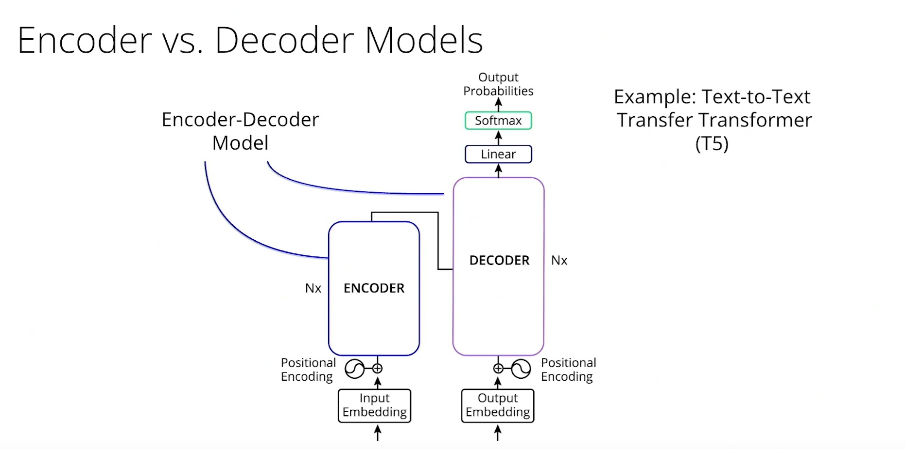

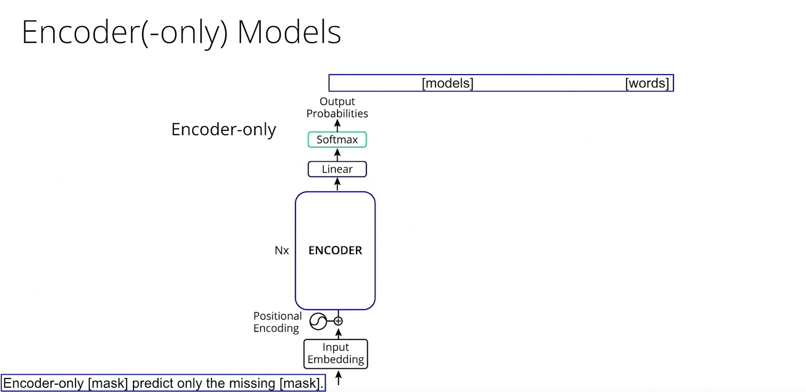

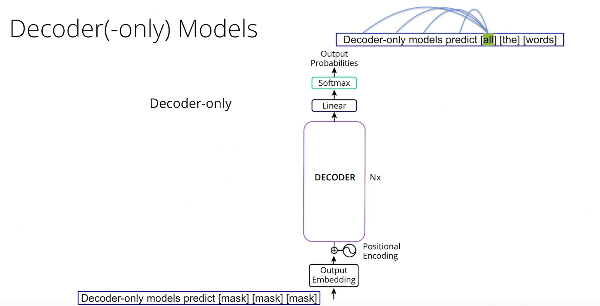

Links:

- [Attention Is All You Need](https://arxiv.org/abs/1706.03762)
- **[The Illustrated Transformer](https://jalammar.github.io/illustrated-transformer/)**
- **[The Annotated Transformer](https://nlp.seas.harvard.edu/annotated-transformer/)**
- [BERT](https://arxiv.org/abs/1810.04805)
- [GPT](https://openai.com/index/language-unsupervised/)

### Completion vs. Instruction Models

Basic Generative models perform *text completion*: they predict successively the next word/token and the text is completed.
Example use cases:

- Finish emails
- Fill in forms
- etc.

We can adapt those generative models to *instruction following*, so that we instruct them to perform a task and they carry it out (e.g., ChatGPT).
Example use cases:

- Translate
- Extract information
- Summarize
- etc.

Links:

- [Training language models to follow instructions with human feedback](https://arxiv.org/abs/2203.02155)
- [Instruction Tuning for Large Language Models: A Survey](https://arxiv.org/abs/2308.10792)

### Data Flywheel

Fine-tuning (for *text-completion*) and instruction fine-tuning (for *instruction following*) require new datasets; these don't need to be as big as the dataset used for pre-training the foundation model, but we need them, nevertheless.

Many options are possible, if the licenses allow them:

- Collect user interaction data; e.g., interaction with the chatbot/LLM. This is a positive feedback loop, a Flywheel.
- Generate a synthetic instruction-fine-tuning dataset with another model, e.g., by defining our desired instructions and asking an LLM to follow/complete them.
  `{"prompt": <existing_instruction>, "completion": <llm_generated_response>}`
- [Self-Alignment with Instruction Backtranslation](https://arxiv.org/abs/2308.06259): the inverse of the previous, i.e., we humans pick answers and ask an LLM to generate suited instructions.
  `{"prompt": <llm_generated_instruction>, "completion": <existing_document_chunk>}`
- [Constitutional AI: Harmlessness from AI Feedback](https://arxiv.org/abs/2212.08073)
- Generation of preference data from existing prompt/response LLM pairs. This can be used in Reinforcement Learning from Human Feedback (RLHF), but the feeback is still from an LLM. See: [Constitutional AI: Harmlessness from AI Feedback](https://arxiv.org/abs/2212.08073).

### Fluency vs. Intelligence

LLMs are fluent, but not intelligent. Although this is quite controversial.

Language fluency is a human capability, and LLMs seem to have super-human language capabilities.

We could say that language is a step function over all species, and humans have extensively exploited it.

### LLM Generation Parameters

- Model
- Temperature: token-probability pairs are flattened with higher temperatures, so more tokens are likely, we get more creative. Take into account that we **sample tokens/words** in that probability distribution to pick the next token/word.
  - Alternative: greedy decoding, i.e., we pick the token/word with the highest probability.
- Context length or attention window, composed of:
  - System prompt
  - Chat history: so that the LLM knows/has memory of the conversation
  - User prompt
  - Maximum length, `max_tokens`: pre-allocated for the LLM response
  - Note: each new generated token needs to be able to attend all previous tokens!
- Top `p` or top `k`: we chop off all tokens below a probability `p`, so we sample only above a given `p` probability. Similarly we sample on the top `k` tokens/words.
- Penalties (repetition or frequency): the `p` values of already used tokens/words are reduced to avoid repetition. Repetition is a common phenomenon in smaller models.

Example: `temperature = 0` and `top_k = 1` leads to greedy decoding.

Links:

- [HF Blog: How to generate text: using different decoding methods for language generation with Transformers](https://huggingface.co/blog/how-to-generate)
- [OpenAI Reference: Create chat completion](https://platform.openai.com/docs/api-reference/chat/create)
- [OpenAI Platform](https://platform.openai.com/docs/overview)
- [OpenAI Playground](https://platform.openai.com/playground/)
- My notes on the HF Book chapter about test generation: [mxagar/nlp_with_transformers_nbs/chapter-5-text-generation](https://github.com/mxagar/nlp_with_transformers_nbs?tab=readme-ov-file#chapter-5-text-generation)


### Demo Playground

After creating an account, we can use the [OpenAI Playground](https://platform.openai.com/playground/). Recommendations:

- Be as specific as possible
- Use few-shot prompts to improve responses
- Avoid vicious circles: the mode might fall into repeating a sequence or words and then tries to repeat them endlessly. Intuitively, that's understandable: we pass as input the generated response, and since the sequence is being repeated, the model keeps repeating it. More information: [The Curious Case of Neural Text Degeneration](https://arxiv.org/abs/1904.09751).

### Prompts

The model is asked to predict the probabilities of the tokens to be the next selected one (`y`), given a previous sequence (`x`, incl. the prompt) and the model weights (`theta`).

    p(x|y,theta)

Since model weights (`theta`) are constant, the variable we have to improve the response is `x`, i.e., **the prompt and the overall context**.

- Remember LLMs are very good in language fluency, conditioned on the prompt.
- The more precise the context, the less hallucinations.

The prompt is composed by several parts:

- System prompt: personality, role, main task
- Chat history: conversation so far
- Augmented user prompt: we enrich the user request with specific orders proven to increase efficiency
  - Trigger phrases like *Think step by step*
  - Other Chain-of-thought prompts: *Define step by step the reasoning followed to provide the answer*
  - Giving some examples
  - etc.

```python
[
  {"role": "system", "content": "You are an AI assistant..."},  # system prompt
  {"role": "user", "content": "Can you..."},  # chat history
  {"role": "assistant", "content": "Sure..."},  # chat history
  {"role": "user", "content": "Why did you..."},  # user prompt
  
]
```

### Demo: Prompts Using Chain-of-Thought

Create an account at [https://api.together.xyz/](https://api.together.xyz/).

Notebook: [`lab/demo_cot_and_triggers.ipynb`](./lab/demo_cot_and_triggers.ipynb)

In the notebook, we ask Llama 2-7B the number of tokens teh user prompt can contain given the context window size and the size of the appended prompt parts; LLMs famously fail in math exercises.

System prompts are constructed in two ways:

1. Answering the question first or
2. Providing the reasoning first

The latter works best, i.e.: provide a reasoning + finally provide an answer based on the reasoning.

Also, a simple trigger phrase is used: *Think step by step*; it does not perform better, but that's maybe not generalizable.

Links (mainly on Chain-of-Thought):

- [Large Language Models are Zero-Shot Reasoners](https://arxiv.org/abs/2205.11916)
- [Chain-of-Thought Prompting Elicits Reasoning in Large Language Models](https://arxiv.org/abs/2201.11903)
- [Gemini: A Family of Highly Capable Multimodal Models](https://arxiv.org/abs/2312.11805)

### Open vs. Closed Models

Closed models are like black boxes, accessed via API.
We can control the weights of open models, but often their performance is not as good as the one of the closed models.

### OpenAI Keys

We have 5 USD for OpenAI usage via [Vocareum](https://www.vocareum.com/).

Our budget can be checked in the `Cloud Resources` tab.

```python
import os
from openai import OpenAI
from dotenv import load_dotenv

load_dotenv(".env", override=True)
# Set a .env file with the credentials
# OPENAI_API_KEY=xxx
# OPENAI_BASE_URL=https://openai.vocareum.com/v1
# OPENAI_BASE_URL=https://api.openai.com/v1

client = OpenAI(
    base_url = os.getenv("OPENAI_BASE_URL"),
    api_key = os.getenv("OPENAI_API_KEY"),
)
```

### Exercise: Chatbot Memory

Notebook: [`lab/chatbot_memory_management.ipynb`](./lab/chatbot_memory_management.ipynb).

The new OpenAI completions interface was missing, so I updated it.

Key contents:

- **Implements a chatbot with memory**: The notebook builds a conversational agent that keeps track of conversation history across multiple turns.
- **Manages the attention window**: It demonstrates strategies to truncate conversation history dynamically to avoid exceeding the model's token limit.
- **Uses OpenAI GPT models via `OpenAI.chat.completions.create` API**
- **Provides truncation strategies**: Includes two truncation modes: 
  - Simple truncation (dropping oldest messages) 
  - and more selective truncation (removing the oldest user/assistant exchanges while preserving the system prompt).
- **Includes error handling and retry logic**: When prompts exceed the model's capacity, the code captures errors, adjusts the prompt, and retries until successful.

Insights:

- **Memory management is essential** when building chatbots that preserve context—without truncation, prompts will eventually exceed token limits.
- **Different truncation strategies** have different trade-offs: simpler approaches are easier to implement, while more sophisticated ones better preserve important context.
- **Clear separation of system prompts, user inputs, and model responses** improves maintainability and interpretability of conversation history.

Caveat: In the notebook, the conversation is flattened to a single string which contains the entire conversation history. That was necessary in the old API, but now it's possible to pass a list of messages, without any flattening:

```python
messages=[
    {"role": "system", "content": "You are a helpful assistant."},
    {"role": "user", "content": "Hello, how are you?"},
    {"role": "assistant", "content": "I'm fine, how can I help?"},
    {"role": "user", "content": "Tell me a joke."}
]
```

### LLM Limitations

Recall what LLMs do: They predict the next token/word probabilities (`y`) given the input sequence (`x`) and the constant model weights (`theta`):

    p(y|x, theta)

Therefore: The more specific and rich the input `x` the more the model will rely on it, otherwise the more will it rely on its weights.

Challenging tasks:

- Avoiding hallucinations
- Repeating/using difficult to tokenize texts, such as URLs 
- Maths problems

Approaches to overcome these limitations:

- Rich context
- Using tools: calculators, etc.

## 2. NLP Fundamentals

I knew already many concepts, so I just collect the concept names/topics.

For a deeper explanation of them, see:

- [mxagar/nlp_guide](https://github.com/mxagar/nlp_guide)
- [mxagar/nlp_with_transformers_nbs](https://github.com/mxagar/nlp_with_transformers_nbs)

### Introduction

Key ideas:

- NLP = Natural Language Processing
- Natural Language: ambiguity is a feature, in contrast to structured languages (e.g., programming languages).
- NLP applications
  - Speech recognition
  - Text classification
  - Machine language translation
  - Text summarization: extractive vs. abstractive summaries
  - QA: Question-Answering (similar to summarization), also extractive and/or abstractive
  - Chatbots, conversational agents
- Challenges in NLP
  - Relies on context
  - Nuanced: idioms, sarcasm
  - Ambiguity, references within the text
  - Misspelling
  - Biases
  - Labeling

### Encoding Text: Tokenization and Embeddings

Key ideas:

- Tokenization and embeddings are used to encode text
  - Tokens: unitary and discrete chunks
  - Embeddings: continuous vectors which encode meaning and context
- Tokenization steps
  - Normalization: clean, lowercase, remove punctualization, etc. We can decide the degree
  - Pretokenization: split by spaces, i.e., we words and symbols
  - Tokenization: split words and symbols into tokens (sub-word tokenization)
  - Postprocessing: adding special symbols, as B/EOS, etc.
- HuggingFace tokenizer: see usage in notebook and code summary below.
  - Encoding and decoding: words <-> tokens <-> ids
  - Maximum model length: 512 (tokens) for BERT
  - Special tokens: unknown, B/EOS, padding, classification, etc.
- Embeddings
  - Vectorization methods: Bag-of-words, one-hot encoding, TF-IDF
    - All of these lack of meaning capturing, context awareness
  - Embeddings are vectors which capture meaning: similar tokens have similar vectors
    - We can perform math operations with meanings!


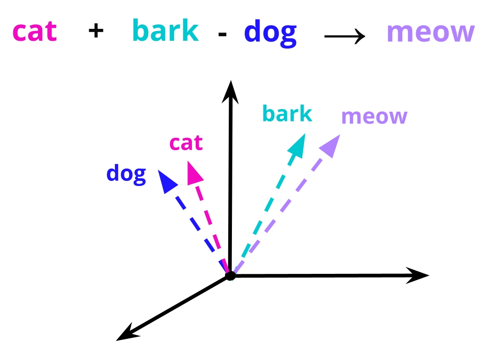

Notebooks: 

- [`lab/hugging-face-tokenizer.ipynb`](./lab/hugging-face-tokenizer.ipynb)
- [`lab/hugging-face-tokenizer-properties.ipynb`](./lab/hugging-face-tokenizer-properties.ipynb)

**HuggingFace Tokenizer** code summary:

```python
# Choose & download a pretrained tokenizer to use
# BERT (encoder-only) and CASED: it cares about capitalization
my_tokenizer = AutoTokenizer.from_pretrained('bert-base-cased')

# Simple method getting tokens from text
raw_text = '''Rory's shoes are magenta and so are Corey's but they aren't nearly as dark!'''
tokens = my_tokenizer.tokenize(raw_text)
print(tokens)
# Sub-word tokenization: words are split into sub-words
# In the case of the BERT tokenizer, the successive split parts are prefixed with '##'
# ['Rory', "'", 's', 'shoes', 'are', 'mage', '##nta', 'and', 'so', 'are', 'Corey', "'", 's', 'but', 'they', 'aren', "'", 't', 'nearly', 'as', 'dark', '!']

# This method also returns special tokens depending on the pretrained tokenizer
# Special tokens are used to mark the beginning and end of a sequence, etc.
# BERT uses [CLS] for the start of a sequence and [SEP] for the end
# [UNK] is used for unknown tokens or words/tokens out-of-vocabulary (e.g., often emojis)
detailed_tokens = my_tokenizer(raw_text).tokens()
print(detailed_tokens)
# ['[CLS]', 'Rory', "'", 's', 'shoes', 'are', 'mage', '##nta', 'and', ..., [SEP]']

# Way to get tokens as integer IDs
print(my_tokenizer.encode(raw_text))
# [101, 14845, 112, 188, 5743, 1132, 27595, 13130, 1105, 1177, 1132, 19521, 112, 188, 1133, 1152, 4597, 112, 189, 2212, 1112, 1843, 106, 102]

# Tokenizer method to get the IDs if we already have the tokens as strings
detailed_ids = my_tokenizer.convert_tokens_to_ids(detailed_tokens)
print(detailed_ids)
# [101, 14845, 112, 188, 5743, 1132, 27595, 13130, 1105, 1177, 1132, 19521, 112, 188, 1133, 1152, 4597, 112, 189, 2212, 1112, 1843, 106, 102]

# Returns an object that has a few different keys available
# It returns a dictionary/object
my_tokenizer(raw_text)
# {'input_ids': [101, 14845, 112, 188, ...], 'token_type_ids': [0, 0, 0, 0, ...], 'attention_mask': [1, 1, 1, 1, ...]}

# Typical call:
print(my_tokenizer(raw_text).input_ids)
# [101, 14845, 112, 188, ...]

# Integer IDs for tokens
ids = my_tokenizer.encode(raw_text)
# The inverse of the .encode() method: .decode()
my_tokenizer.decode(ids)
# "[CLS] Rory ' s shoes are magenta and so are Corey ' s but they aren ' t nearly as dark! [SEP]"

# To ignore special tokens (depending on pretrained tokenizer)
my_tokenizer.decode(ids, skip_special_tokens=True)
# "Rory ' s shoes are magenta and so are Corey ' s but they aren ' t nearly as dark!"

# List of tokens as strings instead of one long string
my_tokenizer.convert_ids_to_tokens(ids)
# ['[CLS]', 'Rory', "'", 's', 'shoes', ...

# tokenizer.model_max_length: the maximum amount of tokens that the tokenizer/model takes per input
my_tokenizer.model_max_length # 512

# tokenizer.all_special_tokens: the special tokens used by the tokenizer
my_tokenizer.all_special_tokens # ['[UNK]', '[SEP]', '[PAD]', '[CLS]', '[MASK]']

# tokenizer.unk_token: the unknown token used by the tokenizer
# tokenizer.bos_token: the beginning of sequence token used by the tokenizer
# tokenizer.eos_token: the end of sequence token used by the tokenizer
# tokenizer.pad_token: the padding token used by the tokenizer
# tokenizer.cls_token: the classification token (aka. class of input) used by the tokenizer
my_tokenizer.unk_token # '[UNK]'
```

#### Exercise: Encoding Text

Notebook: [`lab/encoding.ipynb`](./lab/encoding.ipynb)

A simple tokenizer is built manually, following the 4 typical steps: normalization, pretokenization, tokenization, postprocessing.
However, note that tokenizers usually are trained on corpora to learn efficient splitting nowadays.

Notebook contents:

* **Normalization Step**: Text is first normalized (e.g., lowercased, cleaned) to ensure consistent input before splitting.
* **Pre-tokenization**: The normalized text is split into basic units, typically by whitespace or punctuation.
* **Tokenization**: These units are converted into integer IDs or tokens, defining the core encoding.
* **Postprocessing**: Additional processing, such as adding special tokens (like `[CLS]` and `[SEP]`), finalizes the encoded sequence.
* **Decoding**: In addition to encoding, decoding is also implemented.

### NLP Models for Sequences

Key ideas:

- Text is a sequence
- Many model types can be built to handle sequences
  - Sequence to single value: text -> sentiment
  - Sequence to sequence: text translation
    - Often they encode the input sequence to an internal representation and use that representation to decode the output sequence
  - Single value to sequence
  - ...
- Recurrent Neural Networks (RNNs)
  - Sequence processed sequentially
  - Hidden states stored and updated in successive time steps
  - Model inputs
    - Encoder: Initially, input sequence tokens one by one
    - Decoder: When input sequence finishes and we request output sequence, the input fro the next step is the previous model output
  - Issues
    - Sequences processed sequentially, not in parallel (thus, slow)
    - Vanishing gradient problem: in very deep neural networks, the gradient values decrease due to the fact that they are computed using the product chain
    - Hidden states should represent memory, which starts forgetting concepts as the sequence length increases
  - Solution: Transformers and Attention
    - Sequences can be processed in parallel
    - Attention learns where to focus, so there is less memory loss effect
- Autoregressive models: they take their previous outputs as (part of) the input
- Sampling methods: rather than predicting the next word/token, models output the probability for all the tokens in the vocabulary
  - Sampling consists in choosing in that distribution
  - Parameters: temperature, `top_p`, `top_k`
  - Beam search: considers not only the `p` of the current token, but the `p` of a sequence of tokens

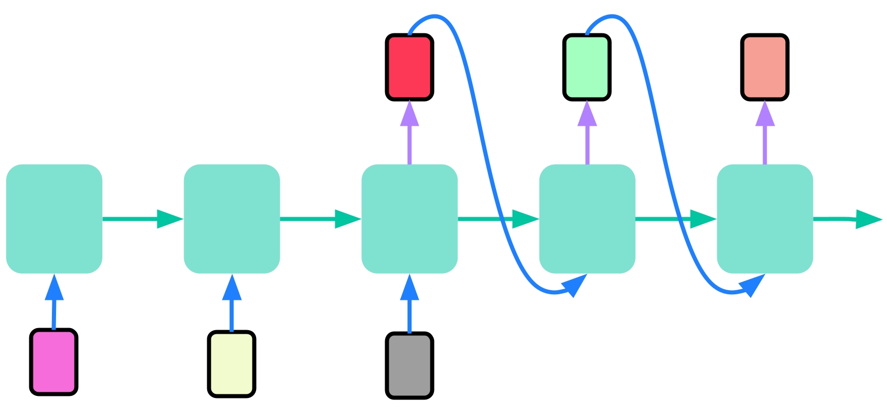

#### Exercise: Text Generation

Notebook: [`lab/text-generation.ipynb`](./lab/text-generation.ipynb).

The notebook has two parts and it uses a [`helper.py`](./lab/helper.py) file, which contains:

* Class `TokenMapping`: Stores token–ID mappings:
  * `id2token`: list mapping indices to tokens
  * `token2id`: dict mapping tokens to indices
  * `__len__`: returns vocabulary size
  * `decode(ids)`: converts a list of IDs back to text tokens
  * `encode(tokens)`: converts tokens into IDs

* Class `ShakespeareDataset`: PyTorch `Dataset` for preparing training data

* Function `encode_text(text, mapping=None)`: Encodes text into numeric IDs
  * If `mapping` is provided: Splits text into tokens (for subword) and converts tokens to IDs
  * If no mapping, it returns list of characters (character-level)

* Function `build_model(vocab_size, embed_dim, rnn_units)`: Builds a PyTorch model for text generation:
  * Embedding layer
  * GRU recurrent layer
  * Linear layer projecting to logits

* Function `next_token(logits, temperature=1.0, top_k=None)`: Samples the next token index:
  * Applies temperature scaling
  * Optionally applies top-k sampling

Concerning the two parts of the notebook:

- Part 1: Character-based Text Generation:

  * Loads the Shakespeare corpus and uses **`encode_text()`** to convert characters into integer IDs (character-level encoding).
  * Initializes **`TokenMapping`** for character-level vocabulary, mapping each unique character to an integer.
  * Creates **`ShakespeareDataset`** to generate training sequences, where each input sequence corresponds to the target sequence shifted by one character.
  * Builds a model with **`build_model()`**, which uses:
    * an embedding layer sized to the character vocabulary,
    * a GRU recurrent layer,
    * and a linear output layer projecting to the character logits.
  * Trains the model using cross-entropy loss over multiple epochs.
  * Defines **`next_token()`** to sample the next character, using temperature scaling and optional top-k filtering.
  * Generates character-level text by repeatedly predicting and appending characters.

- Part 2: Subword Text Generation:

  * Imports and uses a pretrained **Byte Pair Encoding (BPE) tokenizer** from the `tokenizers` library (e.g., **`ByteLevelBPETokenizer`**) instead of character-level encoding.
  * The tokenizer is trained on the Shakespeare text to learn subword units (common character sequences).
  * Uses **`encode_text()`** with the BPE tokenizer to encode the corpus into subword IDs.
  * Initializes **`TokenMapping`** to manage subword IDs and token lookup.
  * Re-creates **`ShakespeareDataset`** with subword sequences.
  * Builds a new model with **`build_model()`**, configured to handle the larger subword vocabulary.
  * Trains the model similarly to the character-based model but now predicting subword tokens.
  * Generates text at the subword level using **`next_token()`**, decoding the generated sequence into text via the tokenizer’s `.decode()` method.


## 3. Transformers and Attention Mechanism

I knew already many concepts, so I just collect the concept names/topics.

For a deeper explanation of them, see:

- [mxagar/nlp_with_transformers_nbs](https://github.com/mxagar/nlp_with_transformers_nbs)
- [mxagar/generative_ai_book](https://github.com/mxagar/generative_ai_book)
- [mxagar/deep_learning_udacity/04_RNN](https://github.com/mxagar/deep_learning_udacity/blob/main/04_RNN/DLND_RNNs.md)
- [mxagar/computer_vision_udacity/03_Advanced_CV_and_DL](https://github.com/mxagar/computer_vision_udacity/blob/main/03_Advanced_CV_and_DL/CVND_Advanced_CV_and_DL.md#3-recursive-neural-networks-rnn)

### Introduction

- Generative Text, Shift: RNNs -> Transformers
- Generative Images, Shift: GANs -> Diffusion Models
- RNNs and LSTMs
- [ELMo Paper: Deep Contextualized Word Representations, 2018](https://aclanthology.org/N18-1202/)
  - It creates contextual embeddings that could differentiate between the same word being used in different contexts.
  - LSTMs were used
- [Attention Paper: Neural Machine Translation by Jointly Learning to Align and Translate, 2014](https://arxiv.org/abs/1409.0473)
  - > Instead of relying on a single context vector, attention allowed the model to combine all of the encoder's hidden states to become its context vector.

### Attention

Attention is related to three values/concepts that have been around for decades in databases:

-	Query: what we are looking for
-	Key: an index or identifier against which we compare the query
-	Value: the data retrieved using the key

This metaphor is used in attention mechanisms to build a contextualized representation of each token:

-	We compute similarity scores (dot products) between the Query and each Key.
-	We apply softmax to transform these scores into a probability distribution (attention weights).
-	We compute the weighted sum of the Values using these weights; this becomes the **contextualized vector**.

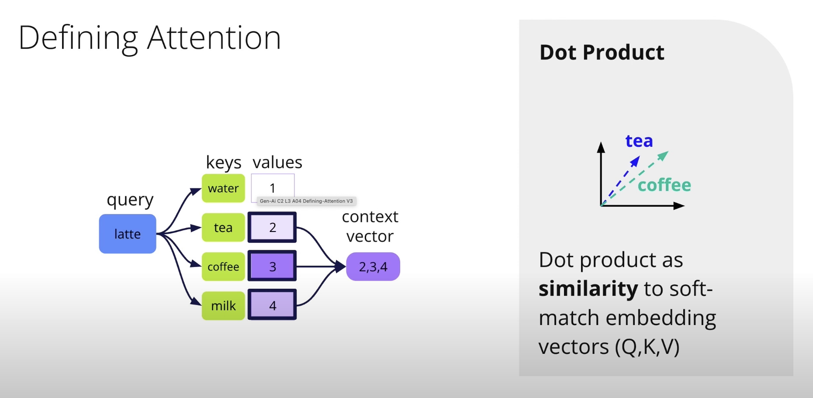

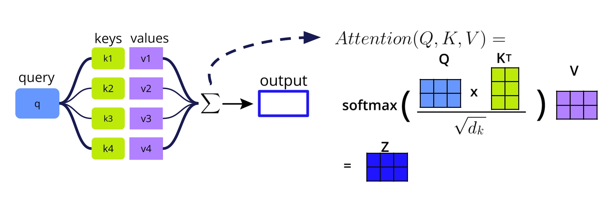

There are at least 3 ways of computing attention:

- Multiplicative: also called dot-product attention (Luong), fast and widely used (e.g., BERT).
- Additive: also called Bahdanau attention, combines learned projections and non-linearities (e.g., tanh) to compute scores; it supports variable-length inputs and is particularly good for alignment in sequence-to-sequence models like translation.
- General: a more flexible variant that learns a weight matrix to project Queries and Keys to the same dimension; more expressive than multiplicative but still faster than additive.

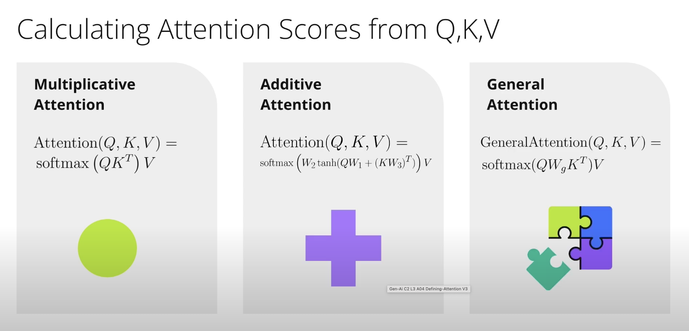

See my notes on the transformer anatomy for a detailed description of the blocks that use attention in the Transformer:

[mxagar/nlp_with_transformers_nbs/chapter-3-transformer-anatomy](https://github.com/mxagar/nlp_with_transformers_nbs?tab=readme-ov-file#chapter-3-transformer-anatomy)

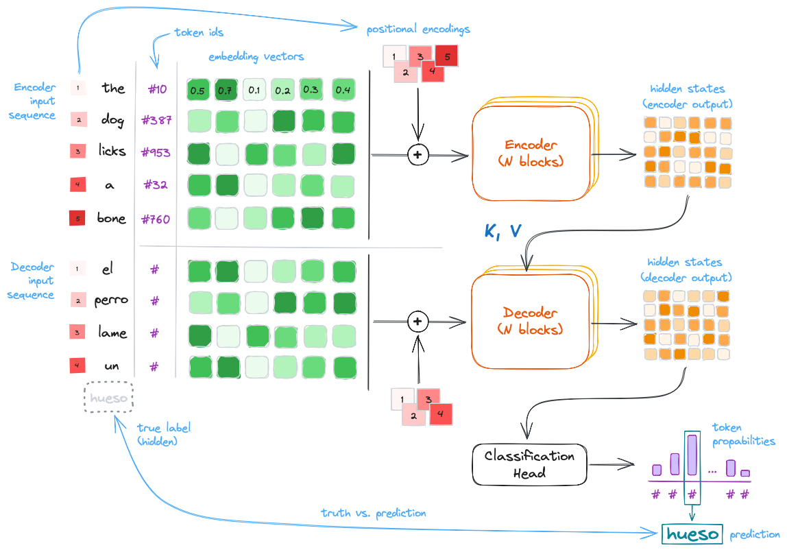

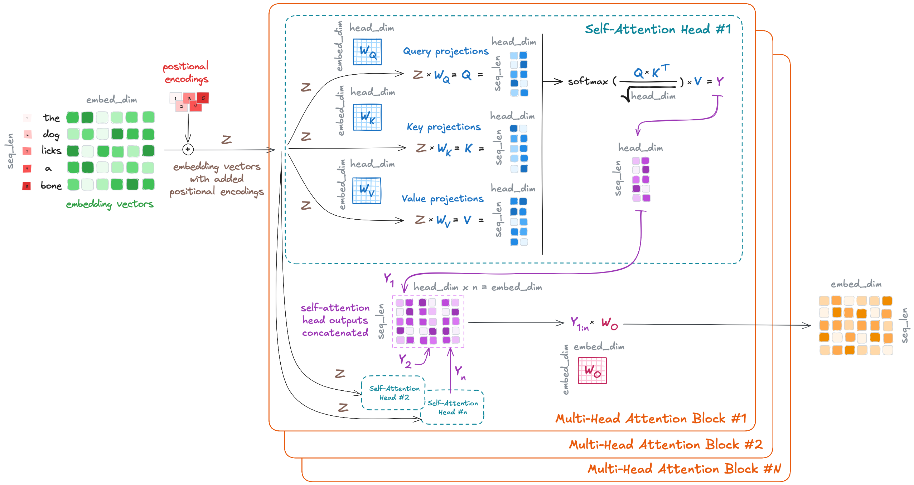

- Embeddings (+ positional encoding) are projected to the tensors Q, K, V.
- The Q, K, V tensors are used to compute the *contextualized vector* using attention; that's a single self-attention head.
- There are several self-attention heads; their outputs are concatenated to form a multi-head attention layer.
- Each block is a residual structure, so it is composed by a multi-head attention layer and also: normalization, linear mappings and two skip connections.
- The encoder of a transformer has several blocks.

```python
def attention(query, key, value):
    "Compute 'Scaled Dot Product Attention'"
    d_k = query.size(-1)
    scores = torch.matmul(query, key.transpose(-2, -1)) / math.sqrt(d_k)
    p_attn = scores.softmax(dim=-1)
    return torch.matmul(p_attn, value)
```

#### Different Attention Mechanisms

**Self-attention**: The embeddings projected to Q, K, V are the same.

- We detect the relationships of the sequence elements wrt. each other
- Matrix multiplication can be parallelized!
- Interaction is O(1), but computation is O(n^2).

**Multi-head attention**: same as self-attention, but we have several heads (each with their weights), and their outputs are concatenated.

**Multi-query attention**: similar to multi-head, but we have multiple Qs, and only one K and V, shared.

- Faster training.
- Larger batches.
- Used to scale to large LLMs (Llama 2).

**Cross-attention**: Q is different to K and V. Used in the decoder; Q can come from a different source or even modality!

#### Issues and Solutions of Attention Mechanisms

- No notion of input order
  - Solution: Positional encodings
- There is no non-linearity between repeated self-attention layers; that's an issue because everything becomes like a single layer.
  - Solution: a feed forward layer is added in-between.
- By default, self-attention can look into the future when predicting a sequence.
  - Solution: attention of future words/tokens is masked out during decoding

### BertViz to Investigate Bias

A short demo is done with [BertViz](https://github.com/jessevig/bertviz?tab=readme-ov-file#self-attention-models-bert-gpt-2-etc).

BertViz helps visualize attention in transformer models.

Video: [Using Bert To Detect Bias-Enhanced](https://www.youtube.com/watch?v=tSvn3RLDsrY). 

Notebook: [lab/demo-using-bertviz-to-detect-bias-completed.ipynb](./lab/demo-using-bertviz-to-detect-bias-completed.ipynb):

- Attention views are shown: Head view, Model view, Neuron view
- The attention relationships of two sentences are compared to investigate bias even in models trained in unsupervised datasets:
  - *The doctor asked the nurse a question. She*
    - Layer 5 of GPT2: *She* attends to *nurse*.
  - *The doctor asked the nurse a question. He*
    - Layer 5 of GPT2: *He* attends to *The doctor*.
- GPT2 seems to encoding some occupational bias in layer 5...

### Exercise: Implement Self-Attention

Notebook: [lab/exercise-1-implement-self-attention-solution.ipynb](./lab/exercise-1-implement-self-attention-solution.ipynb)

- A `MultiHeadSelfAttention` module is implemented in Pytorch, and tested with dummy embedding values.
- This specific GPT implementation is heavily inspired by the [minGPT implementation](https://github.com/karpathy/minGPT) provided by [Andrej Karpathy](https://github.com/karpathy/).
- Scaled multiplicative attention is used, as in the original paper.
- One important part is the mask: a mask is applied to hide the future tokens in the sequence; otherwise, the GPT model would cheat.
  - Masking is done filling the values with `float("-inf")`; then, the `softmax(-inf) = 0`.
- Thus, the encoder can have **multi-head attention** blocks, whereas the decoder has **MASKED multi-head attention** blocks.

```python
import math

import torch
import torch.nn as nn
from torch.nn import functional as F


class MultiHeadSelfAttention(nn.Module):
    """A vanilla multi-head masked self-attention layer."""

    def __init__(self, config):
        super().__init__()
        assert config.n_embd % config.n_head == 0

        # key, query, value projections for all heads
        self.key = nn.Linear(config.n_embd, config.n_embd)
        self.query = nn.Linear(config.n_embd, config.n_embd)
        self.value = nn.Linear(config.n_embd, config.n_embd)

        # regularization
        self.attn_drop = nn.Dropout(config.attn_pdrop)
        self.resid_drop = nn.Dropout(config.resid_pdrop)

        # output projection
        self.proj = nn.Linear(config.n_embd, config.n_embd)

        # causal mask to ensure that attention is only applied to the left in the input sequence
        self.register_buffer(
            "mask",
            torch.tril(torch.ones(config.block_size, config.block_size)).view(
                1, 1, config.block_size, config.block_size
            ),
        )
        self.n_head = config.n_head

    def forward(self, x):
        """The forward pass for the multi-head masked self-attention layer.

        In this exercise, we include lots of print statements and checks to help you
        understand the code and the shapes of the tensors. When actually training
        such a model you would not log this information to the console.
        """

        # batch size, sequence length (in tokens), embedding dimensionality (n_embd per token)
        B, T, C = x.size()
        hs = C // self.n_head  # head size

        # print some debug information
        print(f"batch size: {B}")
        print(f"sequence length: {T}")
        print(f"embedding dimensionality: {C}")
        print(f"number of heads: {self.n_head}")
        print(f"head size: {hs}")

        # calculate query, key, values for all heads in batch and move head forward to be the batch dim
        # resulting dims for k, q, and v are (B, n_head, T, hs)
        k = self.key(x).view(B, T, self.n_head, hs).transpose(1, 2)
        q = self.query(x).view(B, T, self.n_head, hs).transpose(1, 2)
        v = self.value(x).view(B, T, self.n_head, hs).transpose(1, 2)

        # multiply q and k_t matrices, then divide by the square root of d_k
        print("=== Calculate MatrixMultiplication(Q, K_T) / sqrt(d_k) ===")

        k_t = k.transpose(-2, -1)  # what is the shape of k_t?
        d_k = k.size(-1)

        # Matrix multiplication (hint: not "*")
        att = q @ k_t / math.sqrt(d_k)

        print(f"q.shape: {q.shape}")
        print(f"k_t.shape: {k_t.shape}")
        print(f"d_k: {d_k}")
        print(f"att.shape: {att.shape}")

        # set the mask fill value to negative infinity
        print("=== Apply the attention mask ===")

        masked_fill_value = float("-inf")

        att = att.masked_fill(self.mask[:, :, :T, :T] == 0, masked_fill_value)

        # Show the result of applying the mask
        print(f"att: {att}")

        # apply softmax
        print("=== Softmax ===")

        att = F.softmax(att, dim=-1)

        att = self.attn_drop(att)

        # Show the result of applying the softmax and check that
        # the sum of the attention weights in each row is 1
        print(f"att.shape: {att.shape}")
        print(f"att: {att}")
        print(f"att.sum(dim=-1): {att.sum(dim=-1)}")
        att_rows_sum_to_one = all(
            ((att.sum(dim=-1) - 1.0) ** 2 < 1e-6).flatten().tolist()
        )
        print(f"att_rows_sum_to_one: {att_rows_sum_to_one}")
        if not att_rows_sum_to_one:
            raise ValueError(
                "Attention weight rows do not sum to 1. Perhaps the softmax dimension or masked_fill_value is not correct?"
            )

        # multiply att and v matrices
        # (B, n_head, T, T) x (B, n_head, T, hs) -> (B, n_head, T, hs)
        print("=== Calculate final attention ===")

        y = att @ v

        print(f"y.shape: {y.shape}")

        # re-assemble all head outputs side by side
        y = y.transpose(1, 2).contiguous().view(B, T, C)

        # output projection
        y = self.resid_drop(self.proj(y))
        return y
```


### Transformer Models

As already mentioned, there are 3 types of Transformer models:

- Encoder-only, e,g., BERT
- Encoder-Decoder, e.g., T5
- Decoder-only, e.g., GPT

In all of them the **multi-head attention block** introduced in [Attention](#attention) is used, however, these blocks are wrapped with some other layers:

- Layer normalization: inputs/outputs are normalized to mean 0, std 1. This normalization can be pre-layer (original) or post-layer (most common nowadays).
  - This allows for faster training.
- Skip connections (aka. residual connections): previous embeddings (before transformations/updates) are added. These skip/residual connections
  - Minimize the gradient vanishing problem.
  - Enable deeper networks.
  - Improve the optimization of the loss function.
- Positional feed-forward layer: two linear/dense matrices (followed by a dropout) further transform the embeddings. Usually,
  - the first transformation increases 4x the size of the embeddings
  - and the second scales back the embeddings to their original size.

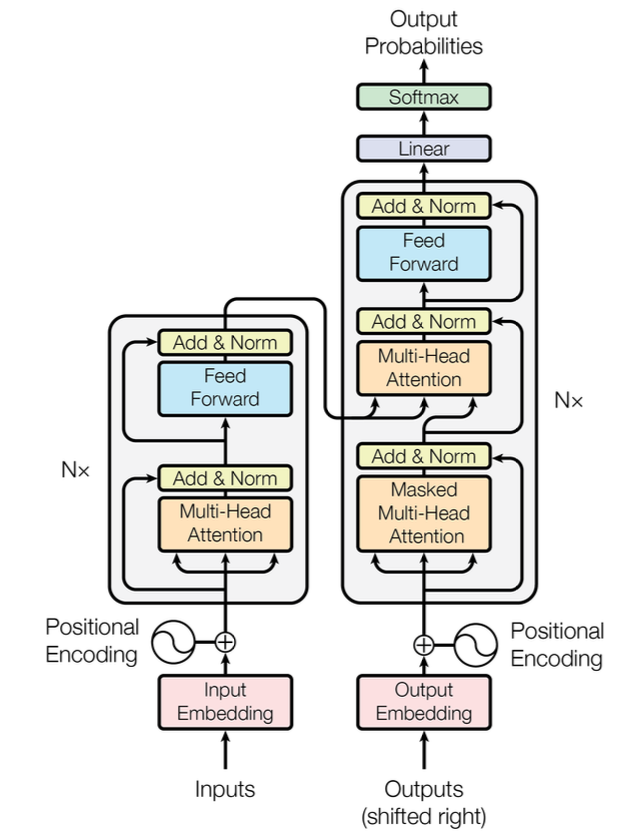

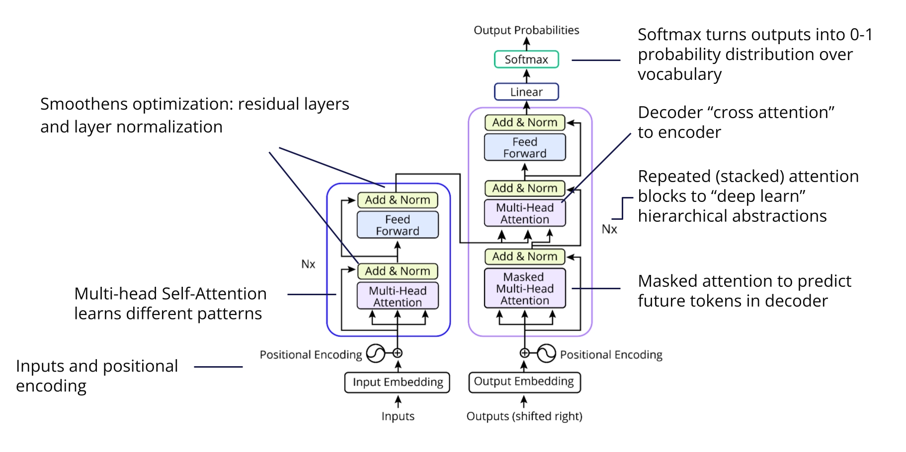

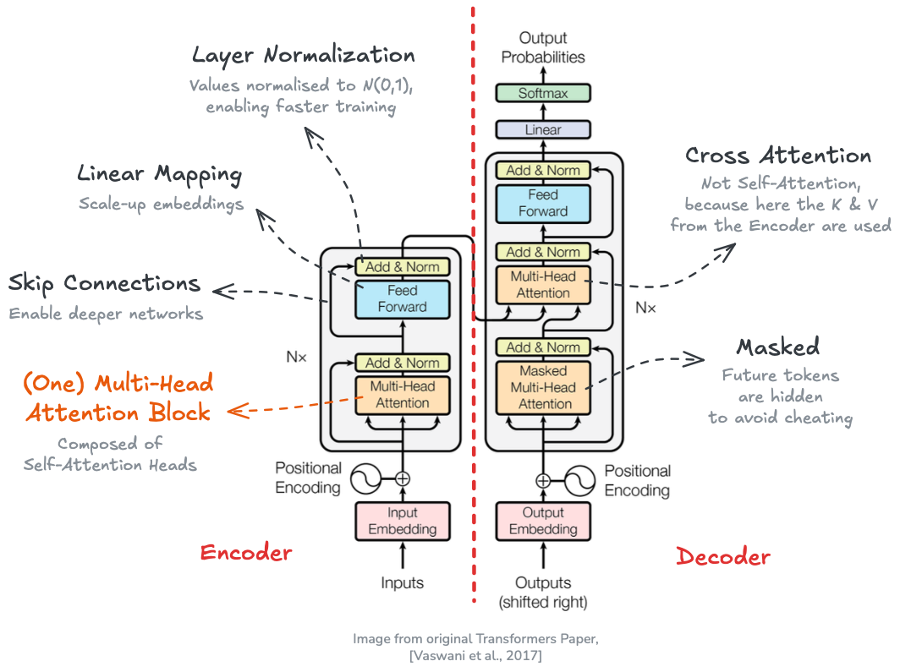

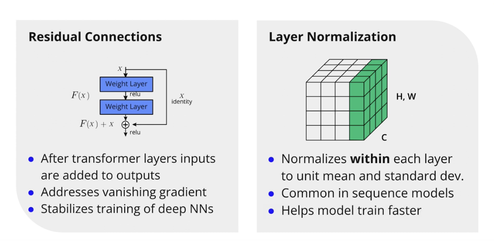

Also, consider *positional encoding* is added to the embeddings. Positional encoding can be:

- Absolute; e.g., sinusoidal values: they allow inputs of various lengths, and were used in the original paper.
- Learned positional encodings.
- Others: active area of research.

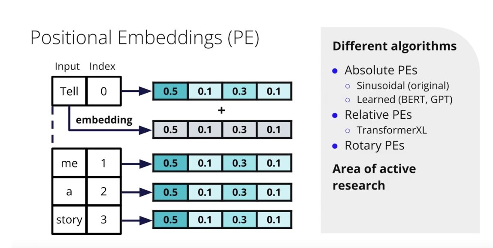

### Training Objectives in Transformers

Typical training strategies for transformers:

- Autoregressive (causal): next token prediction; GPT
  - Every time we pass a sequence, the future token values are masked, to avoid cheating; thus, the matrices are lower diagonal.
  - Teacher forcing is used, which involves using the actual target output (the ground truth) from the training data as the input to the next time step in the sequence, rather than using the model's own predicted output from the previous time step.
- Denoising Autoencoders: predict masked tokens or next sentences; BERT
  - Sentence(s) are input and tokens are masked; we request the masked tokens
  - Predicting the next sentence is also a strategy: we present to sentences and ask the model whether the second is a logical continuation of the first. So it's a binary classification problem.
- Contrastive: target similarity; SBERT, CLIP

Those techniques are self-supervised techniques, i.e., we can work with *unlabeled data*. The output is a **pre-trained model**. Then, we can apply **fine-tuning** to adapt our model to our task/domain. To that end, we usually need *labeled data*, but in a much smaller amount than the *unlabeled dataset*.


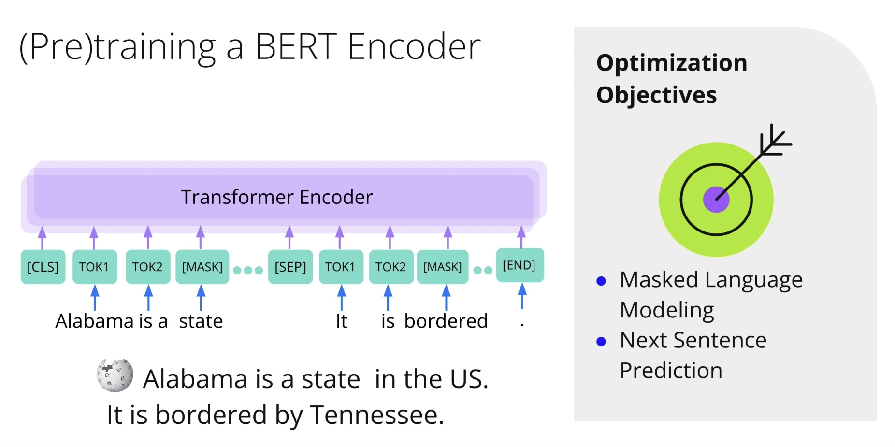

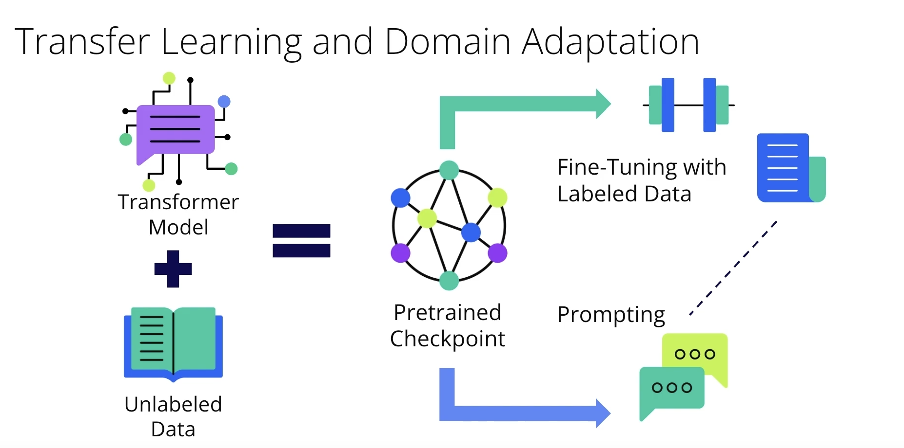

### Exercise: Implement GPT

Code:

- Notebook: [lab/exercise-2-create-your-own-gpt-model-solution.ipynb](./lab/exercise-2-create-your-own-gpt-model-solution.ipynb)
- Module: [lab/common.py](./lab/common.py)

> This specific GPT implementation is heavily inspired by the [minGPT implementation](https://github.com/karpathy/minGPT) provided by [Andrej Karpathy](https://github.com/karpathy/).

Key contents:

-	The notebook walks through the implementation of a simplified GPT model inspired by Karpathy’s minGPT, using PyTorch.
-	It defines three core components for the model:
  -	`MultiHeadSelfAttention` (imported from `common.py`)
  -	`Block`, a Transformer block with residual connections and MLP
  -	`GPT`, the full model with token/position embeddings, transformer blocks, and a generation method
-	The GPT model includes a generate method to autoregressively generate sequences from a given prompt using temperature scaling and (optionally) top-k sampling.
-	A simple toy dataset of addition problems like `111 + 222 = 3 + 30 + 300 = 333` is introduced, meant to train the model on learning symbolic addition in stages.
-	The notebook concludes by verifying that the model can forward inputs and generate sequences without error, setting up for later training.

### Transformers vs. LSTMs

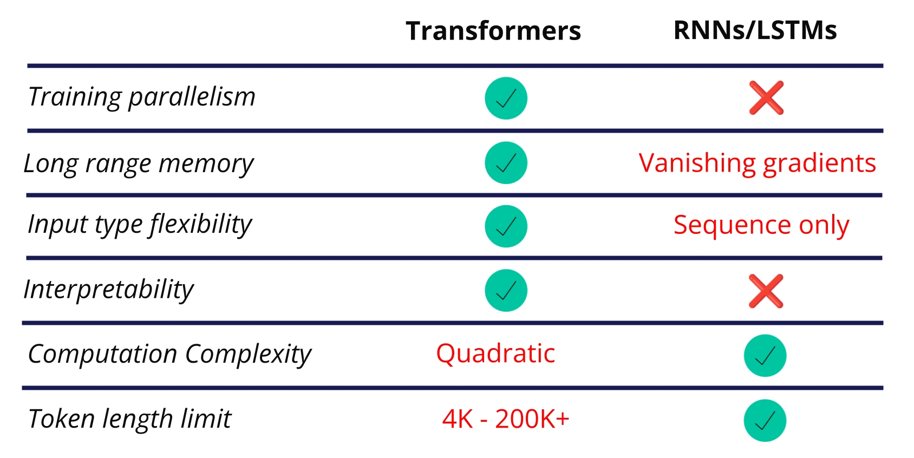

In summary, Transformers have many performance advantages over LSTMs; however, the *naive* **Self-Attention** mechanism is quadratic, i.e., all sequence tokens against all sequence tokens. That limits the input length.

### Transformer Applications and Trends

- Devices, such as [https://www.rabbit.tech/](https://www.rabbit.tech/)
- Multi-Modal Understanding, rather than only text understanding/generation.
  - Check: [MMMU: A Massive Multi-discipline Multimodal Understanding and Reasoning Benchmark for Expert AGI](https://mmmu-benchmark.github.io/)
- The shift from Transformers to AI Systems; interesting article: [The Shift from Models to Compound AI Systems](https://bair.berkeley.edu/blog/2024/02/18/compound-ai-systems/).
- Retrieval-Augmented Generation (RAG)
  - There is a debate due to the continuously increased context windows; will effectively infinite windows arrive and if so, will they render RAGs unnecessary?
- Agents

### Research Trends

#### Optimization

Attention requires a pairwise token computation, which makes the naive approach quadratic on the sequence length.

Some optimizations are being done:

- Hardware optimization
  - 1-bit models: quantization
  - CUDA kernel optimizations
- Variation of the Transformers
  - Reformer: locality-sensitive hashing done to achieve `nlogn` complexity
  - Linformer: low-ran approximations used
  - Performer: orthogonal random features used
- New/alternative architectures, e.g., **Mamba**
  - Not a transformer model, but a *state-space model*
  - Inference faster than in transformers
  - It excels at long sequences (1M tokens)
  - At 3B parameters, it outperforms transformers of the same size
  - If it can scale to larger models while still outperforming transformers, it may dethrone them!

#### Improved Understanding

- [In-context Learning and Induction Heads, 2022](https://arxiv.org/abs/2209.11895)
  - *Induction heads* are hypothetical components that help the model learn from the context.
- [Grokking of Hierarchical Structure in Vanilla Transformers, 2023](https://arxiv.org/abs/2305.18741)
  - Analyzes the model's ability of going beyond the memorized data, i.e., generalization
- [Quantifying Memorization Across Neural Language Models, 2022](https://arxiv.org/abs/2202.07646)
  - > The authors noted:
    - > that the likelihood of LLMs reproducing memorized content verbatim increases with the model's capacity,
    - > the duplication frequency of a training example, and
    - > the length of the context used for prompting.

#### Safe and Ethical Use of AI

- [A Human Rights-Based Approach to Responsible AI, 2022](https://arxiv.org/abs/2210.02667)
- [An Overview of Catastrophic AI Risks, 2023](https://arxiv.org/abs/2306.12001)

### Links and Papers

- Transformers Paper:
  - [Arxiv: Attention is All You Need](https://arxiv.org/abs/1706.03762)
  - [PDF: Attention is All You Need](./assets/google_transformers_paper_2017.pdf)
- [A Decomposable Attention Model for Natural Language Inference](https://arxiv.org/abs/1606.01933v2)
- [Understanding Parameter Sharing in Transformers](https://arxiv.org/abs/2306.09380)
- [Falcon](https://huggingface.co/docs/transformers/main/model_doc/falcon)
- [Llama 2](https://huggingface.co/docs/transformers/model_doc/llama2)ç
- [HiCLIP: Contrastive Language-Image Pretraining with Hierarchy-aware Attention](https://arxiv.org/abs/2303.02995)
- [Scaling Transformer to 1M tokens and beyond with RMT; Bulatov et al., 2023](https://arxiv.org/abs/2304.11062).
- [Paper: Learning Positional Embeddings for Coordinate-MLPs, 2021](https://arxiv.org/abs/2112.11577)
- [Paper: Improving Language Understanding by Generative Pre-Training](https://cdn.openai.com/research-covers/language-unsupervised/language_understanding_paper.pdf)
- [Paper: ResNet, 2015](https://arxiv.org/abs/1512.03385)
- [Paper: BERT, 2018](https://arxiv.org/abs/1810.04805)
- Transformer optimization and latest research directions
  - [The Era of 1-bit LLMs: All Large Language Models are in 1.58 Bits, 2024](https://arxiv.org/abs/2402.17764)
  - [FlashAttention: Fast and Memory-Efficient Exact Attention with IO-Awareness, 2022](https://arxiv.org/abs/2205.14135)
  - [Reformer: The Efficient Transformer, 2020](https://arxiv.org/abs/2001.04451)
  - [Linformer: Self-Attention with Linear Complexity, 2020](https://arxiv.org/abs/2006.04768)
  - [Rethinking Attention with Performers, 2020](https://arxiv.org/abs/2009.14794)
  - [Mamba: Linear-Time Sequence Modeling with Selective State Spaces, 2023](https://arxiv.org/abs/2312.00752)
- Transformer understanding research directions:
  - [In-context Learning and Induction Heads, 2022](https://arxiv.org/abs/2209.11895)
  - [Grokking of Hierarchical Structure in Vanilla Transformers, 2023](https://arxiv.org/abs/2305.18741)
  - [Quantifying Memorization Across Neural Language Models, 2022](https://arxiv.org/abs/2202.07646)
- Ethics:
  - [A Human Rights-Based Approach to Responsible AI, 2022](https://arxiv.org/abs/2210.02667)
  - [An Overview of Catastrophic AI Risks, 2023](https://arxiv.org/abs/2306.12001)


## 4. Retrieval Augmented Generation

OpenAI APIs are used to build a RAG QA chatbot which considers recent events persisted in a database.

Check: [OpenAI API Quickstart guide](https://platform.openai.com/docs/quickstart).

Steps summary:

1. Prepare dataset: tokenize and convert into embedding vectors.
  - These vectors are stored in a (vector) database.
2. Find relevant data related to the query.
  - The query is converted into a vector and using cosine similarity we search the items in our dataset which are most related to it.
3. A custom text prompt is composed, which integrates the query and the database items found.
4. Query a completion model which provides with the answer.

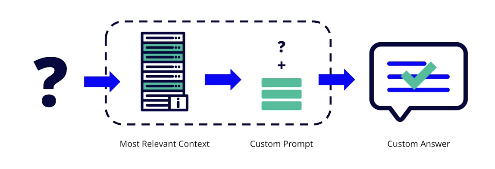

Dataset(s):

1. Course example: [Wikipedia 2022 events](https://en.wikipedia.org/wiki/2022)
2. Exercise: [2023 Turkey–Syria earthquakes](https://en.wikipedia.org/wiki/2023_Turkey%E2%80%93Syria_earthquakes)

The rest of the section uses the first dataset (Wikipedia 2022 events) to build a RAG QA chatbot:

[lab/casestudy_rag_wikpedia_2022.ipynb](./lab/casestudy_rag_wikpedia_2022.ipynb)

Additionally the second dataset (2023 Turkey–Syria earthquakes) is used as an exercise:

[lab/exercise_rag.ipynb](./lab/exercise_rag.ipynb)

Set up an OpenAI account:

- Get an OpenAI API key: Settings > API Keys > Create new secret key
- Create a `.env` file with the API key.
- Add credit to the OpenAI account: Settings > Billing > Add payment method & Add credit balance

Then, we can check everything works, as done in [lab/openai_test.ipynb](./lab/openai_test.ipynb):

```python
import os
import dotenv
from dotenv import load_dotenv
from openai import OpenAI

load_dotenv(".env")

client = OpenAI(
  api_key=os.environ['OPENAI_API_KEY'],
)

# Chat completion
response = client.chat.completions.create(
    model="gpt-4o-mini",
    messages=[
        {"role": "system", "content": "You are a helpful assistant."},
        {"role": "user", "content": "What's the difference between GPT-4 and GPT-4o mini?"}
    ],
    temperature=0.7
)

print(response.choices[0].message.content)
# ...

ukraine_prompt = """
Question: "When did Russia invade Ukraine?"
Answer:
"""

# Prompt completion
response = client.completions.create(
    model="gpt-3.5-turbo-instruct",
    prompt=ukraine_prompt,
    max_tokens=150,
    temperature=0.7,
)

initial_ukraine_answer = response.choices[0].text.strip()
print(initial_ukraine_answer)  # "Russia invaded Ukraine in February 2014."
# The model is answering this way because the training data ends in 2021.
# Our task will be to provide context from 2022 to help the model answer these questions correctly.
# That can be accomplished by using a Retrieval-Augmented Generation (RAG) approach.
```

We can see that there are two main API calls:

- `chat.completions.create`: for chat-based interactions, which supports roles, memory, and turns.
- `completions.create`: for simple Q&A or text generation, which is prompt-only, and legacy-compatible.

### Case Study: RAG with Wikipedia 2022 Events

Key aspects discussed:

- Use APIs to download.
- Numerical representations of text:
  - ASCII tables.
  - One-hot encoding: sparse, too large (size is the vocabulary size).
  - Embeddings: dense; similar words have similar vectors, so word arithmetic becomes possible.
- OpenAI `text-embedding-ada-002` is used to create the embeddings: it has a dimensionality of 1536.
- Keyword search vs. semantic search:
  - Keyword search: exact match, not robust to typos, synonyms, etc.
  - Semantic search: uses embeddings to find similar items, robust to typos, synonyms, etc. Cosine similarity is recommended as distance or similarity metric.
    - In practice, **cosine distance** is used: `cosine_distance = 1 - cosine similarity`
- Context prompt: we provide the found items to the model as context, so it can answer the question; also we request to use only the context information and say "I don't know" if the answer is not in the context.
  - How much context to provide? As much tokens as the model can handle; but don't feed irrelevant information.
  - We can use `tiktoken` to count the tokens in the context and the question.

Notebook: [lab/casestudy_rag_wikpedia_2022.ipynb](./lab/casestudy_rag_wikpedia_2022.ipynb)

**Note**: I had to change many parts of the notebook, since it was using the old API of Open AI. The current version uses the latest API (as of 2025-07).


```python
import os
import dotenv
from dotenv import load_dotenv
from openai import OpenAI

load_dotenv(".env")

## Step 0: Inspecting Non-Customized Results

client = OpenAI(
  api_key=os.environ['OPENAI_API_KEY'],
)

ukraine_prompt = """
Question: "When did Russia invade Ukraine?"
Answer:
"""

response = client.completions.create(
    model="gpt-3.5-turbo-instruct",
    prompt=ukraine_prompt,
    max_tokens=150,
    temperature=0.7,
)

initial_ukraine_answer = response.choices[0].text.strip()
print(initial_ukraine_answer)  # Wrong answer, since the model was trained with data until 2021.

twitter_prompt = """
Question: "Who owns Twitter?"
Answer:
"""

response = client.completions.create(
    model="gpt-3.5-turbo-instruct",
    prompt=twitter_prompt,
    max_tokens=150,
    temperature=0.7,
)

initial_twitter_answer = response.choices[0].text.strip()
print(initial_twitter_answer). # Wrong answer, since the model was trained with data until 2021.

## Step 1: Prepare Dataset

from dateutil.parser import parse
import pandas as pd
import requests

# Get the Wikipedia page for "2022" since OpenAI's models stop in 2021
resp = requests.get("https://en.wikipedia.org/w/api.php?action=query&prop=extracts&exlimit=1&titles=2022&explaintext=1&formatversion=2&format=json")

# Load page text into a dataframe
df = pd.DataFrame()
df["text"] = resp.json()["query"]["pages"][0]["extract"].split("\n")

# Clean up text to remove empty lines and headings
df = df[(df["text"].str.len() > 0) & (~df["text"].str.startswith("=="))]

# In some cases dates are used as headings instead of being part of the
# text sample; adjust so dated text samples start with dates
prefix = ""
for (i, row) in df.iterrows():
    # If the row already has " - ", it already has the needed date prefix
    if " – " not in row["text"]:
        try:
            # If the row's text is a date, set it as the new prefix
            parse(row["text"])
            prefix = row["text"]
        except ValueError:
            # If the row's text isn't a date, add the prefix
            row["text"] = prefix + " – " + row["text"]
df = df[df["text"].str.contains(" – ")]

EMBEDDING_MODEL_NAME = "text-embedding-ada-002"
batch_size = 100
embeddings = []

for i in range(0, len(df), batch_size):
    batch_texts = df.iloc[i:i+batch_size]["text"].tolist()
    
    response = client.embeddings.create(
        model=EMBEDDING_MODEL_NAME,
        input=batch_texts
    )

    # Each `response.data` element is an object with an "embedding"
    embeddings.extend([item.embedding for item in response.data])

df["embeddings"] = embeddings

df.to_csv("embeddings.csv")

import numpy as np
import pandas as pd
import ast

df = pd.read_csv("embeddings.csv", index_col=0)
df["embeddings"] = df["embeddings"].apply(ast.literal_eval)

## Step 2: Create a Function that Finds Related Pieces of Text for a Given Question

from scipy.spatial.distance import cosine as cosine_distance
import ast

# Calculate cosine distance between the first two embeddings
# cosine_distance = 1 - cosine_similarity
cosine_distance(df["embeddings"].loc[0], df["embeddings"].loc[1])

import numpy as np
from scipy.spatial.distance import cdist

def get_embedding(text: str, model="text-embedding-ada-002"):
    response = client.embeddings.create(input=[text], model=model)
    return response.data[0].embedding

def distances_from_embeddings(query_embedding, embeddings, distance_metric="cosine"):
    embeddings = np.stack(embeddings)
    return cdist([query_embedding], embeddings, metric=distance_metric)[0]

def get_rows_sorted_by_relevance(question, df):
    """
    Function that takes in a question string and a dataframe containing
    rows of text and associated embeddings, and returns that dataframe
    sorted from least to most relevant for that question
    """
    
    # Get embeddings for the question text
    question_embeddings = get_embedding(question, model=EMBEDDING_MODEL_NAME)
    
    # Make a copy of the dataframe and add a "distances" column containing
    # the cosine distances between each row's embeddings and the
    # embeddings of the question
    df_copy = df.copy()
    df_copy["distances"] = distances_from_embeddings(
        question_embeddings,
        df_copy["embeddings"].values,
        distance_metric="cosine"
    )
    
    # Sort the copied dataframe by the distances and return it
    # (shorter distance = more relevant so we sort in ascending order)
    df_copy.sort_values("distances", ascending=True, inplace=True)
    return df_copy

df = get_rows_sorted_by_relevance("When did Russia invade Ukraine?", df)
df.head()

df = get_rows_sorted_by_relevance("Who owns Twitter?", df)
df.head()

df.to_csv("distances.csv", index=False)
df = pd.read_csv("distances.csv")
df["embeddings"] = df["embeddings"].apply(ast.literal_eval)
df.head()

## Step 3: Create a Function that Composes a Text Prompt

import tiktoken

def create_prompt(question, df, max_token_count):
    """
    Given a question and a dataframe containing rows of text and their
    embeddings, return a text prompt to send to a Completion model
    """
    # Create a tokenizer that is designed to align with our embeddings
    tokenizer = tiktoken.get_encoding("cl100k_base")
    
    # Count the number of tokens in the prompt template and question
    prompt_template = """
Answer the question based on the context below, and if the question
can't be answered based on the context, say "I don't know"

Context: 

{}

---

Question: {}
Answer:"""
    
    current_token_count = len(tokenizer.encode(prompt_template)) + \
                            len(tokenizer.encode(question))
    
    context = []
    for text in get_rows_sorted_by_relevance(question, df)["text"].values:
        
        # Increase the counter based on the number of tokens in this row
        text_token_count = len(tokenizer.encode(text))
        current_token_count += text_token_count
        
        # Add the row of text to the list if we haven't exceeded the max
        if current_token_count <= max_token_count:
            context.append(text)
        else:
            break

    return prompt_template.format("\n\n###\n\n".join(context), question)

print(create_prompt("When did Russia invade Ukraine?", df, 200))
print(create_prompt("Who owns Twitter?", df, 100))

## Step 4: Create a Function that Answers a Question

COMPLETION_MODEL_NAME = "gpt-3.5-turbo-instruct"

def answer_question(
    question, df, max_prompt_tokens=1800, max_answer_tokens=150
):
    """
    Given a question, a dataframe containing rows of text, and a maximum
    number of desired tokens in the prompt and response, return the
    answer to the question according to an OpenAI Completion model
    
    If the model produces an error, return an empty string
    """
    prompt = create_prompt(question, df, max_prompt_tokens)

    try:
        response = client.completions.create(
            model=COMPLETION_MODEL_NAME,
            prompt=prompt,
            max_tokens=max_answer_tokens,
            temperature=0.7  # optional: defaults to 1.0
        )
        return response.choices[0].text.strip()
    except Exception as e:
        print(f"Error during completion: {e}")
        return ""

custom_ukraine_answer = answer_question("When did Russia invade Ukraine?", df)
print(custom_ukraine_answer)  # February 24 – missiles strike Kyiv.

custom_twitter_answer = answer_question("Who owns Twitter?", df)
print(custom_twitter_answer)  # Elon Musk

```

### Exercise: RAG with 2023 Turkey–Syria Earthquakes

Not done, but should be very similar to the previous case study. Only the dataset is different.

## 5. Build Custom Datasets for LLMs

### Introduction

Key concepts:

- Zero-shot answering: no examples shown in training dataset; emergent properties
- Open domain vs narrow domain: open is common, Wikipedia-like domain, whereas narrow refers to specific information not accessible to the general public, i.e., not common knowledge.

Module contents:

- Collect data
- Clean data
- Modeling tasks
  - Causal language modeling
  - Question-answering
- Building dataset

### Collecting Data

Key ideas:

- Internet data
  - API
    - Programmatic access
    - Structured data: JSON, XML
  - Scraping: HTTP requests
    - Costly
    - Sometimes not allowed
- Licensing: some data has a license!
  - Code licenses can be complicated
- Safety
  - Some data can be toxic

### Web Scraping with BeautifullSoup

Notebook: [lab/Basic Web Scraping.ipynb](./lab/Basic%20Web%20Scraping.ipynb)

```python
import requests
from bs4 import BeautifulSoup

url = 'https://archive.org/details/cu31924067841738'
response = requests.get(url)

# print the status code
print(response.status_code)

# print the content of the response
print(response.text)

with open("language_of_flowers.html", mode='wb') as file:
    file.write(response.content)

with open("language_of_flowers.html") as fp:
    flower_soup = BeautifulSoup(fp, 'html.parser')

# Print a clean (prettier) version to look through
print(flower_soup.prettify())

# Get the <title> tag from the soup
book_title = flower_soup.find("title")
print(book_title)

# Get the text from the <title> tag
book_title = book_title.text.strip()
print(book_title)

# Find all the elements with the tag <p> (paragraph)
collection_items = [item.text.strip() for item in flower_soup.find_all("p")]
print(collection_items)

# Look for an <a> tag (anchor/link element) that has the CSS class "item-upload-info__uploader-name"
# The result is stored in the uploader_name variable
# We find the name of the uploader of the book
uploader_name = flower_soup.find("a", class_="item-upload-info__uploader-name")
print(uploader_name.text.strip())

# Look for an <a> tag (anchor/link element) that has 
# collection items
collection_items = flower_soup.find_all("a", class_="collection-item")
print(collection_items)

for item in collection_items:
    print(item.text.strip())
```

Requests:

- Status codes in 200-299: all good
- Status codes in 400-599: error
  - 404: website doesn't exist
  - 403: forbidden access

HTML tags:

> - `<div>`: Div element is used to chunk content together.
> - `<h1>,<h2>,<h3>,<h4>`: Heading elements are used for section headings.
> - ``: Image element is used to embed an image in a web page.
> - `<p>`: Paragraph element is used for standard blocks of text.
> - `<span>`: Span element is used to group text within another block of text, often for styling.
> - `<a>`: Hyperlink tag is used to link to one page from another.

XML files contain custom tags.

### Web Scraping with Selenium and Scrapy

Other libraries for web scraping:

- [Selenium](https://www.selenium.dev/): for web automation, e.g., clicking buttons, filling forms, etc.
- [Scrapy](https://docs.scrapy.org/en/latest/intro/tutorial.html): a fast high-level web crawling & scraping framework for Python.

Selenium renders the page in a virtual browser, usually *headless* (no GUI), and allows to interact with the page, e.g., clicking buttons, filling forms, etc.

Example code:

```python
from selenium import webdriver
from selenium.webdriver.chrome.options import Options

options = Options()
options.headless = True
options.add_argument("--window-size=1920,1080")

# Create a new instance of the Chrome driver
driver = webdriver.Chrome(options=options, executable_path='/path/to/chromedriver')

# Get the page
driver.get("https://www.udacity.com/")

# The content we are interested is in the page source!
page_source = driver.page_source
with open("udacity_home.html", "w") as f:
    f.write(page_source)

# Close the driver/browser
driver.quit()
```

### Exercise: Collecting Data

Notebook: [lab/Simple_Scraper_SOLUTION.ipynb](./lab/Simple_Scraper_SOLUTION.ipynb)

- Some books are scrapped from [http://books.toscrape.com](http://books.toscrape.com), a scrapping-friendly website.
- Key functions:
  - `fetch_page(url)`: fetches the HTML content of a page.
  - `parse_page(html_doc)`: parses the HTML content to extract product descriptions.
  - `save_text(text, url, train=True)`: saves the extracted text to disk, either in a training or test directory.
  - `generate_url_list()`: generates a list of URLs to scrape from the main page.
- The complete pipeline is automated.


```python
import requests
from bs4 import BeautifulSoup
from pathlib import Path

def fetch_page(url: str):
    headers = {
    'user-agent': 'Mozilla/5.0 (Macintosh; Intel Mac OS X 10_15_7) AppleWebKit/537.36 (KHTML, like Gecko) Chrome/112.0.0.0 Safari/537.36'
    }
    r = requests.get(url, headers=headers)
    if r.status_code == 200:
        return r.text
    else:
        print(r.status_code)
        return r.text


# Test if the function fetch the page correctly
test_url = "http://books.toscrape.com/catalogue/olio_984/index.html"
test_result = fetch_page(test_url)
print(test_result)


def parse_page(html_doc:str):
    soup = BeautifulSoup(html_doc, 'html.parser')
    
    # Our LLM should be trained in product descriptions
    # Find the <div> element with id="product_description"
    product_div = soup.find('div', id='product_description')
    
    # Find the <p> element that is immediate siblings of the product_div
    selected_elements = product_div.find_next('p')
    
    description = selected_elements.text
    return description


test_text = parse_page(test_result)
print(test_text)


def save_text(text, url, train=True):
    # Save the data to "./data/train/" if it's in the training set
    if train:
        file_path = Path("./data/train/")
        file_path.mkdir(parents=True, exist_ok=True)
    # If data is not in the training set, save it to "./data/test/"
    else:
        file_path = Path("./data/test/")
        file_path.mkdir(parents=True, exist_ok=True)
    
    # Split the URL by "/"
    split_url = url.split("/")
    
    # Pull the name from the URL, Add a .txt extension to the end of the file
    file_name = f"{split_url[-2]}.txt"
    print(file_name)
    
    # Write the file to disk
    with open(file_path.joinpath(file_name), "w") as f:
        f.write(text)


save_text(test_text, test_url, train=True)


def generate_url_list():
    # Create a list to store our urls
    url_list = list()
    
    # Specify the index page and fetch it
    home = "https://books.toscrape.com/catalogue/category/books_1/index.html"
    home_page = fetch_page(home)
    
    # Create a soup object for the home page
    soup = BeautifulSoup(home_page, 'html.parser')
    
    # Find all the links on the page
    links = soup.find_all('a', href=True)
    
    for element in links:
        # Pull out and clean the relevant link
        if len(element['href'].split("/")) == 4 and "../../" in element['href'] and "../../../" not in element['href']:
            # Extract the url with the relative (..) references
            relative_url = element['href']
            
            # Replace the relative references with the base URL
            full_url = relative_url.replace("../../", "http://books.toscrape.com/catalogue/")
            url_list.append(full_url)
#         url_list.append(full_url)
    # Deduplicate links in the list
    url_list = list(set(url_list))
    return url_list


# Check if the urls are valid
url_list = generate_url_list()
url_list


# Test if the fetch_page and parse_page functions run correctly.
# Run the cell a few times to test if the descrption is extracted successfully on a random url from the url_list
import random
url = random.choice(url_list)

page_text = fetch_page(url)
product_description = parse_page(page_text)
print(url + "\n")
print(product_description)

# Bring it all together to production description texts from mupliple urls and save them to the disk
for url in url_list:
    page_text = fetch_page(url)
    product_description = parse_page(page_text)
    save_text(product_description, url)
```

### Evaluating Data Quality

For language modeling, we should make sure that for the given task:

- The text is syntactically and semantically correct.
  - Syntax: grammatical correctness.
  - Semantics: meaning of the text.
- The text is relevant.
  - Source should be trustworthy.

Also, we should consider that word embeddings have been [proven to be biased](https://link.springer.com/article/10.1007/s00146-022-01443-w), often male-biased. Thus, we should consider whether that affects our task.

Interestingly, fair models are not necessarily the best models, i.e., a model that is fair may not be the best performing model. Thus, we should consider the trade-off between performance and fairness.

Book: the [Fair ML book](https://fairmlbook.org) by Solon Baracas, Moritz Hardt, Arvind Narayanan is a great resource.

### Data Cleaning

Notebook: [lab/Data_Cleaning.ipynb](./lab/Data_Cleaning.ipynb)

In this notebook, text is fetched from a website (author's bio) and cleaned:

- `BeautifulSoup` is used for parsing HTML and extracting text, going to specific paragraphs/sections.
- Basic processing is performed: select relevant sections after visual inspection, strip text, select based on length, etc.
- Then, spelling errors are addressed: a mangled text is corrected using `SymSpell`: words not found in the package dictionary and not starting with a capital letter are suggested for correction (based on edit distance).

```python
from tqdm import tqdm
import requests
import json
from bs4 import BeautifulSoup
import re
from symspellpy import SymSpell, Verbosity
import pkg_resources


# Function to fetch a page
def fetch_page(url: str):
    headers = {
    'user-agent': 'Mozilla/5.0 (Macintosh; Intel Mac OS X 10_15_7) AppleWebKit/537.36 (KHTML, like Gecko) Chrome/112.0.0.0 Safari/537.36'
    }
    response = requests.get(url, headers=headers)
    r = requests.get(url)
    if r.status_code == 200:
        return r.text
    else:
        print(r.status_code)
        return r.text


# Get the source of the page
# source = fetch_page(research_url)

# Write the source to disk
# with open("research_source.html", "w") as f:
#     f.write(source)
    
# Load the source from disk
with open("research_source.html", "r") as f:
    source = f.read()

print(source)

# Function to condense whitespace
def condense_newline(text):
    return '\n'.join([p for p in re.split('\n|\r', text) if len(p) > 0])

# Return the body without the tags
def strip(body):
    soup = BeautifulSoup(body, 'html.parser')
    condensed_soup = condense_newline(soup.get_text("\n"))
    return condensed_soup

stripped_source = strip(source)

# Returns the text in a list based on specified tags
def parse_html(html_source):
    soup = BeautifulSoup(html_source, 'html.parser')

    # Get text from the specified tags. Add more tags if necessary.
    TAGS = ['div']
    condensed_list = [condense_newline(tag.text) for tag in soup.findAll(TAGS, {"class": "bio_content"})]
    return condensed_list

parsed_source = parse_html(source)

# Finding specific data
for bio in parsed_source:
    if "Erick Galinkin" in bio:
        print(f"{bio}\n")

for bio in parsed_source:
    # Split by newline
    sections = bio.split("\n")
    # The full bio is the last section
    full_bio = sections[-1]
    if "Erick Galinkin" in full_bio:
        print(full_bio)

# Collect full bios by excluding short passages
full_bios = [bio.split("\n")[-1] for bio in parsed_source if len(bio.split("\n")[-1]) > 50]
erick_bio = full_bios[4]
print(erick_bio)

# Bio with errors, to be corrected
mangled_bio = "Erick Galinkin is a hackr and artificial intelligence researcher whose passion is in finding ways to both apply AI to security and apply security to AI. His experience spans the spectrum of information security, including threat intelligence, vulnerability discvery, data science, and malware analysis. As part of Rapid7’s OCTO Team, he coonducts resaerch and informs policy on the cybersecurity implications of artificial intelligence.Erick has presented his research at leading industry and academic conferences and actively writes papers for academic journals. Outside of Rapid7, Erick does research on the theory of deep learning and privacy preserving machine learning while persuing his PhD at Drexel University."

# Find potential misspellings
# Create our SymSpell object
# max_dictionary_edit_distance=2: dictionary words to look are no more than 2 edits/characters away
speller = SymSpell(max_dictionary_edit_distance=2, prefix_length=7)

# Load the dictionary included in symspellpy using pkg_resources
# The structure of the file has to specify when the file is split, whether the term or the count comes first.
dictionary_path = pkg_resources.resource_filename("symspellpy", "frequency_dictionary_en_82_765.txt")
speller.load_dictionary(dictionary_path, term_index=0, count_index=1)

# Check each word in the mangled bio
for word in mangled_bio.split(" "):
    # Show the closest words that are at most two characters different and 
    # if there is no correction within the edit distance, return an empty list.
    suggestions = speller.lookup(word, Verbosity.CLOSEST, max_edit_distance=2, include_unknown=False)
    for suggestion in suggestions:
        print(suggestion)
# rick, 1, 13822320
# trick, 1, 8208473
# ...

# Run the lookup over the whole string
suggestions = speller.lookup_compound(mangled_bio, max_edit_distance=2)
for suggestion in suggestions:
    print(suggestion)

# Check each word in the mangled bio
for word in mangled_bio.split(" "):
    # Exclude correcting words that start with an upper case letter
    suggestions = speller.lookup(word, Verbosity.CLOSEST, max_edit_distance=2, ignore_token=r"[A-Z]\w+", include_unknown=True)
    for suggestion in suggestions:
        print(suggestion)
# Erick, 0, 1
# Galinkin, 0, 1
# ...

bio_list = list()
# Check each word in the mangled bio
for word in mangled_bio.split(" "):
    # Exclude correcting words that start with an upper case letter
    # Set include unknown to True so we return the original word
    suggestions = speller.lookup(word, Verbosity.CLOSEST, max_edit_distance=2, ignore_token=r"[A-Z]\w+", 
                                 include_unknown=True)
    # Append the most probable suggestion term to bio_list
    bio_list.append(suggestions[0].term)
    
# Convert bio_list to string
corrected_bio = " ".join(bio_list)

print('====erick_bio====','\n')
print(erick_bio)
print('\n','====mangled_bio====','\n')
print(mangled_bio)
print('\n','====corrected_bio====','\n')
print(corrected_bio)
```

### Language Modeling Tasks

Key ideas:

- We have different task groups:
  - Text generation
  - Text classification
  - Text summarization
  - Text clustering
- Within the text generation group, we need to deal with text modeling/understanding; there are mainly 2 language modeling tasks:
  - Masked word modeling: a word is masked and it needs to be predicted.
  - Causal language modeling: the last word in a sequence is masked and it needs to be predicted.
- Causal language modeling is a super-class of other tasks:
  - Abstractive summarization: summary of most important contents.
  - QA: answering questions based on a context.
    - Extractive QA: selecting a span from the context.
    - Abstractive QA: generating a new answer based on the context.
- Other tasks groups:
  - Text classification: assigning a label to a given text.
  - Translation
  - Clustering: done with embeddings

Which models should be use?

- Autoregressive models (decoder only, GPT):
  - Instruction-based text generation
  - Summarization
  - Abstractive QA
- Autoencoder models (encoder only, BERT):
  - Classification
  - Extractive QA
  - Clustering
- Sequence to Sequence models (encoder and decoder, T5):
  - Translation

### HuggingFace Dataset and Data Structuring

```python
from datasets import Dataset, load_from_disk, load_dataset
# Create a dictionary
data_dict = {"courses": ["Deep Learning", "Datasets for LLMs"], 
"type": ["Nanodegree", "Standalone"]}

# Create a Dataset object from the dictionary
ds = Dataset.from_dict(data_dict)

# Save the Dataset object to local disk
ds.save_to_disk("my_dataset.hf")
print("Dataset saved!")

# Load the Dataset object from local disk
ds = load_from_disk("my_dataset.hf")
print("Dataset loaded!")

# To share a dataset to the Hub
# Web UI:
# https://huggingface.co/docs/datasets/upload_dataset
# Via Python:
ds.push_to_hub("mxagar/my_dataset")

# To load a dataset from the Hub
ds_ = load_dataset("mxagar/my_dataset")
```

To structure the data, we can:

> 1. Option 1: Storing each context in its own `.txt` file, and, if applicable, storing questions/answers pairs or instructions/outputs pairs in a separate `.csv` file.
  - We can [stream the dataset](https://huggingface.co/docs/datasets/stream), i.e., use the dataset without downloading it entirely.
  - Version control is easier, as well as partial downloading.
  - However, we're going to store many pieces of data, i.e., files: naming and directory structure are essential.
> 2. Option 2: Storing everything within one `.csv` file (potentially one each for train/validation/test sets).
  - Easier: one file, all can be loaded as a Pandas dataframe.
  - Drawbacks: harder to manage and version control, especially with large datasets.
  - Usually used for smaller datasets.

Also consider if we save the *raw* text or the *processed* one, and if the conversion from *processed* to *raw* is necessary (if another processing is desired) and possible at all.

### Causal Modeling: Example

Notebook: [lab/Causal LM Datasets.ipynb](./lab/Causal%20LM%20Datasets.ipynb)

In the notebook, a small dataset is used to finetune a causal small language model (GPT2). The whole preparation, training and evaluation process is demonstrated step-by-step.

```python
from datasets import Dataset, load_dataset
from transformers import AutoTokenizer, AutoModelForCausalLM, TrainingArguments, Trainer, DataCollatorForLanguageModeling
from itertools import chain
import pandas as pd
from pathlib import Path
import torch

# Our data is located in the /data directory. Let's see what we're working with.
!ls ./data/causal_modeling/
# CVE-2020-29583.txt xss.txt

# Load the file names into a list
data_path = Path("./data/causal_modeling")
file_paths = [filename for filename in data_path.glob("*.txt")]

# Read all the file contents into a list
file_data = list()
for filename in file_paths:
    with open(filename, "r") as f:
        data = f.read()
    file_data.append(data)

print(file_data[0])
print('=====================')
print(file_data[1])

# Convert our list of text into a dataset using .from_dict()
dataset = Dataset.from_dict({"text": file_data})

# Preview the dataset
dataset["text"]

# Load the tokenizer for GPT-2
tokenizer = AutoTokenizer.from_pretrained('gpt2')

# The tokenizer does not have a pad token, so we'll specify one.
tokenizer.pad_token = tokenizer.eos_token

# Load the GPT-2 model
model = AutoModelForCausalLM.from_pretrained('gpt2')

# Create a tokenization function to tokenize the dataset
def tokenize_function(examples):
    output = tokenizer(examples['text'])
    return output

# Run the tokenizer over our dataset using the .map method 
# NOTE: For large datasets, this can take a while
tokenized_dataset = dataset.map(tokenize_function, batched=True)

# We want to remove our original dataset's column names from the tokenized dataset
tokenized_dataset = tokenized_dataset.remove_columns(dataset.column_names)

# This function was lightly modified from the HuggingFace run_clm.py
# You can find the original function at https://github.com/huggingface/transformers/blob/main/examples/pytorch/language-modeling/run_clm.py
# Create a preprocessing function to group aour texts together in chunks of 1024
def group_texts(examples):
    # Specify our bock size -- 1024
    block_size = 1024
    
    # Concatenate all the texts together for each example
    concatenated_examples = dict()
    for k in examples.keys():
        concatenated_examples[k] = list(chain(*examples[k]))
        
    # Compute the total length of all the text
    total_length = len(concatenated_examples[list(examples.keys())[0]])
    
    # We drop the small remainder of the block
    # If total_length < block_size, we return an empty dict.
    total_length = (total_length // block_size) * block_size
    
    # Split into chunks of 1024
    result = dict()
    # Loop over the keys and texts in the concatenated examples
    for k, t in concatenated_examples.items():
        # Divide each text into chunks of 1024
        chunks = list()
        for i in range(0, total_length, block_size):
            chunks.append(t[i : i + block_size])
        result[k] = chunks
    # Set the "labels" equal to the "input_ids"
    result["labels"] = result["input_ids"].copy()
    return result

# Chunk our datasets using the group_texts function
dataset = tokenized_dataset.map(group_texts, batched=True)

# Set up our data collator for training. Since our model is PyTorch, we need to specify return_tensors as "pt"
# A data collator is a utility to dynamically batch and format individual samples from a dataset into tensors suitable for training
# mlm=False: Disables masked language modeling (MLM), meaning it’s for causal language modeling (like GPT-style models).
data_collator = DataCollatorForLanguageModeling(tokenizer=tokenizer, mlm=False, return_tensors="pt")

# Establish our training arguments
training_args = TrainingArguments(
    output_dir="finetune_gpt2",
    per_device_train_batch_size=1,
    save_strategy="no"
)

# Put everything into our Trainer
trainer = Trainer(
    model=model,
    args=training_args,
    train_dataset=dataset,
    data_collator=data_collator
)

# Run the trainer
trainer.train()

# Specify an input string
input_string = "Cross-Site Scripting is a vulnerability that"

# Tokenize our input string
inputs = tokenizer(
    input_string,
    return_tensors="pt",
    padding=True,
    truncation=True,
)
input_ids = inputs["input_ids"].to("cpu")
attention_mask = inputs["attention_mask"].to("cpu")

# Generate model output_ids
model.eval()
model.to("cpu")  # Ensure the model is on CPU for inference
with torch.no_grad():
    outputs = model.generate(
        input_ids=input_ids,
        attention_mask=attention_mask,
        num_beams=10,
        num_return_sequences=1,
        no_repeat_ngram_size=1,
        remove_invalid_values=True,
        pad_token_id=tokenizer.eos_token_id,  # required for GPT2
    )

# Decode the output tokens to text
output_text = tokenizer.decode(outputs[0], skip_special_tokens=True)

# Print our output!
print(output_text)
# # Specify an input string
input_string = "Cross-Site Scripting is a vulnerability that"

# Tokenize our input string
inputs = tokenizer(
    input_string,
    return_tensors="pt",
    padding=True,
    truncation=True,
)
input_ids = inputs["input_ids"].to("cpu")
attention_mask = inputs["attention_mask"].to("cpu")

# Generate model output_ids
model.eval()
model.to("cpu")  # Ensure the model is on CPU for inference
with torch.no_grad():
    outputs = model.generate(
        input_ids=input_ids,
        attention_mask=attention_mask,
        num_beams=10,
        num_return_sequences=1,
        no_repeat_ngram_size=1,
        remove_invalid_values=True,
        pad_token_id=tokenizer.eos_token_id,  # required for GPT2
    )

# Decode the output tokens to text
output_text = tokenizer.decode(outputs[0], skip_special_tokens=True)

# Print our output!
print(output_text)
# Cross-Site Scripting is a vulnerability that allows remote attackers to inject arbitrary web script or HTML via unspecified vectors. A denial of service (DoS

```

### Question Answering: Exercise

QA datasets have 3 important elements:

1. **Context**: The text or documents that provide the background information for the questions.
2. **Questions**: The specific queries that need to be answered based on the context.
3. **Answers**: The correct responses to the questions, usually extracted from the context.

Popular dataset:

- [SQuAD](https://rajpurkar.github.io/SQuAD-explorer/)
- [HotpotQA](https://hotpotqa.github.io)
- [SubjQA](https://github.com/megagonlabs/SubjQA)

If we want to create our own QA dataset:

- We need to start collecting contexts
- From the contexts, we derive Questions and Answers
- Alternatively, we have a set of predefined questions and answers that we can use, and we need to map them to contexts.

Notebook: [lab/Building_QA_Datasets_SOLUTION.ipynb](./lab/Building_QA_Datasets_SOLUTION.ipynb)

- Example/notebook based on [https://github.com/huggingface/transformers/tree/main/examples/pytorch/question-answering](https://github.com/huggingface/transformers/tree/main/examples/pytorch/question-answering).
-	Introduces the goal of building a question answering (QA) dataset for training models.
-	Describes the structure of the SQuAD dataset as a widely-used QA format:
  ``` python
  {
    'id': '123',
    'title': 'University_of_Notre_Dame',
    'context': 'One of the main driving...',
    'question': 'In what year did the team lead by Knute Rockne win the Rose Bowl?',
    'answers': {'text': ['1925'], 'answer_start': [354]}
  }
  ```
-	Loads sample context and question-answer pairs provided as Python dictionaries: [`lab/data/qa/qa.csv`](./lab/data/qa/qa.csv), which contains: `question, answer, filename`
-	Converts the question-answer pairs into the SQuAD-style JSON format, including fields like context, question, answers, and id: `qa_to_squad()`
-	Handles the answers field by computing `answer_start` (character index of the answer in the context).
-	Uses the HuggingFace datasets library to convert the list of examples into a Dataset object.
-	Saves the dataset into a HF file type (JSON & arrow) on disk in SQuAD format: `qa_data.hf`.
-	Reloads the saved HF dataset using `load_from_disk()` from HuggingFace to validate formatting.
-	Verifies the structure and types of the loaded dataset fields (like context, question, etc.).
- Base model/backbone: `distilbert-base-uncased`; task-specific models are instantiated
  - `AutoTokenizer`
  - `AutoModelForQuestionAnswering`
- A custom `QuestionAnsweringTrainer(Trainer)` is defined, which
  - Manages the training, evaluation, and prediction loops for question answering models
  - Allows to plug in a custom post-processing function to convert raw model outputs (like start/end logits) into final answer strings
  - We pass our model, dataset, tokenizer, data collator, and post-processing function to `QuestionAnsweringTrainer`.
    - When we call `trainer.train()`, it handles the training loop.
    - When we call `trainer.predict()`, it uses your post-processing function to turn model outputs into readable answers.
- Pre- and post-processing functions are defined:
  - `prepare_train_features`: Preprocesses each example for training a question answering model.
  - `postprocess_qa_predictions`: Converts raw model predictions (start/end logits) into answer strings.
  - `post_processing_function`: Wraps `postprocess_qa_predictions` for use in evaluation or prediction.
- Dataset is preprocessed.
- We run the training with `QuestionAnsweringTrainer`.
- We run the inference/prediction with a question.


```python
from pathlib import Path
import pandas as pd
from datasets import Dataset, load_from_disk
from transformers import (
    AutoTokenizer,
    AutoModelForQuestionAnswering,
    EvalPrediction,
    Trainer,
    default_data_collator,
    pipeline,
)
from transformers.trainer_utils import PredictionOutput, speed_metrics
import math
import time
import collections
import numpy as np
from tqdm.notebook import tqdm


df = pd.read_csv("data/qa/qa.csv")
df.head()
# question	answer	filename
# 0	Who is the manufacturer of the product?	Zyxel	CVE-2020-29583.txt
# ...


def qa_to_squad(question, answer, filename, identifier):
    filepath = "data/qa/" + filename
    with open(filepath, "r") as f:
        context = f.read()
        
    start_location = context.find(answer)
    qa_pair = {
        'id': identifier,
        'title': filepath,
        'context': context,
        'question': question,
        'answers': {
            'text': [answer],
            'answer_start': [start_location]
        }
    }
    return qa_pair


# Build a list of dictionaries
# being each dict the QA pair/row in SQuAD format
qa_list = list()
for i, row in df.iterrows():
    q = row['question']
    a = row['answer']
    f = row['filename']
    SQuAD_dict = qa_to_squad(q, a, f, i)
    qa_list.append(SQuAD_dict)


# Convert the list of dicts into a Dataset object
# We need to use pandas as intermediate auxiliary library
qa_df = pd.DataFrame(data=qa_list)
data = Dataset.from_pandas(qa_df)
print(data[0])
# {'id': 0, 'title': 'data/qa/CVE-2020-29583.txt', 'context': 'CVE: ...


# We can save the dataset to disk
data.save_to_disk("qa_data.hf")

# Load the dataset from disk
loaded_data = load_from_disk("qa_data.hf")

# Inspect the first few entries
print(loaded_data[0])         # Print the first example
print(loaded_data[:3])        # Print the first three examples

# Or convert to a pandas DataFrame for easier inspection
df = loaded_data.to_pandas()
print(df.head())


# We will use DistilBERT as the backbone foundation model to be fine-tuned
# Load the tokenizer for DistilBERT
tokenizer = AutoTokenizer.from_pretrained('distilbert-base-uncased')

# Load the model for the task: AutoModelForQuestionAnswering
# Note: This will throw warnings, which is expected!
model = AutoModelForQuestionAnswering.from_pretrained('distilbert-base-uncased')


# The Trainer subclass here is lightly modified from HuggingFace
# Original source at https://github.com/huggingface/transformers/blob/main/examples/pytorch/question-answering/trainer_qa.py
class QuestionAnsweringTrainer(Trainer):
    def __init__(self, *args, post_process_function=None, **kwargs):
        super().__init__(*args, **kwargs)
        self.post_process_function = post_process_function

    def predict(self, predict_dataset, predict_examples, ignore_keys=None, metric_key_prefix: str = "test"):
        predict_dataloader = self.get_test_dataloader(predict_dataset)

        # Temporarily disable metric computation, we will do it in the loop here.
        compute_metrics = self.compute_metrics
        self.compute_metrics = None
        eval_loop = self.prediction_loop if self.args.use_legacy_prediction_loop else self.evaluation_loop
        start_time = time.time()
        try:
            output = eval_loop(
                predict_dataloader,
                description="Prediction",
                # No point gathering the predictions if there are no metrics, otherwise we defer to
                # self.args.prediction_loss_only
                prediction_loss_only=True if compute_metrics is None else None,
                ignore_keys=ignore_keys,
                metric_key_prefix=metric_key_prefix,
            )
        finally:
            self.compute_metrics = compute_metrics
        total_batch_size = self.args.eval_batch_size * self.args.world_size
        if f"{metric_key_prefix}_jit_compilation_time" in output.metrics:
            start_time += output.metrics[f"{metric_key_prefix}_jit_compilation_time"]
        output.metrics.update(
            speed_metrics(
                metric_key_prefix,
                start_time,
                num_samples=output.num_samples,
                num_steps=math.ceil(output.num_samples / total_batch_size),
            )
        )

        if self.post_process_function is None or self.compute_metrics is None:
            return output

        predictions = self.post_process_function(predict_examples, predict_dataset, output.predictions, "predict")
        metrics = self.compute_metrics(predictions)

        # Prefix all keys with metric_key_prefix + '_'
        for key in list(metrics.keys()):
            if not key.startswith(f"{metric_key_prefix}_"):
                metrics[f"{metric_key_prefix}_{key}"] = metrics.pop(key)
        metrics.update(output.metrics)
        return PredictionOutput(predictions=predictions.predictions, label_ids=predictions.label_ids, metrics=metrics)


# Training preprocessing
# Adapted from the HuggingFace `run_qa.py` example on Github:
# https://github.com/huggingface/transformers/blob/main/examples/pytorch/question-answering/run_qa.py
def prepare_train_features(examples):
    """Preprocesses each example for training a question answering model."""
    # Tokenize our examples with truncation and maybe padding, but keep the overflows using a stride. This results
    # in one example possible giving several features when a context is long, each of those features having a
    # context that overlaps a bit the context of the previous feature.
    tokenized_examples = tokenizer(
        examples["question"],
        examples["context"],
        truncation="only_second",
        max_length=512,
        padding="max_length",
        return_offsets_mapping=True
    )

    # The offset mappings will give us a map from token to character position in the original context. This will
    # help us compute the start_positions and end_positions.
    offset_mapping = tokenized_examples.pop("offset_mapping")

    # Let's label those examples!
    tokenized_examples["start_positions"] = []
    tokenized_examples["end_positions"] = []

    for i, offsets in enumerate(offset_mapping):
        # We will label impossible answers with the index of the CLS token.
        input_ids = tokenized_examples["input_ids"][i]
        cls_index = input_ids.index(tokenizer.cls_token_id)

        # Grab the sequence corresponding to that example (to know what is the context and what is the question).
        sequence_ids = tokenized_examples.sequence_ids(i)

        # One example can give several spans, this is the index of the example containing this span of text.
        answers = examples["answers"][i]

        # If no answers are given, set the cls_index as answer.
        if len(answers["answer_start"]) == 0:
            tokenized_examples["start_positions"].append(cls_index)
            tokenized_examples["end_positions"].append(cls_index)
        else:
            # Start/end character index of the answer in the text.
            start_char = answers["answer_start"][0]
            end_char = start_char + len(answers["text"][0])

            # Start token index of the current span in the text.
            token_start_index = 0

            # End token index of the current span in the text.
            token_end_index = len(input_ids) - 1

            # Otherwise move the token_start_index and token_end_index to the two ends of the answer.
            # Note: we could go after the last offset if the answer is the last word (edge case).
            while token_start_index < len(offsets) and offsets[token_start_index][0] <= start_char:
                token_start_index += 1
            tokenized_examples["start_positions"].append(token_start_index - 1)
            while offsets[token_end_index][1] >= end_char:
                token_end_index -= 1
            tokenized_examples["end_positions"].append(token_end_index + 1)
    
    return tokenized_examples

def postprocess_qa_predictions(
    examples,
    features,
    predictions,
    version_2_with_negative = False,
    n_best_size = 20,
    max_answer_length = 30,
    null_score_diff_threshold = 0.0,
):
    """
    Post-processes the predictions of a question-answering model to convert them to answers that are substrings of the
    original contexts. This is the base postprocessing functions for models that only return start and end logits.

    Args:
        examples: The non-preprocessed dataset (see the main script for more information).
        features: The processed dataset (see the main script for more information).
        predictions (:obj:`Tuple[np.ndarray, np.ndarray]`):
            The predictions of the model: two arrays containing the start logits and the end logits respectively. Its
            first dimension must match the number of elements of :obj:`features`.
        version_2_with_negative (:obj:`bool`, `optional`, defaults to :obj:`False`):
            Whether or not the underlying dataset contains examples with no answers.
        n_best_size (:obj:`int`, `optional`, defaults to 20):
            The total number of n-best predictions to generate when looking for an answer.
        max_answer_length (:obj:`int`, `optional`, defaults to 30):
            The maximum length of an answer that can be generated. This is needed because the start and end predictions
            are not conditioned on one another.
        null_score_diff_threshold (:obj:`float`, `optional`, defaults to 0):
            The threshold used to select the null answer: if the best answer has a score that is less than the score of
            the null answer minus this threshold, the null answer is selected for this example (note that the score of
            the null answer for an example giving several features is the minimum of the scores for the null answer on
            each feature: all features must be aligned on the fact they `want` to predict a null answer).

            Only useful when :obj:`version_2_with_negative` is :obj:`True`.
    """
    if len(predictions) != 2:
        raise ValueError("`predictions` should be a tuple with two elements (start_logits, end_logits).")
    all_start_logits, all_end_logits = predictions

    if len(predictions[0]) != len(features):
        raise ValueError(f"Got {len(predictions[0])} predictions and {len(features)} features.")

    # Build a map example to its corresponding features.
    example_id_to_index = {k: i for i, k in enumerate(examples["id"])}
    features_per_example = collections.defaultdict(list)
    for i, feature in enumerate(features):
        features_per_example[example_id_to_index[feature["example_id"]]].append(i)

    # The dictionaries we have to fill.
    all_predictions = collections.OrderedDict()
    all_nbest_json = collections.OrderedDict()
    if version_2_with_negative:
        scores_diff_json = collections.OrderedDict()

    # Let's loop over all the examples!
    for example_index, example in enumerate(tqdm(examples)):
        # Those are the indices of the features associated to the current example.
        feature_indices = features_per_example[example_index]

        min_null_prediction = None
        prelim_predictions = []

        # Looping through all the features associated to the current example.
        for feature_index in feature_indices:
            # We grab the predictions of the model for this feature.
            start_logits = all_start_logits[feature_index]
            end_logits = all_end_logits[feature_index]
            # This is what will allow us to map some the positions in our logits to span of texts in the original
            # context.
            offset_mapping = features[feature_index]["offset_mapping"]
            # Optional `token_is_max_context`, if provided we will remove answers that do not have the maximum context
            # available in the current feature.
            token_is_max_context = features[feature_index].get("token_is_max_context", None)

            # Update minimum null prediction.
            feature_null_score = start_logits[0] + end_logits[0]
            if min_null_prediction is None or min_null_prediction["score"] > feature_null_score:
                min_null_prediction = {
                    "offsets": (0, 0),
                    "score": feature_null_score,
                    "start_logit": start_logits[0],
                    "end_logit": end_logits[0],
                }

            # Go through all possibilities for the `n_best_size` greater start and end logits.
            start_indexes = np.argsort(start_logits)[-1 : -n_best_size - 1 : -1].tolist()
            end_indexes = np.argsort(end_logits)[-1 : -n_best_size - 1 : -1].tolist()
            for start_index in start_indexes:
                for end_index in end_indexes:
                    # Don't consider out-of-scope answers, either because the indices are out of bounds or correspond
                    # to part of the input_ids that are not in the context.
                    if (
                        start_index >= len(offset_mapping)
                        or end_index >= len(offset_mapping)
                        or offset_mapping[start_index] is None
                        or len(offset_mapping[start_index]) < 2
                        or offset_mapping[end_index] is None
                        or len(offset_mapping[end_index]) < 2
                    ):
                        continue
                    # Don't consider answers with a length that is either < 0 or > max_answer_length.
                    if end_index < start_index or end_index - start_index + 1 > max_answer_length:
                        continue
                    # Don't consider answer that don't have the maximum context available (if such information is
                    # provided).
                    if token_is_max_context is not None and not token_is_max_context.get(str(start_index), False):
                        continue

                    prelim_predictions.append(
                        {
                            "offsets": (offset_mapping[start_index][0], offset_mapping[end_index][1]),
                            "score": start_logits[start_index] + end_logits[end_index],
                            "start_logit": start_logits[start_index],
                            "end_logit": end_logits[end_index],
                        }
                    )
        if version_2_with_negative and min_null_prediction is not None:
            # Add the minimum null prediction
            prelim_predictions.append(min_null_prediction)
            null_score = min_null_prediction["score"]

        # Only keep the best `n_best_size` predictions.
        predictions = sorted(prelim_predictions, key=lambda x: x["score"], reverse=True)[:n_best_size]

        # Add back the minimum null prediction if it was removed because of its low score.
        if (
            version_2_with_negative
            and min_null_prediction is not None
            and not any(p["offsets"] == (0, 0) for p in predictions)
        ):
            predictions.append(min_null_prediction)

        # Use the offsets to gather the answer text in the original context.
        context = example["context"]
        for pred in predictions:
            offsets = pred.pop("offsets")
            pred["text"] = context[offsets[0] : offsets[1]]

        # In the very rare edge case we have not a single non-null prediction, we create a fake prediction to avoid
        # failure.
        if len(predictions) == 0 or (len(predictions) == 1 and predictions[0]["text"] == ""):
            predictions.insert(0, {"text": "empty", "start_logit": 0.0, "end_logit": 0.0, "score": 0.0})

        # Compute the softmax of all scores (we do it with numpy to stay independent from torch/tf in this file, using
        # the LogSumExp trick).
        scores = np.array([pred.pop("score") for pred in predictions])
        exp_scores = np.exp(scores - np.max(scores))
        probs = exp_scores / exp_scores.sum()

        # Include the probabilities in our predictions.
        for prob, pred in zip(probs, predictions):
            pred["probability"] = prob

        # Pick the best prediction. If the null answer is not possible, this is easy.
        if not version_2_with_negative:
            all_predictions[example["id"]] = predictions[0]["text"]
        else:
            # Otherwise we first need to find the best non-empty prediction.
            i = 0
            while predictions[i]["text"] == "":
                i += 1
            best_non_null_pred = predictions[i]

            # Then we compare to the null prediction using the threshold.
            score_diff = null_score - best_non_null_pred["start_logit"] - best_non_null_pred["end_logit"]
            scores_diff_json[example["id"]] = float(score_diff)  # To be JSON-serializable.
            if score_diff > null_score_diff_threshold:
                all_predictions[example["id"]] = ""
            else:
                all_predictions[example["id"]] = best_non_null_pred["text"]

        # Make `predictions` JSON-serializable by casting np.float back to float.
        all_nbest_json[example["id"]] = [
            {k: (float(v) if isinstance(v, (np.float16, np.float32, np.float64)) else v) for k, v in pred.items()}
            for pred in predictions
        ]

    return all_predictions

# Post-processing:
def post_processing_function(examples, features, predictions, stage="eval"):
    """Wraps postprocess_qa_predictions for use in evaluation or prediction"""
    # Post-processing: we match the start logits and end logits to answers in the original context.
    version_2_with_negative = False  # If true, some of the examples do not have an answer
    predictions = postprocess_qa_predictions(
        examples=examples,
        features=features,
        predictions=predictions,
        version_2_with_negative=version_2_with_negative,  # If true, some of the examples do not have an answer
        n_best_size=20,  # The total number of n-best predictions to generate when looking for an answer
        # The maximum length of an answer that can be generated. This is needed because the start
        # and end predictions are not conditioned on one another
        max_answer_length=30,
        # The threshold used to select the null answer: if the best answer has a score that is less than
        # the score of the null answer minus this threshold, the null answer is selected for this example.
        # Only useful when `version_2_with_negative=True`.
        null_score_diff_threshold=0.0,
        output_dir="./output_dir",
        # 'debug', 'info', 'warning', 'error' and 'critical', 
        # plus a 'passive' level which doesn't set anything and keeps the
        # current log level for the Transformers library (which will be `"warning"` by default).
        log_level="warning",
        prefix=stage,
    )
    # Format the result to the format the metric expects.
    if version_2_with_negative:
        formatted_predictions = [
            {"id": str(k), "prediction_text": v, "no_answer_probability": 0.0} for k, v in predictions.items()
        ]
    else:
        formatted_predictions = [{"id": str(k), "prediction_text": v} for k, v in predictions.items()]


    answer_column_name = "answers"
    references = [{"id": str(ex["id"]), "answers": ex[answer_column_name]} for ex in examples]
    return EvalPrediction(predictions=formatted_predictions, label_ids=references)

# Preprocess dataset
data = data.map(prepare_train_features, batched=True)

# Set up our trainer
trainer = QuestionAnsweringTrainer(
    model=model,
    train_dataset=data,
    tokenizer=tokenizer,
    data_collator=default_data_collator,
    post_process_function=post_processing_function
)

# Run the trainer!
trainer.train()

# Save our model
trainer.save_model("./ft-distilbert")

# Let's evaluate our model!
# Specify an input question and context
question = "What can an attacker do with XSS?"
with open("./data/qa/xss.txt", "r") as f:
    context = f.read()

# Use HuggingFace pipeline to answer the question
question_answerer = pipeline("question-answering", model="./ft-distilbert")
question_answerer(question=question, context=context)
# {'score': 5.4717063903808594e-05,
# 'start': 7927,
# 'end': 7942,
# 'answer': 'the victims did'}
```

## 6. Project: Build Your Own Custom Chatbot

Key ideas:

- Construct a custom chatbot.
  - Using RAG? Yes.
  - Using QA model fine-tuning? Not required.
- Data:
  1. Either an article of choice from Wikipedia (we can use API)
  2. Or any of the CSV files provided:
    > - `2023_fashion_trends.csv`: this file contains reports and quotes about fashion trends for 2023. Each row includes the source URL, article title, and text snippet.
    > - `character_descriptions.csv`: this file contains character descriptions from theater, television, and film productions. Each row contains the name, description, medium, and setting. All characters were invented by an OpenAI model.
    > - `nyc_food_scrap_drop_off_sites.csv`: this file contains locations, hours, and other information about food scrap drop-off sites in New York City. This information was retrieved in early 2023, and you can also get the latest version from this open data [portal](https://dev.socrata.com/foundry/data.cityofnewyork.us/if26-z6xq).
  3. Or own own scrapped data: at least 20 rows, text-based.

Instructions:

- Explain why the dataset is suited for the project.
  - Why is model customization required?
  - The model should answer differently after customization.
  - Run the QA model befor and after trianing and show the customization makes sense.
- Prepare dataset:
  - Pandas df with `text` column.
- Create custom query code (use previous example).
- Provide examples.

Rubric:

- Data wrangling: dataframe with at least 20 rows and a `text` column.
- Custom Query Completion: OpenAI API used to get/generate response.
- Demonstrate that custom prompts enhance the performance of the OpenAI model: 2 Questions tested with and without prompt.
- Explain why dataset is appropriate.

Improvements:

- [ ] Explore OpenAI [fine-tuning API](https://platform.openai.com/docs/guides/model-optimization).
- [ ] Use while loop to allow one query after the other.
- [ ] Clean dataset to remove irrelevant contant and augment it if possible and useful.

### Notebooks

- Project: [mxagar/rag-app-examples/qa-rag](https://github.com/mxagar/rag-app-examples/tree/main/qa-rag)

### Interesting Links

- [mxagar/azure-rag-app](https://github.com/mxagar/azure-rag-app)
- [mxagar/rag-app-examples/local-rag](https://github.com/mxagar/rag-app-examples/tree/main/local-rag)
- [aws-samples/aws-genai-llm-chatbot](https://github.com/aws-samples/aws-genai-llm-chatbot)
- [Azure-Samples/azure-search-openai-demo](https://github.com/Azure-Samples/azure-search-openai-demo/)
