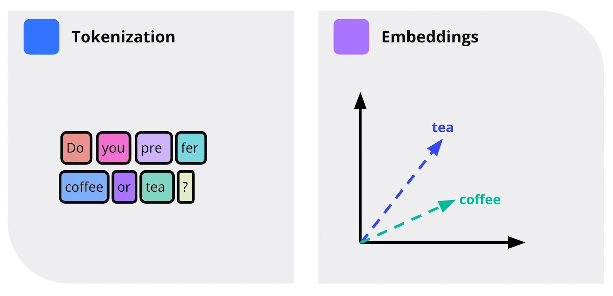

# Udacity Generative AI Nanodegree: Large Language Models (LLMs) & Text Generation

These are my personal notes taken while following the [Udacity Generative AI Nanodegree](https://www.udacity.com/course/generative-ai--nd608).

The Nanodegree has 4 modules:

1. Generative AI Fundamentals.
2. Large Language Models (LLMs) & Text Generation.
3. Computer Vision and Generative AI.
4. Building Generative AI Solutions.

This folder & guide refer to the **second module**: Large Language Models (LLMs) & Text Generation.

Mikel Sagardia, 2024.
No guarantees.

Overview of Contents:

- [Udacity Generative AI Nanodegree: Large Language Models (LLMs) \& Text Generation](#udacity-generative-ai-nanodegree-large-language-models-llms--text-generation)
  - [1. Introduction LLMs](#1-introduction-llms)
    - [Encoder vs. Decoder Models](#encoder-vs-decoder-models)
    - [Completion vs. Instruction Models](#completion-vs-instruction-models)
    - [Data Flywheel](#data-flywheel)
    - [Fluency vs. Intelligence](#fluency-vs-intelligence)
    - [LLM Generation Parameters](#llm-generation-parameters)
    - [Demo Playground](#demo-playground)
    - [Prompts](#prompts)
    - [Demo: Prompts Using Chain-of-Thought](#demo-prompts-using-chain-of-thought)
    - [Open vs. Closed Models](#open-vs-closed-models)
    - [OpenAI Keys](#openai-keys)
    - [Exercise: Chatbot Memory](#exercise-chatbot-memory)
    - [LLM Limitations](#llm-limitations)
  - [2. NLP Fundamentals](#2-nlp-fundamentals)
    - [Introduction](#introduction)
    - [Encoding Text: Tokenization and Embeddings](#encoding-text-tokenization-and-embeddings)
      - [Exercise: Encoding Text](#exercise-encoding-text)
    - [NLP Models for Sequences](#nlp-models-for-sequences)
      - [Exercise: Text Generation](#exercise-text-generation)
  - [3. Transformers and Attention Mechanism](#3-transformers-and-attention-mechanism)
    - [Introduction](#introduction-1)
    - [Attention](#attention)
      - [Different Attention Mechanisms](#different-attention-mechanisms)
      - [Issues and Solutions of Attention Mechanisms](#issues-and-solutions-of-attention-mechanisms)
    - [BertViz to Investigate Bias](#bertviz-to-investigate-bias)
    - [Exercise: Implement Self-Attention](#exercise-implement-self-attention)
    - [Transformer Models](#transformer-models)
    - [Training Objectives in Transformers](#training-objectives-in-transformers)
    - [Exercise: Implement GPT](#exercise-implement-gpt)
    - [Transformers vs. LSTMs](#transformers-vs-lstms)
    - [Transformer Applications and Trends](#transformer-applications-and-trends)
    - [Research Trends](#research-trends)
      - [Optimization](#optimization)
      - [Improved Understanding](#improved-understanding)
      - [Safe and Ethical Use of AI](#safe-and-ethical-use-of-ai)
    - [Links and Papers](#links-and-papers)
  - [4. Retrieval Augmented Generation](#4-retrieval-augmented-generation)
    - [Gathering Data](#gathering-data)
  - [5. Build Custom Datasets for LLMs](#5-build-custom-datasets-for-llms)
  - [6. Project: Build Your Own Custom Chatbot](#6-project-build-your-own-custom-chatbot)
    - [Notebooks](#notebooks)
    - [Project Requirements](#project-requirements)
    - [Interesting Links](#interesting-links)

## 1. Introduction LLMs

I know most of the contents, so I just write down the key concepts explained in the videos.

Historical recap of LLMs:

- 2017: Transformer model, from Google
- 2018: GPT, OpenAI
- BERT, RoBERTa, T5, ...
- Models continued to grow exponentially in size

See my additional notes in [mxagar/nlp_with_transformers_nbs](https://github.com/mxagar/nlp_with_transformers_nbs).

### Encoder vs. Decoder Models

- The original transformer was a Encoder-Decoder architecture; example model: T5
- However, wa can pull apart the Encoder and the Decoder and work with them independently
  - BERT: Encoder-only
    - Masked words need to be predicted during training
    - A classification head is added to the encoder output
    - The training is bidirectional because we have one/several masked words in a sequence and we need to attend both the previous and posterior words/tokens for each masked token.
    - The training process is called *masked language modeling*.
    - Only 15% of the words are used for training, but the model performs well in downstream discriminative tasks: classification, etc.
  - GPT: Decoder-only
    - The next word is masked
    - Autoregressive: previous output is used  to enlarge the sequence and predict the next word/token
    - All the previous words/tokens are used, whereas the encoder training is bidirectional
    - These are the **generative** models in practice


Links:

- [Attention Is All You Need](https://arxiv.org/abs/1706.03762)
- **[The Illustrated Transformer](https://jalammar.github.io/illustrated-transformer/)**
- **[The Annotated Transformer](https://nlp.seas.harvard.edu/annotated-transformer/)**
- [BERT](https://arxiv.org/abs/1810.04805)
- [GPT](https://openai.com/index/language-unsupervised/)

### Completion vs. Instruction Models

Basic Generative models perform *text completion*: they predict successively the next word/token and the text is completed.
Example use cases:

- Finish emails
- Fill in forms
- etc.

We can adapt those generative models to *instruction following*, so that we instruct them to perform a task and they carry it out (e.g., ChatGPT).
Example use cases:

- Translate
- Extract information
- Summarize
- etc.

Links:

- [Training language models to follow instructions with human feedback](https://arxiv.org/abs/2203.02155)
- [Instruction Tuning for Large Language Models: A Survey](https://arxiv.org/abs/2308.10792)

### Data Flywheel

Fine-tuning (for *text-completion*) and instruction fine-tuning (for *instruction following*) require new datasets; these don't need to be as big as the dataset used for pre-training the foundation model, but we need them, nevertheless.

Many options are possible, if the licenses allow them:

- Collect user interaction data; e.g., interaction with the chatbot/LLM. This is a positive feedback loop, a Flywheel.
- Generate a synthetic instruction-fine-tuning dataset with another model, e.g., by defining our desired instructions and asking an LLM to follow/complete them.
  `{"prompt": <existing_instruction>, "completion": <llm_generated_response>}`
- [Self-Alignment with Instruction Backtranslation](https://arxiv.org/abs/2308.06259): the inverse of the previous, i.e., we humans pick answers and ask an LLM to generate suited instructions.
  `{"prompt": <llm_generated_instruction>, "completion": <existing_document_chunk>}`
- [Constitutional AI: Harmlessness from AI Feedback](https://arxiv.org/abs/2212.08073)
- Generation of preference data from existing prompt/response LLM pairs. This can be used in Reinforcement Learning from Human Feedback (RLHF), but the feeback is still from an LLM. See: [Constitutional AI: Harmlessness from AI Feedback](https://arxiv.org/abs/2212.08073).

### Fluency vs. Intelligence

LLMs are fluent, but not intelligent. Although this is quite controversial.

Language fluency is a human capability, and LLMs seem to have super-human language capabilities.

We could say that language is a step function over all species, and humans have extensively exploited it.

### LLM Generation Parameters

- Model
- Temperature: token-probability pairs are flattened with higher temperatures, so more tokens are likely, we get more creative. Take into account that we **sample tokens/words** in that probability distribution to pick the next token/word.
  - Alternative: greedy decoding, i.e., we pick the token/word with the highest probability.
- Context length or attention window, composed of:
  - System prompt
  - Chat history: so that the LLM knows/has memory of the conversation
  - User prompt
  - Maximum length, `max_tokens`: pre-allocated for the LLM response
  - Note: each new generated token needs to be able to attend all previous tokens!
- Top `p` or top `k`: we chop off all tokens below a probability `p`, so we sample only above a given `p` probability. Similarly we sample on the top `k` tokens/words.
- Penalties (repetition or frequency): the `p` values of already used tokens/words are reduced to avoid repetition. Repetition is a common phenomenon in smaller models.

Example: `temperature = 0` and `top_k = 1` leads to greedy decoding.

Links:

- [HF Blog: How to generate text: using different decoding methods for language generation with Transformers](https://huggingface.co/blog/how-to-generate)
- [OpenAI Reference: Create chat completion](https://platform.openai.com/docs/api-reference/chat/create)
- [OpenAI Platform](https://platform.openai.com/docs/overview)
- [OpenAI Playground](https://platform.openai.com/playground/)
- My notes on the HF Book chapter about test generation: [mxagar/nlp_with_transformers_nbs/chapter-5-text-generation](https://github.com/mxagar/nlp_with_transformers_nbs?tab=readme-ov-file#chapter-5-text-generation)


### Demo Playground

After creating an account, we can use the [OpenAI Playground](https://platform.openai.com/playground/). Recommendations:

- Be as specific as possible
- Use few-shot prompts to improve responses
- Avoid vicious circles: the mode might fall into repeating a sequence or words and then tries to repeat them endlessly. Intuitively, that's understandable: we pass as input the generated response, and since the sequence is being repeated, the model keeps repeating it. More information: [The Curious Case of Neural Text Degeneration](https://arxiv.org/abs/1904.09751).

### Prompts

The model is asked to predict the probabilities of the tokens to be the next selected one (`y`), given a previous sequence (`x`, incl. the prompt) and the model weights (`theta`).

    p(x|y,theta)

Since model weights (`theta`) are constant, the variable we have to improve the response is `x`, i.e., **the prompt and the overall context**.

- Remember LLMs are very good in language fluency, conditioned on the prompt.
- The more precise the context, the less hallucinations.

The prompt is composed by several parts:

- System prompt: personality, role, main task
- Chat history: conversation so far
- Augmented user prompt: we enrich the user request with specific orders proven to increase efficiency
  - Trigger phrases like *Think step by step*
  - Other Chain-of-thought prompts: *Define step by step the reasoning followed to provide the answer*
  - Giving some examples
  - etc.

```python
[
  {"role": "system", "content": "You are an AI assistant..."},  # system prompt
  {"role": "user", "content": "Can you..."},  # chat history
  {"role": "assistant", "content": "Sure..."},  # chat history
  {"role": "user", "content": "Why did you..."},  # user prompt
  
]
```

### Demo: Prompts Using Chain-of-Thought

Create an account at [https://api.together.xyz/](https://api.together.xyz/).

Notebook: [`lab/demo_cot_and_triggers.ipynb`](./lab/demo_cot_and_triggers.ipynb)

In the notebook, we ask Llama 2-7B the number of tokens teh user prompt can contain given the context window size and the size of the appended prompt parts; LLMs famously fail in math exercises.

System prompts are constructed in two ways:

1. Answering the question first or
2. Providing the reasoning first

The latter works best, i.e.: provide a reasoning + finally provide an answer based on the reasoning.

Also, a simple trigger phrase is used: *Think step by step*; it does not perform better, but that's maybe not generalizable.

Links (mainly on Chain-of-Thought):

- [Large Language Models are Zero-Shot Reasoners](https://arxiv.org/abs/2205.11916)
- [Chain-of-Thought Prompting Elicits Reasoning in Large Language Models](https://arxiv.org/abs/2201.11903)
- [Gemini: A Family of Highly Capable Multimodal Models](https://arxiv.org/abs/2312.11805)

### Open vs. Closed Models

Closed models are like black boxes, accessed via API.
We can control the weights of open models, but often their performance is not as good as the one of the closed models.

### OpenAI Keys

We have 5 USD for OpenAI usage via [Vocareum](https://www.vocareum.com/).

Our budget can be checked in the `Cloud Resources` tab.

```python
import os
from openai import OpenAI
from dotenv import load_dotenv

load_dotenv(".env", override=True)
# Set a .env file with the credentials
# OPENAI_API_KEY=xxx
# OPENAI_BASE_URL=https://openai.vocareum.com/v1
# OPENAI_BASE_URL=https://api.openai.com/v1

client = OpenAI(
    base_url = os.getenv("OPENAI_BASE_URL"),
    api_key = os.getenv("OPENAI_API_KEY"),
)
```

### Exercise: Chatbot Memory

Notebook: [`lab/chatbot_memory_management.ipynb`](./lab/chatbot_memory_management.ipynb).

The new OpenAI completions interface was missing, so I updated it.

Key contents:

- **Implements a chatbot with memory**: The notebook builds a conversational agent that keeps track of conversation history across multiple turns.
- **Manages the attention window**: It demonstrates strategies to truncate conversation history dynamically to avoid exceeding the model's token limit.
- **Uses OpenAI GPT models via `OpenAI.chat.completions.create` API**
- **Provides truncation strategies**: Includes two truncation modes: 
  - Simple truncation (dropping oldest messages) 
  - and more selective truncation (removing the oldest user/assistant exchanges while preserving the system prompt).
- **Includes error handling and retry logic**: When prompts exceed the model's capacity, the code captures errors, adjusts the prompt, and retries until successful.

Insights:

- **Memory management is essential** when building chatbots that preserve context—without truncation, prompts will eventually exceed token limits.
- **Different truncation strategies** have different trade-offs: simpler approaches are easier to implement, while more sophisticated ones better preserve important context.
- **Clear separation of system prompts, user inputs, and model responses** improves maintainability and interpretability of conversation history.

Caveat: In the notebook, the conversation is flattened to a single string which contains the entire conversation history. That was necessary in the old API, but now it's possible to pass a list of messages, without any flattening:

```python
messages=[
    {"role": "system", "content": "You are a helpful assistant."},
    {"role": "user", "content": "Hello, how are you?"},
    {"role": "assistant", "content": "I'm fine, how can I help?"},
    {"role": "user", "content": "Tell me a joke."}
]
```

### LLM Limitations

Recall what LLMs do: They predict the next token/word probabilities (`y`) given the input sequence (`x`) and the constant model weights (`theta`):

    p(y|x, theta)

Therefore: The more specific and rich the input `x` the more the model will rely on it, otherwise the more will it rely on its weights.

Challenging tasks:

- Avoiding hallucinations
- Repeating/using difficult to tokenize texts, such as URLs 
- Maths problems

Approaches to overcome these limitations:

- Rich context
- Using tools: calculators, etc.

## 2. NLP Fundamentals

I knew already many concepts, so I just collect the concept names/topics.

For a deeper explanation of them, see:

- [mxagar/nlp_guide](https://github.com/mxagar/nlp_guide)
- [mxagar/nlp_with_transformers_nbs](https://github.com/mxagar/nlp_with_transformers_nbs)

### Introduction

Key ideas:

- NLP = Natural Language Processing
- Natural Language: ambiguity is a feature, in contrast to structured languages (e.g., programming languages).
- NLP applications
  - Speech recognition
  - Text classification
  - Machine language translation
  - Text summarization: extractive vs. abstractive summaries
  - QA: Question-Answering (similar to summarization), also extractive and/or abstractive
  - Chatbots, conversational agents
- Challenges in NLP
  - Relies on context
  - Nuanced: idioms, sarcasm
  - Ambiguity, references within the text
  - Misspelling
  - Biases
  - Labeling

### Encoding Text: Tokenization and Embeddings

Key ideas:

- Tokenization and embeddings are used to encode text
  - Tokens: unitary and discrete chunks
  - Embeddings: continuous vectors which encode meaning and context
- Tokenization steps
  - Normalization: clean, lowercase, remove punctualization, etc. We can decide the degree
  - Pretokenization: split by spaces, i.e., we words and symbols
  - Tokenization: split words and symbols into tokens (sub-word tokenization)
  - Postprocessing: adding special symbols, as B/EOS, etc.
- HuggingFace tokenizer: see usage in notebook and code summary below.
  - Encoding and decoding: words <-> tokens <-> ids
  - Maximum model length: 512 (tokens) for BERT
  - Special tokens: unknown, B/EOS, padding, classification, etc.
- Embeddings
  - Vectorization methods: Bag-of-words, one-hot encoding, TF-IDF
    - All of these lack of meaning capturing, context awareness
  - Embeddings are vectors which capture meaning: similar tokens have similar vectors
    - We can perform math operations with meanings!




Notebooks: 

- [`lab/hugging-face-tokenizer.ipynb`](./lab/hugging-face-tokenizer.ipynb)
- [`lab/hugging-face-tokenizer-properties.ipynb`](./lab/hugging-face-tokenizer-properties.ipynb)

**HuggingFace Tokenizer** code summary:

```python
# Choose & download a pretrained tokenizer to use
# BERT (encoder-only) and CASED: it cares about capitalization
my_tokenizer = AutoTokenizer.from_pretrained('bert-base-cased')

# Simple method getting tokens from text
raw_text = '''Rory's shoes are magenta and so are Corey's but they aren't nearly as dark!'''
tokens = my_tokenizer.tokenize(raw_text)
print(tokens)
# Sub-word tokenization: words are split into sub-words
# In the case of the BERT tokenizer, the successive split parts are prefixed with '##'
# ['Rory', "'", 's', 'shoes', 'are', 'mage', '##nta', 'and', 'so', 'are', 'Corey', "'", 's', 'but', 'they', 'aren', "'", 't', 'nearly', 'as', 'dark', '!']

# This method also returns special tokens depending on the pretrained tokenizer
# Special tokens are used to mark the beginning and end of a sequence, etc.
# BERT uses [CLS] for the start of a sequence and [SEP] for the end
# [UNK] is used for unknown tokens or words/tokens out-of-vocabulary (e.g., often emojis)
detailed_tokens = my_tokenizer(raw_text).tokens()
print(detailed_tokens)
# ['[CLS]', 'Rory', "'", 's', 'shoes', 'are', 'mage', '##nta', 'and', ..., [SEP]']

# Way to get tokens as integer IDs
print(my_tokenizer.encode(raw_text))
# [101, 14845, 112, 188, 5743, 1132, 27595, 13130, 1105, 1177, 1132, 19521, 112, 188, 1133, 1152, 4597, 112, 189, 2212, 1112, 1843, 106, 102]

# Tokenizer method to get the IDs if we already have the tokens as strings
detailed_ids = my_tokenizer.convert_tokens_to_ids(detailed_tokens)
print(detailed_ids)
# [101, 14845, 112, 188, 5743, 1132, 27595, 13130, 1105, 1177, 1132, 19521, 112, 188, 1133, 1152, 4597, 112, 189, 2212, 1112, 1843, 106, 102]

# Returns an object that has a few different keys available
# It returns a dictionary/object
my_tokenizer(raw_text)
# {'input_ids': [101, 14845, 112, 188, ...], 'token_type_ids': [0, 0, 0, 0, ...], 'attention_mask': [1, 1, 1, 1, ...]}

# Typical call:
print(my_tokenizer(raw_text).input_ids)
# [101, 14845, 112, 188, ...]

# Integer IDs for tokens
ids = my_tokenizer.encode(raw_text)
# The inverse of the .encode() method: .decode()
my_tokenizer.decode(ids)
# "[CLS] Rory ' s shoes are magenta and so are Corey ' s but they aren ' t nearly as dark! [SEP]"

# To ignore special tokens (depending on pretrained tokenizer)
my_tokenizer.decode(ids, skip_special_tokens=True)
# "Rory ' s shoes are magenta and so are Corey ' s but they aren ' t nearly as dark!"

# List of tokens as strings instead of one long string
my_tokenizer.convert_ids_to_tokens(ids)
# ['[CLS]', 'Rory', "'", 's', 'shoes', ...

# tokenizer.model_max_length: the maximum amount of tokens that the tokenizer/model takes per input
my_tokenizer.model_max_length # 512

# tokenizer.all_special_tokens: the special tokens used by the tokenizer
my_tokenizer.all_special_tokens # ['[UNK]', '[SEP]', '[PAD]', '[CLS]', '[MASK]']

# tokenizer.unk_token: the unknown token used by the tokenizer
# tokenizer.bos_token: the beginning of sequence token used by the tokenizer
# tokenizer.eos_token: the end of sequence token used by the tokenizer
# tokenizer.pad_token: the padding token used by the tokenizer
# tokenizer.cls_token: the classification token (aka. class of input) used by the tokenizer
my_tokenizer.unk_token # '[UNK]'
```

#### Exercise: Encoding Text

Notebook: [`lab/encoding.ipynb`](./lab/encoding.ipynb)

A simple tokenizer is built manually, following the 4 typical steps: normalization, pretokenization, tokenization, postprocessing.
However, note that tokenizers usually are trained on corpora to learn efficient splitting nowadays.

Notebook contents:

* **Normalization Step**: Text is first normalized (e.g., lowercased, cleaned) to ensure consistent input before splitting.
* **Pre-tokenization**: The normalized text is split into basic units, typically by whitespace or punctuation.
* **Tokenization**: These units are converted into integer IDs or tokens, defining the core encoding.
* **Postprocessing**: Additional processing, such as adding special tokens (like `[CLS]` and `[SEP]`), finalizes the encoded sequence.
* **Decoding**: In addition to encoding, decoding is also implemented.

### NLP Models for Sequences

Key ideas:

- Text is a sequence
- Many model types can be built to handle sequences
  - Sequence to single value: text -> sentiment
  - Sequence to sequence: text translation
    - Often they encode the input sequence to an internal representation and use that representation to decode the output sequence
  - Single value to sequence
  - ...
- Recurrent Neural Networks (RNNs)
  - Sequence processed sequentially
  - Hidden states stored and updated in successive time steps
  - Model inputs
    - Encoder: Initially, input sequence tokens one by one
    - Decoder: When input sequence finishes and we request output sequence, the input fro the next step is the previous model output
  - Issues
    - Sequences processed sequentially, not in parallel (thus, slow)
    - Vanishing gradient problem: in very deep neural networks, the gradient values decrease due to the fact that they are computed using the product chain
    - Hidden states should represent memory, which starts forgetting concepts as the sequence length increases
  - Solution: Transformers and Attention
    - Sequences can be processed in parallel
    - Attention learns where to focus, so there is less memory loss effect
- Autoregressive models: they take their previous outputs as (part of) the input
- Sampling methods: rather than predicting the next word/token, models output the probability for all the tokens in the vocabulary
  - Sampling consists in choosing in that distribution
  - Parameters: temperature, `top_p`, `top_k`
  - Beam search: considers not only the `p` of the current token, but the `p` of a sequence of tokens


#### Exercise: Text Generation

Notebook: [`lab/text-generation.ipynb`](./lab/text-generation.ipynb).

The notebook has two parts and it uses a [`helper.py`](./lab/helper.py) file, which contains:

* Class `TokenMapping`: Stores token–ID mappings:
  * `id2token`: list mapping indices to tokens
  * `token2id`: dict mapping tokens to indices
  * `__len__`: returns vocabulary size
  * `decode(ids)`: converts a list of IDs back to text tokens
  * `encode(tokens)`: converts tokens into IDs

* Class `ShakespeareDataset`: PyTorch `Dataset` for preparing training data

* Function `encode_text(text, mapping=None)`: Encodes text into numeric IDs
  * If `mapping` is provided: Splits text into tokens (for subword) and converts tokens to IDs
  * If no mapping, it returns list of characters (character-level)

* Function `build_model(vocab_size, embed_dim, rnn_units)`: Builds a PyTorch model for text generation:
  * Embedding layer
  * GRU recurrent layer
  * Linear layer projecting to logits

* Function `next_token(logits, temperature=1.0, top_k=None)`: Samples the next token index:
  * Applies temperature scaling
  * Optionally applies top-k sampling

Concerning the two parts of the notebook:

- Part 1: Character-based Text Generation:

  * Loads the Shakespeare corpus and uses **`encode_text()`** to convert characters into integer IDs (character-level encoding).
  * Initializes **`TokenMapping`** for character-level vocabulary, mapping each unique character to an integer.
  * Creates **`ShakespeareDataset`** to generate training sequences, where each input sequence corresponds to the target sequence shifted by one character.
  * Builds a model with **`build_model()`**, which uses:
    * an embedding layer sized to the character vocabulary,
    * a GRU recurrent layer,
    * and a linear output layer projecting to the character logits.
  * Trains the model using cross-entropy loss over multiple epochs.
  * Defines **`next_token()`** to sample the next character, using temperature scaling and optional top-k filtering.
  * Generates character-level text by repeatedly predicting and appending characters.

- Part 2: Subword Text Generation:

  * Imports and uses a pretrained **Byte Pair Encoding (BPE) tokenizer** from the `tokenizers` library (e.g., **`ByteLevelBPETokenizer`**) instead of character-level encoding.
  * The tokenizer is trained on the Shakespeare text to learn subword units (common character sequences).
  * Uses **`encode_text()`** with the BPE tokenizer to encode the corpus into subword IDs.
  * Initializes **`TokenMapping`** to manage subword IDs and token lookup.
  * Re-creates **`ShakespeareDataset`** with subword sequences.
  * Builds a new model with **`build_model()`**, configured to handle the larger subword vocabulary.
  * Trains the model similarly to the character-based model but now predicting subword tokens.
  * Generates text at the subword level using **`next_token()`**, decoding the generated sequence into text via the tokenizer’s `.decode()` method.


## 3. Transformers and Attention Mechanism

I knew already many concepts, so I just collect the concept names/topics.

For a deeper explanation of them, see:

- [mxagar/nlp_with_transformers_nbs](https://github.com/mxagar/nlp_with_transformers_nbs)
- [mxagar/generative_ai_book](https://github.com/mxagar/generative_ai_book)
- [mxagar/deep_learning_udacity/04_RNN](https://github.com/mxagar/deep_learning_udacity/blob/main/04_RNN/DLND_RNNs.md)
- [mxagar/computer_vision_udacity/03_Advanced_CV_and_DL](https://github.com/mxagar/computer_vision_udacity/blob/main/03_Advanced_CV_and_DL/CVND_Advanced_CV_and_DL.md#3-recursive-neural-networks-rnn)

### Introduction

- Generative Text, Shift: RNNs -> Transformers
- Generative Images, Shift: GANs -> Diffusion Models
- RNNs and LSTMs
- [ELMo Paper: Deep Contextualized Word Representations, 2018](https://aclanthology.org/N18-1202/)
  - It creates contextual embeddings that could differentiate between the same word being used in different contexts.
  - LSTMs were used
- [Attention Paper: Neural Machine Translation by Jointly Learning to Align and Translate, 2014](https://arxiv.org/abs/1409.0473)
  - > Instead of relying on a single context vector, attention allowed the model to combine all of the encoder's hidden states to become its context vector.

### Attention

Attention is related to three values/concepts that have been around for decades in databases:

-	Query: what we are looking for
-	Key: an index or identifier against which we compare the query
-	Value: the data retrieved using the key

This metaphor is used in attention mechanisms to build a contextualized representation of each token:

-	We compute similarity scores (dot products) between the Query and each Key.
-	We apply softmax to transform these scores into a probability distribution (attention weights).
-	We compute the weighted sum of the Values using these weights; this becomes the **contextualized vector**.


There are at least 3 ways of computing attention:

- Multiplicative: also called dot-product attention (Luong), fast and widely used (e.g., BERT).
- Additive: also called Bahdanau attention, combines learned projections and non-linearities (e.g., tanh) to compute scores; it supports variable-length inputs and is particularly good for alignment in sequence-to-sequence models like translation.
- General: a more flexible variant that learns a weight matrix to project Queries and Keys to the same dimension; more expressive than multiplicative but still faster than additive.


See my notes on the transformer anatomy for a detailed description of the blocks that use attention in the Transformer:

[mxagar/nlp_with_transformers_nbs/chapter-3-transformer-anatomy](https://github.com/mxagar/nlp_with_transformers_nbs?tab=readme-ov-file#chapter-3-transformer-anatomy)


- Embeddings (+ positional encoding) are projected to the tensors Q, K, V.
- The Q, K, V tensors are used to compute the *contextualized vector* using attention; that's a single self-attention head.
- There are several self-attention heads; their outputs are concatenated to form a multi-head attention layer.
- Each block is a residual structure, so it is composed by a multi-head attention layer and also: normalization, linear mappings and two skip connections.
- The encoder of a transformer has several blocks.

```python
def attention(query, key, value):
    "Compute 'Scaled Dot Product Attention'"
    d_k = query.size(-1)
    scores = torch.matmul(query, key.transpose(-2, -1)) / math.sqrt(d_k)
    p_attn = scores.softmax(dim=-1)
    return torch.matmul(p_attn, value)
```

#### Different Attention Mechanisms

**Self-attention**: The embeddings projected to Q, K, V are the same.

- We detect the relationships of the sequence elements wrt. each other
- Matrix multiplication can be parallelized!
- Interaction is O(1), but computation is O(n^2).

**Multi-head attention**: same as self-attention, but we have several heads (each with their weights), and their outputs are concatenated.

**Multi-query attention**: similar to multi-head, but we have multiple Qs, and only one K and V, shared.

- Faster training.
- Larger batches.
- Used to scale to large LLMs (Llama 2).

**Cross-attention**: Q is different to K and V. Used in the decoder; Q can come from a different source or even modality!

#### Issues and Solutions of Attention Mechanisms

- No notion of input order
  - Solution: Positional encodings
- There is no non-linearity between repeated self-attention layers; that's an issue because everything becomes like a single layer.
  - Solution: a feed forward layer is added in-between.
- By default, self-attention can look into the future when predicting a sequence.
  - Solution: attention of future words/tokens is masked out during decoding

### BertViz to Investigate Bias

A short demo is done with [BertViz](https://github.com/jessevig/bertviz?tab=readme-ov-file#self-attention-models-bert-gpt-2-etc).

BertViz helps visualize attention in transformer models.

Video: [Using Bert To Detect Bias-Enhanced](https://www.youtube.com/watch?v=tSvn3RLDsrY). 

Notebook: [lab/demo-using-bertviz-to-detect-bias-completed.ipynb](./lab/demo-using-bertviz-to-detect-bias-completed.ipynb):

- Attention views are shown: Head view, Model view, Neuron view
- The attention relationships of two sentences are compared to investigate bias even in models trained in unsupervised datasets:
  - *The doctor asked the nurse a question. She*
    - Layer 5 of GPT2: *She* attends to *nurse*.
  - *The doctor asked the nurse a question. He*
    - Layer 5 of GPT2: *He* attends to *The doctor*.
- GPT2 seems to encoding some occupational bias in layer 5...

### Exercise: Implement Self-Attention

Notebook: [lab/exercise-1-implement-self-attention-solution.ipynb](./lab/exercise-1-implement-self-attention-solution.ipynb)

- A `MultiHeadSelfAttention` module is implemented in Pytorch, and tested with dummy embedding values.
- This specific GPT implementation is heavily inspired by the [minGPT implementation](https://github.com/karpathy/minGPT) provided by [Andrej Karpathy](https://github.com/karpathy/).
- Scaled multiplicative attention is used, as in the original paper.
- One important part is the mask: a mask is applied to hide the future tokens in the sequence; otherwise, the GPT model would cheat.
  - Masking is done filling the values with `float("-inf")`; then, the `softmax(-inf) = 0`.
- Thus, the encoder can have **multi-head attention** blocks, whereas the decoder has **MASKED multi-head attention** blocks.

```python
import math

import torch
import torch.nn as nn
from torch.nn import functional as F


class MultiHeadSelfAttention(nn.Module):
    """A vanilla multi-head masked self-attention layer."""

    def __init__(self, config):
        super().__init__()
        assert config.n_embd % config.n_head == 0

        # key, query, value projections for all heads
        self.key = nn.Linear(config.n_embd, config.n_embd)
        self.query = nn.Linear(config.n_embd, config.n_embd)
        self.value = nn.Linear(config.n_embd, config.n_embd)

        # regularization
        self.attn_drop = nn.Dropout(config.attn_pdrop)
        self.resid_drop = nn.Dropout(config.resid_pdrop)

        # output projection
        self.proj = nn.Linear(config.n_embd, config.n_embd)

        # causal mask to ensure that attention is only applied to the left in the input sequence
        self.register_buffer(
            "mask",
            torch.tril(torch.ones(config.block_size, config.block_size)).view(
                1, 1, config.block_size, config.block_size
            ),
        )
        self.n_head = config.n_head

    def forward(self, x):
        """The forward pass for the multi-head masked self-attention layer.

        In this exercise, we include lots of print statements and checks to help you
        understand the code and the shapes of the tensors. When actually training
        such a model you would not log this information to the console.
        """

        # batch size, sequence length (in tokens), embedding dimensionality (n_embd per token)
        B, T, C = x.size()
        hs = C // self.n_head  # head size

        # print some debug information
        print(f"batch size: {B}")
        print(f"sequence length: {T}")
        print(f"embedding dimensionality: {C}")
        print(f"number of heads: {self.n_head}")
        print(f"head size: {hs}")

        # calculate query, key, values for all heads in batch and move head forward to be the batch dim
        # resulting dims for k, q, and v are (B, n_head, T, hs)
        k = self.key(x).view(B, T, self.n_head, hs).transpose(1, 2)
        q = self.query(x).view(B, T, self.n_head, hs).transpose(1, 2)
        v = self.value(x).view(B, T, self.n_head, hs).transpose(1, 2)

        # multiply q and k_t matrices, then divide by the square root of d_k
        print("=== Calculate MatrixMultiplication(Q, K_T) / sqrt(d_k) ===")

        k_t = k.transpose(-2, -1)  # what is the shape of k_t?
        d_k = k.size(-1)

        # Matrix multiplication (hint: not "*")
        att = q @ k_t / math.sqrt(d_k)

        print(f"q.shape: {q.shape}")
        print(f"k_t.shape: {k_t.shape}")
        print(f"d_k: {d_k}")
        print(f"att.shape: {att.shape}")

        # set the mask fill value to negative infinity
        print("=== Apply the attention mask ===")

        masked_fill_value = float("-inf")

        att = att.masked_fill(self.mask[:, :, :T, :T] == 0, masked_fill_value)

        # Show the result of applying the mask
        print(f"att: {att}")

        # apply softmax
        print("=== Softmax ===")

        att = F.softmax(att, dim=-1)

        att = self.attn_drop(att)

        # Show the result of applying the softmax and check that
        # the sum of the attention weights in each row is 1
        print(f"att.shape: {att.shape}")
        print(f"att: {att}")
        print(f"att.sum(dim=-1): {att.sum(dim=-1)}")
        att_rows_sum_to_one = all(
            ((att.sum(dim=-1) - 1.0) ** 2 < 1e-6).flatten().tolist()
        )
        print(f"att_rows_sum_to_one: {att_rows_sum_to_one}")
        if not att_rows_sum_to_one:
            raise ValueError(
                "Attention weight rows do not sum to 1. Perhaps the softmax dimension or masked_fill_value is not correct?"
            )

        # multiply att and v matrices
        # (B, n_head, T, T) x (B, n_head, T, hs) -> (B, n_head, T, hs)
        print("=== Calculate final attention ===")

        y = att @ v

        print(f"y.shape: {y.shape}")

        # re-assemble all head outputs side by side
        y = y.transpose(1, 2).contiguous().view(B, T, C)

        # output projection
        y = self.resid_drop(self.proj(y))
        return y
```


### Transformer Models

As already mentioned, there are 3 types of Transformer models:

- Encoder-only, e,g., BERT
- Encoder-Decoder, e.g., T5
- Decoder-only, e.g., GPT

In all of them the **multi-head attention block** introduced in [Attention](#attention) is used, however, these blocks are wrapped with some other layers:

- Layer normalization: inputs/outputs are normalized to mean 0, std 1. This normalization can be pre-layer (original) or post-layer (most common nowadays).
  - This allows for faster training.
- Skip connections (aka. residual connections): previous embeddings (before transformations/updates) are added. These skip/residual connections
  - Minimize the gradient vanishing problem.
  - Enable deeper networks.
  - Improve the optimization of the loss function.
- Positional feed-forward layer: two linear/dense matrices (followed by a dropout) further transform the embeddings. Usually,
  - the first transformation increases 4x the size of the embeddings
  - and the second scales back the embeddings to their original size.


Also, consider *positional encoding* is added to the embeddings. Positional encoding can be:

- Absolute; e.g., sinusoidal values: they allow inputs of various lengths, and were used in the original paper.
- Learned positional encodings.
- Others: active area of research.


### Training Objectives in Transformers

Typical training strategies for transformers:

- Autoregressive (causal): next token prediction; GPT
  - Every time we pass a sequence, the future token values are masked, to avoid cheating; thus, the matrices are lower diagonal.
  - Teacher forcing is used, which involves using the actual target output (the ground truth) from the training data as the input to the next time step in the sequence, rather than using the model's own predicted output from the previous time step.
- Denoising Autoencoders: predict masked tokens or next sentences; BERT
  - Sentence(s) are input and tokens are masked; we request the masked tokens
  - Predicting the next sentence is also a strategy: we present to sentences and ask the model whether the second is a logical continuation of the first. So it's a binary classification problem.
- Contrastive: target similarity; SBERT, CLIP

Those techniques are self-supervised techniques, i.e., we can work with *unlabeled data*. The output is a **pre-trained model**. Then, we can apply **fine-tuning** to adapt our model to our task/domain. To that end, we usually need *labeled data*, but in a much smaller amount than the *unlabeled dataset*.


### Exercise: Implement GPT

Code:

- Notebook: [lab/exercise-2-create-your-own-gpt-model-solution.ipynb](./lab/exercise-2-create-your-own-gpt-model-solution.ipynb)
- Module: [lab/common.py](./lab/common.py)

> This specific GPT implementation is heavily inspired by the [minGPT implementation](https://github.com/karpathy/minGPT) provided by [Andrej Karpathy](https://github.com/karpathy/).

Key contents:

-	The notebook walks through the implementation of a simplified GPT model inspired by Karpathy’s minGPT, using PyTorch.
-	It defines three core components for the model:
  -	`MultiHeadSelfAttention` (imported from `common.py`)
  -	`Block`, a Transformer block with residual connections and MLP
  -	`GPT`, the full model with token/position embeddings, transformer blocks, and a generation method
-	The GPT model includes a generate method to autoregressively generate sequences from a given prompt using temperature scaling and (optionally) top-k sampling.
-	A simple toy dataset of addition problems like `111 + 222 = 3 + 30 + 300 = 333` is introduced, meant to train the model on learning symbolic addition in stages.
-	The notebook concludes by verifying that the model can forward inputs and generate sequences without error, setting up for later training.

### Transformers vs. LSTMs


In summary, Transformers have many performance advantages over LSTMs; however, the *naive* **Self-Attention** mechanism is quadratic, i.e., all sequence tokens against all sequence tokens. That limits the input length.

### Transformer Applications and Trends

- Devices, such as [https://www.rabbit.tech/](https://www.rabbit.tech/)
- Multi-Modal Understanding, rather than only text understanding/generation.
  - Check: [MMMU: A Massive Multi-discipline Multimodal Understanding and Reasoning Benchmark for Expert AGI](https://mmmu-benchmark.github.io/)
- The shift from Transformers to AI Systems; interesting article: [The Shift from Models to Compound AI Systems](https://bair.berkeley.edu/blog/2024/02/18/compound-ai-systems/).
- Retrieval-Augmented Generation (RAG)
  - There is a debate due to the continuously increased context windows; will effectively infinite windows arrive and if so, will they render RAGs unnecessary?
- Agents

### Research Trends

#### Optimization

Attention requires a pairwise token computation, which makes the naive approach quadratic on the sequence length.

Some optimizations are being done:

- Hardware optimization
  - 1-bit models: quantization
  - CUDA kernel optimizations
- Variation of the Transformers
  - Reformer: locality-sensitive hashing done to achieve `nlogn` complexity
  - Linformer: low-ran approximations used
  - Performer: orthogonal random features used
- New/alternative architectures, e.g., **Mamba**
  - Not a transformer model, but a *state-space model*
  - Inference faster than in transformers
  - It excels at long sequences (1M tokens)
  - At 3B parameters, it outperforms transformers of the same size
  - If it can scale to larger models while still outperforming transformers, it may dethrone them!

#### Improved Understanding

- [In-context Learning and Induction Heads, 2022](https://arxiv.org/abs/2209.11895)
  - *Induction heads* are hypothetical components that help the model learn from the context.
- [Grokking of Hierarchical Structure in Vanilla Transformers, 2023](https://arxiv.org/abs/2305.18741)
  - Analyzes the model's ability of going beyond the memorized data, i.e., generalization
- [Quantifying Memorization Across Neural Language Models, 2022](https://arxiv.org/abs/2202.07646)
  - > The authors noted:
    - > that the likelihood of LLMs reproducing memorized content verbatim increases with the model's capacity,
    - > the duplication frequency of a training example, and
    - > the length of the context used for prompting.

#### Safe and Ethical Use of AI

- [A Human Rights-Based Approach to Responsible AI, 2022](https://arxiv.org/abs/2210.02667)
- [An Overview of Catastrophic AI Risks, 2023](https://arxiv.org/abs/2306.12001)

### Links and Papers

- Transformers Paper:
  - [Arxiv: Attention is All You Need](https://arxiv.org/abs/1706.03762)
  - [PDF: Attention is All You Need](./assets/google_transformers_paper_2017.pdf)
- [A Decomposable Attention Model for Natural Language Inference](https://arxiv.org/abs/1606.01933v2)
- [Understanding Parameter Sharing in Transformers](https://arxiv.org/abs/2306.09380)
- [Falcon](https://huggingface.co/docs/transformers/main/model_doc/falcon)
- [Llama 2](https://huggingface.co/docs/transformers/model_doc/llama2)ç
- [HiCLIP: Contrastive Language-Image Pretraining with Hierarchy-aware Attention](https://arxiv.org/abs/2303.02995)
- [Scaling Transformer to 1M tokens and beyond with RMT; Bulatov et al., 2023](https://arxiv.org/abs/2304.11062).
- [Paper: Learning Positional Embeddings for Coordinate-MLPs, 2021](https://arxiv.org/abs/2112.11577)
- [Paper: Improving Language Understanding by Generative Pre-Training](https://cdn.openai.com/research-covers/language-unsupervised/language_understanding_paper.pdf)
- [Paper: ResNet, 2015](https://arxiv.org/abs/1512.03385)
- [Paper: BERT, 2018](https://arxiv.org/abs/1810.04805)
- Transformer optimization and latest research directions
  - [The Era of 1-bit LLMs: All Large Language Models are in 1.58 Bits, 2024](https://arxiv.org/abs/2402.17764)
  - [FlashAttention: Fast and Memory-Efficient Exact Attention with IO-Awareness, 2022](https://arxiv.org/abs/2205.14135)
  - [Reformer: The Efficient Transformer, 2020](https://arxiv.org/abs/2001.04451)
  - [Linformer: Self-Attention with Linear Complexity, 2020](https://arxiv.org/abs/2006.04768)
  - [Rethinking Attention with Performers, 2020](https://arxiv.org/abs/2009.14794)
  - [Mamba: Linear-Time Sequence Modeling with Selective State Spaces, 2023](https://arxiv.org/abs/2312.00752)
- Transformer understanding research directions:
  - [In-context Learning and Induction Heads, 2022](https://arxiv.org/abs/2209.11895)
  - [Grokking of Hierarchical Structure in Vanilla Transformers, 2023](https://arxiv.org/abs/2305.18741)
  - [Quantifying Memorization Across Neural Language Models, 2022](https://arxiv.org/abs/2202.07646)
- Ethics:
  - [A Human Rights-Based Approach to Responsible AI, 2022](https://arxiv.org/abs/2210.02667)
  - [An Overview of Catastrophic AI Risks, 2023](https://arxiv.org/abs/2306.12001)


## 4. Retrieval Augmented Generation

OpenAI APIs are used to build a RAG QA chatbot which considers recent events persisted in a database.

Check: [OpenAI API Quickstart guide](https://platform.openai.com/docs/quickstart).

Steps summary:

1. Prepare dataset: tokenize and convert into embedding vectors.
  - These vectors are stored in a (vector) database.
2. Find relevant data related to the query.
  - The query is converted into a vector and using cosine similarity we search the items in our dataset which are most related to it.
3. A custom text prompt is composed, which integrates the query and the database items found.
4. Query a completion model which provides with the answer.


Dataset(s):

1. Course example: [Wikipedia 2022 events](https://en.wikipedia.org/wiki/2022)
2. Exercise: [2023 Turkey–Syria earthquakes](https://en.wikipedia.org/wiki/2023_Turkey%E2%80%93Syria_earthquakes)

The rest of the section uses the first dataset (Wikipedia 2022 events) to build a RAG QA chatbot:

[lab/casestudy_rag_wikpedia_2022.ipynb](./lab/casestudy_rag_wikpedia_2022.ipynb)

Additionally the second dataset (2023 Turkey–Syria earthquakes) is used as an exercise:

[lab/exercise_rag.ipynb](./lab/exercise_rag.ipynb)

Set up an OpenAI account:

- Get an OpenAI API key: Settings > API Keys > Create new secret key
- Create a `.env` file with the API key.
- Add credit to the OpenAI account: Settings > Billing > Add payment method & Add credit balance

Then, we can check everything works, as done in [lab/openai_test.ipynb](./lab/openai_test.ipynb):

```python
import os
import dotenv
from dotenv import load_dotenv
from openai import OpenAI

load_dotenv(".env")

client = OpenAI(
  api_key=os.environ['OPENAI_API_KEY'],
)

# Chat completion
response = client.chat.completions.create(
    model="gpt-4o-mini",
    messages=[
        {"role": "system", "content": "You are a helpful assistant."},
        {"role": "user", "content": "What's the difference between GPT-4 and GPT-4o mini?"}
    ],
    temperature=0.7
)

print(response.choices[0].message.content)
# ...

ukraine_prompt = """
Question: "When did Russia invade Ukraine?"
Answer:
"""

# Prompt completion
response = client.completions.create(
    model="gpt-3.5-turbo-instruct",
    prompt=ukraine_prompt,
    max_tokens=150,
    temperature=0.7,
)

initial_ukraine_answer = response.choices[0].text.strip()
print(initial_ukraine_answer)  # "Russia invaded Ukraine in February 2014."
# The model is answering this way because the training data ends in 2021.
# Our task will be to provide context from 2022 to help the model answer these questions correctly.
# That can be accomplished by using a Retrieval-Augmented Generation (RAG) approach.
```

We can see that there are two main API calls:

- `chat.completions.create`: for chat-based interactions, which supports roles, memory, and turns.
- `completions.create`: for simple Q&A or text generation, which is prompt-only, and legacy-compatible.

### Gathering Data


## 5. Build Custom Datasets for LLMs

TBD.

:construction:

## 6. Project: Build Your Own Custom Chatbot

TBD.

:construction:

### Notebooks

- Project: [mxagar/rag-app-examples](https://github.com/mxagar/rag-app-examples)

### Project Requirements


### Interesting Links

- [mxagar/azure-rag-app](https://github.com/mxagar/azure-rag-app)
- [aws-samples/aws-genai-llm-chatbot](https://github.com/aws-samples/aws-genai-llm-chatbot)
- [Azure-Samples/azure-search-openai-demo](https://github.com/Azure-Samples/azure-search-openai-demo/)
