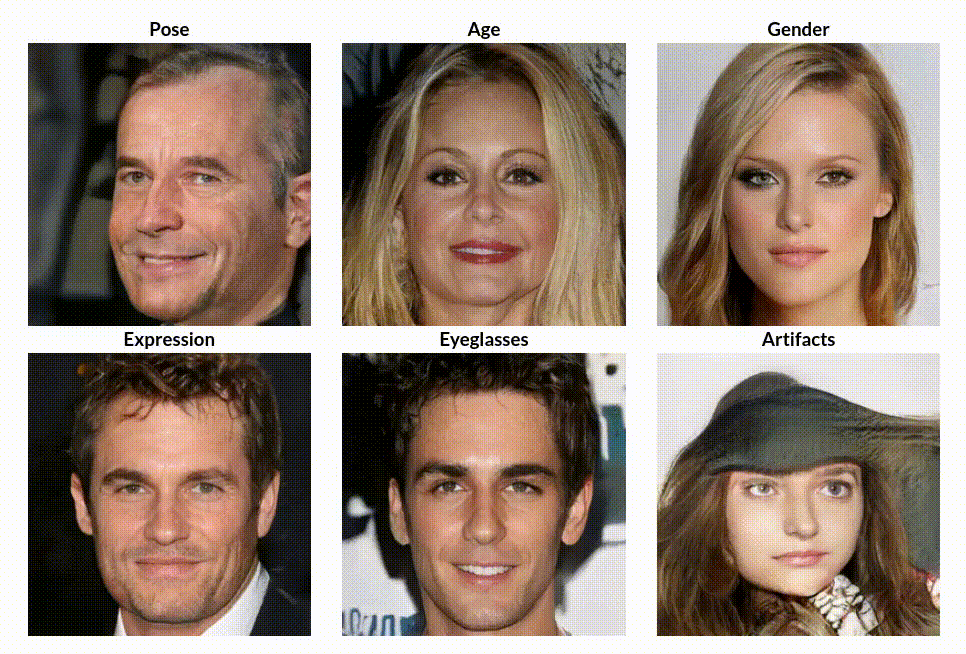
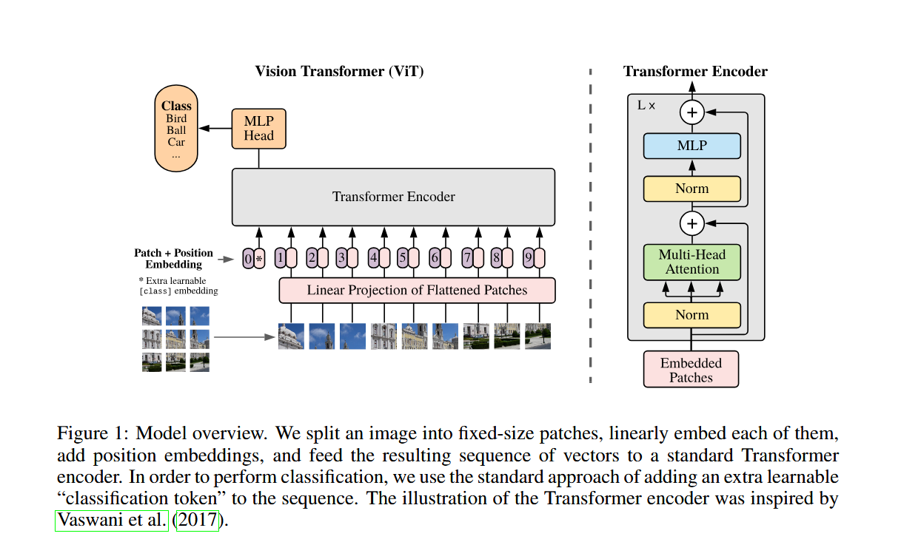
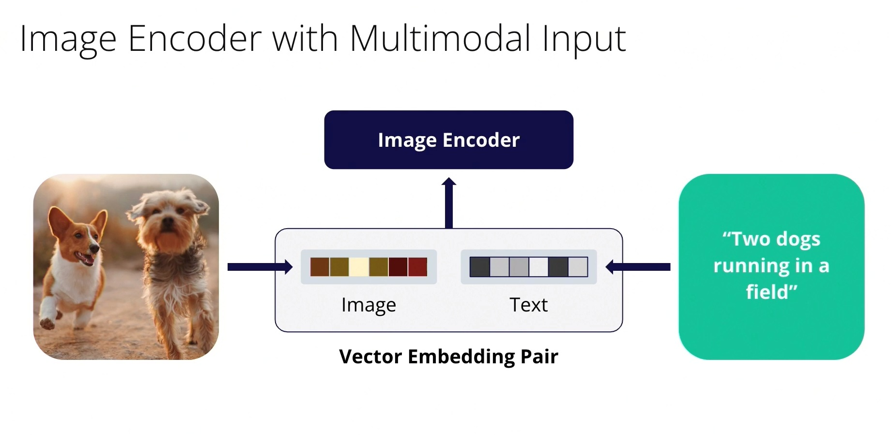
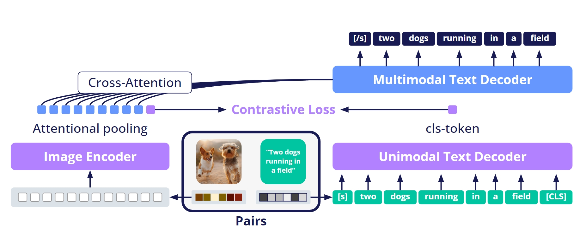
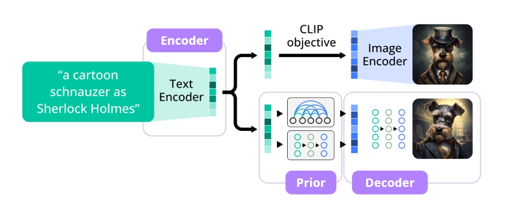
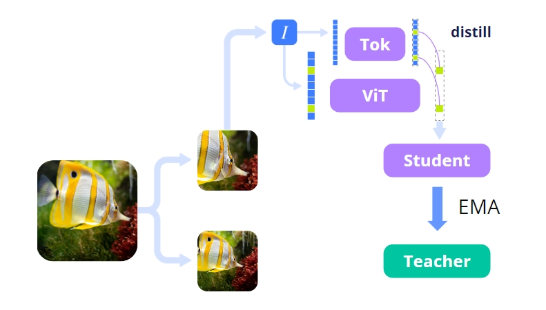
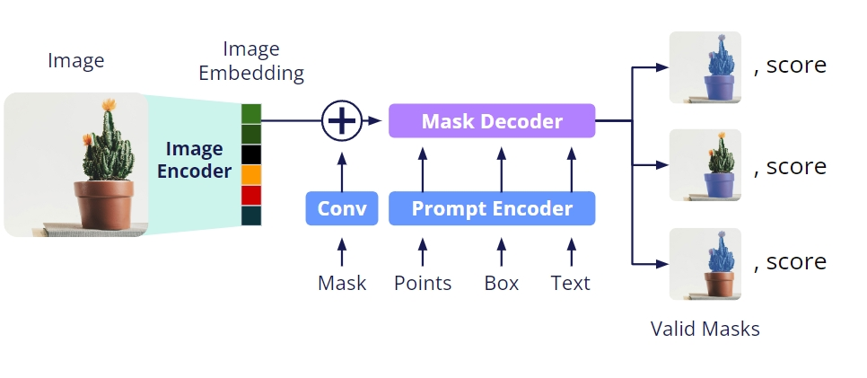
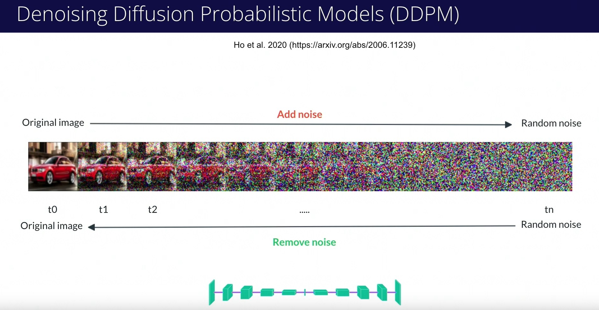
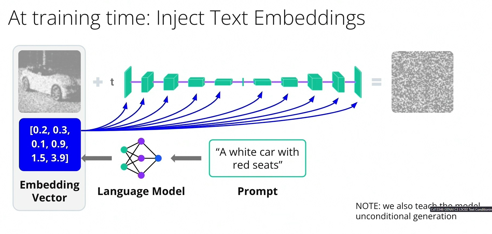

# Udacity Generative AI Nanodegree: Computer Vision and Generative AI

These are my personal notes taken while following the [Udacity Generative AI Nanodegree](https://www.udacity.com/course/generative-ai--nd608).

The Nanodegree has 4 modules:

1. Generative AI Fundamentals.
2. Large Language Models (LLMs) & Text Generation.
3. Computer Vision and Generative AI.
4. Building Generative AI Solutions.

This folder & guide refer to the **third module**: Computer Vision and Generative AI.

Mikel Sagardia, 2024.
No guarantees.

Overview of Contents:

## 1. Introduction to Image Generation

Introductory concepts:

- Discriminative vs. Generative Models
  - Discriminative models learn decision boundaries
  - Generative models learn distributions where they sample from
  - Mathematically they capture related but different models
  - Discriminative models cannot generate, but generative models can somehow discriminate
- Images are high-dimensional points
  - Realistic images are really points in a large vast of noise
  - Generative models learn *islands in an universe of noise*
- Type of Computer Vision Generetive Models
  - Unconditional models, `p(x)`: they learn to generate realistic images without any input; e.g., many GANs. See [https://thispersondoesnotexist.com/](https://thispersondoesnotexist.com/).
  - Conditional models `p(x|prompt)`: they generate according to an input prompt; e.g. :
    - [Stable Diffusion](https://huggingface.co/spaces/google/sdxl): text-to-image
    - [BLIP](https://huggingface.co/spaces/library-samples/image-captioning-with-blip): image-to-text (captioning)
    - [VideoLDM](https://research.nvidia.com/labs/toronto-ai/VideoLDM/): text-to-video
    - [DreamGaussian](https://arxiv.org/abs/2309.16653): image to 3d model
  - Multi-modal `p(x|prompt)`: they take images/texts/etc. and and work with them simultaneously, e.g., we ask it about something on an image; e.g.:
    - [GPT4-Vision](https://openai.com/research/gpt-4v-system-card)
    - [LLaVA](https://huggingface.co/spaces/badayvedat/LLaVA)


### Exercise: Generate an Image with Stable Diffusion

In this section, we learn to play with Stable Diffusion XL 1.0.

To that end, the Gradio local UI from [Automatic1111 - Stable Diffusion Web UI](https://github.com/AUTOMATIC1111/stable-diffusion-webui) is installed and used.


Stable Diffusion

- was trained with 2.3 billion text-image pairs, the dataset is [LAION-5B](https://huggingface.co/papers/2210.08402)
- was trained in 256 NVIDIA A100 GPUs, 150k GPU hours -> 600k USD estimated cost

Some issues:

- It was shown that it captures the biases of the dataset. When asked to generate a doctor, women appear only in 7% of the images (in the US, 39% of the doctors are women).
- Copyright theft is an issue; style cannot be protected, but characters are -- however, the model is able to reproduce popular characters and people.
- Deep fakes.

#### Setup

Instead of downloading and using the web UI locally, I used the Udacity Ubuntu VM.

    Udacity Menu Tab: Cloud Resources
    Start Cloud Resource + Open Cloud Console
    Provide any one of the following login password:

        Username: ubuntu
        Password: ubuntu
        Username: labuser
        Password: vocareum

    Ubuntu starts
    We can use the Terminal
    Clipboard: upper left corner; copy&paste between our machine and Ubuntu
    Install Python 3.10: done in Udacity
    Download Stable Diffusion Web UI: done un Udacity
    Udacity VM instructions:

        # Start Terminal + env
        cd automatic1111
        python3.10 -m venv venv
        source venv/bin/activate

        # Start app: takes 4 mins
        chmod +x webui.sh
        PYTHON=python3.10 ./webui.sh

        # Other Terminal: download weights
        wget https://huggingface.co/stabilityai/stable-diffusion-xl-base-1.0/resolve/main/sd_xl_base_1.0.safetensors -O /home/ubuntu/automatic1111/stable-diffusion-webui/models/Stable-diffusion/sd_xl_base_1.0.safetensors

        # VM Browser
        http://127.0.0.1:7860
        http://localhost:7860

        # Load the previously downloaded model:
        Stable diffusion checkpoint (sd_xl_base_1.0.safetensors)

        # Provide prompt + generate!

    Remember to switch everything off -- we have 40 hours of usage.

For local installation and usage, check [AUTOMATIC1111/stable-diffusion-webui/installation-and-running](https://github.com/AUTOMATIC1111/stable-diffusion-webui?tab=readme-ov-file#installation-and-running).

Very first example tried:

> Prompt: *An astronaut riding a horse on a beach during the dawn*.  
> Paramaters: default
> 

### First Stage: Fixing the Random Seed

The seed makes the generation reproducible.

Seed zapping: for the same prompt, try different seeds.

> A photo of a horse

Seed can be set in the parameters: 1877613533.


### Second Stage: Add Details

We can specify the the details we'd like in the image.

> A photo of a horse jumping in the desert dramatic sky

### Third Stage: Styles

We can mention styles.

> A photo of a horse jumping in the desert dramatic sky by Van Gogh
> A photo of a horse jumping in the desert dramatic sky artstation
> A photo of a horse jumping in the desert dramatic sky intricate details
> A photo of a horse jumping in the desert dramatic sky intricate details National Geographic

### Fourth Stage: Negative Prompts

Negative prompts can be used to specify which concepts should not appear in the generated image.

> "A photo of a horse jumping in the desert dramatic sky intricate details National Geographic", negative prompt: "sand"
> "A photo of a horse jumping in the desert dramatic sky intricate details National Geographic", negative prompt "overexposed, underexposed"

### Fifth Stage: "magic" Words

Magic words are terms discovered by the community which convey specific (often nice) properties to the image: "8k", "high details", etc.

> "A photo of a horse jumping in the desert dramatic sky intricate details National Geographic 8k high details", Negative prompt: "overexposed, underexposed"

### Sixth Stage: Parameters

We can tune the parameters in the UI. However, note that they have no linear effects.

Diffusion works by removing noise from an initial noise map; we have 2 very important params:

- Number of iterations: 20 default; increase might not improve necessarily.
- Classifier-free guidance scale (CFG Scale): how close th emodel should follow prompt; if low, model is freer and more creative...
- Switch: Stable diffusion works with 2 models: base, which creates the base image, and refiner, which refines the details; the switch is the fraction of iteration after which refiner takes over.

> "A photo of a horse jumping in the desert dramatic sky intricate details National Geographic 8k high details", negative prompt: "overexposed, underexposed", Switch at 0.5 and CFG Scale at 6


### Bonus Stage: Inpaint

We can select a region of the image (a badly generated finger/leg) and ask the model to regenerate that part.

- Inpainting icon: colour palette below the generated image.
- Inpaint tab: select/paint region we want to change.

Inpainting has many parameters and they are quire sensitive; we should paly with them, but here's a snapshot of the tested ones:


### Other Examples, Links

- [https://github.com/AUTOMATIC1111/stable-diffusion-webui/wiki](https://github.com/AUTOMATIC1111/stable-diffusion-webui/wiki)
- [https://github.com/AUTOMATIC1111/stable-diffusion-webui/wiki/Extensions](https://github.com/AUTOMATIC1111/stable-diffusion-webui/wiki/Extensions)
- [https://stablediffusion.fr/prompts](https://stablediffusion.fr/prompts)
- [https://stable-diffusion-art.com/automatic1111/](https://stable-diffusion-art.com/automatic1111/)

## 2. Computer Vision Fundamentals

Since I am quite familiar to the topic, I will collect only the key concepts mentioned in the module;.

For more information, you can check other resources of mine, e.g.: [Deep Learning Methods for CV: `mxagar/computer_vision_udacity/CVND_Advanced_CV_and_DL.md`](https://github.com/mxagar/computer_vision_udacity/blob/main/03_Advanced_CV_and_DL/CVND_Advanced_CV_and_DL.md).

Key concepts:

- Image representation: pixels, arrays/matrices, channels
- Features: corners, edges, shapes
- Convolutions (2D local processing): kernels or filters; in DL, they are learnt
- Canny edge detector
- CV tasks: classification, object detection (localization), semantic/instance segmentation
- Intersection Over Union, Non Maximum Supression
- Classical CV vs Deep Learning CV (keys: feature extraction, generalization, interpretability)
- YOLO example
  - Image divided in grid
  - For each grid cell, the probabilities of an object are detected
  - The output has several channels, in which for each grid (x, y, w, h) values are also predicted, among others
  - Realtime
  - Transfer learning, fine-tuning possible
- Demo: pedestrian detection with OpenCV HOG (video)
- Demo: face recognition with eigenfaces and DLIB (notebook, below)

## 3. Image Generation and GANs

Since I am quite familiar to the topic, I will collect only the key concepts mentioned in the module;.

For more information, you can check other resources of mine, e.g.: 

- [mxagar/deep_learning_udacity/05_GAN](https://github.com/mxagar/deep_learning_udacity/blob/main/05_GAN/DLND_GANs.md).
- [mxagar/generative_ai_book/gans](https://github.com/mxagar/generative_ai_book?tab=readme-ov-file#chapter-4-generative-adversarial-networks-gans)

Key introductory concepts:

- Image generation can be
  - Unconditional: GANs
  - Conditional
    - text2img: Stable Diffusion
    - img2img: ControlNet (draw sketches), Inpainting or Part Substitution
- Three main image generation algorithms:
  - VAEs
  - GANs
  - Diffusion
- Generative models can be evaluated in terms of [three properties, aka. the imposible triangle](https://arxiv.org/pdf/2112.07804):
  - **Coverage**: how multimodal (from mode/peak, not modality) are the distributions they capture, i.e., several dog breeds; the higher the coverage, the more diverse is the output.
  - **Quality**: if the distributions of the generated images and real images are close, the quality is good. Pretrained CNNs are used to create image embeddings, creating distributions. Then, the difference between the distributions is measured with the Wasserstein distance metric. That's called the *Fréchet inception distance (FID)*.
  - **Speed**: sampling speed, i.e., how fast we can create new images.
- Each algorithm class excells in mainly 2 out these 3 properties:
  - GANs: quality + speed
  - Diffusion: quality + diversity
  - VAE: speed + diversity


### Generative Adversarial Networks (GANs)

Key aspects:

- Two elements:
  - Generator, `G`: given noise `z`, generate a fake image `G(z)`
    - Starting from latent random noise vector `z`, it is upscaled while decreasing channels: `G(z)`
  - Dicriminator, `D`: given and image `x` (real or fake `x = G(z)`), determine whether it's real/fake
    - Binary classification is performed with a regular CNN: `D(x) in (0,1)`
- Training process:
  - First, the Discriminator is trained:
      - We fix G and generate fake images `G(z)`
      - We train D with real and fake images for one or more steps
  - Second, teh Generator is trained:
    - We fix D
    - We train G and try to fool D
  - The process is repeated until there is no improvement  


Discriminator Training:

- It is the first trained model
- This is the 1st step in the overall batch-iteration loop


```python
optimizerD = optim.Adam(D.parameters(), …)
criterion = BCELoss()

for data, _ in dataloader:
    # ... omitted, moving data to GPU etc.

    # Probability for data to be real,
    # according to the Discriminator
    D_pred = D(data).view(-1)

    # Ground truth labels: here the images are real
    # so the labels are all 1
    labels = torch.full((size,), 1.0, device=device)

    # Compare Discriminator prediction vs ground truth
    loss_on_real_data = criterion(D_pred, labels)

    # Compute gradients
    loss_on_real_data.backward()

    # NOW, instead of calling optimizerD.step()
    # We generate fake images in and pass them to D

    # Get latent vectors and generate
    # fake images using the Generator
    latent_vectors = torch.randn(
        b_size, 
        latent_dimension, 
        1, 
        1
    )
    fake_data = G(latent_vectors)

    # Get predictions from the Discriminator
    # on the fake data
    # NOTE: remember to use .detach()!
    # Why detach?
    # When we call .backward(), the autograd graph is destroyed
    # but we want to re-use the graph of fake_data later in the G
    # so we need to .detach() it
    D_pred = D(
        fake_data.detach()
    ).view(-1)

    # Since these are all fake images, the ground
    # truth should be 0 for all labels. We refill
    # the tensor of labels we already have instead
    # of creating a new one
    labels.fill_(0)

    # Compare Discriminator prediction vs ground truth
    loss_on_fake_data = criterion(D_pred, labels)

    # Add gradients computed on the loss on fake data
    loss_on_fake_data.backward()

    # Finally update the Discriminator
    optimizerD.step()
```

Generator Training (same loop batch-iteration, but 2nd step):

- The `D` is part of the training, but its weights are frozen
- We re-use the `fake_images` generated to train the `D`
- > It can be shown mathematically that maximizing the Binary Cross Entropy loss of the Discriminator on fake data (with label y=0) is equivalent to minimizing the same loss assigning y=1 instead of y=0.


```python
optimizerG = optim.Adam(G.parameters(), …)

for data, _ in dataloader:
    
    ... # Discriminator training

    G.zero_grad()
    
    # Get a prediction from the Discriminator on the
    # fake data we already generated during Discriminator
    # training
    D_pred = D(fake_data).view(-1)
    
    # BCE trick: instead of maximizing BCE when
    # y = 0, we minimize the BCE when y = 1. These
    # are equivalent, but minimizing can be done with
    # the normal Gradient Descent algorithm
    labels.fill_(1)
    loss_on_fake_G = criterion(D_pred, labels)
    
    # Compute gradients
    loss_on_fake_G.backward()
	
    # Update Generator to maximally-fool the
    # Discriminator
    optimizerG.step()
```

#### Exercise: Training a GAN

Notebook: [gan_exercise_1/gan_training.ipynb](./lab/gan_exercise_1/gan_training.ipynb)

Video: [Exercise: Training GANs](https://www.youtube.com/watch?v=3Hq9BGbP6Dw)

Images of cars are predicted. Regular G & D are defined with convolutional blocks.

SoTA Tricks are used for training:

- Use smoothed G, EMA(G)
- Use Gaussian initialization of weights
- Smooth the labels: 1 -> 0.8
- Randomly flip the labels to make D training harder
- Augmentations to prevent overfitting D

#### Training Difficulty

Indeed, GANs are difficult to train

- If any of the D or G gets too good too fast, the training doesn't work, the losses diverge.
- There is no obvious stopping point or metric we could follow; in fact, D's performance becomes worse over time, but we need to stop before it becomes really bad.
- Mode collapse: sometimes the G can find a set of images that always fool the D

Beyond vanialla GANs, some advances have been made:

- [Wasserstein GAN](https://arxiv.org/abs/1701.07875)
- [Progessive GAN](https://arxiv.org/abs/1710.10196)
- [Style GAN](https://arxiv.org/abs/1812.04948)
- [Conditional GAN](https://arxiv.org/abs/1907.10786)



The advantages of GANs

- Very fast: given a random `z`, the model generates a realistic image
- Very high quality; fotos look real

Disadvantages:

- Poor mode coverage
- Tricky to train

#### Exercise: Style GAN

Notebook: [`gan_exercise_2/style_gan.ipynb`](./lab/gan_exercise_2/style_gan.ipynb)

Video: [Exercise: Style GAN](https://www.youtube.com/watch?v=FjTfhrSA0T8)

The NVIDIA StyleGan v3 model is downloaded and used to generate images.

## 4. Transformer-Based Computer Vision Models

In 2020 OpenAI released [Image GPT](https://openai.com/index/image-gpt/), the naïve approach to use transformers for image data: pixels of 64x64 were rasterized in row order and passed to a GPT model which predicted the missing pixel values, i.e., the ending of the image.

This approach is not used as is anymore (expensive to train), but explains which is the straighforward approach.

The current common architecture for Vision Transformers (ViT) was laid by [Dosovitskiy et al. in 2020: *An image is worth 16x16 words: Transformers for image recognition at scale*](https://arxiv.org/abs/2010.11929).



- The paper proposes applying a **pure Transformer** (no convolutional layers) directly to an image, by splitting it into patches, treating each patch as a "token", and using the Transformer encoder to process the sequence of patch embeddings.
- Architecture: encoder only (+ classification head).
- Image size: no restricted.
- An image of shape (H × W × C) is divided into non-overlapping patches of size (P × P).
  - They found that a patch size of 16x16 pixels provides a good balance between expressivity and manageable sequence length.
  - Self-attention scales quadratically with sequence length (number of patches), so using smaller patches or higher image resolution increases cost.
- Each patch is flattened and mapped via a linear projection to a vector (patch embedding).
- A positional embedding is added to each patch embedding to encode spatial position.
- A special "CLS token" is prepended; its final representation is used for classification.
  - CLS is a learnable parameter vector; similarly as in BERT, where CLS token embedding is learned.
- Then the sequence of patch embeddings + CLS is fed into a standard Transformer encoder (stack of self-attention + MLP blocks).
- The (pre-)training task was supervised image classification.
  - We input CLS + 16x16 tokens
  - We get CLS + 16x16 embeddings
  - CLS is used in a classification head (it should contain a kind of a summary)
  - Rest of patch embeddings is discarded, but later works use them (DETR: Detection, DINO: Reconstruction, etc.)
- Because ViT outputs a sequence of patch embeddings, you can adapt it to almost anything:
  - Detection (ViT -> DETR: directly predict bounding boxes with transformer heads).
  - Segmentation (ViT + UPerNet or ViT-based decoders).
  - Vision-language tasks (ViT + text encoder = CLIP, BLIP, Flamingo, etc.).
  - Generative vision models (as the encoder part in diffusion, MAE pretraining).
- **Scale matters**: ViTs underperform CNNs when trained on modest data, but when pre-trained on large datasets (like ImageNet-21k or JFT-300M), they match or exceed performance of strong CNN baselines.
- They perform transfer learning: pre-train on a large dataset and fine-tune on smaller benchmarks (ImageNet, CIFAR-100, VTAB).
- The largest ViT models approach state-of-the-art performance on a range of image classification benchmarks.
- ViT models tend to require **less compute for training** (given high data volumes) compared to strong CNNs.
- The model has fewer inductive biases (no convolution, no explicit locality) — it must learn those structures from data.
- Many follow-up works address weaknesses: combining convolution + attention, hierarchical / patch pooling, sparse attention, better regularization, applying ViTs to detection, segmentation.
  - Usually, hybrid architectures are used, where comvolutional layers extract some of the features

### Conditioned Generation and Multi-Modality

We can have different modalities: images, text, video, audio, etc.

Additionally, we might want to generate a modality conditioned by another one; e.g.: a `text2img` model.

The idea to build those multi-modal models is the following:

- For each modality input, we generate instance embeddings; e.g.:
  - Images: patched in raster order, and for each an embedding vector computed.
  - Texts: tokens converted into embeddings.
- Then, those embeddings are merged: concatenated, summed, etc.
- The resulting merged embedding is passed to the encoder, which receives a more contextualized information.
- The models that create the embeddings are trained together using contrastive loss; for instance, in the case of images and text:
  - If the image and the text (caption) are aligned, their embedding vectors should yield a low contrastive loss.
  - If the image and the text are unrelated, their embedding vectors should be far apart, leading to a high contrastive loss.



These kind of multi-modal architectures allow tasks like **visual question answering (VQA)**, where we can ask the model about the content of the image.



### DALL-E: Text to Image Generation

See: [mxagar/generative_ai_book/chapter-13-multimodal-models](https://github.com/mxagar/generative_ai_book?tab=readme-ov-file#chapter-13-multimodal-models).

Python snippet to generate images with DALL-E via the OpenAI API: [`openai_dalle.ipynb`](./lab/openai_dalle.ipynb):



```python
import os
from dotenv import load_dotenv
from openai import OpenAI

import base64
from io import BytesIO
from PIL import Image
from IPython.display import display

load_dotenv(".env")

client = OpenAI(
  api_key=os.environ['OPENAI_API_KEY'],
)

# Prompt
prompt = "A watercolor painting of a cyberpunk city with flying cars"

# Generate image: API Call
# WARNING: We need authorization/verification: OpenAI Platform > Profile > General > Verify
result = client.images.generate(
    model="gpt-image-1",  # This is the DALL·E model
    prompt=prompt,
    size="1024x1024"
)

# The response contains a URL or base64-encoded image
image_base64 = result.data[0].b64_json
image_bytes = base64.b64decode(image_base64)

# Load with PIL
image = Image.open(BytesIO(image_bytes))

# Display inline in notebook
display(image)

# Optionally save to file
image.save("dalle_output.png")
```

### DINO v2: General Purpose Image Embeddings

Links:

- Paper v1: [Oquab et al., 2024 (Meta): DINOv2: Learning Robust Visual Features without Supervision](https://arxiv.org/pdf/2304.07193)
- Paper v2: [Caron et al., 2021 (Meta): DINOv1: Emerging Properties in Self-Supervised Vision Transformers](https://arxiv.org/abs/2104.14294)
- Repo v1: [https://github.com/facebookresearch/dino](https://github.com/facebookresearch/dino)
- Repo v2: [https://github.com/facebookresearch/dinov2](https://github.com/facebookresearch/dinov2)

A Self-supervised training framework is used to build the Vision Transformer (ViT) DINO, which outputs image embeddings.
Instead of learning with labeled data (like ImageNet classification), DINO trains a ViT to learn general-purpose visual representations, which can later be used for:

- Image classification
- Segmentation
- Feature detection; e.g., eyes, mouth or other elements are detected
- Object detection
- Depth estimation
- Retrieval
- Few-shot tasks

Key ideas:

- Two models are used: the teacher and the student; the smaller student tries to imitate the behaviour of th emore powerful teacher.
  - The teacher is updated with EMA of student.
  - Both see different augmented views of the same image.
  - The student is trained to match the teacher's output distribution (softmax over features).
- The trainig task is matching features across augmentations of the same image: *earn embeddings where crops of the same image are close, and different images are far apart.*
- DINOv2 trained on a huge curated dataset (142M images) with no manual labels.
- The resulting ViT backbone is general-purpose, like CLIP but without text.



Notebook: [`dino_v2.ipynb`](./lab/dino_v2.ipynb):

- We pass the image of a labrador to the HuggingFace DINOv2-small model.
- We get the output embeddings:
  - The first is the CLS token embedding; summary embedding for downstream tasks that require global understanding, such as: classification, similarity, etc.
  - The rest are local embeddings; they are useful for tasks that capture localized information; they can be used for object detection, segmentation, depth, saliency, etc. Each local embedding corresponds to a patch in rasterized row-major order.

```python
from dotenv import load_dotenv
from PIL import Image
from IPython.display import display

from transformers import AutoImageProcessor, AutoModel
import torch

load_dotenv(".env")

# Open image
image = Image.open("../assets/YellowLabradorLooking_new.jpg").convert("RGB")
display(image)

# Choose a DINOv2 model: small (S), base (B), large (L), giant (G)
MODEL_NAME = "facebook/dinov2-small"

# Load processor + model
processor = AutoImageProcessor.from_pretrained(MODEL_NAME)
model = AutoModel.from_pretrained(MODEL_NAME)

# Preprocess
inputs = processor(images=image, return_tensors="pt")

# Forward pass
with torch.no_grad():
    outputs = model(**inputs)

# CLS embedding (global image representation)
cls_embedding = outputs.last_hidden_state[:, 0]
print("CLS embedding shape:", cls_embedding.shape)

# Patch embeddings (local features)
patch_embeddings = outputs.last_hidden_state[:, 1:]
print("Patch embeddings shape:", patch_embeddings.shape)
```

### SAM (Segment Anything Model): Zero-Shot Image Segmentation

See my previous examples in [mxagar/detection_segmentation_pytorch/08_SAM](https://github.com/mxagar/detection_segmentation_pytorch/tree/main/08_SAM).

Links:

- Paper SAM: [Kirillov et al., 2023 (Meta) - Segment Anything](https://ai.meta.com/research/publications/segment-anything/)
- Repo SAM: [https://github.com/facebookresearch/segment-anything](https://github.com/facebookresearch/segment-anything)
- Paper SAM 2: [Ravi et al., 2024 (Meta) - SAM 2: Segment Anything in Images and Videos](https://ai.meta.com/research/publications/sam-2-segment-anything-in-images-and-videos/)
- Repo SAM 2: [https://github.com/facebookresearch/sam2](https://github.com/facebookresearch/sam2)

SAM is a foundation model for image segmentation. Instead of training a new segmentation model for each task (medical, aerial, autonomous driving, etc.), SAM is trained to be promptable: we guide it with simple inputs (points, boxes, text) and it outputs segmentation masks.

SAM has three main parts:

- Image Encoder
  - A Vision Transformer (ViT-Huge, 632M params) pre-trained on billions of masks from Meta's SA-1B dataset (11M images, 1B masks).
  - Produces a dense embedding of the image once → can be reused for multiple prompts.
- Prompt Encoder
  - Encodes user-provided prompts (points, bounding boxes, free-form text in later extensions).
  - Prompts are mapped into the same embedding space as image features.
- Mask Decoder
  - A lightweight transformer decoder that takes both image embeddings and prompt embeddings.
  - Outputs one or more segmentation masks + confidence scores.
  - Designed to run interactively (in <50 ms per mask).

SAM was trained progressively, starting with human annotators, and ending in a self-supervised way.

Limitations:

- Not optimized for small objects (<16x16 patch).
- Works best on natural images (its training domain).
- Produces category-agnostic masks (doesn't know "this is a cat").
- Heavy model (ViT-Huge), inference requires a GPU for interactivity.



Notebook: [`sam.ipynb`](./lab/sam.ipynb)

- A point prompt is defined
- The model is run with a car image and the point
- Three masks are output and displayed as overlay

```python
from dotenv import load_dotenv
from PIL import Image
from IPython.display import display

import numpy as np
from transformers import SamProcessor, SamModel
import torch
import torch.nn.functional as F
import matplotlib.pyplot as plt

load_dotenv(".env")

# Open image
image = Image.open("../assets/car.png").convert("RGB")
display(image)

# Load SAM processor + model
processor = SamProcessor.from_pretrained("facebook/sam-vit-base")
model = SamModel.from_pretrained("facebook/sam-vit-base")

# Define a prompt (here: a single point [x, y])
# Coordinates are in pixel space relative to the image
input_points = [[[450, 600]]] # 2D localization of a window

# Prepare inputs
inputs = processor(
    images=image,
    input_points=input_points,
    return_tensors="pt"
)

# Run model
with torch.no_grad():
    outputs = model(**inputs)

# Input image size: (2646, 1764)
image.size

# These are the scores of the 3 outputs
print(outputs.iou_scores.shape)
print(outputs.iou_scores)

# These are the 2 masks detected
# We need to scale them back to the original image size
outputs.pred_masks.shape

image_np = np.array(image)
print(image_np.shape)  # Should be (height, width, 3) for RGB

def show_mask(mask, ax, random_color=False):
    """
    Overlay a single binary mask on the given matplotlib axis.
    """
    if random_color:
        color = np.concatenate([np.random.random(3), np.array([0.6])], axis=0)  # RGBA
    else:
        color = np.array([30/255, 144/255, 255/255, 0.6])  # default blue
    
    mask = np.squeeze(mask) # (H, W)
    mask = mask.astype(np.float32) # ensure numeric
    h, w = mask.shape
    mask_image = mask.reshape(h, w, 1) * color.reshape(1, 1, -1)
    ax.imshow(mask_image)

# Postprocess masks into the original image space
# F.interpolate doesn't work as expected in my case...
# So I ended up using the processor's built-in function
masks = processor.post_process_masks(
    outputs.pred_masks,
    inputs["original_sizes"],
    inputs["reshaped_input_sizes"]
)[0].cpu().numpy()

# Drop batch dim -> (num_masks, H, W)
masks = np.squeeze(masks, axis=0)

print("Postprocessed masks shape:", masks.shape)

# Plot image + masks + prompt point(s)
plt.figure(figsize=(10, 10))
# Image
plt.imshow(image_np)
ax = plt.gca()
# Show masks
for mask in masks:
    show_mask(mask, ax=ax, random_color=True)

# Add the red sphere at the prompt point(s)
for (x, y) in input_points[0]:
    ax.scatter(x, y, c="red", s=80, marker="o", edgecolors="white", linewidths=1.5)

plt.axis("off")
plt.show()
```

### DETR: Object Detection

Links:

- Repo: [https://github.com/facebookresearch/detr](https://github.com/facebookresearch/detr)
- Paper: [Carion et al., 2020 (Meta): DETR: End-to-end object detection with Transformers](https://ai.meta.com/research/publications/end-to-end-object-detection-with-transformers/)
- Variant: [RT-DETRv2](https://huggingface.co/docs/transformers/en/model_doc/rt_detr_v2)

Key aspects:

- An image is split into a grid of patches (via a CNN backbone like ResNet, not a linear patch embedding like ViT).
- Each patch/feature vector is projected into an embedding and flattened into a sequence.
- Positional encodings are added (since Transformers are permutation-invariant).
- A **Transformer encoder–decoder** architecture.
- Encoder: processes the sequence of image features with self-attention.
- Decoder: receives a fixed number (by default 100) of **object queries** (learned embeddings) that interact with encoder features through cross-attention.
  - Those fixed queries don't correspond to specific object categories ahead of time. Instead, they act like "slots" in which the model can place an object it detects.
  - For each query (i.e., 100 total), the decoder outputs a representation vector.
  - Each decoder output goes into a small feed-forward network (FFN) (same for all outputs).
  - The FFN Predicts (1) a class label (including a special "no object" class), and (2) normalized bounding box coordinates `[cx, cy, w, h]`.
  - Only queries which are not "no object" are valid.
- Hungarian matching is used during trianing: it matches predicted boxes with ground-truth boxes one-to-one.
- Loss = classification loss + bounding box regression loss.
- "No object" predictions are allowed to absorb extra queries.
- No non-max suppression (NMS) is needed.
- Inference: Just take the top scoring boxes (excluding "no object").
- Slow convergence and data inefficiency (needs long training).
- Struggles with small objects.
- Many follow-up works (Deformable DETR, Conditional DETR, DAB-DETR, etc.) improve speed, accuracy, or both.

Notebook: [`detr.ipynb`](./lab/detr.ipynb):

- DETR-ResNet50 is loaded
- Cats are detected in an image, in addition to a remote and a sofa
- Training/fine-tuning would be easy with the HuggingFace library; usually, we would train/fine-tune the complete transformer, but we could freeze the ResNet50 weights.

```python
from dotenv import load_dotenv
from PIL import Image
from IPython.display import display

from transformers import DetrImageProcessor, DetrForObjectDetection
import torch
from PIL import Image
import matplotlib.pyplot as plt

load_dotenv(".env")

image = Image.open("../assets/cats.jpg")
display(image)

# Load processor + model
processor = DetrImageProcessor.from_pretrained("facebook/detr-resnet-50")
model = DetrForObjectDetection.from_pretrained("facebook/detr-resnet-50")

# Preprocess image
inputs = processor(images=image, return_tensors="pt")

# Forward pass
outputs = model(**inputs)

# Convert logits to class labels + bounding boxes
target_sizes = torch.tensor([image.size[::-1]])  # (height, width)
results = processor.post_process_object_detection(
    outputs, target_sizes=target_sizes, threshold=0.9
)[0]

# Plot
plt.imshow(image)
ax = plt.gca()
for score, label, box in zip(results["scores"], results["labels"], results["boxes"]):
    box = [round(i, 2) for i in box.tolist()]
    x, y, w, h = box
    ax.add_patch(plt.Rectangle((x, y), w - x, h - y,
                               fill=False, color="red", linewidth=2))
    ax.text(x, y, f"{model.config.id2label[label.item()]}: {round(score.item(), 3)}",
            fontsize=12, color="white", bbox=dict(facecolor="red", alpha=0.5))
plt.axis("off")
plt.show()

# COCO-pretrained DETR
# How many classes can it predict?
print(len(model.config.id2label))  # number of classes: 91
print(model.config.id2label)  # dict: {id: class_name}

# DETR always outputs a fixed number of predictions (default: 100 queries).
# For each query, it outputs a class label (or "no object") and a bounding box.
# 91 classes + 1 "no object" class = 92 classes
print(outputs.logits.shape)  # (batch_size, num_queries, num_classes+1)
# torch.Size([1, 100, 92])
```

## 5. Diffusion Models

Links:

- Paper: [Ho et al., 2020: Denoising Diffusion Probabilistic Models (DDPM)](https://arxiv.org/abs/2006.11239)
- Web: [https://hojonathanho.github.io/diffusion/](https://hojonathanho.github.io/diffusion/)

Key ideas:

- We have two phase:
  - Forward phase: we iteratively add noise to an image.
  - Backward phase: we iteratively remove noise from an image; it's the reverse process!
- We run the phases step by step, i.e., we add/remove a little bit of noise in each step.
- In the forward phase, We learn to predict the added noise with the DDPM model.
- In the backward phase, we predict the noise to remove with the DDPM model.
- Since we train the model with a wide range of images, it ends up being able to generate many images.
- We need small steps in the reverse phase: it's much easier to improve an image with slight noise than to reconstruct a clear image from pure randomness.
- To create an image, we start from a random noise map.
- Image generation can be unconditioned or conditioned.



### Conditioning

Conditioning consists in guiding the model in what to generate:

- We can condition th emodel with a sketch
- With an image, and ask variations
- With a style, i.e., with an input image
- With a text: the most common

In order to condition the generation with text:

- We convert the text into an embedding vector
- At every denoising step we take the noisy image + time step + embedding vector and pass it to the DDPM model, which will predict the noise map for the time step, taking the text into account
- In practice, we need to inject the embedding vector in different layers of the DDPM using *cross attention*, to reinforce the conditioning
- During training, we also remove the text conditioning in some random steps so that the model learns unconditional generation, too
- During generation, *Classifier-Free Guidance* is used; the name comes from the previous approaches, which used an auxiliary classifier model to guide the model; but that not required anymore.
- 




## 6. Project: AI Photo Editing with Inpainting

TBD.

