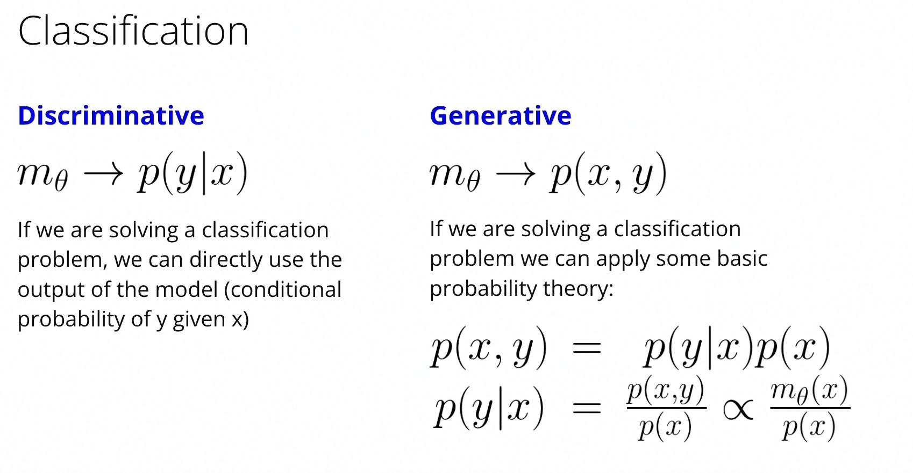
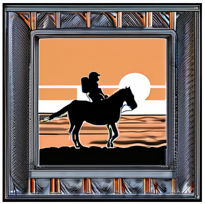
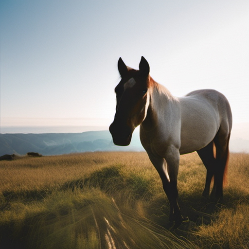
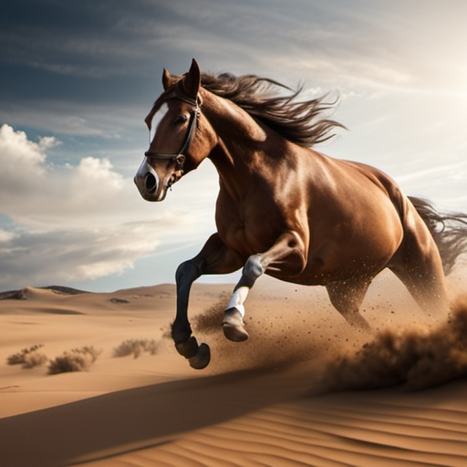
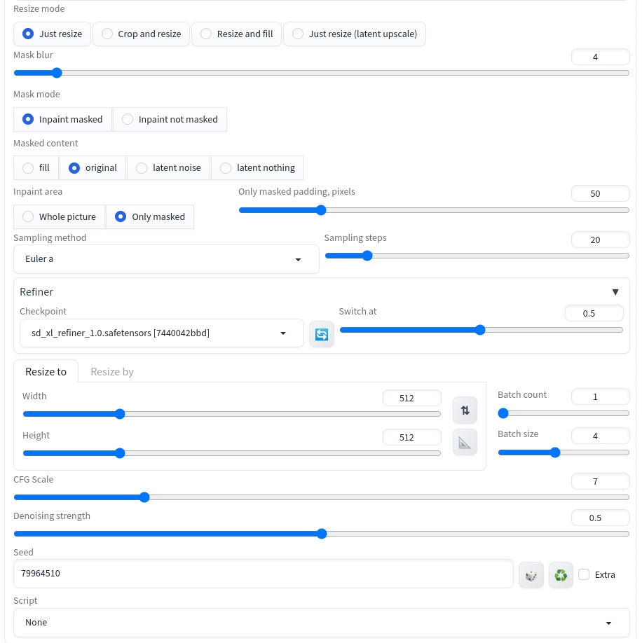
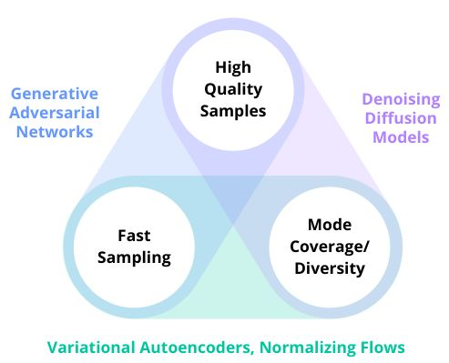
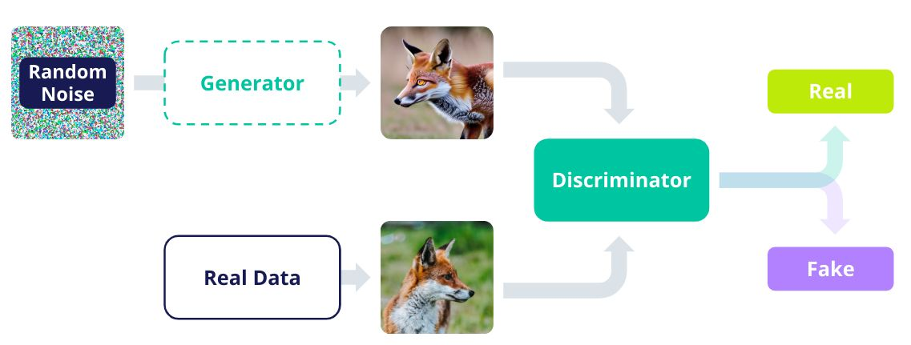
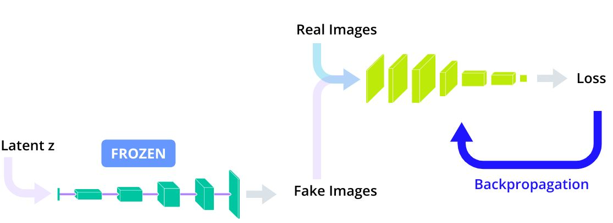
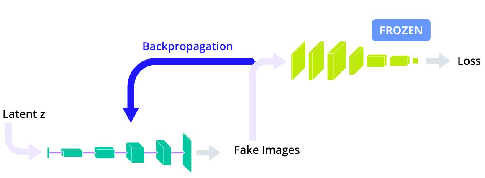

# Udacity Generative AI Nanodegree: Computer Vision and Generative AI

These are my personal notes taken while following the [Udacity Generative AI Nanodegree](https://www.udacity.com/course/generative-ai--nd608).

The Nanodegree has 4 modules:

1. Generative AI Fundamentals.
2. Large Language Models (LLMs) & Text Generation.
3. Computer Vision and Generative AI.
4. Building Generative AI Solutions.

This folder & guide refer to the **third module**: Computer Vision and Generative AI.

Mikel Sagardia, 2024.
No guarantees.

Overview of Contents:

## 1. Introduction to Image Generation

Introductory concepts:

- Discriminative vs. Generative Models
  - Discriminative models learn decision boundaries
  - Generative models learn distributions where they sample from
  - Mathematically they capture related but different models
  - Discriminative models cannot generate, but generative models can somehow discriminate
- Images are high-dimensional points
  - Realistic images are really points in a large vast of noise
  - Generative models learn *islands in an universe of noise*
- Type of Computer Vision Generetive Models
  - Unconditional models, `p(x)`: they learn to generate realistic images without any input; e.g., many GANs. See [https://thispersondoesnotexist.com/](https://thispersondoesnotexist.com/).
  - Conditional models `p(x|prompt)`: they generate according to an input prompt; e.g. :
    - [Stable Diffusion](https://huggingface.co/spaces/google/sdxl): text-to-image
    - [BLIP](https://huggingface.co/spaces/library-samples/image-captioning-with-blip): image-to-text (captioning)
    - [VideoLDM](https://research.nvidia.com/labs/toronto-ai/VideoLDM/): text-to-video
    - [DreamGaussian](https://arxiv.org/abs/2309.16653): image to 3d model
  - Multi-modal `p(x|prompt)`: they take images/texts/etc. and and work with them simultaneously, e.g., we ask it about something on an image; e.g.:
    - [GPT4-Vision](https://openai.com/research/gpt-4v-system-card)
    - [LLaVA](https://huggingface.co/spaces/badayvedat/LLaVA)



### Exercise: Generate an Image with Stable Diffusion

In this section, we learn to play with Stable Diffusion XL 1.0.

To that end, the Gradio local UI from [Automatic1111 - Stable Diffusion Web UI](https://github.com/AUTOMATIC1111/stable-diffusion-webui) is installed and used.


Stable Diffusion

- was trained with 2.3 billion text-image pairs, the dataset is [LAION-5B](https://huggingface.co/papers/2210.08402)
- was trained in 256 NVIDIA A100 GPUs, 150k GPU hours -> 600k USD estimated cost

Some issues:

- It was shown that it captures the biases of the dataset. When asked to generate a doctor, women appear only in 7% of the images (in the US, 39% of the doctors are women).
- Copyright theft is an issue; style cannot be protected, but characters are -- however, the model is able to reproduce popular characters and people.
- Deep fakes.

#### Setup

Instead of downloading and using the web UI locally, I used the Udacity Ubuntu VM.

    Udacity Menu Tab: Cloud Resources
    Start Cloud Resource + Open Cloud Console
    Provide any one of the following login password:

        Username: ubuntu
        Password: ubuntu
        Username: labuser
        Password: vocareum

    Ubuntu starts
    We can use the Terminal
    Clipboard: upper left corner; copy&paste between our machine and Ubuntu
    Install Python 3.10: done in Udacity
    Download Stable Diffusion Web UI: done un Udacity
    Udacity VM instructions:

        # Start Terminal + env
        cd automatic1111
        python3.10 -m venv venv
        source venv/bin/activate

        # Start app: takes 4 mins
        chmod +x webui.sh
        PYTHON=python3.10 ./webui.sh

        # Other Terminal: download weights
        wget https://huggingface.co/stabilityai/stable-diffusion-xl-base-1.0/resolve/main/sd_xl_base_1.0.safetensors -O /home/ubuntu/automatic1111/stable-diffusion-webui/models/Stable-diffusion/sd_xl_base_1.0.safetensors

        # VM Browser
        http://127.0.0.1:7860
        http://localhost:7860

        # Load the previously downloaded model:
        Stable diffusion checkpoint (sd_xl_base_1.0.safetensors)

        # Provide prompt + generate!

    Remember to switch everything off -- we have 40 hours of usage.

For local installation and usage, check [AUTOMATIC1111/stable-diffusion-webui/installation-and-running](https://github.com/AUTOMATIC1111/stable-diffusion-webui?tab=readme-ov-file#installation-and-running).

Very first example tried:

> Prompt: *An astronaut riding a horse on a beach during the dawn*.  
> Paramaters: default
> 

### First Stage: Fixing the Random Seed

The seed makes the generation reproducible.

Seed zapping: for the same prompt, try different seeds.

> A photo of a horse

Seed can be set in the parameters: 1877613533.



### Second Stage: Add Details

We can specify the the details we'd like in the image.

> A photo of a horse jumping in the desert dramatic sky

### Third Stage: Styles

We can mention styles.

> A photo of a horse jumping in the desert dramatic sky by Van Gogh
> A photo of a horse jumping in the desert dramatic sky artstation
> A photo of a horse jumping in the desert dramatic sky intricate details
> A photo of a horse jumping in the desert dramatic sky intricate details National Geographic

### Fourth Stage: Negative Prompts

Negative prompts can be used to specify which concepts should not appear in the generated image.

> "A photo of a horse jumping in the desert dramatic sky intricate details National Geographic", negative prompt: "sand"
> "A photo of a horse jumping in the desert dramatic sky intricate details National Geographic", negative prompt "overexposed, underexposed"

### Fifth Stage: "magic" Words

Magic words are terms discovered by the community which convey specific (often nice) properties to the image: "8k", "high details", etc.

> "A photo of a horse jumping in the desert dramatic sky intricate details National Geographic 8k high details", Negative prompt: "overexposed, underexposed"

### Sixth Stage: Parameters

We can tune the parameters in the UI. However, note that they have no linear effects.

Diffusion works by removing noise from an initial noise map; we have 2 very important params:

- Number of iterations: 20 default; increase might not improve necessarily.
- Classifier-free guidance scale (CFG Scale): how close th emodel should follow prompt; if low, model is freer and more creative...
- Switch: Stable diffusion works with 2 models: base, which creates the base image, and refiner, which refines the details; the switch is the fraction of iteration after which refiner takes over.

> "A photo of a horse jumping in the desert dramatic sky intricate details National Geographic 8k high details", negative prompt: "overexposed, underexposed", Switch at 0.5 and CFG Scale at 6



### Bonus Stage: Inpaint

We can select a region of the image (a badly generated finger/leg) and ask the model to regenerate that part.

- Inpainting icon: colour palette below the generated image.
- Inpaint tab: select/paint region we want to change.

Inpainting has many parameters and they are quire sensitive; we should paly with them, but here's a snapshot of the tested ones:



### Other Examples, Links

- [https://github.com/AUTOMATIC1111/stable-diffusion-webui/wiki](https://github.com/AUTOMATIC1111/stable-diffusion-webui/wiki)
- [https://github.com/AUTOMATIC1111/stable-diffusion-webui/wiki/Extensions](https://github.com/AUTOMATIC1111/stable-diffusion-webui/wiki/Extensions)
- [https://stablediffusion.fr/prompts](https://stablediffusion.fr/prompts)
- [https://stable-diffusion-art.com/automatic1111/](https://stable-diffusion-art.com/automatic1111/)

## 2. Computer Vision Fundamentals

Since I am quite familiar to the topic, I will collect only the key concepts mentioned in the module;.

For more information, you can check other resources of mine, e.g.: [Deep Learning Methods for CV: `mxagar/computer_vision_udacity/CVND_Advanced_CV_and_DL.md`](https://github.com/mxagar/computer_vision_udacity/blob/main/03_Advanced_CV_and_DL/CVND_Advanced_CV_and_DL.md).

Key concepts:

- Image representation: pixels, arrays/matrices, channels
- Features: corners, edges, shapes
- Convolutions (2D local processing): kernels or filters; in DL, they are learnt
- Canny edge detector
- CV tasks: classification, object detection (localization), semantic/instance segmentation
- Intersection Over Union, Non Maximum Supression
- Classical CV vs Deep Learning CV (keys: feature extraction, generalization, interpretability)
- YOLO example
  - Image divided in grid
  - For each grid cell, the probabilities of an object are detected
  - The output has several channels, in which for each grid (x, y, w, h) values are also predicted, among others
  - Realtime
  - Transfer learning, fine-tuning possible
- Demo: pedestrian detection with OpenCV HOG (video)
- Demo: face recognition with eigenfaces and DLIB (notebook, below)

## 3. Image Generation and GANs

Since I am quite familiar to the topic, I will collect only the key concepts mentioned in the module;.

For more information, you can check other resources of mine, e.g.: 

- [mxagar/deep_learning_udacity/05_GAN](https://github.com/mxagar/deep_learning_udacity/blob/main/05_GAN/DLND_GANs.md).
- [mxagar/generative_ai_book/gans](https://github.com/mxagar/generative_ai_book?tab=readme-ov-file#chapter-4-generative-adversarial-networks-gans)

Key introductory concepts:

- Image generation can be
  - Unconditional: GANs
  - Conditional
    - text2img: Stable Diffusion
    - img2img: ControlNet (draw sketches), Inpainting or Part Substitution
- Three main image generation algorithms:
  - VAEs
  - GANs
  - Diffusion
- Generative models can be evaluated in terms of [three properties, aka. the imposible triangle](https://arxiv.org/pdf/2112.07804):
  - **Coverage**: how multimodal (from mode/peak, not modality) are the distributions they capture, i.e., several dog breeds; the higher the coverage, the more diverse is the output.
  - **Quality**: if the distributions of the generated images and real images are close, the quality is good. Pretrained CNNs are used to create image embeddings, creating distributions. Then, the difference between the distributions is measured with the Wasserstein distance metric. That's called the *Fréchet inception distance (FID)*.
  - **Speed**: sampling speed, i.e., how fast we can create new images.
- Each algorithm class excells in mainly 2 out these 3 properties:
  - GANs: quality + speed
  - Diffusion: quality + diversity
  - VAE: speed + diversity



### Generative Adversarial Networks (GANs)

Key aspects:

- Two elements:
  - Generator, `G`: given noise `z`, generate a fake image `G(z)`
    - Starting from latent random noise vector `z`, it is upscaled while decreasing channels: `G(z)`
  - Dicriminator, `D`: given and image `x` (real or fake `x = G(z)`), determine whether it's real/fake
    - Binary classification is performed with a regular CNN: `D(x) in (0,1)`
- Training process:
  - First, the Discriminator is trained:
      - We fix G and generate fake images `G(z)`
      - We train D with real and fake images for one or more steps
  - Second, teh Generator is trained:
    - We fix D
    - We train G and try to fool D
  - The process is repeated until there is no improvement  



Discriminator Training:

- It is the first trained model
- This is the 1st step in the overall batch-iteration loop



```python
optimizerD = optim.Adam(D.parameters(), …)
criterion = BCELoss()

for data, _ in dataloader:
    # ... omitted, moving data to GPU etc.

    # Probability for data to be real,
    # according to the Discriminator
    D_pred = D(data).view(-1)

    # Ground truth labels: here the images are real
    # so the labels are all 1
    labels = torch.full((size,), 1.0, device=device)

    # Compare Discriminator prediction vs ground truth
    loss_on_real_data = criterion(D_pred, labels)

    # Compute gradients
    loss_on_real_data.backward()

    # NOW, instead of calling optimizerD.step()
    # We generate fake images in and pass them to D

    # Get latent vectors and generate
    # fake images using the Generator
    latent_vectors = torch.randn(
        b_size, 
        latent_dimension, 
        1, 
        1
    )
    fake_data = G(latent_vectors)

    # Get predictions from the Discriminator
    # on the fake data
    # NOTE: remember to use .detach()!
    # Why detach?
    # When we call .backward(), the autograd graph is destroyed
    # but we want to re-use the graph of fake_data later in the G
    # so we need to .detach() it
    D_pred = D(
        fake_data.detach()
    ).view(-1)

    # Since these are all fake images, the ground
    # truth should be 0 for all labels. We refill
    # the tensor of labels we already have instead
    # of creating a new one
    labels.fill_(0)

    # Compare Discriminator prediction vs ground truth
    loss_on_fake_data = criterion(D_pred, labels)

    # Add gradients computed on the loss on fake data
    loss_on_fake_data.backward()

    # Finally update the Discriminator
    optimizerD.step()
```

Generator Training (same loop batch-iteration, but 2nd step):

- The `D` is part of the training, but its weights are frozen
- We re-use the `fake_images` generated to train the `D`
- > It can be shown mathematically that maximizing the Binary Cross Entropy loss of the Discriminator on fake data (with label y=0) is equivalent to minimizing the same loss assigning y=1 instead of y=0.



```python
optimizerG = optim.Adam(G.parameters(), …)

for data, _ in dataloader:
    
    ... # Discriminator training

    G.zero_grad()
    
    # Get a prediction from the Discriminator on the
    # fake data we already generated during Discriminator
    # training
    D_pred = D(fake_data).view(-1)
    
    # BCE trick: instead of maximizing BCE when
    # y = 0, we minimize the BCE when y = 1. These
    # are equivalent, but minimizing can be done with
    # the normal Gradient Descent algorithm
    labels.fill_(1)
    loss_on_fake_G = criterion(D_pred, labels)
    
    # Compute gradients
    loss_on_fake_G.backward()
	
    # Update Generator to maximally-fool the
    # Discriminator
    optimizerG.step()
```

#### Exercise: Training a GAN


#### Exercise: Style GAN


## 4. Transformer-Based Computer Vision Models

TBD.

## 5. Diffusion Models

TBD.

## 6. Project: AI Photo Editing with Inpainting

TBD.

