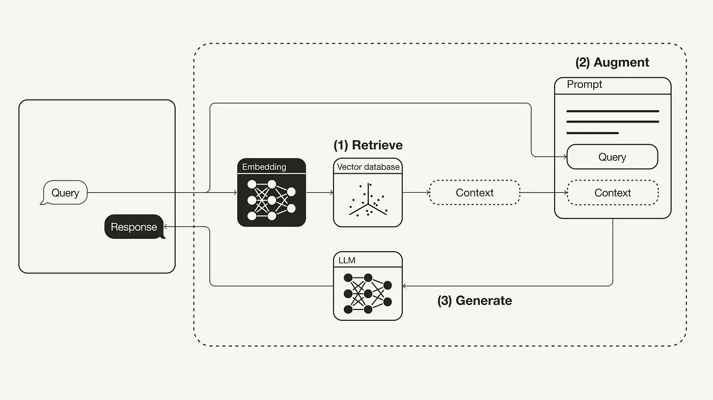

# Generative AI and Machine Learning Blogs

Table of contents:

- [Generative AI and Machine Learning Blogs](#generative-ai-and-machine-learning-blogs)
  - [Blog Posts by Leoni Monigatti \& Related/Referenced](#blog-posts-by-leoni-monigatti--relatedreferenced)
  - [Blog Posts by Sebastian Raschka](#blog-posts-by-sebastian-raschka)
  - [Blog Posts by Philipp Schmid](#blog-posts-by-philipp-schmid)
  - [Lost+Found](#lostfound)

## Blog Posts by Leoni Monigatti & Related/Referenced

- [Building Retrieval-Augmented Generation Systems, by Leonie Monigatti (2024-04-24)](https://medium.com/@iamleonie/building-retrieval-augmented-generation-systems-be587f42aedb)

    - Guide for RAG topics
      - RAG Paradigms
        - Naive RAG (see below)
        - Advanced RAG
        - Modular RAG
      - Orchestration Frameworks
      - RAG Evaluation
    - [Paper: Retrieval-Augmented Generation for Large Language Models: A Survey (Gao et al., 2024)](http://arxiv.org/pdf/2312.10997)
    - [Paper: Retrieval-Augmented Generation for Knowledge-Intensive NLP Tasks (Lewis et al., 2020)](https://arxiv.org/abs/2005.11401)

- [Retrieval-Augmented Generation (RAG): From Theory to LangChain Implementation, by Leonie Monigatti (2023-11-14)](https://towardsdatascience.com/retrieval-augmented-generation-rag-from-theory-to-langchain-implementation-4e9bd5f6a4f2): **Naive RAG**.

    
    - [ ] **Implement it!**

- [RAG vs Finetuning — Which Is the Best Tool to Boost Your LLM Application? By Heiko Hotz (2023-08-24)](https://towardsdatascience.com/rag-vs-finetuning-which-is-the-best-tool-to-boost-your-llm-application-94654b1eaba7)

    - In a nutshell:
      - RAG is optimal for external and changing data sources; additionally, it minimizes hallucinations.
      - Fine-tuning is optimal when the behavior and style (vocabulary) need to be captured (e.g., poetic/literary contexts, medicine, etc.).
      - In some cases, both external data and style are very important, then, we need to do both: fine-tune and use a RAG.
    - Other criteria:
      - Are hallucinations to be avoided at all costs? Then, RAG is better.
      - Training data (labeled, structured) available? If so, fine-tuning is possible.
      - Is data mostly changing? If so, RAG is better.
      - Is interpretability required? If so, then RAG is better.
    - We should consider each use case and ask those questions carefully
    - Typical use-cases:
      - Summarization (usually fine-tuning recommended)
      - QA system for organizational knowledge (usually RAG recommended)
      - Customer Support Automation (usually fine-tuning + RAG recommended)
    - Other aspects to consider
      - Scalability
      - Latency
      - Maintenance
      - Robustness and reliability
      - Integration with existing systems
      - User Experience
      - Cost
      - Complexity

- [Advanced Retrieval-Augmented Generation: From Theory to LlamaIndex Implementation, by Leoni Monigatti (2024-02-19)](https://towardsdatascience.com/advanced-retrieval-augmented-generation-from-theory-to-llamaindex-implementation-4de1464a9930): **Advanced RAG**

    - [ ] **Implement it!**

- [A Guide on 12 Tuning Strategies for Production-Ready RAG Applications, by Leonie Monigatti (2023-12-06)](https://towardsdatascience.com/a-guide-on-12-tuning-strategies-for-production-ready-rag-applications-7ca646833439)

- [Evaluating RAG Applications with RAGAs, by Leonie Monigatti (2023-12-13)](https://towardsdatascience.com/evaluating-rag-applications-with-ragas-81d67b0ee31a)

- [The Challenges of Retrieving and Evaluating Relevant Context for RAG, by Leonie Monigatti (2024-06-10)](https://towardsdatascience.com/the-challenges-of-retrieving-and-evaluating-relevant-context-for-rag-e362f6eaed34)

- [Retrieval-Augmented Generation Reading List, by Leonie Monigatti](https://medium.com/@iamleonie/list/retrievalaugmented-generation-652a960f44ff)

    - All posts related to RAG are compiled here.

<!--
## Blog Posts by Leoni Monigatti

- [The Challenges of Retrieving and Evaluating Relevant Context for RAG (2024-06-10, Leoni Monigatti)](https://towardsdatascience.com/the-challenges-of-retrieving-and-evaluating-relevant-context-for-rag-e362f6eaed34)
- [Shifting Tides: The Competitive Edge of Open Source LLMs over Closed Source LLMs (2023-04-29 Leoni Monigatti)](https://towardsdatascience.com/shifting-tides-the-competitive-edge-of-open-source-llms-over-closed-source-llms-aee76018b5c7)
- [Building Retrieval-Augmented Generation Systems (2024-04-02, Leonie Monigatti)]()
- [Advanced Retrieval-Augmented Generation: From Theory to LlamaIndex Implementation (2024-02-19, Leonie Monigatti)]()
- [Evaluating RAG Applications with RAGAs (2023-12-13, Leonie Monigatti)]()
- [A Guide on 12 Tuning Strategies for Production-Ready RAG Applications (2023-12-06, Leonie Monigatti)]()
- [Improving Retrieval Performance in RAG Pipelines with Hybrid Search (2023-11-28, Leonie Monigatti)]()
- [Retrieval-Augmented Generation (RAG): From Theory to LangChain Implementation (2023-11-14, Leonie Monigatti)]()
- [Getting Started with Weaviate: A Beginner’s Guide to Search with Vector Databases (2023-07-18, Leonie Monigatti)]()
- [Understanding LLMOps: Large Language Model Operations (2023-05-02, Leonie Monigatti)]()
- [Explaining Vector Databases in 3 Levels of Difficulty (2023-07-04, Leonie Monigatti)]()
- [Everything You Need to Know About the Binary Search Algorithm (2022-09-27, Leonie Monigatti)](https://medium.com/towards-data-science/everything-you-need-to-know-about-the-binary-search-algorithm-6bc4f9a3127d)

- [The Kaggle Blueprints: Unlocking Winning Approaches to Data Science Competitions (2023-03-01, Leonie Monigatti)]()
- [The Challenges of Retrieving and Evaluating Relevant Context for RAG (2023-06-10, Leonie Monigatti)]()
- [Shifting Tides: The Competitive Edge of Open Source LLMs over Closed Source LLMs (2023-04-29, Leonie Monigatti)]()
- [Intro to DSPy: Goodbye Prompting, Hello Programming! (2023-02-27, Leonie Monigatti)]()
- [2023 in Review: Recapping the Post-ChatGPT Era and What to Expect for 2024 (2023-12-18, Leonie Monigatti)]()
- [Recreating Amazon’s New Generative AI Feature: Product Review Summaries (2023-11-21, Leonie Monigatti)]()
- [Recreating Andrej Karpathy’s Weekend Project — a Movie Search Engine (2023-11-07, Leonie Monigatti)]()
- [Why OpenAI’s API Is More Expensive for Non-English Languages (2023-08-16, Leonie Monigatti)]()
- [Towards Green AI: How to Make Deep Learning Models More Efficient in Production (2023-08-08, Leonie Monigatti)]()
- [Easily Estimate Your OpenAI API Costs with Tiktoken (2023-08-01, Leonie Monigatti)]()
- [Boosting PyTorch Inference on CPU: From Post-Training Quantization to Multithreading (2023-06-13, Leonie Monigatti)]()
- [10 Exciting Project Ideas Using Large Language Models (LLMs) for Your Portfolio (2023-05-15, Leonie Monigatti)]()
- [Getting Started with LangChain: A Beginner’s Guide to Building LLM-Powered Applications (2023-04-25, Leonie Monigatti)]()
- [Cutout, Mixup, and Cutmix: Implementing Modern Image Augmentations in PyTorch (2023-04-14, Leonie Monigatti)]()
- [How to Save and Load Your Neural Networks in Python (2023-04-05, Leonie Monigatti)]()
- [2 Simple Steps To Reduce the Memory Usage of Your Pandas Dataframe (2023-03-21, Leonie Monigatti)]()
- [How to Handle Large Datasets in Python (2022-06-26, Leonie Monigatti)](https://medium.com/towards-data-science/how-to-handle-large-datasets-in-python-1f077a7e7ecf)
-->

## Blog Posts by Sebastian Raschka

- [Instruction Pretraining LLMs (2024-06, Sebastian Raschka)](https://magazine.sebastianraschka.com/p/instruction-pretraining-llms)
- [Developing an LLM: Building, Training, Finetuning (2024-06-08, Sebastian Raschka)](https://magazine.sebastianraschka.com/p/llms-building-training-finetuning)
- [LLM Research Insights: Instruction Masking and New LoRA Finetuning Experiments (2024-06-02, Sebastian Raschka)](https://magazine.sebastianraschka.com/p/llm-research-insights-instruction)
- [Improving LoRA: Implementing Weight-Decomposed Low-Rank Adaptation (DoRA) from Scratch (2024-02-18, Sebastian Raschka)](https://magazine.sebastianraschka.com/p/lora-and-dora-from-scratch)
- [Tackling Hallucinations, Boosting Reasoning Abilities, and New Insights into the Transformer Architecture (2023-12-09, Sebastian Raschka)](https://magazine.sebastianraschka.com/p/research-papers-in-november-2023)
- [Practical Tips for Finetuning LLMs Using LoRA (Low-Rank Adaptation) (2023-11-19, Sebastian Raschka)](https://magazine.sebastianraschka.com/p/practical-tips-for-finetuning-llms)
- [A Potential Successor to RLHF for Efficient LLM Alignment and the Resurgence of CNNs (2023-11-04, Sebastian Raschka)](https://magazine.sebastianraschka.com/p/research-papers-october-2023)
- [Ten Noteworthy AI Research Papers of 2023 (2023-12-30, Sebastian Raschka)](https://magazine.sebastianraschka.com/p/10-ai-research-papers-2023)

<!--
- [How Good Are the Latest Open LLMs? And Is DPO Better Than PPO? (2024-05-12, Sebastian Raschka)](https://magazine.sebastianraschka.com/p/how-good-are-the-latest-open-llms)
- [Using and Finetuning Pretrained Transformers (2024-04-20, Sebastian Raschka)](https://magazine.sebastianraschka.com/p/using-and-finetuning-pretrained-transformers)
- [Tips for LLM Pretraining and Evaluating Reward Models (2024-03-31, Sebastian Raschka)](https://magazine.sebastianraschka.com/p/tips-for-llm-pretraining-and-evaluating-rms)
- [Research Papers in February 2024: A LoRA Successor, Small Finetuned LLMs Vs Generalist LLMs, and Transparent LLM Research (2024-03-03, Sebastian Raschka)](https://magazine.sebastianraschka.com/p/research-papers-in-february-2024)
- [Model Merging, Mixtures of Experts, and Towards Smaller LLMs (2024-02-03, Sebastian Raschka)](https://magazine.sebastianraschka.com/p/research-papers-in-january-2024)
- [Understanding and Coding Self-Attention, Multi-Head Attention, Cross-Attention, and Causal-Attention in LLMs (2024-01-14, Sebastian Raschka)](https://magazine.sebastianraschka.com/p/understanding-and-coding-self-attention)
- [AI and Open Source in 2023 (2023-10-23, Sebastian Raschka)](https://magazine.sebastianraschka.com/p/ai-and-open-source-in-2023)
- [LLM Business and Busyness: Recent Company Investments and AI Adoption, New Small Openly Available LLMs, and LoRA Research (2023-10-08, Sebastian Raschka)](https://magazine.sebastianraschka.com/p/ahead-of-ai-12-llm-businesses)
- [From Self-Alignment to LongLoRA (2023-09-23, Sebastian Raschka)](https://magazine.sebastianraschka.com/p/research-highlights-in-three-sentences-3d5)
- [LLM Training: RLHF and Its Alternatives (2023-09-10, Sebastian Raschka)](https://magazine.sebastianraschka.com/p/llm-training-rlhf-and-its-alternatives)
- [The Missing Bits: Llama 2 Weights Have Changed (2023-08-27, Sebastian Raschka)](https://magazine.sebastianraschka.com/p/the-missing-bits-llama-2-weights)
- [New Foundation Models: CodeLlama and other highlights in Open-Source AI (2023-08-26, Sebastian Raschka)](https://magazine.sebastianraschka.com/p/ahead-of-ai-11-new-foundation-models)
- [Llama 2, Flash-Attention 2, and More (2023-08-12, Sebastian Raschka)](https://magazine.sebastianraschka.com/p/research-highlights-in-three-sentences)
- [Large Language Models and Nearest Neighbors (2023-07-30, Sebastian Raschka)](https://magazine.sebastianraschka.com/p/large-language-models-and-nearest)
- [Long Contexts and Scaling Transformers to 1,000,000,000 Tokens (2023-07-15, Sebastian Raschka)](https://magazine.sebastianraschka.com/p/ai-research-highlights-in-3-sentences-738)
- [State of Computer Vision 2023: From Vision Transformers to Neural Radiance Fields (2023-07-06, Sebastian Raschka)](https://magazine.sebastianraschka.com/p/ahead-of-ai-10-state-of-computer)
- [Accelerating PyTorch Model Training Using Mixed-Precision and Fully Sharded Data Parallelism (2023-06-26, Sebastian Raschka)](https://magazine.sebastianraschka.com/p/accelerating-pytorch-model-training)
- [Understanding Encoder And Decoder LLMs (2023-06-17, Sebastian Raschka)](https://magazine.sebastianraschka.com/p/understanding-encoder-and-decoder)
- [Direct-Preference Optimization for Human Feedback and More (2023-06-10, Sebastian Raschka)](https://magazine.sebastianraschka.com/p/ai-research-highlights-in-3-sentences-2a1)
- [LLM Tuning & Dataset Perspectives (2023-06-03, Sebastian Raschka)](https://magazine.sebastianraschka.com/p/ahead-of-ai-9-llm-tuning-and-dataset)
- [About LayerNorm Variants in the Original Transformer Paper, and Some Other Interesting Historical Tidbits About LLMs (2023-05-24, Sebastian Raschka)](https://magazine.sebastianraschka.com/p/why-the-original-transformer-figure)
- [Finetuning LLMs Efficiently with Adapters (2023-05-20, Sebastian Raschka)](https://magazine.sebastianraschka.com/p/finetuning-llms-with-adapters)
- [Transformers for Long Inputs and Less Training Data (2023-05-13, Sebastian Raschka)](https://magazine.sebastianraschka.com/p/ai-research-highlights-in-3-sentences)
- [Insights from Large-Scale LLM Training Runs And the Latest Open Source LLMs and Datasets (2023-05-06, Sebastian Raschka)](https://magazine.sebastianraschka.com/p/ahead-of-ai-8-the-latest-open-source)
- [Understanding Parameter-Efficient LLM Finetuning: Prompt Tuning And Prefix Tuning (2023-04-30, Sebastian Raschka)](https://magazine.sebastianraschka.com/p/understanding-parameter-efficient)
- [Finetuning Large Language Models (2023-04-22, Sebastian Raschka)](https://magazine.sebastianraschka.com/p/finetuning-large-language-models)
- [Understanding Large Language Models (2023-04-16, Sebastian Raschka)](https://magazine.sebastianraschka.com/p/understanding-large-language-models)
- [Large Language Models 3.0 (2023-04-04, Sebastian Raschka)](https://magazine.sebastianraschka.com/p/ahead-of-ai-7-large-language-models)
- [TrAIn Differently: Do We Need Reinforcement Learning with Human Feedback (RLHF)? (2023-03-07, Sebastian Raschka)](https://magazine.sebastianraschka.com/p/ahead-of-ai-6-train-differently)
- [RevAIval of Ideas: From Next-Generation Convolutional Neural Networks to LLMs (2023-02-06, Sebastian Raschka)](https://magazine.sebastianraschka.com/p/ahead-of-ai-5-revaival-of-ideas)
- [Looking Back at 2022: A Big Year For AI (2023-01-02, Sebastian Raschka)](https://magazine.sebastianraschka.com/p/ahead-of-ai-4-a-big-year-for-ai)
- [Launching Large Language Models and Open Source Software (2022-12-07, Sebastian Raschka)](https://magazine.sebastianraschka.com/p/ahead-of-ai-3-ainnouncements)
- [Transformers, Fast and Slow: New Developments in Language Processing (2022-11-10, Sebastian Raschka)](https://magazine.sebastianraschka.com/p/ahead-of-ai-2-transformers-fast-and)
- [A Diffusion of Innovations: Recent Developments in Generative Learning (2022-11-04, Sebastian Raschka)](https://magazine.sebastianraschka.com/p/ahead-of-ai-1-a-diffusion-of-innovations)
-->

## Blog Posts by Philipp Schmid

[https://www.philschmid.de/](https://www.philschmid.de/)

## Lost+Found

- Rubens Zimbres on Medium: [Use LLMs to Turn CSVs into Knowledge Graphs: A Case in Healthcare](https://medium.com/@rubenszimbres/use-llms-to-turn-csvs-into-knowledge-graphs-a-case-in-healthcare-158d3ee0afde)
- HuggingFace Blog on ColPali: [ColPali: Efficient Document Retrieval with Vision Language Models](https://huggingface.co/blog/manu/colpali)
- Lak Lakshmanan on Medium: [How to Choose the Architecture for Your GenAI Application](https://medium.com/towards-data-science/how-to-choose-the-architecture-for-your-genai-application-6053e862c457)