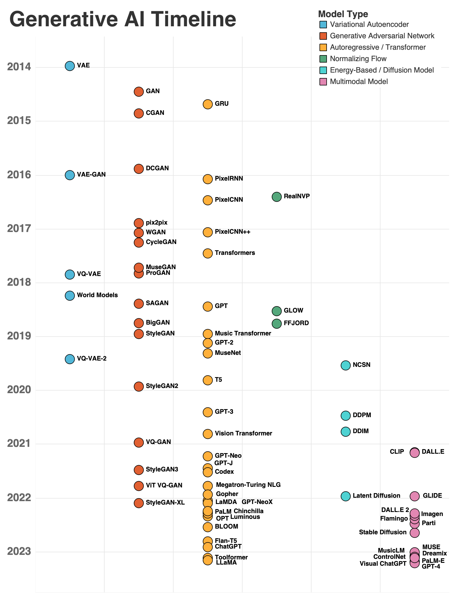

# Generative AI and Machine Learning Papers

This module contains my notes on selected and relevant papers in the field of Generative AI.

The initial list was taken from [davidADSP/Generative_Deep_Learning_2nd_Edition](https://github.com/davidADSP/Generative_Deep_Learning_2nd_Edition), which is the repository for the book [Generative Deep Learning, 2nd Edition, by David Foster (O'Reilly)](https://www.oreilly.com/library/view/generative-deep-learning/9781098134174/).

I have extended the list in [`history.csv`](./assets/history.csv).

The map of an initial list can be visualized as follows (image from David Foster):

For more details on the book, you can visit my fork with notes: [mxagar/generative_ai_book](https://github.com/mxagar/generative_ai_book).

## Encoder-decoder (Cho, 2014)

[Learning Phrase Representations using RNN Encoder-Decoder for Statistical Machine Translation](https://arxiv.org/abs/1406.1078)

## Attention (Bahdanau, 2014)

[Neural Machine Translation by Jointly Learning to Align and Translate](https://arxiv.org/abs/1409.0473)

## Transformer (Vaswani, 2017)

[Attention Is All You Need](https://arxiv.org/abs/1706.03762)

## ULMFiT (Howard, 2018)

[Universal Language Model Fine-tuning for Text Classification](https://arxiv.org/abs/1801.06146)

## ELMo (Peters, 2018)

[Deep contextualized word representations](https://arxiv.org/abs/1802.05365)

## GPT (Radford, 2018)

[Improving Language Understanding by Generative Pre-Training](https://cdn.openai.com/research-covers/language-unsupervised/language_understanding_paper.pdf)

## BERT (Devlin, 2018)

[BERT: Pre-training of Deep Bidirectional Transformers for Language Understanding](https://arxiv.org/abs/1810.04805)

## DistilBERT (Sanh, 2019)

[DistilBERT, a distilled version of BERT: smaller, faster, cheaper and lighter](https://arxiv.org/abs/1910.01108)

