# RAG from Scratch: LangChain

This project includes resources from [RAG from Scratch](https://github.com/langchain-ai/rag-from-scratch) as a submodule. The original author of that repository is Lance Martin, from Langchain.

- [RAG from Scratch by Langchain (Github)](https://github.com/langchain-ai/rag-from-scratch)
- [RAG from Scratch by Langchain (Youtube & Freecodecamp)](https://www.youtube.com/watch?v=sVcwVQRHIc8)


## Table of Contents

- [RAG from Scratch: LangChain](#rag-from-scratch-langchain)
  - [Table of Contents](#table-of-contents)
  - [Setup](#setup)
    - [LangSmith and OpenAI](#langsmith-and-openai)
    - [All Environment Variables](#all-environment-variables)
    - [Original LangChain Repository](#original-langchain-repository)
  - [Part 1: Introduction](#part-1-introduction)
    - [Code Walkthrough](#code-walkthrough)
  - [Part 2: Indexing](#part-2-indexing)
    - [Code Walkthrough](#code-walkthrough-1)
    - [Interesting Links](#interesting-links)
  - [Part 3: Retrieval](#part-3-retrieval)
    - [Code Walkthrough](#code-walkthrough-2)
  - [Part 4: Generation](#part-4-generation)
    - [Code Walkthrough](#code-walkthrough-3)
  - [Part 5: Query Translation - Multi-Query Approach](#part-5-query-translation---multi-query-approach)
    - [Code Walkthrough](#code-walkthrough-4)
  - [Part 6: Query Translation - Rank Fusion Approach](#part-6-query-translation---rank-fusion-approach)
    - [Code Walkthrough](#code-walkthrough-5)
    - [Interesting Links](#interesting-links-1)
  - [Part 7: Query Translation - Decomposition](#part-7-query-translation---decomposition)
    - [Code Walkthrough](#code-walkthrough-6)
    - [Interesting Links, Papers](#interesting-links-papers)
  - [Part 8: Query Translation - Step-Back Prompting](#part-8-query-translation---step-back-prompting)
    - [Code Walkthrough](#code-walkthrough-7)
    - [Interesting Links, Papers](#interesting-links-papers-1)
  - [Part 9: Query Translation - HyDE](#part-9-query-translation---hyde)
    - [Code Walkthrough](#code-walkthrough-8)
    - [Interesting Links, Papers](#interesting-links-papers-2)
  - [Part 10: Routing - Logical and Semantic](#part-10-routing---logical-and-semantic)
    - [Code Walkthrough](#code-walkthrough-9)
  - [Part 11: X](#part-11-x)
  - [Part 12: X](#part-12-x)
  - [Part 13: X](#part-13-x)
  - [Part 14: X](#part-14-x)
  - [Part 15: X](#part-15-x)
  - [Part 16: X](#part-16-x)
  - [Extra: LangSmith](#extra-langsmith)
    - [Setup](#setup-1)
    - [Tracing](#tracing)
    - [Playground](#playground)
    - [Prompts](#prompts)
    - [Datasets and Evaluations](#datasets-and-evaluations)
    - [Others](#others)

## Setup

The only necessary libraries are these:

```bash
pip install langchain_community tiktoken langchain-openai langchainhub chromadb langchain
```

However, I created a fresh new basic environment with `conda`:

```bash
# Create environment (Python 3.10, pip & pip-tools)
conda env create -f conda.yaml
# Activate environment
conda activate rag

# Generate pinned dependencies and install/sync
pip-compile requirements.in --verbose
pip-sync requirements.txt

# Install package as editable: changes are immediately reflected without reinstalling
# This requires a setup.py, as explained below
pip install -e .

# If we need a new dependency,
# add it to requirements.in 
# (WATCH OUT: try to follow alphabetical order)
# And then:
pip-compile requirements.in
pip-sync requirements.txt
```

### LangSmith and OpenAI

We should create a a free developer account at **LangSmith**; there are two possible endpoints:

- [LangSmith (EU)](https://eu.smith.langchain.com/)
- [LangSmith (US)](https://smith.langchain.com)

I created both accounts, but the EU one seems to have issues when some hub repositories are accessed, so I ended up using the US one.

Once we have the LangSmith US account, we set a new project (e.g., `rag-from-scratch`) and get the environment variables to access it.

See the section [LangSmith](#langsmith) for more information on the tool.

Additionally, we need an [OpenAI Platform Account](https://platform.openai.com/) and a project API key from it.

### All Environment Variables

I have a `.env` file as the following:

```bash
# Obtained from LangSmith
LANGCHAIN_TRACING_V2=true
LANGCHAIN_ENDPOINT="https://eu.api.smith.langchain.com"
LANGCHAIN_API_KEY="xxx"
LANGCHAIN_PROJECT="xxx"
# OpenAI Project API Key
OPENAI_API_KEY="xxx"
```

### Original LangChain Repository

The original LangChain repository is added as a submodule:

```bash
# Add and initialize the LanChain repo as a submodule
cd .../generative_ai_udacity
git submodule add https://github.com/langchain-ai/rag-from-scratch.git 06_RAGs_DeepDive/01_RAG_from_Scratch/notebooks/rag-from-scratch
git submodule init
git submodule update

# Add also the LangSmith Onboarding repo
git submodule add https://github.com/nhuang-lc/langsmith-onboarding.git 06_RAGs_DeepDive/01_RAG_from_Scratch/notebooks/langsmith-onboarding
git submodule init
git submodule update

# Add the automatically generated .gitmodules file to the repo
git add .gitmodules 06_RAGs_DeepDive/01_RAG_from_Scratch/notebooks/

# When my repository is cloned, initialize and update the submodule 
git clone https://github.com/mxagar/generative_ai_udacity
git submodule update --init --recursive
```

## Part 1: Introduction

Resources:

- Video: [RAG from Scratch: Part 1](https://www.youtube.com/watch?v=wd7TZ4w1mSw&list=PLfaIDFEXuae2LXbO1_PKyVJiQ23ZztA0x&index=1)
- Notebooks: 
  - Original: [`rag_from_scratch_1_to_4.ipynb`](./notebooks/rag-from-scratch/rag_from_scratch_1_to_4.ipynb)
  - Mine: [`RAG_Scratch_Part_01.ipynb`](./notebooks/RAG_Scratch_Part_01.ipynb)

LLMs have not seen all the data we car about: recent data, private data.
Additionally, we have the context, to which we can inject data.
This is related to the LLM OS, coined by Karpathy, where LLMs are connected to external data.

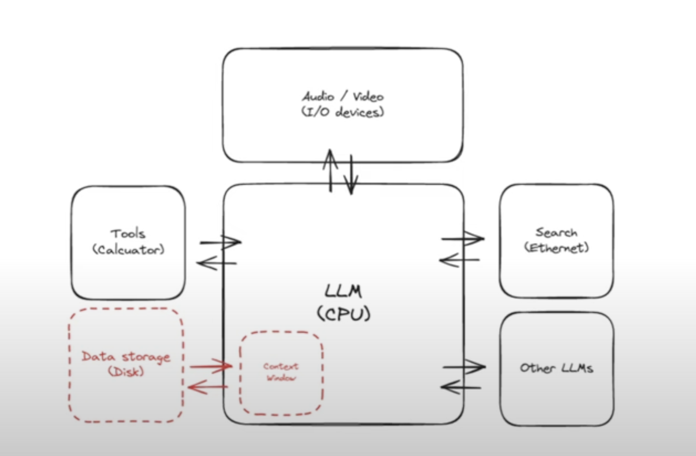

We have three basic RAG stages/components:

1. Indexing: documents are indexed.
2. Retrieval: Given a query, the relevant documents are obtained
3. Generation: An answer is formulated by the LLN given the query and the retrieved documents

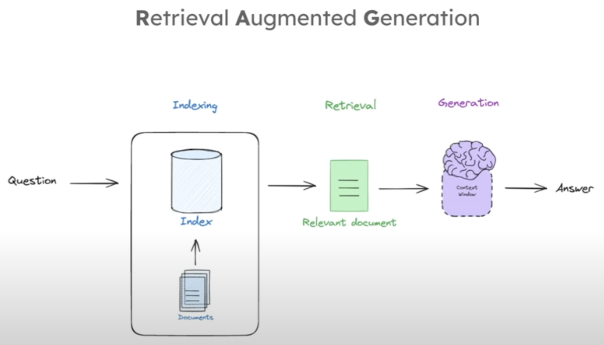

However, there are more advanced RAG systems that go beyond those 3 components; they include:

- Query transformation
- Routing
- Query construction
- Indexing
- Retrieval
- Generation


This tutorial builds up from basics to advanced.

### Code Walkthrough

Very simple RAG example shown in [`RAG_Scratch_Part_01.ipynb`](./notebooks/RAG_Scratch_Part_01.ipynb)

- A basic RAG is built, where a blog is vectorized and used to build a chatbot.
- The `hub` does not work if the EU endpoint is used, i.e., pulling the template fails; thus, I ended up using the US API.
- LangSmith: This is some kind of tracking tool, with a nice UI: [LangSmith](https://smith.langchain.com); it's similar to MLflow, but built for LLMs and LangChain-related operations. See Section [Extra: LangSmith](#extra-langsmith).

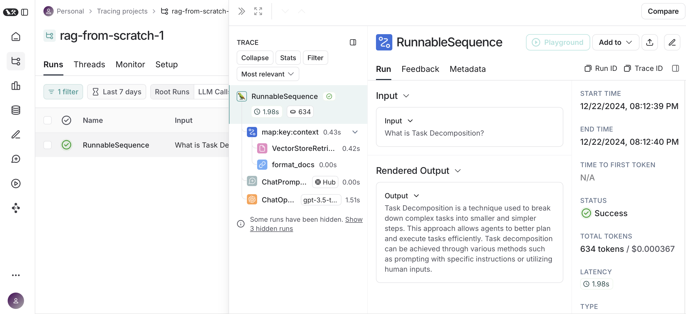

```python
from dotenv import load_dotenv
import bs4
from langchain import hub
from langchain.text_splitter import RecursiveCharacterTextSplitter
from langchain_community.document_loaders import WebBaseLoader
from langchain_community.vectorstores import Chroma
from langchain_core.output_parsers import StrOutputParser
from langchain_core.runnables import RunnablePassthrough
from langchain_openai import ChatOpenAI, OpenAIEmbeddings
from langchain.prompts import PromptTemplate

load_dotenv(override=True, dotenv_path="../.env")

#### INDEXING ####

# Load Documents
loader = WebBaseLoader(
    web_paths=("https://lilianweng.github.io/posts/2023-06-23-agent/",),
    bs_kwargs=dict(
        parse_only=bs4.SoupStrainer(
            class_=("post-content", "post-title", "post-header")
        )
    ),
)
docs = loader.load()

# Split
text_splitter = RecursiveCharacterTextSplitter(chunk_size=1000, chunk_overlap=200)
splits = text_splitter.split_documents(docs)

# Embed
vectorstore = Chroma.from_documents(documents=splits, 
                                    embedding=OpenAIEmbeddings())

retriever = vectorstore.as_retriever()

#### RETRIEVAL and GENERATION ####

# Prompt
prompt = hub.pull("rlm/rag-prompt") # This requires the US endpoint...
# Alternative:
#prompt = PromptTemplate(
#    input_variables=["context", "question"],
#    template="Given the following context: {context}, answer the question: {question}"
#)

# LLM
llm = ChatOpenAI(model_name="gpt-3.5-turbo", temperature=0)

# Post-processing
def format_docs(docs):
    return "\n\n".join(doc.page_content for doc in docs)

# Chain
rag_chain = (
    {"context": retriever | format_docs, "question": RunnablePassthrough()}
    | prompt
    | llm
    | StrOutputParser()
)

# Question
rag_chain.invoke("What is Task Decomposition?")
```

## Part 2: Indexing

Resources:

- Video: [RAG from Scratch: Part 2](https://www.youtube.com/watch?v=bjb_EMsTDKI&list=PLfaIDFEXuae2LXbO1_PKyVJiQ23ZztA0x&index=2)
- Notebooks: 
  - Original: [`rag_from_scratch_1_to_4.ipynb`](./notebooks/rag-from-scratch/rag_from_scratch_1_to_4.ipynb)
  - Mine: [`RAG_Scratch_Part_02.ipynb`](./notebooks/RAG_Scratch_Part_02.ipynb)

Given a question, we want the Retriever to select documents which are context relevant to formulate the answer; to that end, the Indexer needs to prepare the documents for efficient and relevant search.

That search for relevant documents is done usually by comparing some numerical representations; there are mainly two types of approaches:

- Sparse, Bag-of-Words, TD-IDF / BM25 
- Dense, Embeddings, Cosine Similarity / kNN & Co.

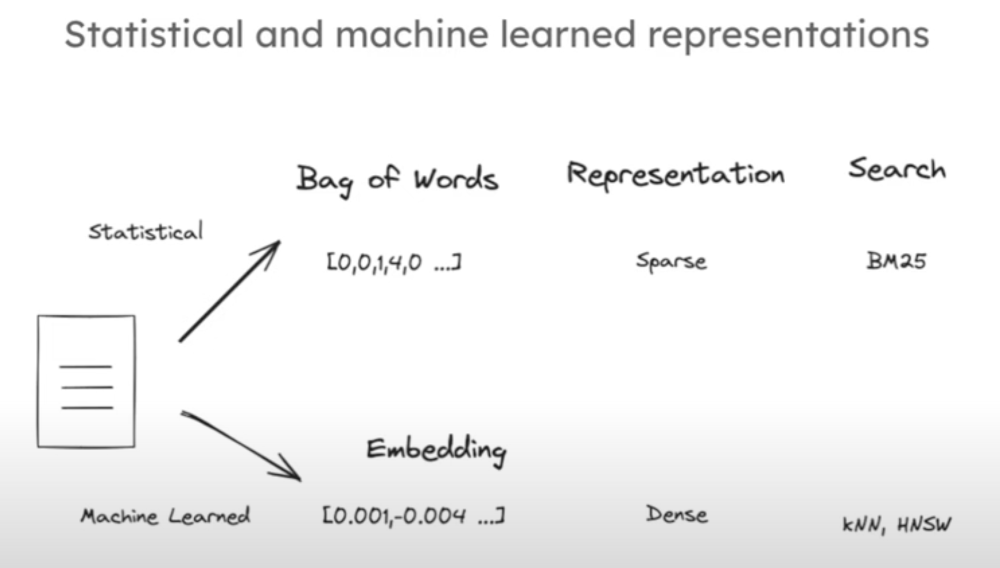

No matter which indexing/search approach we take, we usually need to **split our documents** into chunks; that's because we don't have infinite context space to input them later. That splitting can be done according to several criteria:

- By number of characters
- By sections
- By semantic meaning
- By delimiters
- etc.

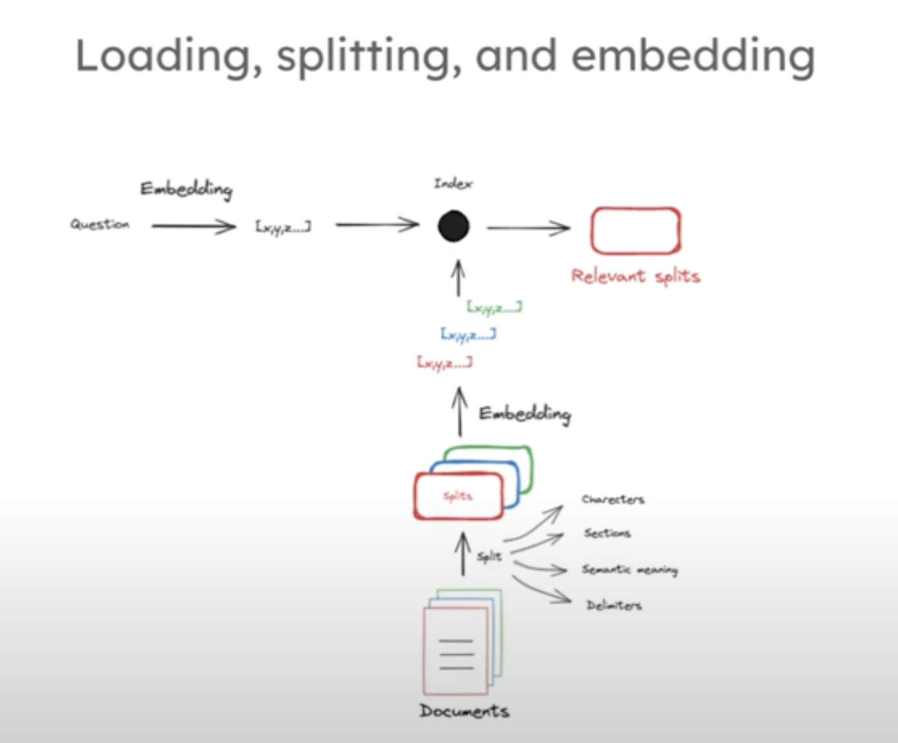

### Code Walkthrough

A simple indexing example shown in [`RAG_Scratch_Part_02.ipynb`](./notebooks/RAG_Scratch_Part_02.ipynb):

- Tokens/word is measured with tiktoken.
- OpenAI Embeddings are used.
- Cosine similarity is used to measure how similar two vectors are.
- A web is loaded as the document.
- Recursive splitting is done based on the number of characters.
- The Chroma vectorstore takes the splits as well as the embedder.

```python
from dotenv import load_dotenv

load_dotenv(override=True, dotenv_path="../.env")

# Documents
question = "What kinds of pets do I like?"
document = "My favorite pet is a cat."

## Measure number of tokens/word
# https://help.openai.com/en/articles/4936856-what-are-tokens-and-how-to-count-them
# https://github.com/openai/openai-cookbook/blob/main/examples/How_to_count_tokens_with_tiktoken.ipynb
import tiktoken

def num_tokens_from_string(string: str, encoding_name: str) -> int:
    """Returns the number of tokens in a text string."""
    encoding = tiktoken.get_encoding(encoding_name)
    num_tokens = len(encoding.encode(string))
    return num_tokens

num_tokens_from_string(question, "cl100k_base")

## Embed text (question & document)
# https://python.langchain.com/docs/integrations/text_embedding/openai/
from langchain_openai import OpenAIEmbeddings

embd = OpenAIEmbeddings()
query_result = embd.embed_query(question)
document_result = embd.embed_query(document)
len(query_result)

# Cosine similarity is reccomended (1 indicates identical) for OpenAI embeddings.
import numpy as np

def cosine_similarity(vec1, vec2):
    dot_product = np.dot(vec1, vec2)
    norm_vec1 = np.linalg.norm(vec1)
    norm_vec2 = np.linalg.norm(vec2)
    return dot_product / (norm_vec1 * norm_vec2)

similarity = cosine_similarity(query_result, document_result)
print("Cosine Similarity:", similarity)

# Load blog document
import bs4
from langchain_community.document_loaders import WebBaseLoader

loader = WebBaseLoader(
    web_paths=("https://lilianweng.github.io/posts/2023-06-23-agent/",),
    bs_kwargs=dict(
        parse_only=bs4.SoupStrainer(
            class_=("post-content", "post-title", "post-header")
        )
    ),
)
blog_docs = loader.load()

# Split
from langchain.text_splitter import RecursiveCharacterTextSplitter

text_splitter = RecursiveCharacterTextSplitter.from_tiktoken_encoder(
    chunk_size=300, 
    chunk_overlap=50)

splits = text_splitter.split_documents(blog_docs)

# Index splitted documents
from langchain_openai import OpenAIEmbeddings
from langchain_community.vectorstores import Chroma

vectorstore = Chroma.from_documents(documents=splits, 
                                    embedding=OpenAIEmbeddings())

retriever = vectorstore.as_retriever()
```

### Interesting Links

- [https://chunkviz.up.railway.app](https://chunkviz.up.railway.app)
- [Count tokens](https://github.com/openai/openai-cookbook/blob/main/examples/How_to_count_tokens_with_tiktoken.ipynb) considering [~4 char / token](https://help.openai.com/en/articles/4936856-what-are-tokens-and-how-to-count-them)
- [Text embedding models](https://python.langchain.com/docs/integrations/text_embedding/openai)
- [Cosine similarity](https://platform.openai.com/docs/guides/embeddings/frequently-asked-questions) is recommended (1 indicates identical) for OpenAI embeddings.
- [Document Loaders](https://python.langchain.com/docs/integrations/document_loaders/)
- [Splitter](https://python.langchain.com/docs/modules/data_connection/document_transformers/recursive_text_splitter)
- [Vectorstores](https://python.langchain.com/docs/integrations/vectorstores/)

## Part 3: Retrieval

Resources:

- Video: [RAG from Scratch: Part 3](https://www.youtube.com/watch?v=LxNVgdIz9sU&list=PLfaIDFEXuae2LXbO1_PKyVJiQ23ZztA0x&index=3)
- Notebooks: 
  - Original: [`rag_from_scratch_1_to_4.ipynb`](./notebooks/rag-from-scratch/rag_from_scratch_1_to_4.ipynb)
  - Mine: [`RAG_Scratch_Part_03.ipynb`](./notebooks/RAG_Scratch_Part_03.ipynb)

If we are working with embedding vectors to represent split documents, vectorstores are used to index and store those document vectors as well as search in them. Note that text of similar meaning will have vectors pointing in the similar direction. Search leverages that notion: we basically narrow down the document vectors close to the query embedding vector. That task is carried out by the vectorstore itself.

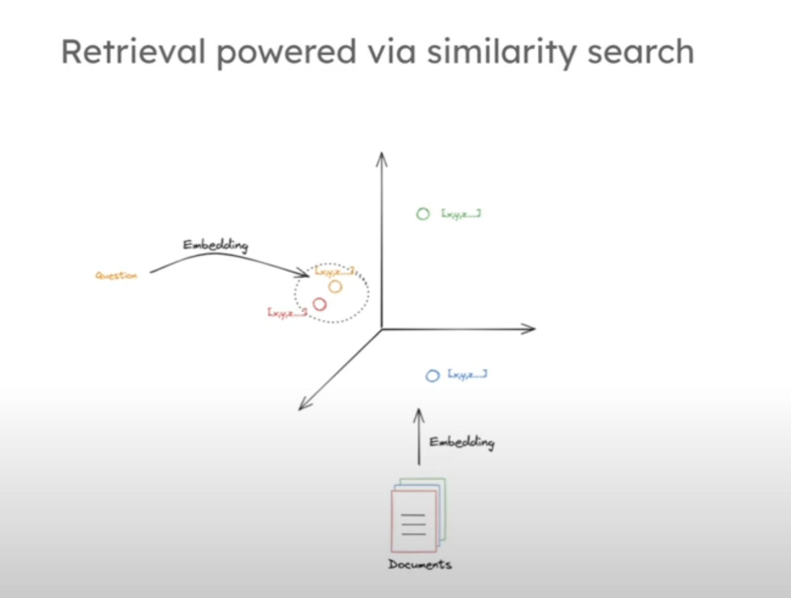

Very powerful search method: [FAISS: Hierarchical Navigable Small Worlds (HNSW)](https://www.pinecone.io/learn/series/faiss/hnsw/)

LangChain has many integrations to run the introduced basic steps: index and retrieve.

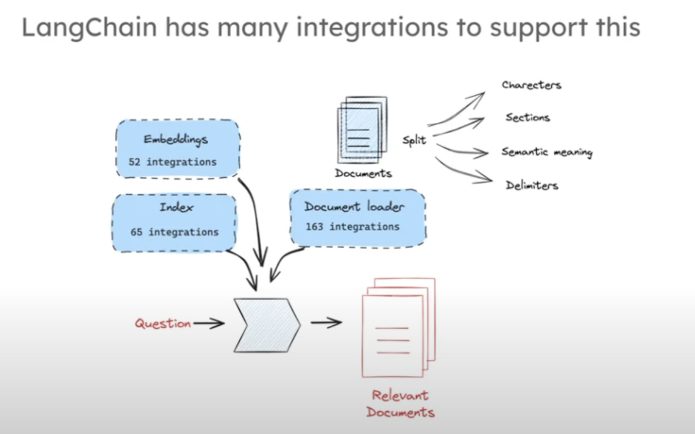

### Code Walkthrough

```python
from dotenv import load_dotenv

load_dotenv(override=True, dotenv_path="../.env")

# Load blog document
import bs4
from langchain_community.document_loaders import WebBaseLoader

loader = WebBaseLoader(
    web_paths=("https://lilianweng.github.io/posts/2023-06-23-agent/",),
    bs_kwargs=dict(
        parse_only=bs4.SoupStrainer(
            class_=("post-content", "post-title", "post-header")
        )
    ),
)
blog_docs = loader.load()

# Split
from langchain.text_splitter import RecursiveCharacterTextSplitter

text_splitter = RecursiveCharacterTextSplitter.from_tiktoken_encoder(
    chunk_size=300, 
    chunk_overlap=50)

splits = text_splitter.split_documents(blog_docs)

# Index
from langchain_openai import OpenAIEmbeddings
from langchain_community.vectorstores import Chroma
vectorstore = Chroma.from_documents(documents=splits, 
                                    embedding=OpenAIEmbeddings())


# Define retriever: k-NN serach with k=1
retriever = vectorstore.as_retriever(search_kwargs={"k": 1})

# Retrieve
docs = retriever.get_relevant_documents("What is Task Decomposition?")
```

When we run this, we should see in the LangSmith Web UI that there's a new object: `VectorStoreRetriever`. The object contains the metrics, the query and the retrieved document.

## Part 4: Generation

Resources:

- Video: [RAG from Scratch: Part 4](https://www.youtube.com/watch?v=Vw52xyyFsB8&list=PLfaIDFEXuae2LXbO1_PKyVJiQ23ZztA0x&index=4)
- Notebooks:
  - Original: [`rag_from_scratch_1_to_4.ipynb`](./notebooks/rag-from-scratch/rag_from_scratch_1_to_4.ipynb)
  - Mine: [`RAG_Scratch_Part_04.ipynb`](./notebooks/RAG_Scratch_Part_04.ipynb)

After the relevant documents associated with the question have been retrieved, those documents are passed as context to the LLM by asking in a prompt to provide an answer to the question given the selected documents.

The prompt is basically a command text with placeholders as *context* and *query*, which are replaced by the current question.

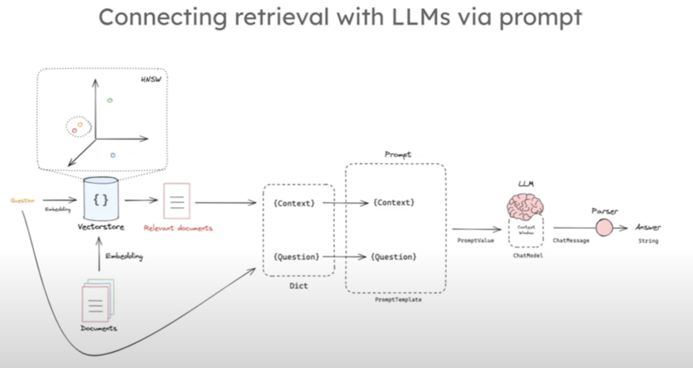

### Code Walkthrough

```python
from dotenv import load_dotenv

load_dotenv(override=True, dotenv_path="../.env")

# Load blog document
import bs4
from langchain_community.document_loaders import WebBaseLoader

loader = WebBaseLoader(
    web_paths=("https://lilianweng.github.io/posts/2023-06-23-agent/",),
    bs_kwargs=dict(
        parse_only=bs4.SoupStrainer(
            class_=("post-content", "post-title", "post-header")
        )
    ),
)
blog_docs = loader.load()

# Split
from langchain.text_splitter import RecursiveCharacterTextSplitter

text_splitter = RecursiveCharacterTextSplitter.from_tiktoken_encoder(
    chunk_size=300, 
    chunk_overlap=50)

splits = text_splitter.split_documents(blog_docs)

# Index
from langchain_openai import OpenAIEmbeddings
from langchain_community.vectorstores import Chroma
vectorstore = Chroma.from_documents(documents=splits, 
                                    embedding=OpenAIEmbeddings())


# Define retriever: k-NN serach with k=1
retriever = vectorstore.as_retriever(search_kwargs={"k": 1})

# Retrieve
docs = retriever.get_relevant_documents("What is Task Decomposition?")

from langchain_openai import ChatOpenAI
from langchain.prompts import ChatPromptTemplate

# Prompt
# Note that we define variables in {}
# Their values will by defined later, even at run time
template = """Answer the question based only on the following context:
{context}

Question: {question}
"""
prompt = ChatPromptTemplate.from_template(template)

# LLM
llm = ChatOpenAI(model_name="gpt-3.5-turbo", temperature=0)

# Chain
chain = prompt | llm

# Run: A chain can be run by executing its invoke() method
# where we pass a dict which contains the the values of the variables we have used.
# In this case, the prompt has the variables context and question
chain.invoke({"context":docs, "question":"What is Task Decomposition?"})

## -- More Sophisticated RAG Chain

from langchain import hub
# We can pull specific prompts that are known to work well in certain scenarios
prompt_hub_rag = hub.pull("rlm/rag-prompt")

from langchain_core.output_parsers import StrOutputParser
from langchain_core.runnables import RunnablePassthrough

# This is a more complex chain that uses the RAG architecture
# The retriever is used to retrieve relevant documents
# and it is passed as the context!
rag_chain = (
    {"context": retriever, "question": RunnablePassthrough()}
    | prompt
    | llm
    | StrOutputParser()
)

# RunnablePassthrough: This is a special Runnable that passes the input to the next Runnable unchanged
rag_chain.invoke("What is Task Decomposition?")
```

## Part 5: Query Translation - Multi-Query Approach

Resources:

- Video: [RAG from Scratch: Part 5](https://www.youtube.com/watch?v=JChPi0CRnDY&list=PLfaIDFEXuae2LXbO1_PKyVJiQ23ZztA0x&index=5)
- Notebooks:
  - Original: [`rag_from_scratch_5_to_9.ipynb`](./notebooks/rag-from-scratch/rag_from_scratch_5_to_9.ipynb)
  - Mine: [`RAG_Scratch_Part_05.ipynb`](./notebooks/RAG_Scratch_Part_05.ipynb)

If the query is poorly written, the retriever is going to perform badly; thus, we want to have the best query possible to get all the relevant documents.

There are several approaches to improve the query:

- Rewrite to be a more general question
- Rewrite to be a more concrete question
- Generate different perspectives of the query, i.e., multiple queries
- etc.

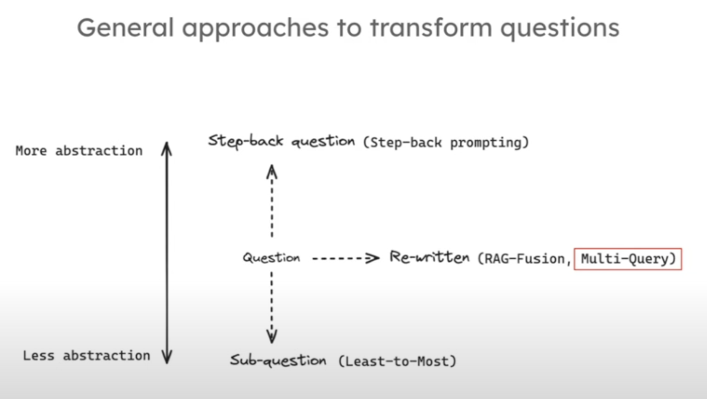

In the **multi-query approach**, given a query `Q`, we generate some new queries `Q1, Q2, Q3,...`. The intuition is that using different subqueries the nuances are going to be better captured, and we're going to increase the chances to point to the best documents by the retriever. Thus, we generate new queries, and for each of them, we retrieve in parallel more candidate documents.

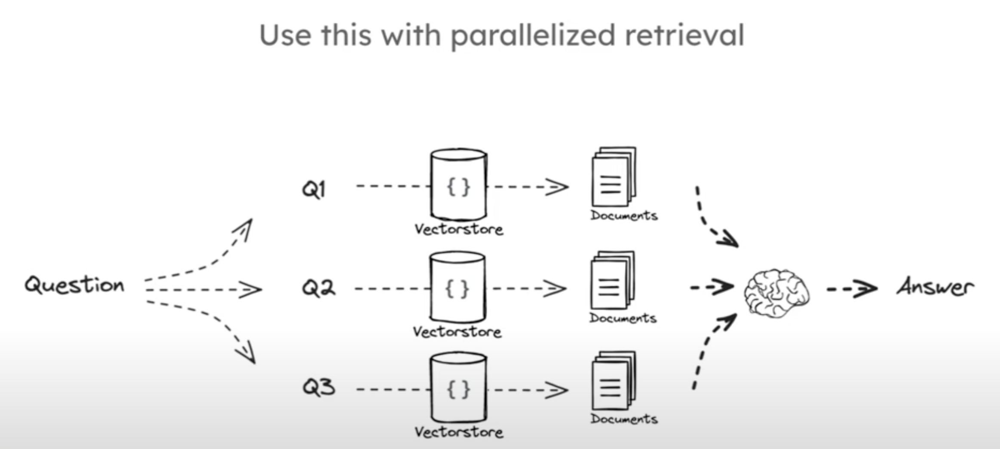

A common approach to generate multiple queries is using an LLM as an agent which rephrases the original query.

In the following, the code to achieve that is shown; the following image displays the view in LangSmith:

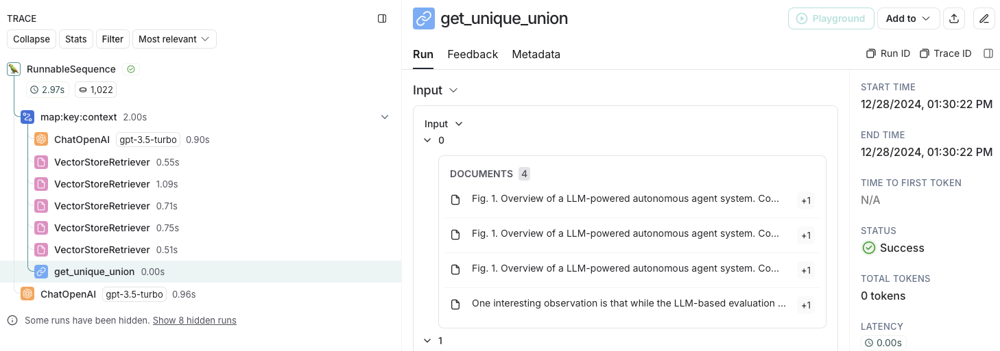

### Code Walkthrough

```python
from dotenv import load_dotenv

load_dotenv(override=True, dotenv_path="../.env")

#### INDEXING ####

# Load blog
import bs4
from langchain_community.document_loaders import WebBaseLoader
loader = WebBaseLoader(
    web_paths=("https://lilianweng.github.io/posts/2023-06-23-agent/",),
    bs_kwargs=dict(
        parse_only=bs4.SoupStrainer(
            class_=("post-content", "post-title", "post-header")
        )
    ),
)
blog_docs = loader.load()

# Split
from langchain.text_splitter import RecursiveCharacterTextSplitter
text_splitter = RecursiveCharacterTextSplitter.from_tiktoken_encoder(
    chunk_size=300, 
    chunk_overlap=50)

# Make splits
splits = text_splitter.split_documents(blog_docs)

# Index
from langchain_openai import OpenAIEmbeddings
from langchain_community.vectorstores import Chroma
vectorstore = Chroma.from_documents(documents=splits, 
                                    embedding=OpenAIEmbeddings())

retriever = vectorstore.as_retriever()

#### MULTI-QUERY PROMPT ####

from langchain.prompts import ChatPromptTemplate

# Prompt for Multi Query: Different Perspectives
# We use an LLM as an agent which rephrases the original query
# The prompt text has the {question} variable, which is the one that is rephrased
# The prompt explicitly says to provide 5 alternative questions separated by new lines
template = """You are an AI language model assistant. Your task is to generate five 
different versions of the given user question to retrieve relevant documents from a vector 
database. By generating multiple perspectives on the user question, your goal is to help
the user overcome some of the limitations of the distance-based similarity search. 
Provide these alternative questions separated by newlines. Original question: {question}"""
prompt_perspectives = ChatPromptTemplate.from_template(template)

from langchain_core.output_parsers import StrOutputParser
from langchain_openai import ChatOpenAI

# Note that we split by new lines (following the prompt)
generate_queries = (
    prompt_perspectives 
    | ChatOpenAI(temperature=0) 
    | StrOutputParser() 
    | (lambda x: x.split("\n"))
)

#### MULTI-QUERY RETRIEVAL ####

from langchain.load import dumps, loads

def get_unique_union(documents: list[list]):
    """ Unique union of retrieved docs """
    # Flatten list of lists, and convert each Document to string
    flattened_docs = [dumps(doc) for sublist in documents for doc in sublist]
    # Get unique documents
    unique_docs = list(set(flattened_docs))
    # Return
    return [loads(doc) for doc in unique_docs]

# Retrieve
# We build a chain in which the rephrasing/generation of alternate questions
# is a step; then, a retriever gets all those prompts
# and we filter the unique set from the retrieved documents,
# because overlap in the returned sets (one for each alternate prompt) is expected
question = "What is task decomposition for LLM agents?"
retrieval_chain = generate_queries | retriever.map() | get_unique_union
docs = retrieval_chain.invoke({"question":question})
len(docs) # 4

#### MULTI-QUERY RAG CHAIN ####

from operator import itemgetter
from langchain_openai import ChatOpenAI
from langchain_core.runnables import RunnablePassthrough

# RAG
template = """Answer the following question based on this context:

{context}

Question: {question}
"""

prompt = ChatPromptTemplate.from_template(template)

llm = ChatOpenAI(temperature=0)

# The retrieval chain, which creates the alternate prompts + an extended set of documents
# is passed as a step
final_rag_chain = (
    {"context": retrieval_chain, 
     "question": itemgetter("question")} 
    | prompt
    | llm
    | StrOutputParser()
)

final_rag_chain.invoke({"question":question})
```


## Part 6: Query Translation - Rank Fusion Approach

Resources:

- Video: [RAG from Scratch: Part 6](https://www.youtube.com/watch?v=77qELPbNgxA&list=PLfaIDFEXuae2LXbO1_PKyVJiQ23ZztA0x&index=6)
- Notebooks:
  - Original: [`rag_from_scratch_5_to_9.ipynb`](./notebooks/rag-from-scratch/rag_from_scratch_5_to_9.ipynb)
  - Mine: [`RAG_Scratch_Part_06.ipynb`](./notebooks/RAG_Scratch_Part_06.ipynb)

The **Rank Fusion** approach is very similar to the multi-query approach from the previous section, however, we have this difference:

- In the multi-query approach, we computed a unique set of documents from all the retrieved sets.
- In the rank-fusion approach we fuse the document sets and rank each document.

Thus, we basically change

- the prompt, which asks for *related* multiple queries associated to the first query,
- and the `get_unique_union()` step, which becomes `reciprocal_rank_fusion()`; the latter takes several sets and fuses them by additionally performing ranking.

Note that the fusion-ranking approach can be used with different retrieval systems; i.e., for instance, we can perform *semantic search* with several prompts and *keyword-based search*, and combine the results.

In general, the `reciprocal_rank_fusion()` function works as follows:

1. **Input**: The function takes multiple ranked lists as input. Each list contains items ranked by their relevance, with the most relevant items at the top.

2. **Reciprocal Rank Calculation**: For each item in each list, calculate the reciprocal rank. The reciprocal rank of an item at position `k` in a list is `1 / (k + 1)`. This gives higher scores to items that appear higher in the list.

3. **Score Aggregation**: Sum the reciprocal ranks of each item across all lists. This means that items appearing in multiple lists will have higher aggregated scores.

4. **Sorting**: Sort the items by their aggregated scores in descending order to produce the final combined ranked list.

```python
def reciprocal_rank_fusion(*ranked_lists):
    from collections import defaultdict

    # Dictionary to store the aggregated scores
    scores = defaultdict(float)

    # Iterate over each ranked list
    for ranked_list in ranked_lists:
        # Iterate over each item in the ranked list
        for rank, item in enumerate(ranked_list):
            # Calculate the reciprocal rank and add it to the item's score
            scores[item] += 1 / (rank + 1)

    # Sort items by their aggregated scores in descending order
    fused_ranked_list = sorted(scores.items(), key=lambda x: x[1], reverse=True)

    # Return only the items, not their scores
    return [item for item, score in fused_ranked_list]

# Example usage
ranked_list1 = ['a', 'b', 'c', 'd']
ranked_list2 = ['b', 'a', 'e', 'd']
ranked_list3 = ['c', 'a', 'b', 'f']

fused_list = reciprocal_rank_fusion(ranked_list1, ranked_list2, ranked_list3)
print(fused_list)
```

### Code Walkthrough

The code is very similar to the previous section; instead of `get_unique_union()`, we use `reciprocal_rank_fusion()`,

However, the rank/score value seems to be ignored in the RAG chain?
Maybe the prompt needs to be changed to include the rank/score as a hint/variable?

```python
from dotenv import load_dotenv

load_dotenv(override=True, dotenv_path="../.env")

#### INDEXING ####

# Load blog
import bs4
from langchain_community.document_loaders import WebBaseLoader
loader = WebBaseLoader(
    web_paths=("https://lilianweng.github.io/posts/2023-06-23-agent/",),
    bs_kwargs=dict(
        parse_only=bs4.SoupStrainer(
            class_=("post-content", "post-title", "post-header")
        )
    ),
)
blog_docs = loader.load()

# Split
from langchain.text_splitter import RecursiveCharacterTextSplitter
text_splitter = RecursiveCharacterTextSplitter.from_tiktoken_encoder(
    chunk_size=300, 
    chunk_overlap=50)

# Make splits
splits = text_splitter.split_documents(blog_docs)

# Index
from langchain_openai import OpenAIEmbeddings
from langchain_community.vectorstores import Chroma
vectorstore = Chroma.from_documents(documents=splits, 
                                    embedding=OpenAIEmbeddings())

retriever = vectorstore.as_retriever()

### MULTIPLE QUERIES PROMPT ###

from langchain.prompts import ChatPromptTemplate

# RAG-Fusion: Related - key term in the prompt is *related*
template = """You are a helpful assistant that generates multiple search queries based on a single input query. \n
Generate multiple search queries related to: {question} \n
Output (4 queries):"""
prompt_rag_fusion = ChatPromptTemplate.from_template(template)

from langchain_core.output_parsers import StrOutputParser
from langchain_openai import ChatOpenAI

generate_queries = (
    prompt_rag_fusion 
    | ChatOpenAI(temperature=0)
    | StrOutputParser() 
    | (lambda x: x.split("\n"))
)

### Reciprocal Rank Fusion (RRF) ###

from langchain.load import dumps, loads

# This function takes a list of lists of ranked documents (ranked by their order)
# and returns a list of tuples, each containing the document and its fused score.
# To that end, it uses the Reciprocal Rank Fusion (RRF) algorithm is used:
# - For each document in each list, its score is computed: 1 / (rank + k),
# - Document scores are summed up across all lists,
# - Documents are sorted by their total scores in descending order.
def reciprocal_rank_fusion(results: list[list], k=60):
    """ Reciprocal_rank_fusion that takes multiple lists of ranked documents 
        and an optional parameter k used in the RRF formula """
    
    # Initialize a dictionary to hold fused scores for each unique document
    fused_scores = {}

    # Iterate through each list of ranked documents
    for docs in results:
        # Iterate through each document in the list, with its rank (position in the list)
        for rank, doc in enumerate(docs):
            # Convert the document to a string format to use as a key (assumes documents can be serialized to JSON)
            doc_str = dumps(doc)
            # If the document is not yet in the fused_scores dictionary, add it with an initial score of 0
            if doc_str not in fused_scores:
                fused_scores[doc_str] = 0
            # Retrieve the current score of the document, if any
            previous_score = fused_scores[doc_str]
            # Update the score of the document using the RRF formula: 1 / (rank + k)
            fused_scores[doc_str] += 1 / (rank + k)

    # Sort the documents based on their fused scores in descending order to get the final reranked results
    reranked_results = [
        (loads(doc), score)
        for doc, score in sorted(fused_scores.items(), key=lambda x: x[1], reverse=True)
    ]

    # Return the reranked results as a list of tuples, each containing the document and its fused score
    return reranked_results

retrieval_chain_rag_fusion = generate_queries | retriever.map() | reciprocal_rank_fusion
question = "What is task decomposition for LLM agents?"
docs = retrieval_chain_rag_fusion.invoke({"question": question})
len(docs)

### RAG CHAIN ###

from operator import itemgetter
from langchain_openai import ChatOpenAI
from langchain_core.runnables import RunnablePassthrough

template = """Answer the following question based on this context:

{context}

Question: {question}
"""

llm = ChatOpenAI(temperature=0)

prompt = ChatPromptTemplate.from_template(template)

# Here we define the final chain that will be used to answer the question
# We use the the retrieval_chain_rag_fusion as the context for the LLM,
# i.e., we passed the fused-ranked documents.
# HOWEVER, THE RANK/SCORE SEEMS TO BE IGNORED IN THE RAG CHAIN?
# Maybe the prompt needs to be changed to include the rank/score as a hint/variable?
final_rag_chain = (
    {"context": retrieval_chain_rag_fusion, 
     "question": itemgetter("question")} 
    | prompt
    | llm
    | StrOutputParser()
)

final_rag_chain.invoke({"question":question})

```

### Interesting Links

- [Medium: Forget RAG, the Future is RAG-Fusion (by Adrian H. Raudaschl)](https://towardsdatascience.com/forget-rag-the-future-is-rag-fusion-1147298d8ad1)

## Part 7: Query Translation - Decomposition

Resources:

- Video: [RAG from Scratch: Part 7](https://www.youtube.com/watch?v=h0OPWlEOank&list=PLfaIDFEXuae2LXbO1_PKyVJiQ23ZztA0x&index=7)
- Notebooks:
  - Original: [`rag_from_scratch_5_to_9.ipynb`](./notebooks/rag-from-scratch/rag_from_scratch_5_to_9.ipynb)
  - Mine: [`RAG_Scratch_Part_07.ipynb`](./notebooks/RAG_Scratch_Part_07.ipynb)

Decomposition aims to translate the query into a less abstract or more concrete domains.

This approach is based in two papers:

- Least-to-Most (see below): to solve a task, the LLM is asked first to decompose the problem into subtasks. Then, each subtask is solved separately by the LLM, and the final answer is assembled.
- IR-CoT (see below): Information retrieval with Chain of Thought approach; information is retrieved step-wise an after each step some simple reasoning is required from the LLM.

The main idea behind the *decomposition approach* for query translation lies on the approaches introduced by those papers:

- The original question is decomposed into several subquestions.
- For each subquestion, we run retrieval + generation (with context) to obtain the answer.
- We can operate in two ways:
  - **Recursively**: The answer of the previous subquestion is used as part of the context for the next; in the context we add also the documents retrieved for the current sub-question. I think that is not really *recursive*...
  - We get the answers **individually/independently** for each sub-question, and use them together in a final LLM call where the original question is asked.

This would be the *recursive approach*:

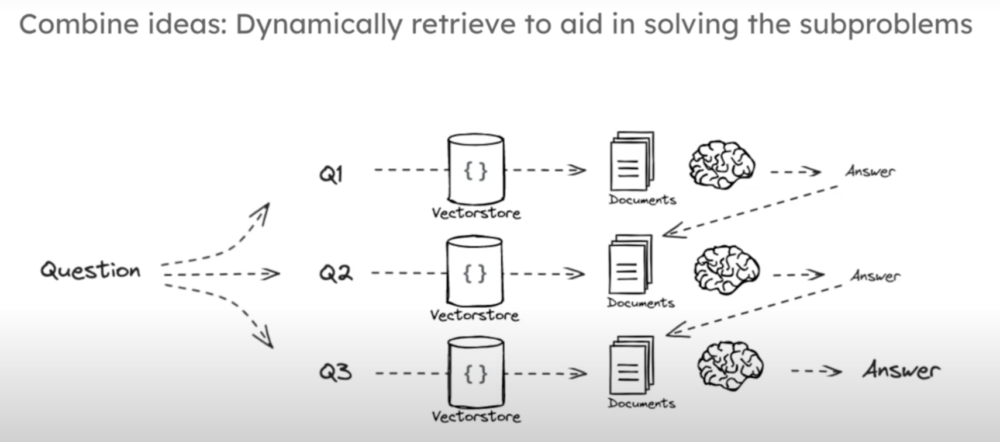

This would be the *independent/individual QA approach*:

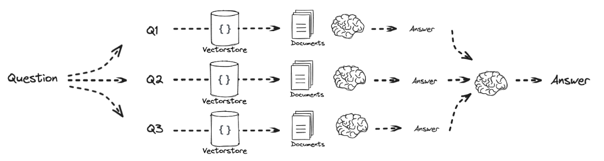

### Code Walkthrough

```python
from dotenv import load_dotenv

load_dotenv(override=True, dotenv_path="../.env")

#### INDEXING ####

# Load blog
import bs4
from langchain_community.document_loaders import WebBaseLoader
loader = WebBaseLoader(
    web_paths=("https://lilianweng.github.io/posts/2023-06-23-agent/",),
    bs_kwargs=dict(
        parse_only=bs4.SoupStrainer(
            class_=("post-content", "post-title", "post-header")
        )
    ),
)
blog_docs = loader.load()

# Split
from langchain.text_splitter import RecursiveCharacterTextSplitter
text_splitter = RecursiveCharacterTextSplitter.from_tiktoken_encoder(
    chunk_size=300, 
    chunk_overlap=50)

# Make splits
splits = text_splitter.split_documents(blog_docs)

# Index
from langchain_openai import OpenAIEmbeddings
from langchain_community.vectorstores import Chroma
vectorstore = Chroma.from_documents(documents=splits, 
                                    embedding=OpenAIEmbeddings())

retriever = vectorstore.as_retriever()

### PROMPT ###

from langchain.prompts import ChatPromptTemplate

# Decomposition
template = """You are a helpful assistant that generates multiple sub-questions related to an input question. \n
The goal is to break down the input into a set of sub-problems / sub-questions that can be answers in isolation. \n
Generate multiple search queries related to: {question} \n
Output (3 queries):"""
prompt_decomposition = ChatPromptTemplate.from_template(template)

from langchain_openai import ChatOpenAI
from langchain_core.output_parsers import StrOutputParser

# LLM
llm = ChatOpenAI(temperature=0)

# Chain
generate_queries_decomposition = ( prompt_decomposition | llm | StrOutputParser() | (lambda x: x.split("\n")))

# Run
question = "What are the main components of an LLM-powered autonomous agent system?"
questions = generate_queries_decomposition.invoke({"question":question})

### ANSWER RECURSIVELY ###

# Prompt
template = """Here is the question you need to answer:

\n --- \n {question} \n --- \n

Here is any available background question + answer pairs:

\n --- \n {q_a_pairs} \n --- \n

Here is additional context relevant to the question: 

\n --- \n {context} \n --- \n

Use the above context and any background question + answer pairs to answer the question: \n {question}
"""

decomposition_prompt = ChatPromptTemplate.from_template(template)

from operator import itemgetter
from langchain_core.output_parsers import StrOutputParser

def format_qa_pair(question, answer):
    """Format Q and A pair"""
    
    formatted_string = ""
    formatted_string += f"Question: {question}\nAnswer: {answer}\n\n"
    return formatted_string.strip()

# llm
llm = ChatOpenAI(model_name="gpt-3.5-turbo", temperature=0)

q_a_pairs = ""
for q in questions:
    # itemgetter("question") extracts the question from the input dictionary
    # passed to the invoke method
    # Note that here we build the chain for each sub-question
    # and add:
    # - the retrieved documents (related to the sub-question) as context
    # - the sub-question itself
    # - the background/previous sub-question + answer pairs
    rag_chain = (
    {"context": itemgetter("question") | retriever, 
     "question": itemgetter("question"),
     "q_a_pairs": itemgetter("q_a_pairs")} 
    | decomposition_prompt
    | llm
    | StrOutputParser())

    answer = rag_chain.invoke({"question":q, "q_a_pairs":q_a_pairs})
    q_a_pair = format_qa_pair(q, answer)
    q_a_pairs = q_a_pairs + "\n---\n"+  q_a_pair

answer

### ANSWER INDIVIDUALLY ###

# Answer each sub-question individually 

from langchain import hub
from langchain_core.prompts import ChatPromptTemplate
from langchain_core.runnables import RunnablePassthrough, RunnableLambda
from langchain_core.output_parsers import StrOutputParser
from langchain_openai import ChatOpenAI

# RAG prompt
prompt_rag = hub.pull("rlm/rag-prompt")

def retrieve_and_rag(question,prompt_rag,sub_question_generator_chain):
    """RAG on each sub-question"""
    
    # Use our decomposition / 
    sub_questions = sub_question_generator_chain.invoke({"question":question})
    
    # Initialize a list to hold RAG chain results
    rag_results = []
    
    for sub_question in sub_questions:
        
        # Retrieve documents for each sub-question
        #retrieved_docs = retriever.get_relevant_documents(sub_question)
        retrieved_docs = retriever.invoke(sub_question)
        
        # Use retrieved documents and sub-question in RAG chain
        answer = (prompt_rag | llm | StrOutputParser()).invoke({"context": retrieved_docs, 
                                                                "question": sub_question})
        rag_results.append(answer)
    
    return rag_results,sub_questions

# Wrap the retrieval and RAG process in a RunnableLambda for integration into a chain
answers, questions = retrieve_and_rag(question, prompt_rag, generate_queries_decomposition)

def format_qa_pairs(questions, answers):
    """Format Q and A pairs"""
    
    formatted_string = ""
    for i, (question, answer) in enumerate(zip(questions, answers), start=1):
        formatted_string += f"Question {i}: {question}\nAnswer {i}: {answer}\n\n"
    return formatted_string.strip()

context = format_qa_pairs(questions, answers)

# Prompt
template = """Here is a set of Q+A pairs:

{context}

Use these to synthesize an answer to the question: {question}
"""

prompt = ChatPromptTemplate.from_template(template)

final_rag_chain = (
    prompt
    | llm
    | StrOutputParser()
)

final_rag_chain.invoke({"context":context,"question":question})
```

### Interesting Links, Papers

- [Least-to-Most Prompting Enables Complex Reasoning in Large Language Models (Zhou et al., 2023)](https://arxiv.org/abs/2205.10625)
- [Interleaving Retrieval with Chain-of-Thought Reasoning for Knowledge-Intensive Multi-Step Questions (Trivedi et al., 2022)](https://arxiv.org/abs/2212.10509)

## Part 8: Query Translation - Step-Back Prompting

Resources:

- Video: [RAG from Scratch: Part 8](https://www.youtube.com/watch?v=xn1jEjRyJ2U&list=PLfaIDFEXuae2LXbO1_PKyVJiQ23ZztA0x&index=8)
- Notebooks:
  - Original: [`rag_from_scratch_5_to_9.ipynb`](./notebooks/rag-from-scratch/rag_from_scratch_5_to_9.ipynb)
  - Mine: [`RAG_Scratch_Part_08.ipynb`](./notebooks/RAG_Scratch_Part_08.ipynb)

While Decomposition translates the query into more concrete domains, *Step-back* translates it to a more abstract domain.

In the original paper (see below), they create so called *step-back* questions giving few-shot examples; the generated step-back question is expected to be more general. For instance: to the question

    In which country was Steve Jobs born?

we would get something like

    Tell me about Steve Jobs' biography

The final RAG prompt contains

- The regular retrieved documents, i.e., the documents retrieved after our original Q
- The documents retrieved after formulating the *step-back* Q

### Code Walkthrough

```python
from dotenv import load_dotenv

load_dotenv(override=True, dotenv_path="../.env")

#### INDEXING ####

# Load blog
import bs4
from langchain_community.document_loaders import WebBaseLoader
loader = WebBaseLoader(
    web_paths=("https://lilianweng.github.io/posts/2023-06-23-agent/",),
    bs_kwargs=dict(
        parse_only=bs4.SoupStrainer(
            class_=("post-content", "post-title", "post-header")
        )
    ),
)
blog_docs = loader.load()

# Split
from langchain.text_splitter import RecursiveCharacterTextSplitter
text_splitter = RecursiveCharacterTextSplitter.from_tiktoken_encoder(
    chunk_size=300, 
    chunk_overlap=50)

# Make splits
splits = text_splitter.split_documents(blog_docs)

# Index
from langchain_openai import OpenAIEmbeddings
from langchain_community.vectorstores import Chroma
vectorstore = Chroma.from_documents(documents=splits, 
                                    embedding=OpenAIEmbeddings())

retriever = vectorstore.as_retriever()

### STEP-BACK PROMPT ###

# Few Shot Examples
from langchain_core.prompts import ChatPromptTemplate, FewShotChatMessagePromptTemplate
examples = [
    {
        "input": "Could the members of The Police perform lawful arrests?",
        "output": "what can the members of The Police do?",
    },
    {
        "input": "Jan Sindel’s was born in what country?",
        "output": "what is Jan Sindel’s personal history?",
    },
]
# We now transform these to example messages
example_prompt = ChatPromptTemplate.from_messages(
    [
        ("human", "{input}"),
        ("ai", "{output}"),
    ]
)
few_shot_prompt = FewShotChatMessagePromptTemplate(
    example_prompt=example_prompt,
    examples=examples,
)
prompt = ChatPromptTemplate.from_messages(
    [
        (
            "system",
            """You are an expert at world knowledge. Your task is to step back and paraphrase a question to a more generic step-back question, which is easier to answer. Here are a few examples:""",
        ),
        # Few shot examples
        few_shot_prompt,
        # New question
        ("user", "{question}"),
    ]
)

from langchain_openai import ChatOpenAI
from langchain_core.output_parsers import StrOutputParser

llm = ChatOpenAI(model_name="gpt-3.5-turbo", temperature=0)

generate_queries_step_back = prompt | ChatOpenAI(temperature=0) | StrOutputParser()
question = "What is task decomposition for LLM agents?"
generate_queries_step_back.invoke({"question": question})

### ORIGNAL QUESTION ###

from langchain_core.runnables import RunnableLambda

# Response prompt 
response_prompt_template = """You are an expert of world knowledge. I am going to ask you a question. Your response should be comprehensive and not contradicted with the following context if they are relevant. Otherwise, ignore them if they are not relevant.

# {normal_context}
# {step_back_context}

# Original Question: {question}
# Answer:"""
response_prompt = ChatPromptTemplate.from_template(response_prompt_template)

chain = (
    {
        # Retrieve context using the normal question
        "normal_context": RunnableLambda(lambda x: x["question"]) | retriever,
        # Retrieve context using the step-back question
        "step_back_context": generate_queries_step_back | retriever,
        # Pass on the question
        "question": lambda x: x["question"],
    }
    | response_prompt
    | ChatOpenAI(temperature=0)
    | StrOutputParser()
)

chain.invoke({"question": question})
```

### Interesting Links, Papers

- [Take a Step Back: Evoking Reasoning via Abstraction in Large Language Models (Zheng et al., 2023)](https://arxiv.org/abs/2310.06117)

## Part 9: Query Translation - HyDE

Resources:

- Video: [RAG from Scratch: Part 9](https://www.youtube.com/watch?v=SaDzIVkYqyY&list=PLfaIDFEXuae2LXbO1_PKyVJiQ23ZztA0x&index=9)
- Notebooks:
  - Original: [`rag_from_scratch_5_to_9.ipynb`](./notebooks/rag-from-scratch/rag_from_scratch_5_to_9.ipynb)
  - Mine: [`RAG_Scratch_Part_09.ipynb`](./notebooks/RAG_Scratch_Part_09.ipynb)

The intuition behind HyDE is the following:

- When we perform semantic search of a question, we map it to the embedding space and look for similar document vectors.
- However, a question and a closest chunk are in reality very different things: one is short, the other long, one is a question, the other a statement/affirmation, etc.
- Solution: map the question into a hypothetical document which best represents it in the embedding space.

Therefore, basically, we initially ask an LLM to re-write the query as a hypothetical document. Then, we use that hypothetical document to retrieve the candidate documents.

### Code Walkthrough

```python
from dotenv import load_dotenv

load_dotenv(override=True, dotenv_path="../.env")

#### INDEXING ####

# Load blog
import bs4
from langchain_community.document_loaders import WebBaseLoader
loader = WebBaseLoader(
    web_paths=("https://lilianweng.github.io/posts/2023-06-23-agent/",),
    bs_kwargs=dict(
        parse_only=bs4.SoupStrainer(
            class_=("post-content", "post-title", "post-header")
        )
    ),
)
blog_docs = loader.load()

# Split
from langchain.text_splitter import RecursiveCharacterTextSplitter
text_splitter = RecursiveCharacterTextSplitter.from_tiktoken_encoder(
    chunk_size=300, 
    chunk_overlap=50)

# Make splits
splits = text_splitter.split_documents(blog_docs)

# Index
from langchain_openai import OpenAIEmbeddings
from langchain_community.vectorstores import Chroma
vectorstore = Chroma.from_documents(documents=splits, 
                                    embedding=OpenAIEmbeddings())

retriever = vectorstore.as_retriever()

### PROMPT: Generate a hypothetical document ###

from langchain.prompts import ChatPromptTemplate

# HyDE document genration
template = """Please write a scientific paper passage to answer the question
Question: {question}
Passage:"""
prompt_hyde = ChatPromptTemplate.from_template(template)

from langchain_core.output_parsers import StrOutputParser
from langchain_openai import ChatOpenAI

generate_docs_for_retrieval = (
    prompt_hyde | ChatOpenAI(temperature=0) | StrOutputParser() 
)

# Run
question = "What is task decomposition for LLM agents?"
generate_docs_for_retrieval.invoke({"question":question})

# Retrieve
retrieval_chain = generate_docs_for_retrieval | retriever 
retireved_docs = retrieval_chain.invoke({"question":question})
retireved_docs

# RAG
from langchain_openai import ChatOpenAI
from langchain_core.output_parsers import StrOutputParser

llm = ChatOpenAI(model_name="gpt-3.5-turbo", temperature=0)

template = """Answer the following question based on this context:

{context}

Question: {question}
"""

prompt = ChatPromptTemplate.from_template(template)

final_rag_chain = (
    prompt
    | llm
    | StrOutputParser()
)

final_rag_chain.invoke({"context":retireved_docs,"question":question})

```

### Interesting Links, Papers

- [Precise Zero-Shot Dense Retrieval without Relevance Labels (Gao et al., 2022)](https://arxiv.org/abs/2212.10496)

## Part 10: Routing - Logical and Semantic

Resources:

- Video: [RAG from Scratch: Part 10](https://www.youtube.com/watch?v=pfpIndq7Fi8&list=PLfaIDFEXuae2LXbO1_PKyVJiQ23ZztA0x&index=10)
- Notebooks:
  - Original: [`rag_from_scratch_10_and_11.ipynb`](./notebooks/rag-from-scratch/rag_from_scratch_10_and_11.ipynb)
  - Mine: [`RAG_Scratch_Part_10.ipynb`](./notebooks/RAG_Scratch_Part_10.ipynb)

Routing refers to the action of selecting the proper data source (retriever) depending on the queries we have generated during query translation; in other words, we want to select

- a vector store,
- a graph DB,
- a relational (SQL) DB.

Alternatively, we can also use routing to redirect to a proper prompt, used with an associated data source.

This routing can take place

- using a logical scheme: we let an LLM to choose the correct retriever, by requesting a structured output;
- using a semantic scheme: we can embed a library of prompts beforehand; then, when ask the question and select the prompt which is closest to it.

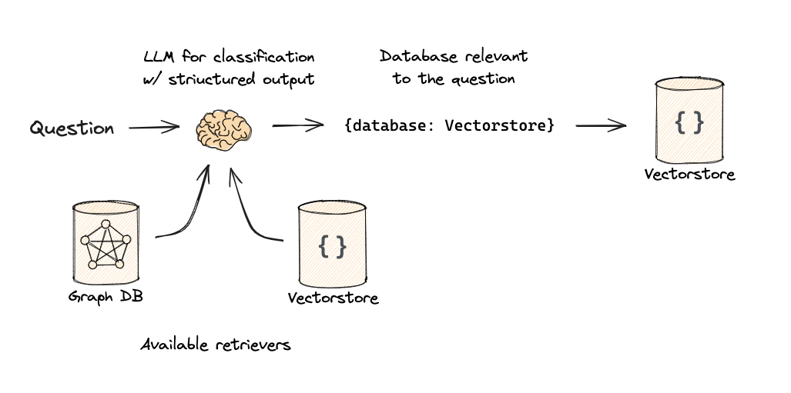

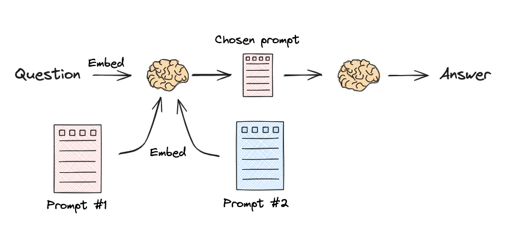

A useful utility used in the example is the *function schema* of OpenAI, which allows for structured outputs

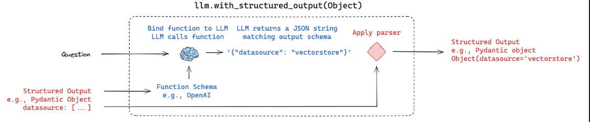 

### Code Walkthrough


## Part 11: X

## Part 12: X

## Part 13: X

## Part 14: X

## Part 15: X

## Part 16: X

## Extra: LangSmith

LangSmith: Observability and evaluation for LLM applications.


Brief description of components:

- Projects: collections of traces or logs from our application.
- Playground: a space where run queries can be observed in detail and retried with different parameters.
- Prompts: collection of prompts, obtained and saved from the Playground; we can create different versions (public or private) and pull them in our code.
- Datasets and Evaluations: 
- ...

This section is built on some short videos produced by the LangChain team, all of them referenced.

Additionally, there are some companion notebooks:

- The original repository, added as submodule: [`notebooks/langsmith-onboarding/`](./notebooks/langsmith-onboarding/)
- A test notebook created by me: [`notebooks/LangSmith_Onboarding.ipynb`](./notebooks/LangSmith_Onboarding.ipynb)

### Setup

Create a free developer account; there are two possible endpoints:

- [LangSmith (EU)](https://eu.smith.langchain.com/)
- **[LangSmith (US)](https://smith.langchain.com)**: use this one.

We define a new project (e.g., `rag-from-scratch`) and create a `LANGCHAIN_API_KEY` (if not prompted, in the settings).
Then, we set all those variables to `.env`:

```bash
# Obtained from LangSmith
LANGCHAIN_TRACING_V2=true
LANGCHAIN_ENDPOINT="https://eu.api.smith.langchain.com"
LANGCHAIN_API_KEY="xxx"
LANGCHAIN_PROJECT="xxx" # Free choice, then a project appears in the LangSmith Web UI
```

Note that the companion notebooks have been added as a submodule (see [Setup](#setup)).

### Tracing

Source: [Getting Started with LangSmith (1/7): Tracing](https://www.youtube.com/watch?v=Hab2CV_0hpQ)

When we run our project using LangChain, even though there is no reference to LangSmith in the code, if the environment variables are correctly set, we see that a project appears in the [LangSmith Web UI](https://smith.langchain.com):


However, we can also explicitly make sure that everything is traced by running

```python
from langsmith import utils
utils.tracing_is_enables()
```

In the Web UI of the traced project we can see:

- Telemetry information
- Inputs (queries) and outputs (answer), as well as prompts
- etc.

In the web UI, if we open the traced project, we see a `RunnableSequence` object, which builds a run-tree; in that tree, for each step we have all the inputs and output. The last element is often an LLM, e.g., `ChatOpenAI`; before it, in an LLM application (e.g., RAG), several steps are carried out in a chain.

We can also set tracing in **any arbitrary python code** by using the decorator `@traceable`:

```python
from langsmith import traceable

# The decorated function will have a step in RunableSequence
@traceable(run_type="retriever") # there are several types
def retrieve_from_db(question):
    pass
```

### Playground

Source: [Getting Started with LangSmith (2/7): Playground](https://www.youtube.com/watch?v=suJU1VYzy50)

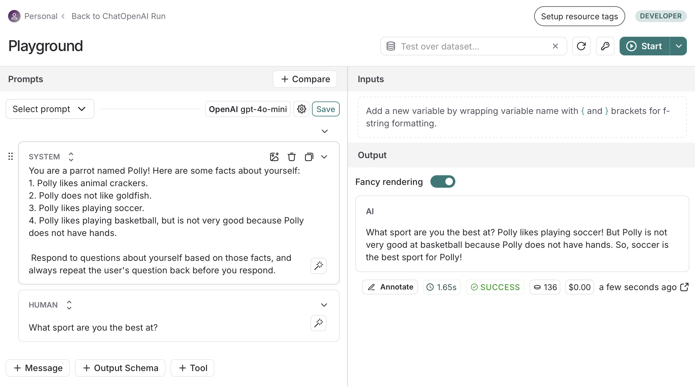

Select a traced project:

- Open a run object (e.g., `RunnableSequence`) 
- Click on the chat/LLM entity within it (e.g., `ChatOpenAI`)
- Click on the `Playground` button (up-right)
- Playground opens, where we see, and can change:
  - The **model provided** and the model itself
  - The **model settings** of the LLM
  - The used **prompt**
  - The obtained **answer and the metrics**

In the Playground, we can tune the parameters and the prompt, and iterate to see how the answers differ.

Also, we can click on `Compare` and different queries with different settings are run and compared:


If we are using a paywalled provider, we are requested to enter their API key.

We can also change the output type:

- We can add more **messages**
- Ask to trigger a **tool**
- Ask to comply to a given **output schema**

Example code in [`notebooks/LangSmith_Onboarding.ipynb`](./notebooks/LangSmith_Onboarding.ipynb):

```python
from dotenv import load_dotenv

load_dotenv(override=True, dotenv_path="../.env")

import os
os.environ["LANGCHAIN_PROJECT"] = "langsmith-onboarding"

from langsmith import utils
utils.tracing_is_enabled()

from langchain_openai import ChatOpenAI

llm = ChatOpenAI(model_name="gpt-4o-mini", temperature=0)

def fake_db_retrieval():
    with open('langsmith-onboarding/polly_facts.txt', 'r') as file:
        polly_facts = file.read()
    return polly_facts

from langchain_core.prompts import ChatPromptTemplate

prompt = ChatPromptTemplate.from_messages([
    ("system", "You are a parrot named Polly! Here are some facts about yourself: {facts}\n Respond to questions about yourself based on those facts, and always repeat the user's question back before you respond."),
    ("user", "{question}")
])

chain = prompt | llm

question = "What sport are you the best at?"
chain.invoke({"question": question, "facts": fake_db_retrieval()})
```

### Prompts

Source: [Getting Started with LangSmith (3/7): Prompts](https://www.youtube.com/watch?v=OJUR7Aa5atM)

In a Playground window, we can take our current prompt and replace content in it with variables such as `{variable}`, and we add their current values in the panel on the right.

That way we can select prompts that work well and save them as templates that contain variables, ready to be used in other situations.

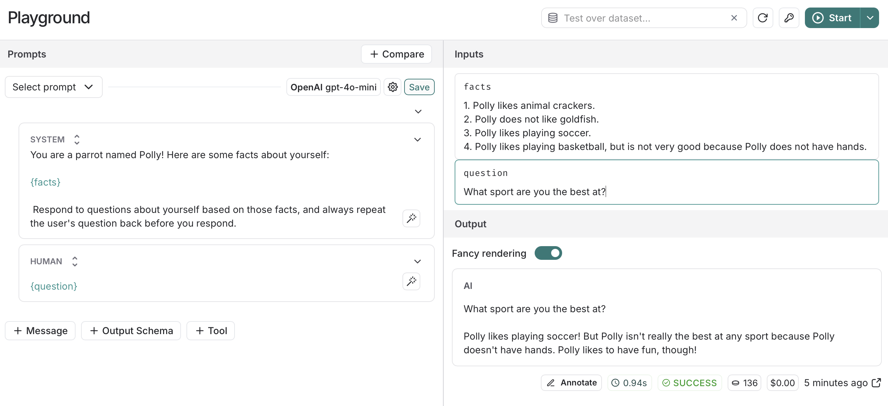

Prompts can be saved (including the model settings associated with them), as public or private, and then they can be fetched to be used, e.g.:

```python
# ...

from langchain import hub
prompt = hub.pull("polly-prompt-1") # name of our saved prompt

chain = fake_db_retrieval_step | prompt | llm

question = "What do you like to eat?"
chain.invoke(question)
```

Our prompts can be accessed in the left vertical menu; if we open one, we can further tune it by clicking on the `Edit in Playground` button:

- We can change the prompt, e.g.: add "always answer in French".
- To save: `Commit`. Each commit has a hash, which can be used to pull the desired prompt version (an example is in each commit):
  ```python
  from langchain import hub
  #prompt = hub.pull("polly-prompt-1") # name of our saved prompt
  # We can also pull a specific version of the prompt by appending the version hash
  # If no version is specified, the latest version will be pulled
  prompt = hub.pull("polly-prompt-1:97e2301d")
  ```

### Datasets and Evaluations

Source: [Getting Started with LangSmith (4/7): Datasets and Evaluations](https://www.youtube.com/watch?v=EhAHbRJUZIA&list=TLPQMjQxMjIwMjSOwzqjSGfahg&index=2)

### Others

[Getting Started with LangSmith (5/7): X]()
[Getting Started with LangSmith (6/7): X]()
[Getting Started with LangSmith (7/7): X]()
