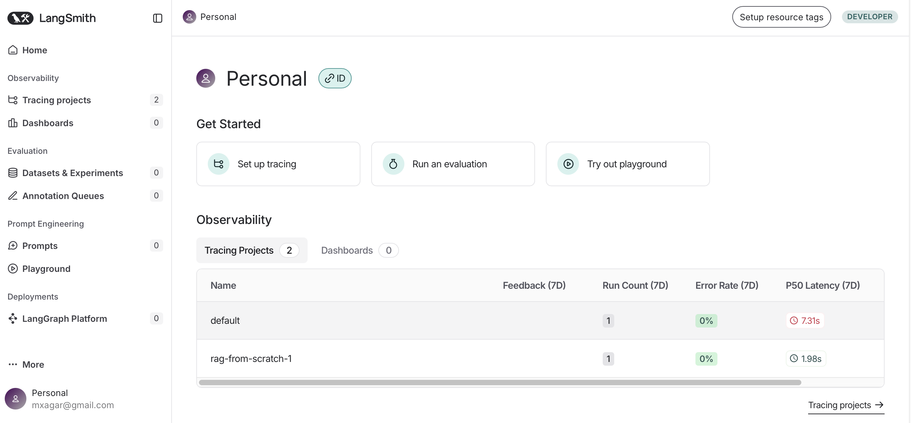
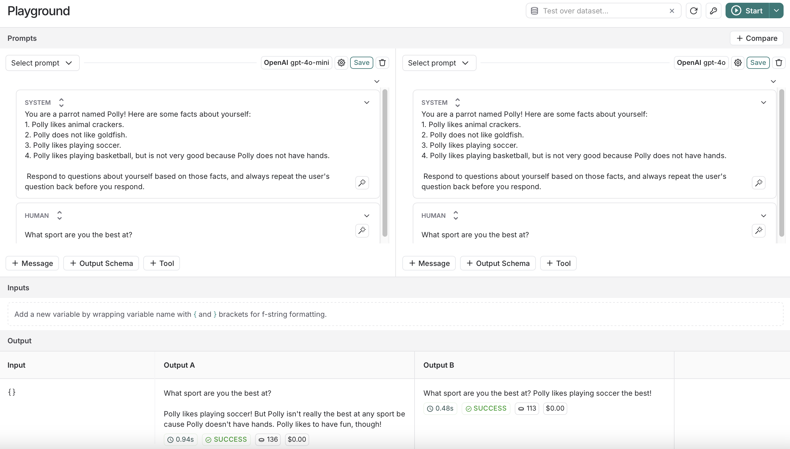

# RAG from Scratch: LangChain

This project includes resources from [RAG from Scratch](https://github.com/langchain-ai/rag-from-scratch) as a submodule. The original author of that repository is Lance Martin, from Langchain.

- [RAG from Scratch by Langchain (Github)](https://github.com/langchain-ai/rag-from-scratch)
- [RAG from Scratch by Langchain (Youtube & Freecodecamp)](https://www.youtube.com/watch?v=sVcwVQRHIc8)


## Table of Contents

- [RAG from Scratch: LangChain](#rag-from-scratch-langchain)
  - [Table of Contents](#table-of-contents)
  - [Setup](#setup)
    - [LangSmith and OpenAI](#langsmith-and-openai)
    - [All Environment Variables](#all-environment-variables)
    - [Original LangChain Repository](#original-langchain-repository)
  - [Part 1: Introduction](#part-1-introduction)
    - [Code Walkthrough](#code-walkthrough)
  - [Part 2: Indexing](#part-2-indexing)
    - [Code Walkthrough](#code-walkthrough-1)
    - [Interesting Links](#interesting-links)
  - [Part 3: Retrieval](#part-3-retrieval)
    - [Code Walkthrough](#code-walkthrough-2)
  - [Part 4: Generation](#part-4-generation)
    - [Code Walkthrough](#code-walkthrough-3)
  - [Part 5: Query Translation - Multi-Query Approach](#part-5-query-translation---multi-query-approach)
    - [Code Walkthrough](#code-walkthrough-4)
  - [Part 6: X](#part-6-x)
  - [Part 7: X](#part-7-x)
  - [Part 8: X](#part-8-x)
  - [Part 9: X](#part-9-x)
  - [Part 10: X](#part-10-x)
  - [Part 11: X](#part-11-x)
  - [Part 12: X](#part-12-x)
  - [Part 13: X](#part-13-x)
  - [Part 14: X](#part-14-x)
  - [Extra: LangSmith](#extra-langsmith)
    - [Setup](#setup-1)
    - [Tracing](#tracing)
    - [Playground](#playground)
    - [Prompts](#prompts)
    - [Datasets and Evaluations](#datasets-and-evaluations)
    - [Others](#others)

## Setup

The only necessary libraries are these:

```bash
pip install langchain_community tiktoken langchain-openai langchainhub chromadb langchain
```

However, I created a fresh new basic environment with `conda`:

```bash
# Create environment (Python 3.10, pip & pip-tools)
conda env create -f conda.yaml
# Activate environment
conda activate rag

# Generate pinned dependencies and install/sync
pip-compile requirements.in --verbose
pip-sync requirements.txt

# Install package as editable: changes are immediately reflected without reinstalling
# This requires a setup.py, as explained below
pip install -e .

# If we need a new dependency,
# add it to requirements.in 
# (WATCH OUT: try to follow alphabetical order)
# And then:
pip-compile requirements.in
pip-sync requirements.txt
```

### LangSmith and OpenAI

We should create a a free developer account at **LangSmith**; there are two possible endpoints:

- [LangSmith (EU)](https://eu.smith.langchain.com/)
- [LangSmith (US)](https://smith.langchain.com)

I created both accounts, but the EU one seems to have issues when some hub repositories are accessed, so I ended up using the US one.

Once we have the LangSmith US account, we set a new project (e.g., `rag-from-scratch`) and get the environment variables to access it.

See the section [LangSmith](#langsmith) for more information on the tool.

Additionally, we need an [OpenAI Platform Account](https://platform.openai.com/) and a project API key from it.

### All Environment Variables

I have a `.env` file as the following:

```bash
# Obtained from LangSmith
LANGCHAIN_TRACING_V2=true
LANGCHAIN_ENDPOINT="https://eu.api.smith.langchain.com"
LANGCHAIN_API_KEY="xxx"
LANGCHAIN_PROJECT="xxx"
# OpenAI Project API Key
OPENAI_API_KEY="xxx"
```

### Original LangChain Repository

The original LangChain repository is added as a submodule:

```bash
# Add and initialize the LanChain repo as a submodule
cd .../generative_ai_udacity
git submodule add https://github.com/langchain-ai/rag-from-scratch.git 06_RAGs_DeepDive/01_RAG_from_Scratch/notebooks/rag-from-scratch
git submodule init
git submodule update

# Add also the LangSmith Onboarding repo
git submodule add https://github.com/nhuang-lc/langsmith-onboarding.git 06_RAGs_DeepDive/01_RAG_from_Scratch/notebooks/langsmith-onboarding
git submodule init
git submodule update

# Add the automatically generated .gitmodules file to the repo
git add .gitmodules 06_RAGs_DeepDive/01_RAG_from_Scratch/notebooks/

# When my repository is cloned, initialize and update the submodule 
git clone https://github.com/mxagar/generative_ai_udacity
git submodule update --init --recursive
```

## Part 1: Introduction

Resources:

- Video: [RAG from Scratch: Part 1](https://www.youtube.com/watch?v=wd7TZ4w1mSw&list=PLfaIDFEXuae2LXbO1_PKyVJiQ23ZztA0x&index=1)
- Notebooks: 
  - Original: [`rag_from_scratch_1_to_4.ipynb`](./notebooks/rag-from-scratch/rag_from_scratch_1_to_4.ipynb)
  - Mine: [`RAG_Scratch_Part_01.ipynb`](./notebooks/RAG_Scratch_Part_01.ipynb)

LLMs have not seen all the data we car about: recent data, private data.
Additionally, we have the context, to which we can inject data.
This is related to the LLM OS, coined by Karpathy, where LLMs are connected to external data.


We have three basic RAG stages/components:

1. Indexing: documents are indexed.
2. Retrieval: Given a query, the relevant documents are obtained
3. Generation: An answer is formulated by the LLN given the query and the retrieved documents


However, there are more advanced RAG systems that go beyond those 3 components; they include:

- Query transformation
- Routing
- Query construction
- Indexing
- Retrieval
- Generation


This tutorial builds up from basics to advanced.

### Code Walkthrough

Very simple RAG example shown in [`RAG_Scratch_Part_01.ipynb`](./notebooks/RAG_Scratch_Part_01.ipynb)

- A basic RAG is built, where a blog is vectorized and used to build a chatbot.
- The `hub` does not work if the EU endpoint is used, i.e., pulling the template fails; thus, I ended up using the US API.
- LangSmith: This is some kind of tracking tool, with a nice UI: [LangSmith](https://smith.langchain.com); it's similar to MLflow, but built for LLMs and LangChain-related operations. See Section [Extra: LangSmith](#extra-langsmith).


```python
from dotenv import load_dotenv
import bs4
from langchain import hub
from langchain.text_splitter import RecursiveCharacterTextSplitter
from langchain_community.document_loaders import WebBaseLoader
from langchain_community.vectorstores import Chroma
from langchain_core.output_parsers import StrOutputParser
from langchain_core.runnables import RunnablePassthrough
from langchain_openai import ChatOpenAI, OpenAIEmbeddings
from langchain.prompts import PromptTemplate

load_dotenv(override=True, dotenv_path="../.env")

#### INDEXING ####

# Load Documents
loader = WebBaseLoader(
    web_paths=("https://lilianweng.github.io/posts/2023-06-23-agent/",),
    bs_kwargs=dict(
        parse_only=bs4.SoupStrainer(
            class_=("post-content", "post-title", "post-header")
        )
    ),
)
docs = loader.load()

# Split
text_splitter = RecursiveCharacterTextSplitter(chunk_size=1000, chunk_overlap=200)
splits = text_splitter.split_documents(docs)

# Embed
vectorstore = Chroma.from_documents(documents=splits, 
                                    embedding=OpenAIEmbeddings())

retriever = vectorstore.as_retriever()

#### RETRIEVAL and GENERATION ####

# Prompt
prompt = hub.pull("rlm/rag-prompt") # This requires the US endpoint...
# Alternative:
#prompt = PromptTemplate(
#    input_variables=["context", "question"],
#    template="Given the following context: {context}, answer the question: {question}"
#)

# LLM
llm = ChatOpenAI(model_name="gpt-3.5-turbo", temperature=0)

# Post-processing
def format_docs(docs):
    return "\n\n".join(doc.page_content for doc in docs)

# Chain
rag_chain = (
    {"context": retriever | format_docs, "question": RunnablePassthrough()}
    | prompt
    | llm
    | StrOutputParser()
)

# Question
rag_chain.invoke("What is Task Decomposition?")
```

## Part 2: Indexing

Resources:

- Video: [RAG from Scratch: Part 2](https://www.youtube.com/watch?v=bjb_EMsTDKI&list=PLfaIDFEXuae2LXbO1_PKyVJiQ23ZztA0x&index=2)
- Notebooks: 
  - Original: [`rag_from_scratch_1_to_4.ipynb`](./notebooks/rag-from-scratch/rag_from_scratch_1_to_4.ipynb)
  - Mine: [`RAG_Scratch_Part_02.ipynb`](./notebooks/RAG_Scratch_Part_02.ipynb)

Given a question, we want the Retriever to select documents which are context relevant to formulate the answer; to that end, the Indexer needs to prepare the documents for efficient and relevant search.

That search for relevant documents is done usually by comparing some numerical representations; there are mainly two types of approaches:

- Sparse, Bag-of-Words, TD-IDF / BM25 
- Dense, Embeddings, Cosine Similarity / kNN & Co.


No matter which indexing/search approach we take, we usually need to **split our documents** into chunks; that's because we don't have infinite context space to input them later. That splitting can be done according to several criteria:

- By number of characters
- By sections
- By semantic meaning
- By delimiters
- etc.


### Code Walkthrough

A simple indexing example shown in [`RAG_Scratch_Part_02.ipynb`](./notebooks/RAG_Scratch_Part_02.ipynb):

- Tokens/word is measured with tiktoken.
- OpenAI Embeddings are used.
- Cosine similarity is used to measure how similar two vectors are.
- A web is loaded as the document.
- Recursive splitting is done based on the number of characters.
- The Chroma vectorstore takes the splits as well as the embedder.

```python
from dotenv import load_dotenv

load_dotenv(override=True, dotenv_path="../.env")

# Documents
question = "What kinds of pets do I like?"
document = "My favorite pet is a cat."

## Measure number of tokens/word
# https://help.openai.com/en/articles/4936856-what-are-tokens-and-how-to-count-them
# https://github.com/openai/openai-cookbook/blob/main/examples/How_to_count_tokens_with_tiktoken.ipynb
import tiktoken

def num_tokens_from_string(string: str, encoding_name: str) -> int:
    """Returns the number of tokens in a text string."""
    encoding = tiktoken.get_encoding(encoding_name)
    num_tokens = len(encoding.encode(string))
    return num_tokens

num_tokens_from_string(question, "cl100k_base")

## Embed text (question & document)
# https://python.langchain.com/docs/integrations/text_embedding/openai/
from langchain_openai import OpenAIEmbeddings

embd = OpenAIEmbeddings()
query_result = embd.embed_query(question)
document_result = embd.embed_query(document)
len(query_result)

# Cosine similarity is reccomended (1 indicates identical) for OpenAI embeddings.
import numpy as np

def cosine_similarity(vec1, vec2):
    dot_product = np.dot(vec1, vec2)
    norm_vec1 = np.linalg.norm(vec1)
    norm_vec2 = np.linalg.norm(vec2)
    return dot_product / (norm_vec1 * norm_vec2)

similarity = cosine_similarity(query_result, document_result)
print("Cosine Similarity:", similarity)

# Load blog document
import bs4
from langchain_community.document_loaders import WebBaseLoader

loader = WebBaseLoader(
    web_paths=("https://lilianweng.github.io/posts/2023-06-23-agent/",),
    bs_kwargs=dict(
        parse_only=bs4.SoupStrainer(
            class_=("post-content", "post-title", "post-header")
        )
    ),
)
blog_docs = loader.load()

# Split
from langchain.text_splitter import RecursiveCharacterTextSplitter

text_splitter = RecursiveCharacterTextSplitter.from_tiktoken_encoder(
    chunk_size=300, 
    chunk_overlap=50)

splits = text_splitter.split_documents(blog_docs)

# Index splitted documents
from langchain_openai import OpenAIEmbeddings
from langchain_community.vectorstores import Chroma

vectorstore = Chroma.from_documents(documents=splits, 
                                    embedding=OpenAIEmbeddings())

retriever = vectorstore.as_retriever()
```

### Interesting Links

- [https://chunkviz.up.railway.app](https://chunkviz.up.railway.app)
- [Count tokens](https://github.com/openai/openai-cookbook/blob/main/examples/How_to_count_tokens_with_tiktoken.ipynb) considering [~4 char / token](https://help.openai.com/en/articles/4936856-what-are-tokens-and-how-to-count-them)
- [Text embedding models](https://python.langchain.com/docs/integrations/text_embedding/openai)
- [Cosine similarity](https://platform.openai.com/docs/guides/embeddings/frequently-asked-questions) is recommended (1 indicates identical) for OpenAI embeddings.
- [Document Loaders](https://python.langchain.com/docs/integrations/document_loaders/)
- [Splitter](https://python.langchain.com/docs/modules/data_connection/document_transformers/recursive_text_splitter)
- [Vectorstores](https://python.langchain.com/docs/integrations/vectorstores/)

## Part 3: Retrieval

Resources:

- Video: [RAG from Scratch: Part 3](https://www.youtube.com/watch?v=LxNVgdIz9sU&list=PLfaIDFEXuae2LXbO1_PKyVJiQ23ZztA0x&index=3)
- Notebooks: 
  - Original: [`rag_from_scratch_1_to_4.ipynb`](./notebooks/rag-from-scratch/rag_from_scratch_1_to_4.ipynb)
  - Mine: [`RAG_Scratch_Part_03.ipynb`](./notebooks/RAG_Scratch_Part_03.ipynb)

If we are working with embedding vectors to represent split documents, vectorstores are used to index and store those document vectors as well as search in them. Note that text of similar meaning will have vectors pointing in the similar direction. Search leverages that notion: we basically narrow down the document vectors close to the query embedding vector. That task is carried out by the vectorstore itself.


Very powerful search method: [FAISS: Hierarchical Navigable Small Worlds (HNSW)](https://www.pinecone.io/learn/series/faiss/hnsw/)

LangChain has many integrations to run the introduced basic steps: index and retrieve.


### Code Walkthrough

```python
from dotenv import load_dotenv

load_dotenv(override=True, dotenv_path="../.env")

# Load blog document
import bs4
from langchain_community.document_loaders import WebBaseLoader

loader = WebBaseLoader(
    web_paths=("https://lilianweng.github.io/posts/2023-06-23-agent/",),
    bs_kwargs=dict(
        parse_only=bs4.SoupStrainer(
            class_=("post-content", "post-title", "post-header")
        )
    ),
)
blog_docs = loader.load()

# Split
from langchain.text_splitter import RecursiveCharacterTextSplitter

text_splitter = RecursiveCharacterTextSplitter.from_tiktoken_encoder(
    chunk_size=300, 
    chunk_overlap=50)

splits = text_splitter.split_documents(blog_docs)

# Index
from langchain_openai import OpenAIEmbeddings
from langchain_community.vectorstores import Chroma
vectorstore = Chroma.from_documents(documents=splits, 
                                    embedding=OpenAIEmbeddings())


# Define retriever: k-NN serach with k=1
retriever = vectorstore.as_retriever(search_kwargs={"k": 1})

# Retrieve
docs = retriever.get_relevant_documents("What is Task Decomposition?")
```

When we run this, we should see in the LangSmith Web UI that there's a new object: `VectorStoreRetriever`. The object contains the metrics, the query and the retrieved document.

## Part 4: Generation

Resources:

- Video: [RAG from Scratch: Part 4](https://www.youtube.com/watch?v=Vw52xyyFsB8&list=PLfaIDFEXuae2LXbO1_PKyVJiQ23ZztA0x&index=4)
- Notebooks:
  - Original: [`rag_from_scratch_1_to_4.ipynb`](./notebooks/rag-from-scratch/rag_from_scratch_1_to_4.ipynb)
  - Mine: [`RAG_Scratch_Part_04.ipynb`](./notebooks/RAG_Scratch_Part_04.ipynb)

After the relevant documents associated with the question have been retrieved, those documents are passed as context to the LLM by asking in a prompt to provide an answer to the question given the selected documents.

The prompt is basically a command text with placeholders as *context* and *query*, which are replaced by the current question.


### Code Walkthrough

```python
from dotenv import load_dotenv

load_dotenv(override=True, dotenv_path="../.env")

# Load blog document
import bs4
from langchain_community.document_loaders import WebBaseLoader

loader = WebBaseLoader(
    web_paths=("https://lilianweng.github.io/posts/2023-06-23-agent/",),
    bs_kwargs=dict(
        parse_only=bs4.SoupStrainer(
            class_=("post-content", "post-title", "post-header")
        )
    ),
)
blog_docs = loader.load()

# Split
from langchain.text_splitter import RecursiveCharacterTextSplitter

text_splitter = RecursiveCharacterTextSplitter.from_tiktoken_encoder(
    chunk_size=300, 
    chunk_overlap=50)

splits = text_splitter.split_documents(blog_docs)

# Index
from langchain_openai import OpenAIEmbeddings
from langchain_community.vectorstores import Chroma
vectorstore = Chroma.from_documents(documents=splits, 
                                    embedding=OpenAIEmbeddings())


# Define retriever: k-NN serach with k=1
retriever = vectorstore.as_retriever(search_kwargs={"k": 1})

# Retrieve
docs = retriever.get_relevant_documents("What is Task Decomposition?")

from langchain_openai import ChatOpenAI
from langchain.prompts import ChatPromptTemplate

# Prompt
# Note that we define variables in {}
# Their values will by defined later, even at run time
template = """Answer the question based only on the following context:
{context}

Question: {question}
"""
prompt = ChatPromptTemplate.from_template(template)

# LLM
llm = ChatOpenAI(model_name="gpt-3.5-turbo", temperature=0)

# Chain
chain = prompt | llm

# Run: A chain can be run by executing its invoke() method
# where we pass a dict which contains the the values of the variables we have used.
# In this case, the prompt has the variables context and question
chain.invoke({"context":docs, "question":"What is Task Decomposition?"})

## -- More Sophisticated RAG Chain

from langchain import hub
# We can pull specific prompts that are known to work well in certain scenarios
prompt_hub_rag = hub.pull("rlm/rag-prompt")

from langchain_core.output_parsers import StrOutputParser
from langchain_core.runnables import RunnablePassthrough

# This is a more complex chain that uses the RAG architecture
# The retriever is used to retrieve relevant documents
# and it is passed as the context!
rag_chain = (
    {"context": retriever, "question": RunnablePassthrough()}
    | prompt
    | llm
    | StrOutputParser()
)

# RunnablePassthrough: This is a special Runnable that passes the input to the next Runnable unchanged
rag_chain.invoke("What is Task Decomposition?")
```

## Part 5: Query Translation - Multi-Query Approach

Resources:

- Video: [RAG from Scratch: Part 5](https://www.youtube.com/watch?v=JChPi0CRnDY&list=PLfaIDFEXuae2LXbO1_PKyVJiQ23ZztA0x&index=5)
- Notebooks:
  - Original: [`rag_from_scratch_5_to_9.ipynb`](./notebooks/rag-from-scratch/rag_from_scratch_5_to_9.ipynb)
  - Mine: [`RAG_Scratch_Part_05.ipynb`](./notebooks/RAG_Scratch_Part_05.ipynb)

If the query is poorly written, the retriever is going to perform badly; thus, we want to have the best query possible to get all the relevant documents.

There are several approaches to improve the query:

- Rewrite to be a more general question
- Rewrite to be a more concrete question
- Generate different perspectives of the query, i.e., multiple queries
- etc.


In the **multi-query approach**, given a query `Q`, we generate some new queries `Q1, Q2, Q3,...`. The intuition is that using different subqueries the nuances are going to be better captured, and we're going to increase the chances to point to the best documents by the retriever. Thus, we generate new queries, and for each of them, we retrieve in parallel more candidate documents.


### Code Walkthrough

```python
from dotenv import load_dotenv

load_dotenv(override=True, dotenv_path="../.env")
```

## Part 6: X

Resources:

- Video: [RAG from Scratch: Part X]()
- Notebooks:
  - Original: [`rag_from_scratch_5_to_9.ipynb`](./notebooks/rag-from-scratch/rag_from_scratch_5_to_9.ipynb)
  - Mine: [`RAG_Scratch_Part_06.ipynb`](./notebooks/RAG_Scratch_Part_06.ipynb)

## Part 7: X

Resources:

- Video: [RAG from Scratch: Part X]()
- Notebooks:
  - Original: [`rag_from_scratch_5_to_9.ipynb`](./notebooks/rag-from-scratch/rag_from_scratch_5_to_9.ipynb)
  - Mine: [`RAG_Scratch_Part_07.ipynb`](./notebooks/RAG_Scratch_Part_07.ipynb)

## Part 8: X

Resources:

- Video: [RAG from Scratch: Part X]()
- Notebooks:
  - Original: [`rag_from_scratch_5_to_9.ipynb`](./notebooks/rag-from-scratch/rag_from_scratch_5_to_9.ipynb)
  - Mine: [`RAG_Scratch_Part_08.ipynb`](./notebooks/RAG_Scratch_Part_08.ipynb)

## Part 9: X

Resources:

- Video: [RAG from Scratch: Part X]()
- Notebooks:
  - Original: [`rag_from_scratch_5_to_9.ipynb`](./notebooks/rag-from-scratch/rag_from_scratch_5_to_9.ipynb)
  - Mine: [`RAG_Scratch_Part_09.ipynb`](./notebooks/RAG_Scratch_Part_09.ipynb)

## Part 10: X

## Part 11: X

## Part 12: X

## Part 13: X

## Part 14: X

## Extra: LangSmith

LangSmith: Observability and evaluation for LLM applications.



Brief description of components:

- Projects: collections of traces or logs from our application.
- Playground: a space where run queries can be observed in detail and retried with different parameters.
- Prompts: collection of prompts, obtained and saved from the Playground; we can create different versions (public or private) and pull them in our code.
- Datasets and Evaluations: 
- ...

This section is built on some short videos produced by the LangChain team, all of them referenced.

Additionally, there are some companion notebooks:

- The original repository, added as submodule: [`notebooks/langsmith-onboarding/`](./notebooks/langsmith-onboarding/)
- A test notebook created by me: [`notebooks/LangSmith_Onboarding.ipynb`](./notebooks/LangSmith_Onboarding.ipynb)

### Setup

Create a free developer account; there are two possible endpoints:

- [LangSmith (EU)](https://eu.smith.langchain.com/)
- **[LangSmith (US)](https://smith.langchain.com)**: use this one.

We define a new project (e.g., `rag-from-scratch`) and create a `LANGCHAIN_API_KEY` (if not prompted, in the settings).
Then, we set all those variables to `.env`:

```bash
# Obtained from LangSmith
LANGCHAIN_TRACING_V2=true
LANGCHAIN_ENDPOINT="https://eu.api.smith.langchain.com"
LANGCHAIN_API_KEY="xxx"
LANGCHAIN_PROJECT="xxx" # Free choice, then a project appears in the LangSmith Web UI
```

Note that the companion notebooks have been added as a submodule (see [Setup](#setup)).

### Tracing

Source: [Getting Started with LangSmith (1/7): Tracing](https://www.youtube.com/watch?v=Hab2CV_0hpQ)

When we run our project using LangChain, even though there is no reference to LangSmith in the code, if the environment variables are correctly set, we see that a project appears in the [LangSmith Web UI](https://smith.langchain.com):


However, we can also explicitly make sure that everything is traced by running

```python
from langsmith import utils
utils.tracing_is_enables()
```

In the Web UI of the traced project we can see:

- Telemetry information
- Inputs (queries) and outputs (answer), as well as prompts
- etc.

In the web UI, if we open the traced project, we see a `RunnableSequence` object, which builds a run-tree; in that tree, for each step we have all the inputs and output. The last element is often an LLM, e.g., `ChatOpenAI`; before it, in an LLM application (e.g., RAG), several steps are carried out in a chain.

We can also set tracing in **any arbitrary python code** by using the decorator `@traceable`:

```python
from langsmith import traceable

# The decorated function will have a step in RunableSequence
@traceable(run_type="retriever") # there are several types
def retrieve_from_db(question):
    pass
```

### Playground

Source: [Getting Started with LangSmith (2/7): Playground](https://www.youtube.com/watch?v=suJU1VYzy50)


Select a traced project:

- Open a run object (e.g., `RunnableSequence`) 
- Click on the chat/LLM entity within it (e.g., `ChatOpenAI`)
- Click on the `Playground` button (up-right)
- Playground opens, where we see, and can change:
  - The **model provided** and the model itself
  - The **model settings** of the LLM
  - The used **prompt**
  - The obtained **answer and the metrics**

In the Playground, we can tune the parameters and the prompt, and iterate to see how the answers differ.

Also, we can click on `Compare` and different queries with different settings are run and compared:



If we are using a paywalled provider, we are requested to enter their API key.

We can also change the output type:

- We can add more **messages**
- Ask to trigger a **tool**
- Ask to comply to a given **output schema**

Example code in [`notebooks/LangSmith_Onboarding.ipynb`](./notebooks/LangSmith_Onboarding.ipynb):

```python
from dotenv import load_dotenv

load_dotenv(override=True, dotenv_path="../.env")

import os
os.environ["LANGCHAIN_PROJECT"] = "langsmith-onboarding"

from langsmith import utils
utils.tracing_is_enabled()

from langchain_openai import ChatOpenAI

llm = ChatOpenAI(model_name="gpt-4o-mini", temperature=0)

def fake_db_retrieval():
    with open('langsmith-onboarding/polly_facts.txt', 'r') as file:
        polly_facts = file.read()
    return polly_facts

from langchain_core.prompts import ChatPromptTemplate

prompt = ChatPromptTemplate.from_messages([
    ("system", "You are a parrot named Polly! Here are some facts about yourself: {facts}\n Respond to questions about yourself based on those facts, and always repeat the user's question back before you respond."),
    ("user", "{question}")
])

chain = prompt | llm

question = "What sport are you the best at?"
chain.invoke({"question": question, "facts": fake_db_retrieval()})
```

### Prompts

Source: [Getting Started with LangSmith (3/7): Prompts](https://www.youtube.com/watch?v=OJUR7Aa5atM)

In a Playground window, we can take our current prompt and replace content in it with variables such as `{variable}`, and we add their current values in the panel on the right.

That way we can select prompts that work well and save them as templates that contain variables, ready to be used in other situations.


Prompts can be saved (including the model settings associated with them), as public or private, and then they can be fetched to be used, e.g.:

```python
# ...

from langchain import hub
prompt = hub.pull("polly-prompt-1") # name of our saved prompt

chain = fake_db_retrieval_step | prompt | llm

question = "What do you like to eat?"
chain.invoke(question)
```

Our prompts can be accessed in the left vertical menu; if we open one, we can further tune it by clicking on the `Edit in Playground` button:

- We can change the prompt, e.g.: add "always answer in French".
- To save: `Commit`. Each commit has a hash, which can be used to pull the desired prompt version (an example is in each commit):
  ```python
  from langchain import hub
  #prompt = hub.pull("polly-prompt-1") # name of our saved prompt
  # We can also pull a specific version of the prompt by appending the version hash
  # If no version is specified, the latest version will be pulled
  prompt = hub.pull("polly-prompt-1:97e2301d")
  ```

### Datasets and Evaluations

Source: [Getting Started with LangSmith (4/7): Datasets and Evaluations](https://www.youtube.com/watch?v=EhAHbRJUZIA&list=TLPQMjQxMjIwMjSOwzqjSGfahg&index=2)

### Others

[Getting Started with LangSmith (5/7): X]()
[Getting Started with LangSmith (6/7): X]()
[Getting Started with LangSmith (7/7): X]()
