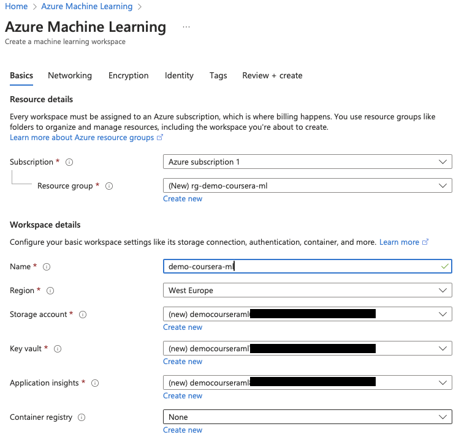
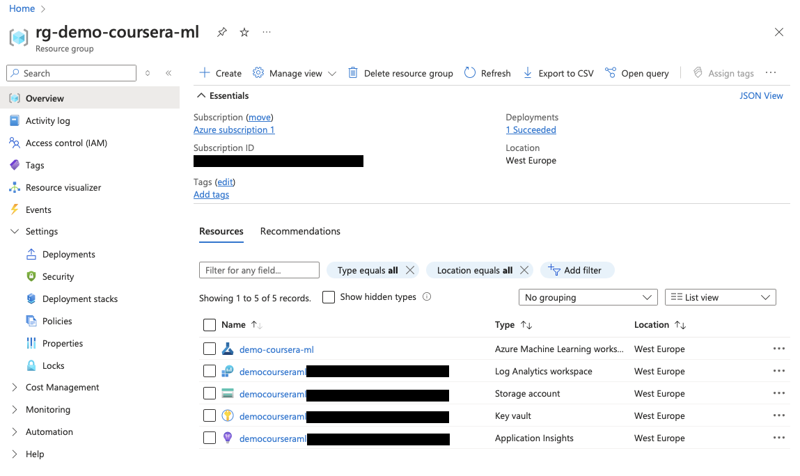
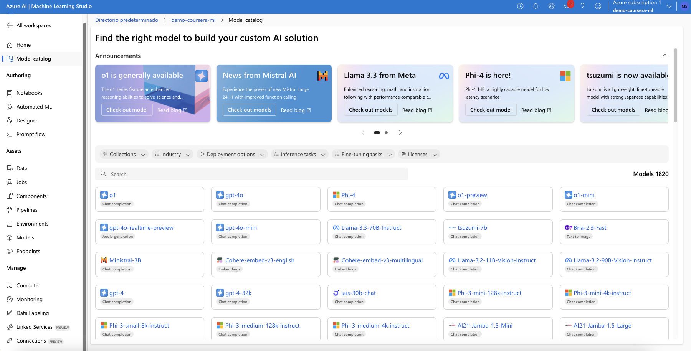
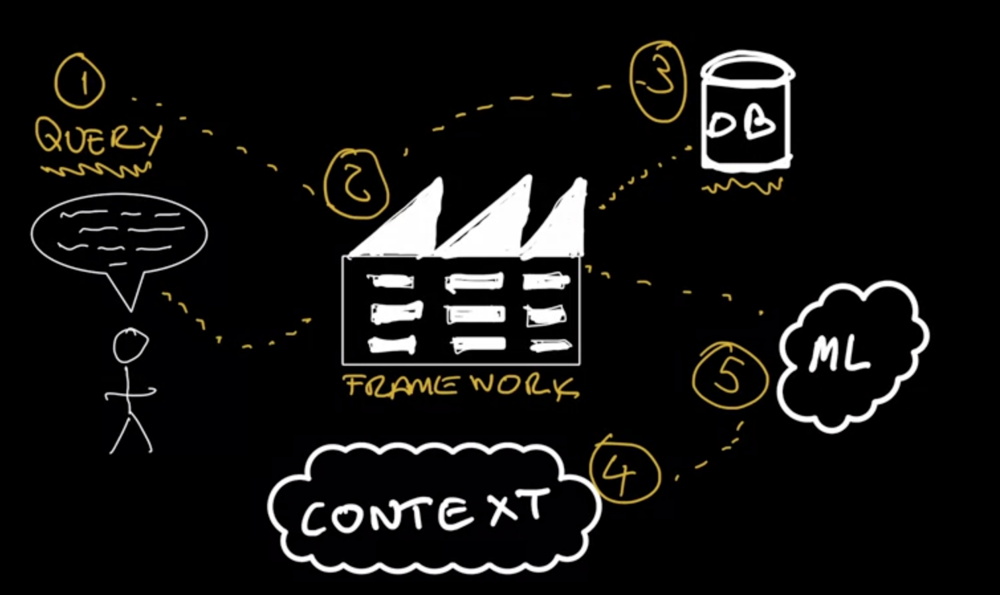
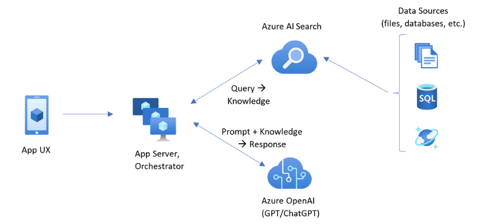
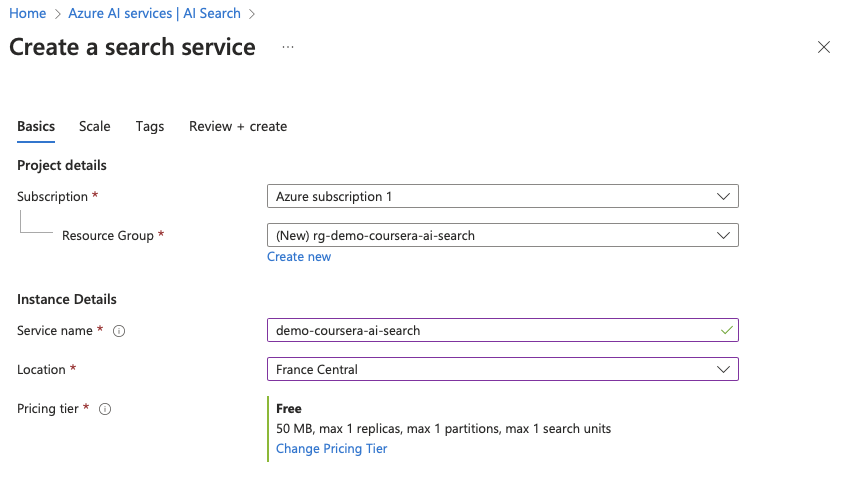
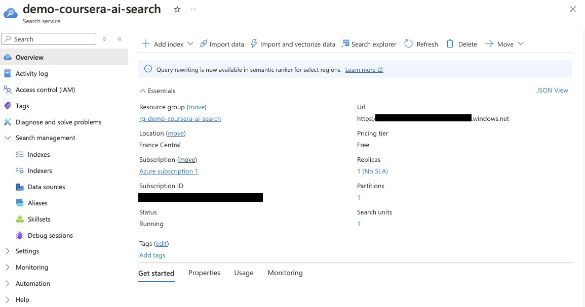

# Operationalizing LLMs on Azure

This folder includes my notes on the course [Operationalizing LLMs on Azure](https://www.coursera.org/learn/llmops-azure), which is the second module of the Coursera Specialization [Large Language Model Operations (LLMOps)](https://www.coursera.org/specializations/large-language-model-operations).

For a guide on Azure, check my notes in [mxagar/azure_guide](https://github.com/mxagar/azure_guide).

## Table of Contents

- [Operationalizing LLMs on Azure](#operationalizing-llms-on-azure)
  - [Table of Contents](#table-of-contents)
  - [0. Setup](#0-setup)
  - [1. Introduction to LLMOps with Azure](#1-introduction-to-llmops-with-azure)
    - [Introduction to Azure and Its AI Services](#introduction-to-azure-and-its-ai-services)
      - [Azure Machine Learning](#azure-machine-learning)
      - [Azure OpenAI](#azure-openai)
    - [Overview of LLMs](#overview-of-llms)
    - [LLM Deployment in Azure](#llm-deployment-in-azure)
  - [2. LLMs with Azure](#2-llms-with-azure)
    - [Azure Machine Learning and LLMs](#azure-machine-learning-and-llms)
    - [Azure OpenAI Service](#azure-openai-service)
    - [Azure OpenAI APIs](#azure-openai-apis)
  - [3. Extending with Functions and Plugins](#3-extending-with-functions-and-plugins)
    - [Improved Prompts with Semantic Kernel](#improved-prompts-with-semantic-kernel)
    - [Extending Results with Functions](#extending-results-with-functions)
    - [Using Functions with External APIs](#using-functions-with-external-apis)
  - [4. Building an End-to-End Application in Azure](#4-building-an-end-to-end-application-in-azure)
    - [Architecture](#architecture)
      - [Azure AI Search](#azure-ai-search)
      - [Github Actions](#github-actions)
      - [Azure AI Document Intelligence](#azure-ai-document-intelligence)
      - [Extra Exercises](#extra-exercises)
    - [RAG with Azure AI Search](#rag-with-azure-ai-search)
    - [Deployment and Scaling with Github Action](#deployment-and-scaling-with-github-action)

## 0. Setup

Steps:

- Create an Account in Azure: [mxagar/azure_guide/01_fundamentals#12-basic-demos](https://github.com/mxagar/azure_guide/tree/main/01_fundamentals#12-basic-demos); I used an account linked to my Github.
- Create a Python environment (see below).

Recipe to create a `conda` environment with provided dependency files:

```bash
# Create environment (Python 3.10, pip & pip-tools)
conda env create -f conda.yaml
# Activate environment
conda activate rag

# Generate pinned dependencies and install/sync
pip-compile requirements.in --verbose
pip-sync requirements.txt

# Install package as editable: changes are immediately reflected without reinstalling
# This requires a setup.py, as explained below
pip install -e .

# If we need a new dependency,
# add it to requirements.in 
# (WATCH OUT: try to follow alphabetical order)
# And then:
pip-compile requirements.in
pip-sync requirements.txt
```

## 1. Introduction to LLMOps with Azure

### Introduction to Azure and Its AI Services

For an overview of Azure, check my guides: [mxagar/azure_guide/01_fundamentals](https://github.com/mxagar/azure_guide/tree/main/01_fundamentals)

An important portal for learning Azure: [https://learn.microsoft.com/](https://learn.microsoft.com/)

- Documentation: Generic topics explained in detail.
- Training
- [**Code Samples**](https://learn.microsoft.com/en-gb/samples/browse/): We have very specific and useful examples here!

It's important to distinguish between two important AI services:

- Azure OpenAI: These are OpenAI models
  - We can open **Azure OpenAI Studio** and check them.
  - If we use them, we get OpenAI model clones running on our Subscription only for us!
- Azure Machine Learning: Here, we can create instances, which are then opened in **Azure Machine Learning Studio**
  - In the Studio, we have access to all sorts of models, not the OpenAI models.
  - We have models for vision, language, etc.
  - We have Endpoints, etc.

#### Azure Machine Learning

An **Azure Machine Learning Workspace** is created. The *container registry* is left empty (i.e., *None*).



Several services are deployed (it takes some minutes) in the selected/created RG.



Once created, we go to the `Azure Machine Learning workspace` service instance and click on `Launch Studio`.



There we see we have many options on the left menu:

- Model catalog (OpenAI models appear again, but we are redirected to OpenAI Studio).
- Notebooks (also samples).
- (Our) Models, in a registry.
- Endpoints.
- Compute instances: we can create compute instance with GPU and attach them to our Notebooks.

#### Azure OpenAI

TBD.

### Overview of LLMs

TBD.

### LLM Deployment in Azure

TBD.

## 2. LLMs with Azure

### Azure Machine Learning and LLMs

TBD.

### Azure OpenAI Service

TBD.

### Azure OpenAI APIs

TBD.

## 3. Extending with Functions and Plugins

### Improved Prompts with Semantic Kernel

TBD.

### Extending Results with Functions

TBD.

### Using Functions with External APIs

TBD.

## 4. Building an End-to-End Application in Azure

### Architecture

Summary:

- The section covers the architectural overview and components involved in building an end-to-end application using large language models; specifically, the RAG (Retrieval Augmented Generation) pattern is introduced.
- The application is built entirely using Microsoft Azure Cloud services; it uses, among others, the Azure AI Search service.
- Github Actions are also introduced, as a way to automate deployment.

LLMs are trained in many tokens/texts, but they might not have specific knowledge we want. A [RAG (Retrieval Augmented Generation)](https://arxiv.org/abs/2005.11401) application is able to plug in new knowledge to the model via its context:

- First, we index documents which contain new information; e.g., in a vector DB.
- When we ask the Query, the Framework (e.g., LangChain or our Application) retrieves the Documents which are likely to contain the answer.
- With those Documents, the Context is created.
- The LLM is invoked in a Prompt which contains the Query and the Context (i.e., we already provide the answer as specified in our Documents).
- The answer of the LLM is returned to the User.



Azure enables the necessary components to implement [Retrieval Augmented Generation (RAG) using Azure AI Search](https://learn.microsoft.com/en-us/azure/search/retrieval-augmented-generation-overview).



#### Azure AI Search

Azure AI Search (previously known as Azure Cognitive Search) is a basic Azure service we need; it allows to search data from storage components.

We can manually create it, e.g.:



Important: Choose the Free Tier with 50 MB of storage.

Once created and configured, if we go to the resource in the Portal, we see we can

- **Import Data** manually
  - For that, we need to either create or connect a Blob Storage Account
- We can search in the **Indexes**
- etc.



More information can be found in the official Azure documentation: [Create an Azure AI Search service in the Azure portal](https://learn.microsoft.com/en-gb/azure/search/search-create-service-portal)

- **Configure authentication** (for programmatic access)
- Scale your service (Partitions and Replicas)
- When to add a second service
- Add more services to a subscription

#### Github Actions

Github Actions allow to easily deploy an application to the cloud, i.e., Azure.

- We can enter secrets to Github.
- Under `.github/workflows` a YAML file is created with all the jobs/steps necessary for deployment.
- We usually get a template YAML which we modify to our needs.
- Typical steps:
  - Checkout repo branch
  - Setup Docker
  - Login to Github and get secrets
  - Build our container and push it to Azure Container Registry (ACR)
  - Deploy Azure Container App (after authentication)

The example shown in the video is the following:

[`alfredodeza/huggingface-azure-acr/.github/workflows/main.yml`](https://github.com/alfredodeza/huggingface-azure-acr/blob/main/.github/workflows/main.yml)

```yaml
name: Trigger auto deployment for demo-container

#env:
#  AZURE_CONTAINER_APP_NAME: demo-container
#  AZURE_GROUP_NAME: demo-container

# When this action will be executed
on:
  # Automatically trigger it when detected changes in repo. Remove comments to enable
  #push:
  #  branches: 
  #    [ main ]

  # Allow mannually trigger 
  workflow_dispatch:      

jobs:
  build:
    runs-on: ubuntu-latest

    steps:
      - name: Checkout to the branch
        uses: actions/checkout@v2

      - name: Set up Docker Buildx
        uses: docker/setup-buildx-action@v1

      - name: Log in to GitHub container registry
        uses: docker/login-action@v1.10.0
        with:
          registry: demoalfredo.azurecr.io
          username: ${{ secrets.ACR_USERNAME }}
          password: ${{ secrets.ACR_PASSWORD }}

      - name: Lowercase the repo name and username
        run: echo "REPO=${GITHUB_REPOSITORY,,}" >>${GITHUB_ENV}

      - name: Build and push container image to ACR registry
        uses: docker/build-push-action@v2
        with:
          push: true
          tags: demoalfredo.azurecr.io/${{ env.REPO }}:${{ github.sha }}
          file: ./Dockerfile

  deploy:
    runs-on: ubuntu-latest
    needs: build
    
    steps:
      - name: Azure Login
        uses: azure/login@v1
        with:
          creds: ${{ secrets.AZURE_CREDENTIALS }}


      - name: Deploy to containerapp
        uses: azure/CLI@v1
        with:
          inlineScript: |
            az config set extension.use_dynamic_install=yes_without_prompt
            az containerapp registry set -n demo-container -g demo-container --server demoalfredo.azurecr.io --username ${{ secrets.ACR_USERNAME }} --password ${{ secrets.ACR_PASSWORD }}
            az containerapp update -n demo-container -g demo-container --cpu 2 --memory 4Gi
            az containerapp update -n demo-container -g demo-container --image demoalfredo.azurecr.io/alfredodeza/huggingface-azure-acr:${{ github.sha }}
```

#### Azure AI Document Intelligence

A link to this blog post is provided:

[Elevating RAG and Search: The Synergy of Azure AI Document Intelligence and Azure OpenAI](https://techcommunity.microsoft.com/blog/azure-ai-services-blog/elevating-rag-and-search-the-synergy-of-azure-ai-document-intelligence-and-azure/4006348)

Key ideas in the blog post:

> The Azure AI Document Intelligence Layout model offers a comprehensive solution for semantic chunking by providing advanced content extraction and document structure analysis capabilities.
> With this model, you can easily extract paragraphs, tables, titles, section headings, selection marks, font/style, key-value pairs, math formulas, QR code/barcode and more from various document types.
> The extracted information can be conveniently outputted to markdown format, enabling you to define your semantic chunking strategy based on the provided building blocks.
> The model is highly scalable in Optical Character Recognition (OCR), table extraction, document structure analysis (e.g., paragraphs, titles, section headings), and reading order detection, ensuring high-quality results driven by AI capabilities.
> It supports 309 printed and 12 handwritten languages.

We can go to [Azure AI Document Intelligence Studio](https://documentintelligence.ai.azure.com/studio/layout), choose the Analyze options and try it!

Additional resources:

- [Quickstart: Document Intelligence SDKs](https://learn.microsoft.com/en-us/azure/ai-services/document-intelligence/quickstarts/get-started-sdks-rest-api?view=doc-intel-4.0.0&pivots=programming-language-python#layout-model) – use your preferred SDK or REST API to extract content and structure from documents.
- [Sample code of using Layout API to output in markdown format](https://github.com/Azure/azure-sdk-for-python/blob/main/sdk/documentintelligence/azure-ai-documentintelligence/samples/sample_analyze_documents_output_in_markdown.py).

#### Extra Exercises

Azure AI Search:

- [ ] Use the Azure CLI or SDK to create an Azure AI Search service.
- [ ] Configure an Azure role like "Search Service Contributor" for managing the service.
- [ ] Try creating an index and loading data using the portal import data wizard.
- [ ] Experiment with different partition and replica configurations.
- [ ] Compare capabilities between the Free and Basic tiers.

Azure Document Intelligence:

- [ ] Analyze a document via the portal.
- [ ] Convert a document into Markdown with the SDK.

### RAG with Azure AI Search

TBD.

### Deployment and Scaling with Github Action

TBD.
