# Operationalizing LLMs on Azure

This folder includes my notes on the course [Operationalizing LLMs on Azure](https://www.coursera.org/learn/llmops-azure), which is the second module of the Coursera Specialization [Large Language Model Operations (LLMOps)](https://www.coursera.org/specializations/large-language-model-operations).

For a guide on Azure, check my notes in [mxagar/azure_guide](https://github.com/mxagar/azure_guide).

## Table of Contents

- [Operationalizing LLMs on Azure](#operationalizing-llms-on-azure)
  - [Table of Contents](#table-of-contents)
  - [0. Setup](#0-setup)
  - [1. Introduction to LLMOps with Azure](#1-introduction-to-llmops-with-azure)
    - [1.1 Introduction to Azure and Its AI Services](#11-introduction-to-azure-and-its-ai-services)
      - [Azure Machine Learning](#azure-machine-learning)
      - [Azure OpenAI](#azure-openai)
    - [1.2 Overview of LLMs](#12-overview-of-llms)
    - [1.3 LLM Deployment in Azure](#13-llm-deployment-in-azure)
      - [Azure Machine Learning](#azure-machine-learning-1)
      - [Azure AI Content Safety](#azure-ai-content-safety)
      - [Azure Open AI (Studio - or Azure AI Foundry)](#azure-open-ai-studio---or-azure-ai-foundry)
  - [2. LLMs with Azure](#2-llms-with-azure)
    - [2.1 Azure Machine Learning and LLMs](#21-azure-machine-learning-and-llms)
      - [Check Quotas](#check-quotas)
      - [Create Compute Instances](#create-compute-instances)
      - [Deploy a Model](#deploy-a-model)
    - [2.2 Azure OpenAI Service](#22-azure-openai-service)
    - [2.3 Azure OpenAI APIs](#23-azure-openai-apis)
  - [3. Extending with Functions and Plugins](#3-extending-with-functions-and-plugins)
    - [3.1 Improved Prompts with Semantic Kernel](#31-improved-prompts-with-semantic-kernel)
      - [Prompts from Messages with LangChain](#prompts-from-messages-with-langchain)
    - [3.2 Extending Results with Functions](#32-extending-results-with-functions)
      - [Functions with OpenAI Library](#functions-with-openai-library)
      - [Functions with LangChain Library](#functions-with-langchain-library)
      - [Structured Outputs with OpenAI Library](#structured-outputs-with-openai-library)
    - [3.3 Using Functions with External APIs](#33-using-functions-with-external-apis)
      - [API Code](#api-code)
      - [Running the API](#running-the-api)
      - [Using the API with Azure OpenAI](#using-the-api-with-azure-openai)
  - [4. Building an End-to-End Application in Azure](#4-building-an-end-to-end-application-in-azure)
    - [4.1 Architecture](#41-architecture)
      - [Azure AI Search](#azure-ai-search)
      - [Github Actions](#github-actions)
      - [Azure AI Document Intelligence](#azure-ai-document-intelligence)
        - [Notebook](#notebook)
      - [Suggested Extra Exercises](#suggested-extra-exercises)
    - [4.2 RAG with Azure AI Search](#42-rag-with-azure-ai-search)
      - [Azure AI Search: Upload and Search for Embeddings](#azure-ai-search-upload-and-search-for-embeddings)
    - [4.3 Deployment and Scaling with Github Action](#43-deployment-and-scaling-with-github-action)

## 0. Setup

Steps:

- Create an Account in Azure: [mxagar/azure_guide/01_fundamentals#12-basic-demos](https://github.com/mxagar/azure_guide/tree/main/01_fundamentals#12-basic-demos); I used an account linked to my Github.
- Create a Python environment (see below).

Recipe to create a `conda` environment with provided dependency files:

```bash
# Create environment (Python 3.10, pip & pip-tools)
conda env create -f conda.yaml
# Activate environment
conda activate rag

# Generate pinned dependencies and install/sync
pip-compile requirements.in --verbose
pip-sync requirements.txt

# Install package as editable: changes are immediately reflected without reinstalling
# This requires a setup.py, as explained below
pip install -e .

# If we need a new dependency,
# add it to requirements.in 
# (WATCH OUT: try to follow alphabetical order)
# And then:
pip-compile requirements.in
pip-sync requirements.txt
```

## 1. Introduction to LLMOps with Azure

### 1.1 Introduction to Azure and Its AI Services

For an overview of Azure, check my guides: [mxagar/azure_guide/01_fundamentals](https://github.com/mxagar/azure_guide/tree/main/01_fundamentals)

An important portal for learning Azure: [https://learn.microsoft.com/](https://learn.microsoft.com/)

- Documentation: Generic topics explained in detail.
- Training
- [**Code Samples**](https://learn.microsoft.com/en-gb/samples/browse/): We have very specific and useful examples here!

It's important to distinguish between two important AI services:

- Azure OpenAI: These are OpenAI models
  - We can open **Azure OpenAI Studio** and check them.
  - If we use them, we get OpenAI model clones running on our Subscription only for us!
- Azure Machine Learning: Here, we can create instances, which are then opened in **Azure Machine Learning Studio**
  - In the Studio, we have access to all sorts of models, not the OpenAI models.
  - We have models for vision, language, etc.
  - We have Endpoints, etc.

#### Azure Machine Learning

An **Azure Machine Learning Workspace** is created in [Azure Machine Learning](https://learn.microsoft.com/en-us/azure/machine-learning/overview-what-is-azure-machine-learning?view=azureml-api-2). The *container registry* is left empty (i.e., *None*).


Several services are deployed (it takes some minutes) in the selected/created RG.


Once created, we go to the `Azure Machine Learning workspace` service instance and click on `Launch Studio`.


There we see we have many options on the left menu:

- Model catalog (OpenAI models appear again, but we are redirected to OpenAI Studio).
- Notebooks (also samples).
- (Our) Models, in a registry.
- Endpoints.
- Compute instances: we can create compute instance with GPU and attach them to our Notebooks.

:warning: **IMPORTANT**: When we deploy an Azure Machine Learning Workspace **without** anything in it, it does not incur in any fixed costs; but when we start adding compute & Co., then we'll have costs.

#### Azure OpenAI

[Azure OpenAI](https://learn.microsoft.com/en-us/azure/ai-services/openai/overview) is a wrapper for the OpenAI models on Azure, i.e., we can deploy and access custom OpenAI models via Azure using it. In addition, it offers other functionalities for user convenience: fine-tuning, network access, etc.

We create a resource instance on the Azure Platform:

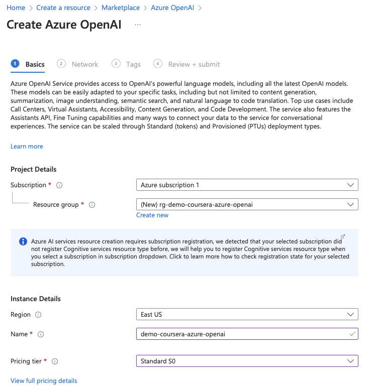

- Basics: see snapshot.
  - Check the [Azure OpenAI Pricing](https://azure.microsoft.com/en-gb/pricing/details/cognitive-services/openai-service/)
- Network: we select `all networks`, i.e., we can access the resource from the Internet. We could restrict that to selected networks or completely shut down network access.

:warning: **IMPORTANT**: When we deploy an Azure OpenAI instance **it incurs fixed costs even if we don't use it!**

Once created, we go to the resource:

- (Left) Resource Management > Keys and Endpoints: Endpoints + Credentials to access via Internet are here!
- (Left) Overview: general information
  - Here we should have also a link to the **Azure Open AI Studio** (old) or **Azure AI Foundry**.
  - In the Studio/Foundry, we can configure and deploy models, get credentials, try them in the playground, fine-tune them, etc.

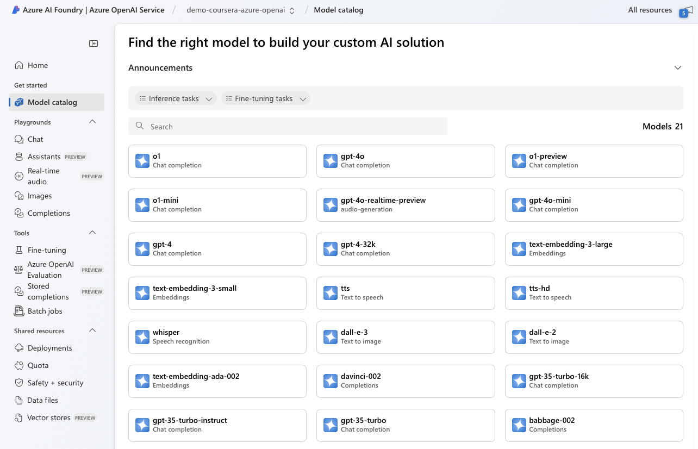

In **Azure AI Foundry**:

- In the **Shared Resources** section we have management tools:
  - Deployments: they should appear here, with their configuration properties.
  - Quotas: each region-model-subscription has a limit in tokens/minute, etc.
  - Data files: for fine-tuning
  - Safety and Security: content filters.
  - Quotas.
  - etc.
- In the **Playground**, we can use/chat with the deployed models.
  - We can use our deployed model in the chat.
  - If we click on `View code` we see the Python code for interaction.
- Deploying an Azure OpenAI model here is much easier than deploying any other readily available model.
  - No need to define Compute and/or configure Endpoints.
- Also, once deployed, we can change its configuration, e.g., change its Tokens Per Minute (TPM) quota.
  - One important feature is using the dynamic quota, i.e., capacity increases dynamically if general subscription quota is available.
  - Note also that we have a content filter by default! The answer will contain some assessment wrt. our filter!

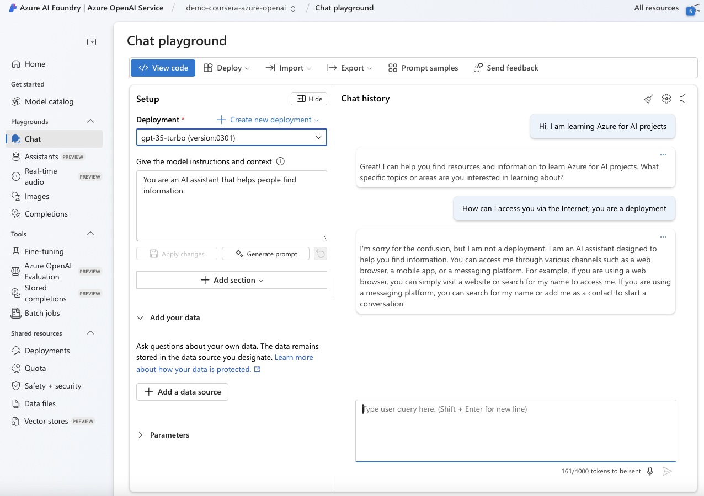

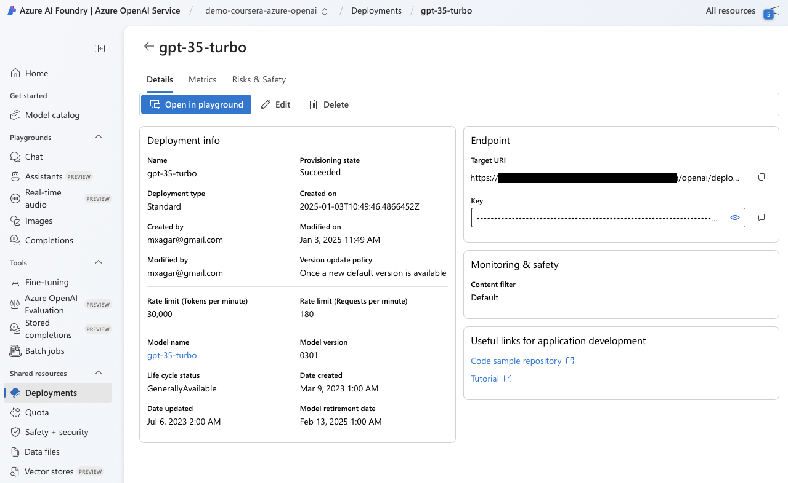

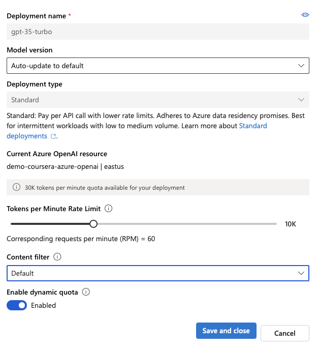

In the notebook [`01_azure_open_ai_basics.ipynb`](./notebooks/01_azure_open_ai_basics.ipynb) I show how to use the OpenAI deployment programmatically via REST; I used the API key and the Endpoint obtained from the Azure AI Foundry (Deployments).

- Note that we have access to the Endpoint URL and the keys in two spots:
  - In the Azure Portal, if we select the Azure OpenAI resource: Resource management > Keys and Endpoint.
  - In the Azure AI Foundry: Select deployment: Details view.
- Also, note that the Endpoint URL can have several forms:
  - A specific form is suited for `curl` or `requests` calls, because it contains all the elements necessary to contact our model.
  - A generic is shorter, it's the base of the specific; it is used by libraries, like `openai`.

In the Chat Playground, if we click on `View code` we see the Python code for interaction, which is different to the simple REST API call. The example code from `View code` has more options; I also tested it in the notebook.

```python
### -- Simple API Call

import os
import requests
from dotenv import load_dotenv

load_dotenv(override=True, dotenv_path=".env")

# Define your Azure OpenAI details
AZURE_OPENAI_ENDPOINT_URI = os.getenv("AZURE_OPENAI_ENDPOINT_URI")
AZURE_OPENAI_API_KEY = os.getenv("AZURE_OPENAI_API_KEY")

# Set up the request headers
headers = {
    "Content-Type": "application/json",
    "api-key": AZURE_OPENAI_API_KEY,
}

# Define the request body
data = {
    "messages": [
        {"role": "system", "content": "You are an assistant."},
        {"role": "user", "content": "Tell me a joke."},
    ],
    "max_tokens": 100,
}

# Send the POST request
response = requests.post(
    f"{AZURE_OPENAI_ENDPOINT_URI}",
    headers=headers,
    json=data,
)

# Handle the response
if response.status_code == 200:
    result = response.json()
    print("Response:")
    print(result["choices"][0]["message"]["content"])
else:
    print(f"Error: {response.status_code} - {response.text}")
# Response:
# Why don't scientists trust atoms? 
# 
# Because they make up everything.

### -- Code Example from Playground

import os  
import base64
from openai import AzureOpenAI
from dotenv import load_dotenv

load_dotenv(override=True, dotenv_path=".env")

# Now, the URL is shorter and we add the endpoint and deployment name
endpoint = os.getenv("ENDPOINT_URL")
deployment = os.getenv("DEPLOYMENT_NAME")
subscription_key = os.getenv("AZURE_OPENAI_API_KEY")

# Initialize Azure OpenAI client with key-based authentication    
client = AzureOpenAI(  
    azure_endpoint=endpoint,  
    api_key=subscription_key,  
    api_version="2024-05-01-preview",  
)

#Prepare the chat prompt 
chat_prompt = [
    {
        "role": "system",
        "content": "You are an AI assistant that helps people find information."
    }
] 
    
# Include speech result if speech is enabled  
messages = chat_prompt  
    
# Generate the completion  
completion = client.chat.completions.create(  
    model=deployment,  
    messages=messages,  
    max_tokens=800,  
    temperature=0.7,  
    top_p=0.95,  
    frequency_penalty=0,  
    presence_penalty=0,  
    stop=None,  
    stream=False
)

print(completion.to_json())
# {
#   ...
#   "choices": [
#     {
#       "message": {
#         "content": "Hello! How can I assist you in finding information today?",
#         "role": "assistant"
#       },
#   ...
# }
```

Note that the response from the API is very rich:

```json
{
  "id": "chatcmpl-xxx",
  "choices": [
    {
      "finish_reason": "stop",
      "index": 0,
      "logprobs": null,
      "message": {
        "content": "Hello! How can I assist you in finding information today?",
        "role": "assistant"
      },
      "content_filter_results": {
        "hate": {
          "filtered": false,
          "severity": "safe"
        },
        "self_harm": {
          "filtered": false,
          "severity": "safe"
        },
        "sexual": {
          "filtered": false,
          "severity": "safe"
        },
        "violence": {
          "filtered": false,
          "severity": "safe"
        }
      }
    }
  ],
  "created": 1735936877,
  "model": "gpt-35-turbo",
  "object": "chat.completion",
  "system_fingerprint": null,
  "usage": {
    "completion_tokens": 12,
    "prompt_tokens": 19,
    "total_tokens": 31
  },
  "prompt_filter_results": [
    {
      "prompt_index": 0,
      "content_filter_results": {}
    }
  ]
}
```

### 1.2 Overview of LLMs

Summary of flow in an LLM:

- A text is a sequence of words.
- Words are converted into tokens: indices in a vocabulary.
- Tokens are converted into embedding vectors.
- An LLM is a probability machine: given the input sequence of words (tokens, vectors), the probabilities of all the vocabulary tokens to be the next are predicted. Then, we choose according to different strategies, e.g., we pick the most probable one, or sample among the most probable ones.

Benefits and risks of LLMs:

- They create coherent text.
- Tasks that work well:
  - Summarization, given the original text.
  - Rewriting texts, given all the information.
- **BUT, they hallucinate**: they basically predict the next word based on the probability distributions they have learned.

Mitigating the risks of LLMs, in increasing order of difficulty and cost:

- Prompt engineering
- Add retrieval and extend context (RAG)
- Fine-tune with new documents
- Train from scratch

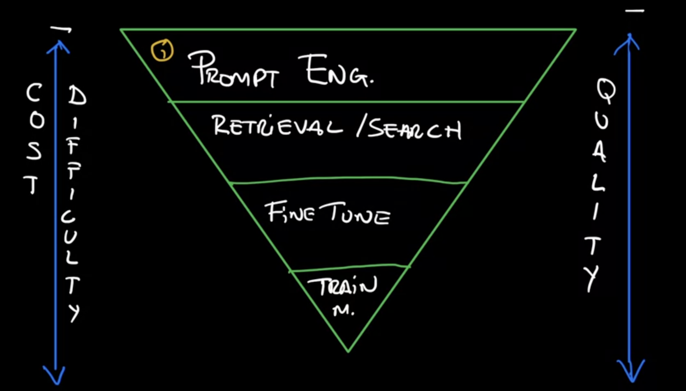

LLM Operations is composed of the following components:

1. Data
2. Models: training, fine-tuning, storage
3. Testing: evaluation of models
4. Search: we need to search data, etc.
5. Prompting: interface, commands to the LLMs
6. Deployment to the cloud: packaging, setting up inference, scaling, etc.
7. Monitoring: observe performance, drift, etc.

All those components need to be able to connect to each other and we need to be able to automate them.

Very interesting blog post by MS: [An Introduction to LLMOps: Operationalizing and Managing Large Language Models using Azure ML](https://techcommunity.microsoft.com/blog/machinelearningblog/an-introduction-to-llmops-operationalizing-and-managing-large-language-models-us/3910996).

### 1.3 LLM Deployment in Azure

:warning: If we get a deployment error associated with an *unregistred service*, that's because we need to **register** a service to our Subscription.
In Azure Portal:

    Select Subscriptio > Settings: Resource Providers > Search for Service, e.g.: Microsoft.MachineLearningServices > Register

#### Azure Machine Learning

The service Azure Machine Learning has many models from many vendors:

- All available models have been vetted to work on Azure.
- Some models might be available in given regions/zones.

Also, note that we can upload our models, e.g., in ONNX format!

Steps to browse the models:

- Create an instance/workspace, e.g., `demo-coursera-ml-us`.
- Open workspace and go to `Model catalog`.
- We can filter by many aspects:
  - Collections: HuggingFace, Meta, etc.
    - OpenAI models appear also here, but if we deploy one, we are redirected from Azure Machine Learning space to the Azure AI Foundry (previously Azure Open AI Studio).
  - Inference Task: text completion, summarization, object detection, etc.
  - Licenses
  - etc.

Important sections (left menu):

- `Model catalog`: curated models from Azure
- `Assets: Models`: all our model appear here, we can upload models, too
- `Assets: Environment`: a deployment requires an environment, which is usually a Docker image (`Dockerfile`) with optional files (`requirements.txt`); there are environments available and we can create custom ones.
- `Assets: Endpoints`: Models are deployed to an endpoint, which has a URI as well ass access credentials.
- `Manage: Compute`: Deployments require a compute resource, which is instantiated here.

Deployment options for the models:

- After a model is selected (e.g., from the Model catalog), we click on `Deploy`; we usually have the options
  - Pay-as-you-go
  - Real-time
  - Batch inference
- When we select a deployment method, sometimes we get the error *not enough quota*
  - That's because we need to first define a `Compute` instance 
    - We can select CPU/GPU
    - Look at the price per hour: the more resources, the more expensive
- If we want to deploy a custom model we uploaded, the procedure is similar, but we have to specify
  - The model (which needs to be uploaded, e.g. an ONNX file)
  - The environment (`Dockerfile` + `requirements.txt`)
  - The scoring script
  - The deployment configuration:
    - Managed compute vs Kubernetes
    - Authentication type
    - Timeout
    - etc.
  - etc.

Check [`02_azure_machine_learning_basics.ipynb`](./notebooks/02_azure_machine_learning_basics.ipynb) to see how a Pytorch model can be converted to ONNX format and uploaded to Azure Machine Learning.

Snapshot: Upload an ONNX Model

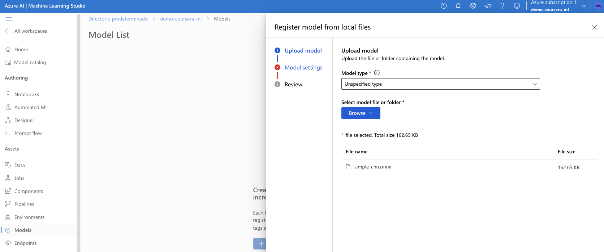

Snapshot: Deploy an ONNX Model

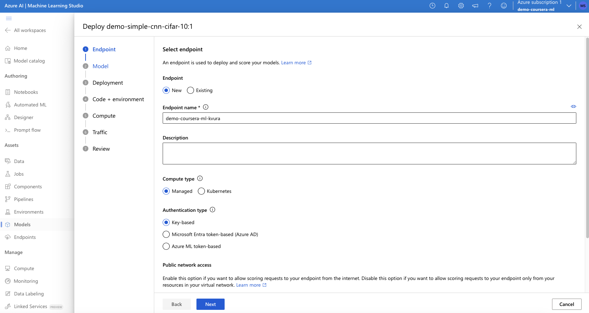

Snapshot: Scoring of an ONNX Model

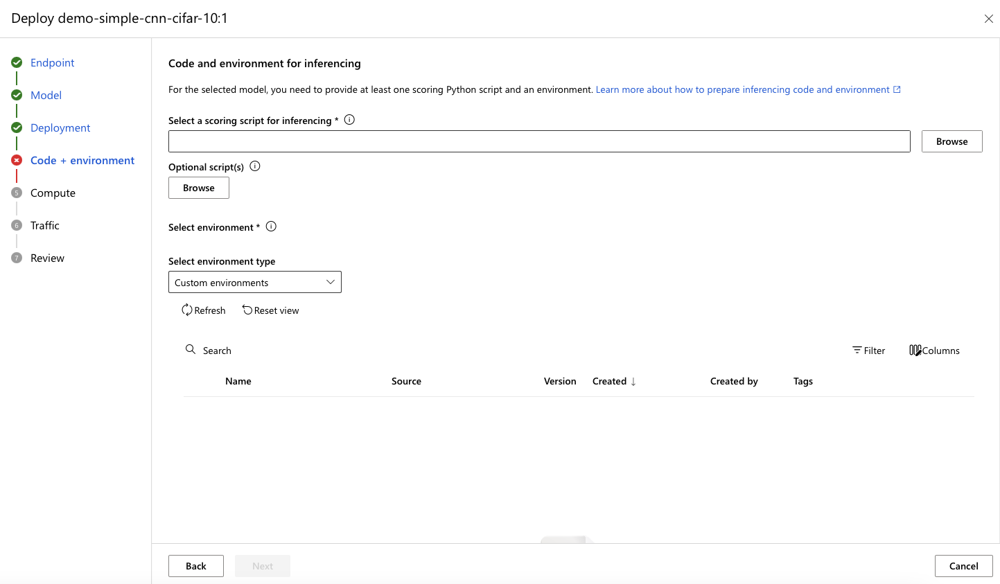

Snapshot: Deploy a Model from Catalog

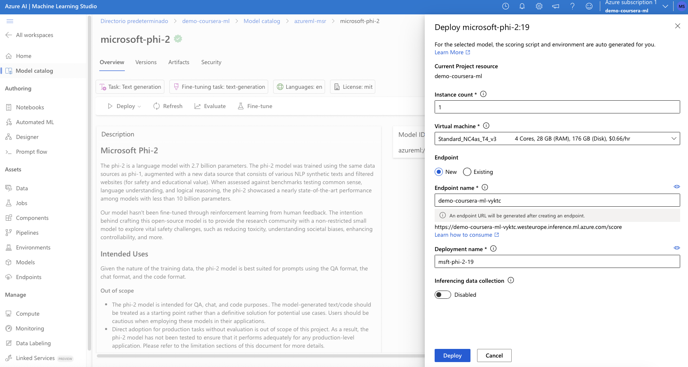

Snapshot: Deploy Compute

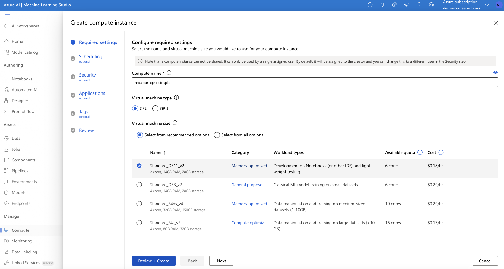

Snapshot: Deployed Compute Details. Note that we can launch come applications that are already running!

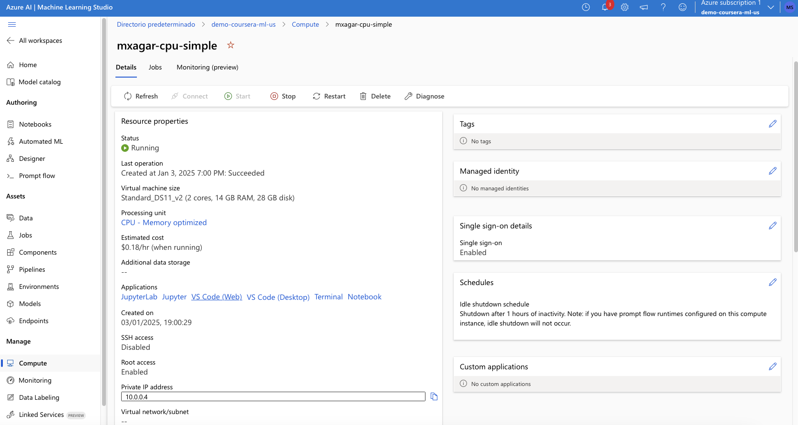

#### Azure AI Content Safety

Check: [What is Azure AI Content Safety?](https://learn.microsoft.com/en-us/azure/ai-services/content-safety/overview)

Azure AI Content Safety is an API which filters input/output content. Examples:

> - [Jailbreak risk detection](https://learn.microsoft.com/en-us/rest/api/contentsafety/text-operations/detect-text-jailbreak?view=rest-contentsafety-2024-02-15-preview&tabs=HTTP): Scans text for the risk of a User input attack on a Large Language Model. This is an input filter.
> - [Protected material test](https://learn.microsoft.com/en-us/rest/api/contentsafety/text-operations/detect-text-protected-material?view=rest-contentsafety-2024-09-01&tabs=HTTP): Scans AI-generated text for known text content (for example, song lyrics, articles, recipes, selected web content). This is an output filter.

**Content Safety** is a service, so we can create an instance in the Portal: `Search > Content safety`.

- When we instantiate/create one, we open the Azure Content Safety Studio
- We can configure and try the Content Safety functionality in the Azure Content Safety Studio.
  - However, we are going to use it usually via an API.
  - The Azure Content Safety Studio has links to the documentation and Python code examples where the API calls are performed via `resquests`.

#### Azure Open AI (Studio - or Azure AI Foundry)

Compared to Azure Machine Learning, the Azure OpenAI Studio (now Azure AI Foundry) is constrained to OpenAI models but it is much faster and easier to use.

See the previous section [Azure OpenAI](#azure-openai).

## 2. LLMs with Azure

### 2.1 Azure Machine Learning and LLMs

#### Check Quotas

Before deploying anything, we need to make sure we have the necessary quotas active.

    Azure Portal > Quotas > Machine Learning: Find Compute resource we need in region
        Device quota not enough? Request increase

The resource we are going to use the quota with needs to be in the same region; in our case, our Azure Machine Learning workspace must be deployed in the same region, e.g., East US, West Europe, etc.

A typical compute quota for ML applications is an NCAS device: NVIDIA GPU-enabled virtual machine (VM); they are expensive, so choose wisely. Example choice:

`Standard NCASv3_T4 Family Cluster Dedicated vCPUs` in West Europe (Usage: 0 of 12 available).

If we request it a quota increase, it takes some minutes to process.

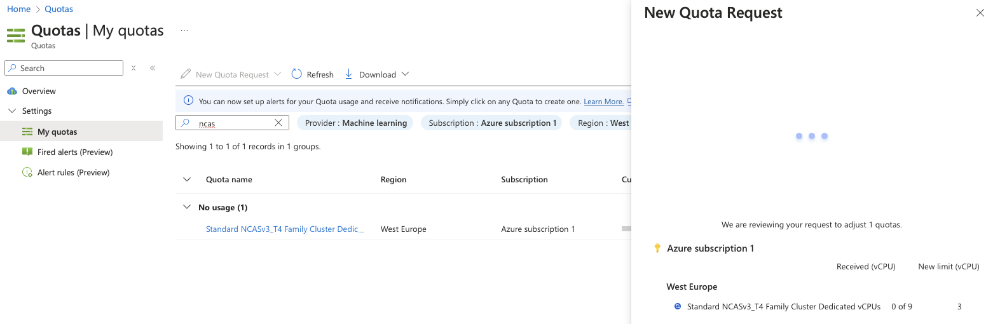

Also, note that the Azure Machine Learning Studio has also a section/tab called *Quotas*:

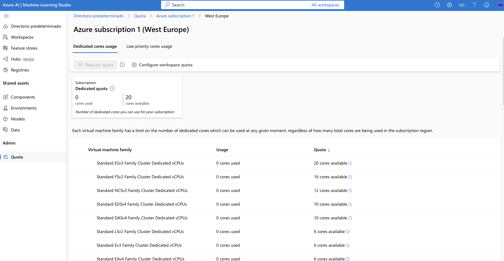

Some additional device families:

- Standard DASv4 Family Cluster Dedicated vCPUs: no GPU, but CPU and memory intensive work; e.g., for classical ML.
- Standard EDSv4 Family Cluster Dedicated vCPUs: no GPU, but large amounts of memory per CPU (AMD processors); e.g., for large-scale enterprise applications.
- Standard ESv3 Family Cluster Dedicated vCPUs: no GPU, memory-intensive workloads (Intel processors); e.g., Spark applications.
- ...

More information: [Azure subscription and service limits, quotas, and constraints](https://learn.microsoft.com/en-us/azure/azure-resource-manager/management/azure-subscription-service-limits).

#### Create Compute Instances

Once we have checked that we have available quota, we need to deploy a compute instance.

In out Azure Machine Learning Workspace (recall it's tied to a region), we go to `Compute` menu and deploy a compute instance:

- Select GPU if we need
- Select device; e.g.: Standard_NC6s_v3 (6 cores, 112 GB RAM, 736 GB disk)
  - GPU - 1 x NVIDIA Tesla V100
  - USD 3.82/hr (when running)
- After we deploy it and set it running, when we click on it 
  - We see we can apply some actions: Stop, Delete, Restart, etc.
  - We have some running applications available and accessible via link: Jupyter, etc.

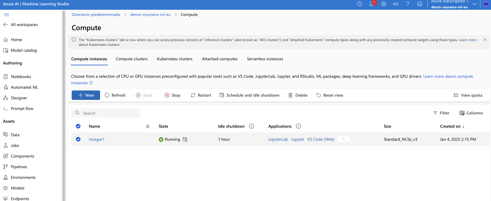

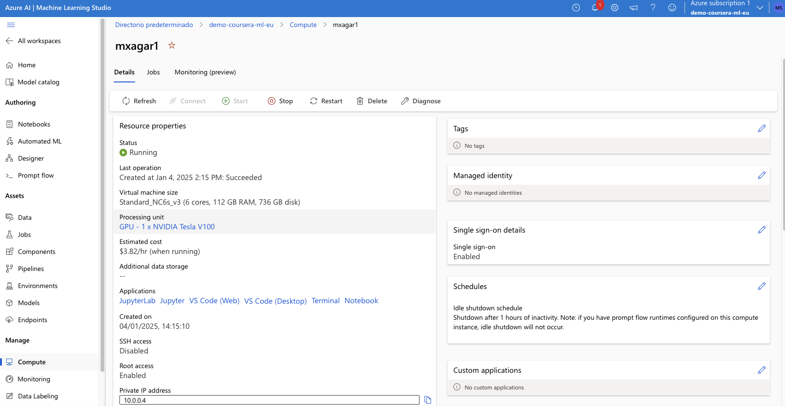

More information: [Tutorial: Create resources you need to get started](https://learn.microsoft.com/en-gb/azure/machine-learning/quickstart-create-resources?view=azureml-api-2).

#### Deploy a Model

When a Compute instance is deployed on our Azure Machine Learning Workspace, we can select a LLM model from the `Model catalog` and deploy it.

:warning: The example chosen in the course was `microsoft-phi-2`; however, I was not able to replicate the deployment, even tough I followed all the steps. I think the error is related to the quotas, and the current high demand for GPUs.

In the course video, the instructor shows that once deployed, we have several infos on the resource:

- Swagger URI: API documentation
- Authentication configuration: key or token
- REST endpoint
- Also, there as some important tabs:
  - Test
  - Consume: information for using the endpoint
    - Keys
    - Endpoint URL
    - Code examples
  - Monitoring
  - Logs tab

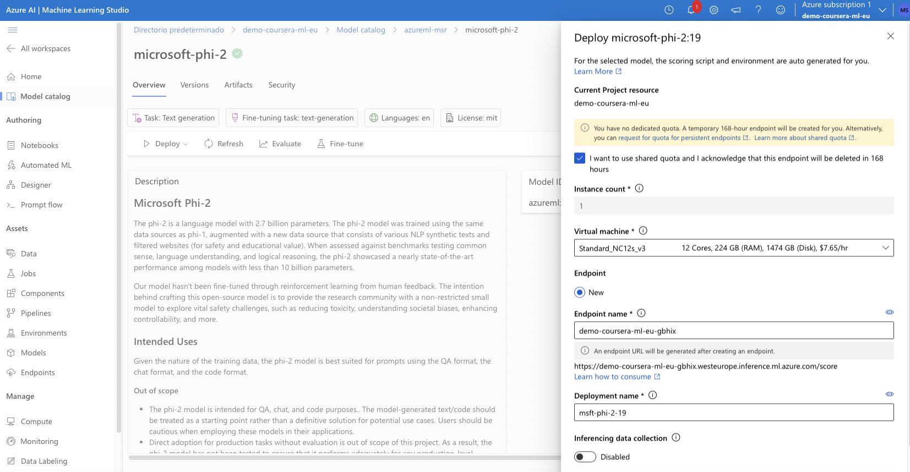

### 2.2 Azure OpenAI Service

Some months ago we needed to request access to Azure OpenAI; but apparently that's not the case anymore.

Compared to Azure Machine Learning, the Azure OpenAI Studio (now Azure AI Foundry) is constrained to OpenAI models but it is much faster and easier to use.

See the previous section [Azure OpenAI](#azure-openai).

### 2.3 Azure OpenAI APIs

This section is the continuation of the section [Azure OpenAI](#azure-openai).

Following the code example from the playground, a mini app is build.

- The application maintains a state called `history`, which contains the conversation so far.
- With a `while True` loop, we interact with the deployed LLM while the conversation is kept in memory (context).
- The code is in [`01_azure_open_ai_basics.ipynb`](./notebooks/01_azure_open_ai_basics.ipynb), but it is better suited to be run in a script.

```python
import os  
import base64
from openai import AzureOpenAI
from openai import ChatCompletion
from dotenv import load_dotenv
from typing import List, Dict, Optional

load_dotenv(override=True, dotenv_path=".env")

# Now, the URL is shorter and we add the endpoint and deployment name
endpoint = os.getenv("ENDPOINT_URL")
deployment = os.getenv("DEPLOYMENT_NAME")
subscription_key = os.getenv("AZURE_OPENAI_API_KEY")

# Initialize Azure OpenAI client with key-based authentication    
client = AzureOpenAI(  
    azure_endpoint=endpoint,  
    api_key=subscription_key,  
    api_version="2024-05-01-preview",  
)

def chat(user_message: str, history: Optional[list[dict]] = None) -> ChatCompletion:
    if history is None:
        history = [
            {
                "role": "system",
                "content": "You are an AI assistant that helps people find information."
            }
        ]

    # Insert the user message into the history
    history.append(
        {
            "role": "user",
            "content": user_message
        }
    )
    
    # Generate the completion  
    completion = client.chat.completions.create(  
        model=deployment,  
        messages=history,  
        max_tokens=800,  
        temperature=0.7,  
        top_p=0.95,
        frequency_penalty=0,  
        presence_penalty=0,  
        stop=None,  
        stream=False
    )
    
    # Extend history
    history.append(
        {
            "role": "assistant",
            "content": completion.choices[0].message.content
        }
    )
    
    return completion, history

history = None
while True:
    user_message = input(">>: ")
    completion, history = chat(user_message, history)
    print(f"assistant: {completion.to_dict()['choices'][0]['message']['content']}")

```

## 3. Extending with Functions and Plugins

The code of this entire section is from [alfredodeza/azure-chat-demo](https://github.com/alfredodeza/azure-chat-demo).

Unfortunately, an old version of [microsoft/semantic-kernel](https://github.com/microsoft/semantic-kernel) is used.

Therefore, I tried to port most parts into LangChain.

### 3.1 Improved Prompts with Semantic Kernel

Semantic Kernel is the Microsoft version of LangChain:

- [Introduction to Semantic Kernel](https://learn.microsoft.com/en-us/semantic-kernel/overview/)
- [microsoft/semantic-kernel](https://github.com/microsoft/semantic-kernel)
- [Official Quick Start Guide for Python](https://learn.microsoft.com/en-us/semantic-kernel/get-started/quick-start-guide?pivots=programming-language-python)

Installation:

```bash
pip install semantic-kernel
```
:warning: **The code examples don't work with newer versions!** Therefore, I tried to port most parts to LangChain.

See [`03_semantic_kernel/`](./notebooks/03_semantic_kernel/) for the original code.

See [`04_langchain.ipynb`](./notebooks/04_langchain.ipynb) for the ported code.

The original code with Semantic Kernel by Alfredo Deza is added to [`notebooks/03_semantic_kernel/`](./notebooks/03_semantic_kernel/) as a git submodule.

```bash
# Add and initialize the LanChain repo as a submodule
cd .../generative_ai_udacity
git submodule add https://github.com/alfredodeza/azure-chat-demo.git 06_RAGs_DeepDive/02_Azure_LLMs/notebooks/03_semantic_kernel/azure-chat-demo
git submodule init
git submodule update

# Add the automatically generated .gitmodules file to the repo
git add .gitmodules 06_RAGs_DeepDive/02_Azure_LLMs/notebooks/03_semantic_kernel/

# When my repository is cloned, initialize and update the submodule 
git clone https://github.com/mxagar/generative_ai_udacity
git submodule update --init --recursive
```

#### Prompts from Messages with LangChain

See [`04_langchain.ipynb`](./notebooks/04_langchain.ipynb).

```python
import os
from os.path import dirname
from dotenv import load_dotenv

from langchain.chat_models import AzureChatOpenAI
from langchain.prompts import ChatPromptTemplate
from langchain.schema import HumanMessage, SystemMessage, AIMessage

# Load environment variables
current_dir = os.path.abspath(".")
root_dir = dirname(current_dir)
env_file = os.path.join(current_dir, '.env')
load_dotenv(env_file, override=True)

# Retrieve Azure OpenAI credentials
#deployment_name = os.getenv("DEPLOYMENT_NAME")
#endpoint = os.getenv("ENDPOINT_URL")
api_key = os.getenv("AZURE_OPENAI_API_KEY")
azure_openai_endpoint = os.getenv("AZURE_OPENAI_ENDPOINT_URI")

# Initialize Azure OpenAI Chat model
# Additional model parameters passed: tempreature, max_tokens, top_p
chat_model = AzureChatOpenAI(
    azure_endpoint=azure_openai_endpoint,
    openai_api_version="2024-08-01-preview",
    openai_api_key=api_key,
    temperature=0.7,
    max_tokens=2000,
    top_p=0.8
)

# Define the prompt
# We can build a prompt using the ChatPromptTemplate class.
# We can create it from a list if messages; the messages can be: HumanMessage, SystemMessage, AIMessage
#   [SystemMessage(content="..."), HumanMessage(content="..."), AIMessage(content="..."), ...]
# Another option is to pass a list of tuples:
#   [("system", ("..."), ("human", "..."), ("ai", "..."), ...]
def create_prompt(user_input: str):
    return ChatPromptTemplate.from_messages([
        ("system", (
            "You are a wine specialist, a sommelier. Your name is Alfredo. "
            "You only know about Cabernet Franc, so any recommendation you make "
            "must insist on Cabernet Franc as an alternative."
        )),
        # We could just user_input, but here we add an additional hidden/default message/note
        ("human", (
            f"{user_input}\n\nProvide 3 wine options with a description. "
            "It is OK to make up descriptions of wines that do not exist."
        )),
    ])

# Main function
def main():
    # User input
    user_input = "I want a wine for a dinner party"

    # Create the prompt
    prompt = create_prompt(user_input)

    # Generate response from the model
    response = chat_model.invoke(prompt.format_prompt().to_messages())

    # Print the result
    print(response.content)

main()
```

### 3.2 Extending Results with Functions

These are the key ideas behind the approach of functions in LLMs:

- we define some functions with a signature/interface that are implemented locally or remotely (e.g., APIs);
- we expose to the LLM the signature/interface definition;
- when we ask a question to the LLM which could be resolved by the function, it creates the call arguments necessary for that;
- then, the result from the function call is used by the LLM to formulate the answer.

It is like creating some plug-ins for the LLMs!

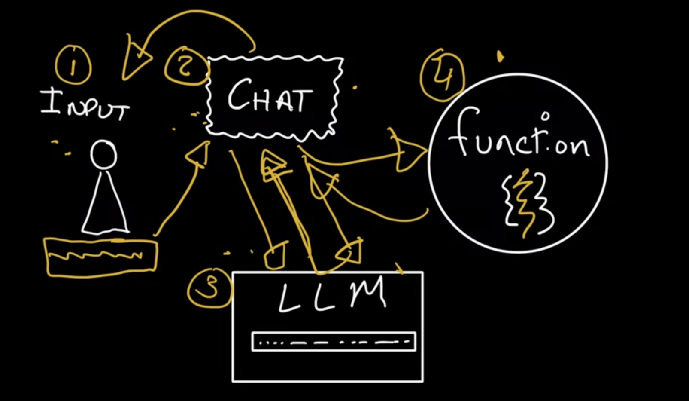

Documentation:

- [OpenAI Function Calling](https://platform.openai.com/docs/guides/function-calling)
- [OpenAI Python](https://github.com/openai/openai-python)

According to OpenAI:

> Function calling was introduced with the release of `gpt-4-turbo` on June 13, 2023. All `gpt-*` models released after this date support function calling.
> Legacy models released before this date were not trained to support function calling.

So we can use, e.g., `gpt-4o-mini`.

#### Functions with OpenAI Library

From [`04_langchain.ipynb`](./notebooks/04_langchain.ipynb):

```python
import os
from os.path import dirname
import json
from dotenv import load_dotenv

from langchain.chat_models import AzureChatOpenAI
from openai import AzureOpenAI
from langchain.prompts import ChatPromptTemplate
from langchain.schema import HumanMessage, SystemMessage, AIMessage, FunctionMessage

# Load environment variables
current_dir = os.path.abspath(".")
root_dir = dirname(current_dir)
env_file = os.path.join(current_dir, '.env')
load_dotenv(env_file, override=True)

# Retrieve Azure OpenAI credentials
deployment_name = os.getenv("DEPLOYMENT_NAME")
endpoint = os.getenv("ENDPOINT_URL")
api_key = os.getenv("AZURE_OPENAI_API_KEY")
azure_openai_endpoint = os.getenv("AZURE_OPENAI_ENDPOINT_URI")

# Get the API Key from environment variable AZURE_OPENAI_API_KEY
client = AzureOpenAI(
    api_key=api_key,
    # https://learn.microsoft.com/azure/ai-services/openai/reference#rest-api-versioning
    api_version="2024-08-01-preview", # API version is in the Endpoint URI
    # https://learn.microsoft.com/azure/cognitive-services/openai/how-to/create-resource?pivots=web-portal#create-a-resource
    azure_endpoint=endpoint,
)

# Define the get_weather function
def get_weather(location: str, date: str) -> dict:
    """
    Mock function to get weather information for a location and date.
    """
    return {
        "location": location,
        "date": date,
        "forecast": "sunny",
        "temperature": "25°C"
    }

# Define the function schema
tools = [
    {
        "type": "function",
        "function": {
            "name": "get_weather",
            "parameters": {
                "type": "object",
                "properties": {
                    "location": {"type": "string"},
                    "date": {"type": "string"},
                },
            },
        },
    }
]


# Main function
def main():
    user_query = "What is the weather in Paris tomorrow?"

    # Send the initial request to the model
    response = client.chat.completions.create(
        messages=[
            {"role": "system", "content": "You are an AI assistant."},
            {"role": "user", "content": user_query}
        ],
        model=deployment_name,
        tools=tools,
        #tool_choice="auto"  # Let the model decide when to call the function
    )

    # Check if the model requested a function call
    if response.choices[0].message.tool_calls is not None:
        function_call = response.choices[0].message.tool_calls[0].function
        function_name = function_call.name
        function_arguments = json.loads(function_call.arguments)

        # Execute the requested function
        if function_name == "get_weather":
            function_result = get_weather(**function_arguments)

        # Send the function result back to the model
        # after extending the messages with the function result
        # NOTE: We are invoking the LLM again, which incurs in more costs
        # Another option is handle the function call locally!
        final_response = client.chat.completions.create(
            messages=[
                {"role": "system", "content": "You are an AI assistant."},
                {"role": "user", "content": user_query},
                {"role": "function", "name": function_name, "content": json.dumps(function_result)}
            ],
            model=deployment_name
        )

        # Print the model's final response
        print(final_response.choices[0].message.content)
    else:
        # Print the model's direct response
        print(response.choices[0].message.content)

main()
```

#### Functions with LangChain Library

From [`04_langchain.ipynb`](./notebooks/04_langchain.ipynb):

```python
import os
import json
from dotenv import load_dotenv
from langchain.chat_models import AzureChatOpenAI
from langchain.schema import SystemMessage, HumanMessage, AIMessage, FunctionMessage
from langchain.prompts import ChatPromptTemplate

# Load environment variables
current_dir = os.path.abspath(".")
root_dir = dirname(current_dir)
env_file = os.path.join(current_dir, '.env')
load_dotenv(env_file, override=True)

# Retrieve Azure OpenAI credentials
deployment_name = os.getenv("DEPLOYMENT_NAME")
endpoint = os.getenv("ENDPOINT_URL")
api_key = os.getenv("AZURE_OPENAI_API_KEY")
azure_openai_endpoint = os.getenv("AZURE_OPENAI_ENDPOINT_URI")

# Initialize Azure OpenAI via LangChain
chat_model = AzureChatOpenAI(
    azure_endpoint=azure_openai_endpoint,
    openai_api_version="2024-08-01-preview", # API version is in the Endpoint URI
    openai_api_key=api_key,
    temperature=0.7
)

# Define the get_weather function as a LangChain tool
def get_weather(location: str, date: str) -> dict:
    """
    Mock function to get weather information for a location and date.
    """
    return {
        "location": location,
        "date": date,
        "forecast": "sunny",
        "temperature": "25°C"
    }

# Define the tool schema for LangChain
tools = [get_weather]

# Define the function schemas for LangChain
function_schemas = [
    {
        "name": "get_weather",
        "description": "Provides weather information for a given location and date.",
        "parameters": {
            "type": "object",
            "properties": {
                "location": {"type": "string", "description": "The city to get the weather for."},
                "date": {"type": "string", "description": "The date to get the weather for (e.g., '2023-09-25')."}
            },
            "required": ["location", "date"]
        }
    }
]

# Define the prompt template
def create_prompt(user_input: str):
    return ChatPromptTemplate.from_messages([
        SystemMessage(content="You are an AI assistant."),
        HumanMessage(content=user_input)
    ])

# Main function
def main():
    user_query = "What is the weather in Paris tomorrow?"

    # Initial response with tool metadata
    response = chat_model.invoke(
        create_prompt(user_query).format_prompt().to_messages(),
        functions=function_schemas,
        function_call="auto"  # Allow the model to decide when to call the function
    )

    # Check if the model requests a function call
    if response.additional_kwargs.get("function_call"):
        function_call = response.additional_kwargs["function_call"]
        function_name = function_call["name"]
        function_arguments = json.loads(function_call["arguments"])

        # Execute the requested function
        if function_name == "get_weather":
            function_result = get_weather(**function_arguments)

        # Send the function result back to the model
        # after extending the messages with the function result
        # NOTE: We are invoking the LLM again, which incurs in more costs
        # Another option is handle the function call locally!
        messages = create_prompt(user_query).format_prompt().to_messages()
        messages.append(FunctionMessage(name=function_name, content=json.dumps(function_result)))
        final_response = chat_model.invoke(messages)

        print(final_response.content)
    else:
        # Handle direct responses
        print(response.content)

main()
```

#### Structured Outputs with OpenAI Library

```python
import os
from os.path import dirname
import json
from dotenv import load_dotenv
from enum import Enum
from typing import Union
from pydantic import BaseModel

from langchain.chat_models import AzureChatOpenAI
import openai
from openai import AzureOpenAI
from langchain.prompts import ChatPromptTemplate
from langchain.schema import HumanMessage, SystemMessage, AIMessage, FunctionMessage

# Load environment variables
current_dir = os.path.abspath(".")
root_dir = dirname(current_dir)
env_file = os.path.join(current_dir, '.env')
load_dotenv(env_file, override=True)

# Retrieve Azure OpenAI credentials
deployment_name = os.getenv("DEPLOYMENT_NAME")
endpoint = os.getenv("ENDPOINT_URL")
api_key = os.getenv("AZURE_OPENAI_API_KEY")
azure_openai_endpoint = os.getenv("AZURE_OPENAI_ENDPOINT_URI")

# Get the API Key from environment variable AZURE_OPENAI_API_KEY
client = AzureOpenAI(
    api_key=api_key,
    # https://learn.microsoft.com/azure/ai-services/openai/reference#rest-api-versioning
    api_version="2024-08-01-preview", # API version is in the Endpoint URI
    # https://learn.microsoft.com/azure/cognitive-services/openai/how-to/create-resource?pivots=web-portal#create-a-resource
    azure_endpoint=endpoint,
)

# Define the structured output as a Pydantic model
class GetDeliveryDate(BaseModel):
    order_id: str

# Define the tools: convert the Pydantic model to a function tool
tools = [openai.pydantic_function_tool(GetDeliveryDate)]
# If we are not using the SDK, we can define the tool manually
# but we need to add the `strict: True` parameter.
# I obtained the manual schema by printing tools[0]
tools_ = [
    {
        'type': 'function',
        'function': {
            'name': 'GetDeliveryDate',
            'strict': True,
            'parameters': {
                'properties': {
                    'order_id': { 'title': 'Order Id', 'type': 'string' }
                },
                'required': ['order_id'], 
                'title': 'GetDeliveryDate',
                'type': 'object',
                'additionalProperties': False
                }
            }
    },
]

# Define the prompt/history
messages = []
messages.append({"role": "system", "content": "You are a helpful customer support assistant. Use the supplied tools to assist the user."})
messages.append({"role": "user", "content": "Hi, can you tell me the delivery date for my order #12345?"})

response = client.chat.completions.create(
    model=deployment_name,
    messages=messages,
    tools=tools,
    #tools=tools_,
)

print(response.choices[0].message.tool_calls[0].function)
# Function(arguments='{"order_id":"12345"}', name='GetDeliveryDate')
```

### 3.3 Using Functions with External APIs

In this section, a locally run API is used by the LLM, wrapped in a function.

The original API code is very simple and has been cloned as a submodule from Alfredo Deza's repository [alfredodeza/historical-temperatures](https://github.com/alfredodeza/historical-temperatures).

```bash
# Add and initialize the LanChain repo as a submodule
cd .../generative_ai_udacity
git submodule add https://github.com/alfredodeza/historical-temperatures.git 06_RAGs_DeepDive/02_Azure_LLMs/notebooks/historical-temperatures-api
git submodule init
git submodule update

# Add the automatically generated .gitmodules file to the repo
git add .gitmodules 06_RAGs_DeepDive/02_Azure_LLMs/notebooks/

# When my repository is cloned, initialize and update the submodule 
git clone https://github.com/mxagar/generative_ai_udacity
git submodule update --init --recursive
```

#### API Code

[`notebooks/historical-temperatures-api/webapp/main.py`](./notebooks/historical-temperatures-api/webapp/main.py):

```python
import json
from os.path import dirname, abspath, join
from fastapi import FastAPI
from fastapi.responses import RedirectResponse
from fastapi.staticfiles import StaticFiles


current_dir = dirname(abspath(__file__))
historical_data = join(current_dir, "weather.json")

app = FastAPI()


# Loads the historical data for Portugal cities
with open(historical_data, "r") as f:
    data = json.load(f)


@app.get('/')
def root():
    return RedirectResponse(url='/docs', status_code=301)


@app.get('/countries')
def countries():
    # Only allows Portugal for now
    return list(data.keys())


@app.get('/countries/{country}/{city}/{month}')
def monthly_average(country: str, city: str, month: str):
    return data[country][city][month]

```

The app uses [`weather.json`](./notebooks/historical-temperatures-api/webapp/weather.json), which contains data only for 3 cities in Portugal:

```json
{
  "Portugal": {
    "Lisbon": {
      "January": { "high": 57, "low": 46 },
      "February": { "high": 60, "low": 47 },
      ...
      "December": { "high": 58, "low": 48 }
    },
    "Porto": {
      "January": { "high": 55, "low": 45 },
      "February": { "high": 58, "low": 46 },
      ...
      "December": { "high": 56, "low": 46 }
    },
    "Braga": {
      "January": { "high": 55, "low": 43 },
      "February": { "high": 58, "low": 45 },  
      ...
      "December": { "high": 57, "low": 45 }
    }
  }
}
```

#### Running the API

In a separate Terminal, start `uvicorn`:

```bash
cd .../notebooks/historical-temperatures-api
uvicorn --host 0.0.0.0 webapp.main:app
```

Inspect the running API at [http://127.0.0.1:8000/docs](http://127.0.0.1:8000/docs) after you see the following output:

```
$ uvicorn --host 0.0.0.0 webapp.main:app
INFO:     Started server process [37770]
INFO:     Waiting for application startup.
INFO:     Application startup complete.
INFO:     Uvicorn running on http://0.0.0.0:8000 (Press CTRL+C to quit)
```

FastAPI builds a Swagger UI docs where we can play with the API manually.

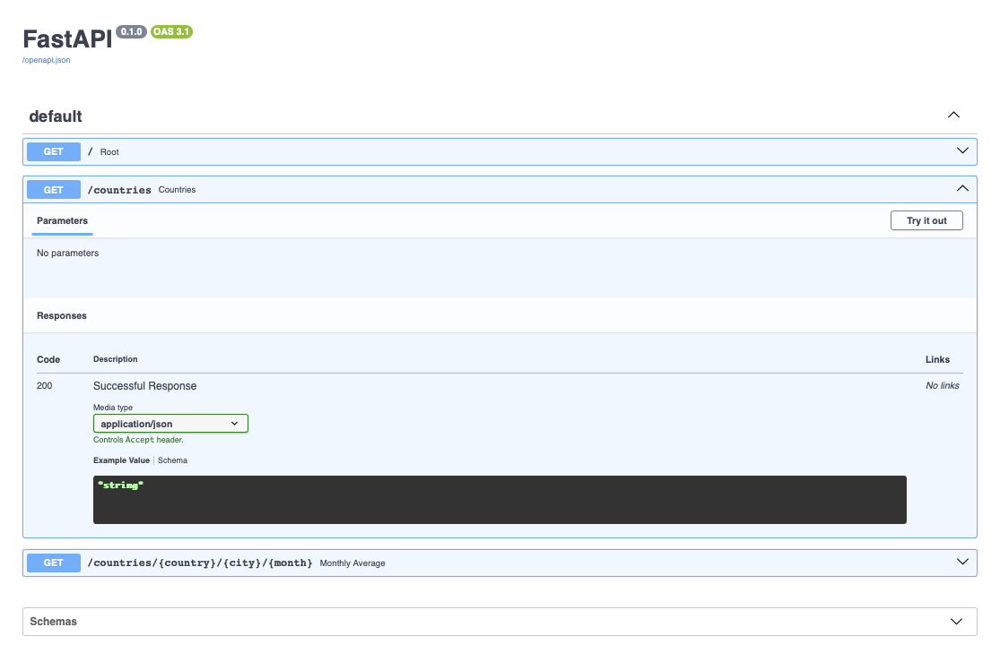

We can now start requesting data to the API via REST calls.
The app uses [`weather.json`](./notebooks/historical-temperatures-api/webapp/weather.json), which contains data only for 3 cities in Portugal.

#### Using the API with Azure OpenAI

See [`04_langchain.ipynb`](./notebooks/04_langchain.ipynb).

Nothing really new is used here; the main difference is that the local function we redirect to after the LLM call is connected to the API.

The FastAPI app needs to be running.

```python
import os
import json
import requests
from dotenv import load_dotenv
from langchain.chat_models import AzureChatOpenAI
from langchain.schema import SystemMessage, HumanMessage, AIMessage, FunctionMessage
from langchain.prompts import ChatPromptTemplate

# Load environment variables
current_dir = os.path.abspath(".")
root_dir = dirname(current_dir)
env_file = os.path.join(current_dir, '.env')
load_dotenv(env_file, override=True)

# Retrieve Azure OpenAI credentials
deployment_name = os.getenv("DEPLOYMENT_NAME")
endpoint = os.getenv("ENDPOINT_URL")
api_key = os.getenv("AZURE_OPENAI_API_KEY")
azure_openai_endpoint = os.getenv("AZURE_OPENAI_ENDPOINT_URI")

# Initialize Azure OpenAI via LangChain
chat_model = AzureChatOpenAI(
    azure_endpoint=azure_openai_endpoint,
    openai_api_version="2024-08-01-preview", # API version is in the Endpoint URI
    openai_api_key=api_key,
    temperature=0.7
)

# Define the travel_weather function as a LangChain tool
def travel_weather(city=None, month=None) -> str:
    """Gets the average temperature for a city in a month using an API."""
    microservice_url = "http://127.0.0.1:8000"
    result = requests.get(f"{microservice_url}/countries/Portugal/{city}/{month}").json()
    res = f"The average high temperature in {city} in {month} is {result['high']} degrees."
    return res

# Define the tool schema for LangChain
tools = [travel_weather]

# Define the function schemas for LangChain
function_schemas = [
    {
        "name": "travel_weather",
        "description": "Finds the average temperature for a city in a month.",
        "parameters": {
            "type": "object",
            "properties": {
                "city": {"type": "string", "description": "The city to get the weather for."},
                "month": {"type": "string", "description": "The month to get the weather for (e.g., 'January')."}
            },
            "required": ["city", "month"]
        }
    }
]

# Define the prompt template
def create_prompt(user_input: str):
    return ChatPromptTemplate.from_messages([
        SystemMessage(content="You are a travel weather chat bot. Your name is Frederick. You are trying to help people find the average temperature in a city in a month."),
        HumanMessage(content=user_input)
    ])

# Main function
def main():
    user_query = "I'm travelling to Porto, and it seems that it would happen in January. What would be the average temperature?"

    # Initial response with tool metadata
    response = chat_model.invoke(
        create_prompt(user_query).format_prompt().to_messages(),
        functions=function_schemas,
        function_call="auto"  # Allow the model to decide when to call the function
    )

    # Check if the model requests a function call
    if response.additional_kwargs.get("function_call"):
        function_call = response.additional_kwargs["function_call"]
        function_name = function_call["name"]
        function_arguments = json.loads(function_call["arguments"])

        # Execute the requested function
        res = None
        if function_name == "travel_weather":
            res = travel_weather(**function_arguments)

        if res is not None:
            print(res)

    else:
        # Handle direct responses
        print(response.content)

main()
# The average high temperature in Porto in January is 55 degrees.
```

## 4. Building an End-to-End Application in Azure

### 4.1 Architecture

Summary:

- The section covers the architectural overview and components involved in building an end-to-end application using large language models; specifically, the RAG (Retrieval Augmented Generation) pattern is introduced.
- The application is built entirely using Microsoft Azure Cloud services; it uses, among others, the Azure AI Search service.
- Github Actions are also introduced, as a way to automate deployment.

LLMs are trained in many tokens/texts, but they might not have specific knowledge we want. A [RAG (Retrieval Augmented Generation)](https://arxiv.org/abs/2005.11401) application is able to plug in new knowledge to the model via its context:

- First, we index documents which contain new information; e.g., in a vector DB.
- When we ask the Query, the Framework (e.g., LangChain or our Application) retrieves the Documents which are likely to contain the answer.
- With those Documents, the Context is created.
- The LLM is invoked in a Prompt which contains the Query and the Context (i.e., we already provide the answer as specified in our Documents).
- The answer of the LLM is returned to the User.


Azure enables the necessary components to implement [Retrieval Augmented Generation (RAG) using Azure AI Search](https://learn.microsoft.com/en-us/azure/search/retrieval-augmented-generation-overview).


#### Azure AI Search

Azure AI Search (previously known as Azure Cognitive Search) is a basic Azure service we need; it allows to search data from storage components.

We can manually create it, e.g.:


Important: Choose the Free Tier with 50 MB of storage.

Once created and configured, if we go to the resource in the Portal, we see we can

- **Import Data** manually
  - For that, we need to either create or connect a Blob Storage Account
- We can search in the **Indexes**
- etc.


More information can be found in the official Azure documentation: [Create an Azure AI Search service in the Azure portal](https://learn.microsoft.com/en-gb/azure/search/search-create-service-portal)

- **Configure authentication** (for programmatic access)
- Scale your service (Partitions and Replicas)
- When to add a second service
- Add more services to a subscription

#### Github Actions

Github Actions allow to easily deploy an application to the cloud, i.e., Azure.

- We can enter secrets to Github.
- Under `.github/workflows` a YAML file is created with all the jobs/steps necessary for deployment.
- We usually get a template YAML which we modify to our needs.
- Typical steps:
  - Checkout repo branch
  - Setup Docker
  - Login to Github and get secrets
  - Build our container and push it to Azure Container Registry (ACR)
  - Deploy Azure Container App (after authentication)

The example shown in the video is the following:

[`alfredodeza/huggingface-azure-acr/.github/workflows/main.yml`](https://github.com/alfredodeza/huggingface-azure-acr/blob/main/.github/workflows/main.yml)

```yaml
name: Trigger auto deployment for demo-container

#env:
#  AZURE_CONTAINER_APP_NAME: demo-container
#  AZURE_GROUP_NAME: demo-container

# When this action will be executed
on:
  # Automatically trigger it when detected changes in repo. Remove comments to enable
  #push:
  #  branches: 
  #    [ main ]

  # Allow mannually trigger 
  workflow_dispatch:      

jobs:
  build:
    runs-on: ubuntu-latest

    steps:
      - name: Checkout to the branch
        uses: actions/checkout@v2

      - name: Set up Docker Buildx
        uses: docker/setup-buildx-action@v1

      - name: Log in to GitHub container registry
        uses: docker/login-action@v1.10.0
        with:
          registry: demoalfredo.azurecr.io
          username: ${{ secrets.ACR_USERNAME }}
          password: ${{ secrets.ACR_PASSWORD }}

      - name: Lowercase the repo name and username
        run: echo "REPO=${GITHUB_REPOSITORY,,}" >>${GITHUB_ENV}

      - name: Build and push container image to ACR registry
        uses: docker/build-push-action@v2
        with:
          push: true
          tags: demoalfredo.azurecr.io/${{ env.REPO }}:${{ github.sha }}
          file: ./Dockerfile

  deploy:
    runs-on: ubuntu-latest
    needs: build
    
    steps:
      - name: Azure Login
        uses: azure/login@v1
        with:
          creds: ${{ secrets.AZURE_CREDENTIALS }}


      - name: Deploy to containerapp
        uses: azure/CLI@v1
        with:
          inlineScript: |
            az config set extension.use_dynamic_install=yes_without_prompt
            az containerapp registry set -n demo-container -g demo-container --server demoalfredo.azurecr.io --username ${{ secrets.ACR_USERNAME }} --password ${{ secrets.ACR_PASSWORD }}
            az containerapp update -n demo-container -g demo-container --cpu 2 --memory 4Gi
            az containerapp update -n demo-container -g demo-container --image demoalfredo.azurecr.io/alfredodeza/huggingface-azure-acr:${{ github.sha }}
```

#### Azure AI Document Intelligence

A link to this blog post is provided:

[Elevating RAG and Search: The Synergy of Azure AI Document Intelligence and Azure OpenAI](https://techcommunity.microsoft.com/blog/azure-ai-services-blog/elevating-rag-and-search-the-synergy-of-azure-ai-document-intelligence-and-azure/4006348)

Key ideas in the blog post:

> The Azure AI Document Intelligence Layout model offers a comprehensive solution for semantic chunking by providing advanced content extraction and document structure analysis capabilities.
> With this model, you can easily extract paragraphs, tables, titles, section headings, selection marks, font/style, key-value pairs, math formulas, QR code/barcode and more from various document types.
> The extracted information can be conveniently outputted to markdown format, enabling you to define your semantic chunking strategy based on the provided building blocks.
> The model is highly scalable in Optical Character Recognition (OCR), table extraction, document structure analysis (e.g., paragraphs, titles, section headings), and reading order detection, ensuring high-quality results driven by AI capabilities.
> It supports 309 printed and 12 handwritten languages.

We can go to [Azure AI Document Intelligence Studio](https://documentintelligence.ai.azure.com/studio/layout), choose the Analyze options and try it!

- First, create a `Document Intelligence` service instance.
- Go to [Azure AI Document Intelligence Studio](https://documentintelligence.ai.azure.com/studio/layout) (link should appear in the deployed Doc Intelligence Resource).
- Select any of the default analysis options: OCR, Layout, General Documents.
  - Select a RG which contains a `Document Intelligence` instance or create one.
  - Run the analysis.
- Note that there are much more pre-built analysis models!
  - Invoices
  - Receipts
  - Id documents
  - US health insurance cards
  - US personal tax
  - Contracts
  - ...

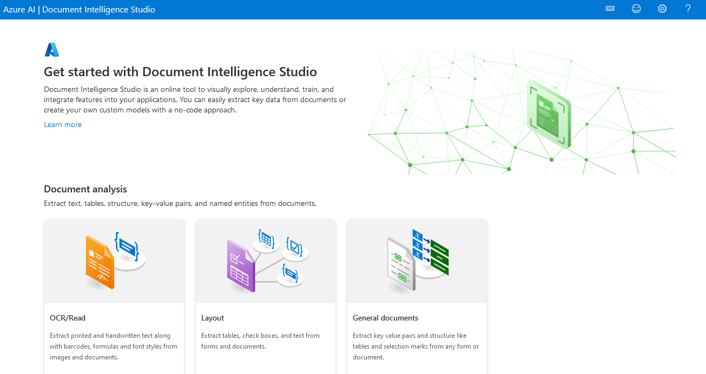

Example in which the layour of the original RAG paper by Leweis et al. is analyzed (sections are detected as bounding boxes and a JSON is generated with boudning box information, such as location, content, type of bounding box, etc.):

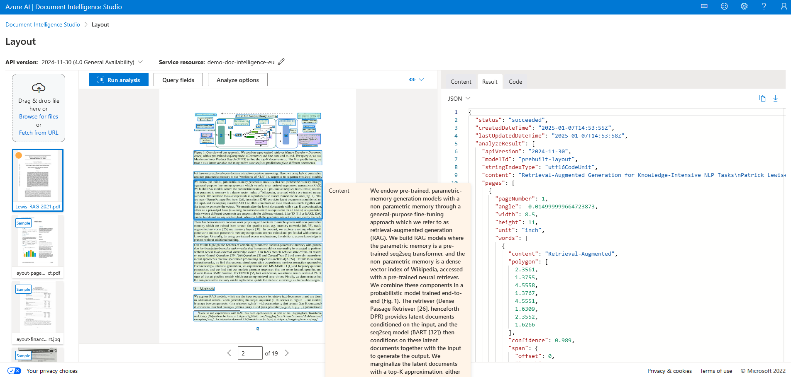

Additional resources:

- [Quickstart: Document Intelligence SDKs](https://learn.microsoft.com/en-us/azure/ai-services/document-intelligence/quickstarts/get-started-sdks-rest-api?view=doc-intel-4.0.0&pivots=programming-language-python#layout-model) – use your preferred SDK or REST API to extract content and structure from documents.
- [Sample code of using Layout API to output in markdown format](https://github.com/Azure/azure-sdk-for-python/blob/main/sdk/documentintelligence/azure-ai-documentintelligence/samples/sample_analyze_documents_output_in_markdown.py).

##### Notebook

See [`05_azure_doc_intelligence.ipynb`](./notebooks/05_azure_doc_intelligence.ipynb).

Sources:

- [sample_analyze_documents_output_in_markdown.py](https://github.com/Azure/azure-sdk-for-python/blob/main/sdk/documentintelligence/azure-ai-documentintelligence/samples/sample_analyze_documents_output_in_markdown.py)
- [DocumentIntelligenceClient Class](https://learn.microsoft.com/en-us/python/api/azure-ai-documentintelligence/azure.ai.documentintelligence.documentintelligenceclient?view=azure-python#azure-ai-documentintelligence-documentintelligenceclient-begin-analyze-document)
- [AnalyzeDocumentRequest Class](https://learn.microsoft.com/en-us/python/api/azure-ai-documentintelligence/azure.ai.documentintelligence.models.analyzedocumentrequest?view=azure-python)
- [AnalyzeResult Class](https://learn.microsoft.com/en-us/python/api/azure-ai-formrecognizer/azure.ai.formrecognizer.analyzeresult?view=azure-python)
- [sample_analyze_layout.py](https://github.com/Azure/azure-sdk-for-python/blob/main/sdk/documentintelligence/azure-ai-documentintelligence/samples/sample_analyze_layout.py)

```python
import os
from os.path import dirname
from dotenv import load_dotenv

from azure.core.credentials import AzureKeyCredential
from azure.ai.documentintelligence import DocumentIntelligenceClient
from azure.ai.documentintelligence.models import (
    AnalyzeDocumentRequest, DocumentContentFormat, AnalyzeResult
)

# Load environment variables
current_dir = os.path.abspath(".")
root_dir = dirname(current_dir)
env_file = os.path.join(current_dir, '.env')
load_dotenv(env_file, override=True)

def pdf2markdown(file_path: str):
    # Get the endpoint and key from the environment
    endpoint = os.environ["AZURE_DOCUMENTINTELLIGENCE_ENDPOINT"]
    key = os.environ["AZURE_DOCUMENTINTELLIGENCE_API_KEY"]
    # NOTE: we could also use a URL instead of the local file path
    #url = "https://github.com/mxagar/generative_ai_udacity/blob/main/06_RAGs_DeepDive/02_Azure_LLMs/literature/Lewis_RAG_2021_one_page.pdf"

    client = DocumentIntelligenceClient(endpoint=endpoint, credential=AzureKeyCredential(key))
    with open(file_path, "rb") as file_stream:
        poller = client.begin_analyze_document(
            model_id="prebuilt-layout",
            body=file_stream,  # Pass the local file stream
            #body=AnalyzeDocumentRequest(url_source=url), # Use this line to analyze a document from a URL
            output_content_format=DocumentContentFormat.MARKDOWN,
            content_type="application/pdf",  # Explicitly specify content type
        )
        result: AnalyzeResult = poller.result()

    print(f"Here's the full content in format {result.content_format}:\n")
    print(result.content)


def analyze_layout(file_path: str, display: bool = True):
    def _in_span(word, spans):
        for span in spans:
            if word.span.offset >= span.offset and (word.span.offset + word.span.length) <= (span.offset + span.length):
                return True
        return False

    def _format_polygon(polygon):
        if not polygon:
            return "N/A"
        return ", ".join([f"[{polygon[i]}, {polygon[i + 1]}]" for i in range(0, len(polygon), 2)])

    endpoint = os.environ["AZURE_DOCUMENTINTELLIGENCE_ENDPOINT"]
    key = os.environ["AZURE_DOCUMENTINTELLIGENCE_API_KEY"]

    client = DocumentIntelligenceClient(endpoint=endpoint, credential=AzureKeyCredential(key))
    with open(file_path, "rb") as f:
        poller = client.begin_analyze_document("prebuilt-layout", body=f)
    result: AnalyzeResult = poller.result()

    if display:
        if result.styles and any([style.is_handwritten for style in result.styles]):
            print("Document contains handwritten content")
        else:
            print("Document does not contain handwritten content")

        for page in result.pages:
            print(f"----Analyzing layout from page #{page.page_number}----")
            print(f"Page has width: {page.width} and height: {page.height}, measured with unit: {page.unit}")

            if page.lines:
                for line_idx, line in enumerate(page.lines):
                    words = []
                    if page.words:
                        for word in page.words:
                            print(f"......Word '{word.content}' has a confidence of {word.confidence}")
                            if _in_span(word, line.spans):
                                words.append(word)
                    print(
                        f"...Line # {line_idx} has word count {len(words)} and text '{line.content}' "
                        f"within bounding polygon '{_format_polygon(line.polygon)}'"
                    )

            if page.selection_marks:
                for selection_mark in page.selection_marks:
                    print(
                        f"Selection mark is '{selection_mark.state}' within bounding polygon "
                        f"'{_format_polygon(selection_mark.polygon)}' and has a confidence of {selection_mark.confidence}"
                    )

        if result.paragraphs:
            print(f"----Detected #{len(result.paragraphs)} paragraphs in the document----")
            # Sort all paragraphs by span's offset to read in the right order.
            result.paragraphs.sort(key=lambda p: (p.spans.sort(key=lambda s: s.offset), p.spans[0].offset))
            print("-----Print sorted paragraphs-----")
            for paragraph in result.paragraphs:
                if not paragraph.bounding_regions:
                    print(f"Found paragraph with role: '{paragraph.role}' within N/A bounding region")
                else:
                    print(f"Found paragraph with role: '{paragraph.role}' within")
                    print(
                        ", ".join(
                            f" Page #{region.page_number}: {_format_polygon(region.polygon)} bounding region"
                            for region in paragraph.bounding_regions
                        )
                    )
                print(f"...with content: '{paragraph.content}'")
                print(f"...with offset: {paragraph.spans[0].offset} and length: {paragraph.spans[0].length}")

        if result.tables:
            for table_idx, table in enumerate(result.tables):
                print(f"Table # {table_idx} has {table.row_count} rows and " f"{table.column_count} columns")
                if table.bounding_regions:
                    for region in table.bounding_regions:
                        print(
                            f"Table # {table_idx} location on page: {region.page_number} is {_format_polygon(region.polygon)}"
                        )
                for cell in table.cells:
                    print(f"...Cell[{cell.row_index}][{cell.column_index}] has text '{cell.content}'")
                    if cell.bounding_regions:
                        for region in cell.bounding_regions:
                            print(
                                f"...content on page {region.page_number} is within bounding polygon '{_format_polygon(region.polygon)}'"
                            )

        print("----------------------------------------")
    
    return result


pdf2markdown("../literature/Lewis_RAG_2021_one_page.pdf")
result = analyze_layout("../literature/Lewis_RAG_2021_one_page.pdf")
```

#### Suggested Extra Exercises

Azure AI Search:

- [ ] Use the Azure CLI or SDK to create an Azure AI Search service.
- [ ] Configure an Azure role like "Search Service Contributor" for managing the service.
- [ ] Try creating an index and loading data using the portal import data wizard.
- [ ] Experiment with different partition and replica configurations.
- [ ] Compare capabilities between the Free and Basic tiers.

Azure Document Intelligence:

- [x] Analyze a document via the portal.
- [x] Convert a document into Markdown with the SDK.

### 4.2 RAG with Azure AI Search

**Important source: [Retrieval-Augmented Generation (RAG) - Bea Stollnitz](https://bea.stollnitz.com/blog/rag/). It shows how to create a RAG application on Azure.**

**This section is very important, bevcause in its notebook a basic RAG application is built using Azure Services.**

The section code is from Alfredo Deza's repository [alfredodeza/azure-rag](https://github.com/alfredodeza/azure-rag), and it's added as a submodule.

```bash
# Add and initialize the LanChain repo as a submodule
cd .../generative_ai_udacity
git submodule add https://github.com/alfredodeza/azure-rag.git 06_RAGs_DeepDive/02_Azure_LLMs/notebooks/azure-rag
git submodule init
git submodule update

# Add the automatically generated .gitmodules file to the repo
git add .gitmodules 06_RAGs_DeepDive/02_Azure_LLMs/notebooks/

# When my repository is cloned, initialize and update the submodule 
git clone https://github.com/mxagar/generative_ai_udacity
git submodule update --init --recursive
```

Overview of the infrastructure for the RAG application:

- Resources created manually (Azure Portal):
  - Azure AI Search (France Central): `rg-demo-coursera-ai-search/demo-coursera-ai-search`
    - It will contain and index, created programmatically.
  - Azure OpenAI (East US, access from everywhere): `rg-demo-coursera-azure-openai/demo-coursera-azure-openai`
    - Chat model, deployed beforehand: `gpt-4o-mini`
    - Embeddings model, deployed beforehand: `text-embedding-ada-002`
  - Azure Container App: Backend - FastAPI with all the code
    - Github Container Registry used for Container
- Deployment: Using Github Actions

#### Azure AI Search: Upload and Search for Embeddings

Azure AI Search and OpenAI Embeddings are used via LangChain!

See [`06_azure_search_rag.ipynb`](./notebooks/06_azure_search_rag.ipynb).

**This notebook is ver important, as it shows all the basic steps of a RAG application:**

- Loading Documents with LangChain: PDF and CSV
- Splitting Documents with LangChain: RecursiveCharacterTextSplitter, CharacterTextSplitter
- Creating Embeddings, Creating Index and Uploading Documents and Search of Documents
  - Chunk and Index Data with Embeddings Service: AzureSearch, AzureOpenAIEmbeddings
  - Retrieve Data: AzureSearch, AzureAISearchRetriever
  - Retrieving with a Chain: RAG Chain!

These resources need to be created beforehand:

- Azure OpenAI
  - Chat model
  - Embeddings model
- Azure AI Search

The Azure AI Search service contains indexes with searchable documents.
When we instantiate the Azure AI Search service it has no index; we programmatically create and populate it when we add documents.
Then, those documents are searchable: programmatically and also in the Azure Portal:

    RG > Search service > Search management > Indexes > index_name

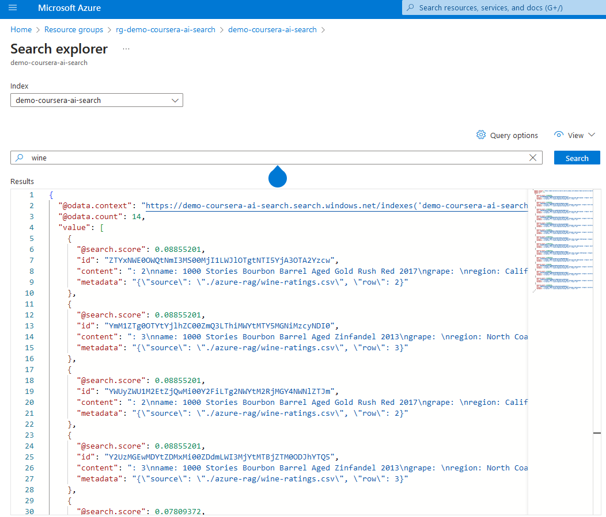

Links to documentation of used objects:

- [AzureOpenAIEmbeddings](https://python.langchain.com/docs/integrations/text_embedding/azureopenai/)
- [AzureOpenAIEmbeddings API Reference](https://python.langchain.com/api_reference/openai/embeddings/langchain_openai.embeddings.azure.AzureOpenAIEmbeddings.html)
- [AzureSearch](https://python.langchain.com/docs/integrations/vectorstores/azuresearch/)
- [AzureAISearchRetriever](https://python.langchain.com/docs/integrations/retrievers/azure_ai_search/)
- [AzureAISearchRetriever API Reference (langchain_community)](https://python.langchain.com/api_reference/community/retrievers/langchain_community.retrievers.azure_ai_search.AzureAISearchRetriever.html)

Notebook [`06_azure_search_rag.ipynb`](./notebooks/06_azure_search_rag.ipynb) contents:

```python
import os
from os.path import dirname
from pprint import pprint
from dotenv import load_dotenv

# Load environment variables
current_dir = os.path.abspath(".")
root_dir = dirname(current_dir)
env_file = os.path.join(current_dir, '.env')
load_dotenv(env_file, override=True)

## -- Loading Documents with LangChain: PDF and CSV

from langchain.document_loaders import PyPDFLoader

# The PyPDFLoader loads each page into a document
loader = PyPDFLoader("../literature/Lewis_RAG_2021.pdf")
pages = loader.load_and_split()  # Same effect as .load()
print(pages[0].page_content)

from langchain.document_loaders import CSVLoader

# The CSVLoader loads each row into a separate document, similar to a page in a PDF
loader = CSVLoader("./azure-rag/wine-ratings.csv")
rows = loader.load()
rows
# [Document(metadata={'source': './azure-rag/wine-ratings.csv', 'row': 0}, page_content=': 0\nname: 1000 Stories Bourbon Barrel Aged Batch Blue Carignan...'), ...]

## -- Splitting Documents with LangChain: RecursiveCharacterTextSplitter, CharacterTextSplitter

from langchain.text_splitter import RecursiveCharacterTextSplitter

# Splitting text by recursively look at characters.
# Recursively tries to split by different characters to find one that works.
# Attempts to split text hierarchically, respecting semantic boundaries (e.g., sentences, paragraphs)?
text_splitter = RecursiveCharacterTextSplitter.from_tiktoken_encoder(
    chunk_size=300, 
    chunk_overlap=50)

splits = text_splitter.split_documents(pages)

from langchain.text_splitter import CharacterTextSplitter

text_splitter = CharacterTextSplitter(chunk_size=1000, chunk_overlap=0)
docs = text_splitter.split_documents(rows)

## -- Creating Embeddings, Creating Index and Uploading Documents and Search of Documents

import openai
#from langchain.embeddings import OpenAIEmbeddings
from langchain_openai import AzureOpenAIEmbeddings
from langchain.vectorstores import AzureSearch

# Retrieve Azure credentials and variables
load_dotenv(env_file, override=True)
azure_openai_endpoint = os.getenv("AZURE_OPENAI_ENDPOINT")
azure_openai_endpoint_uri = os.getenv("AZURE_OPENAI_ENDPOINT_URI")
embedding_deployment_name = os.getenv("EMBEDDING_DEPLOYMENT_NAME")
chat_deployment_name = os.getenv("CHAT_DEPLOYMENT_NAME")
azure_openai_api_key = os.getenv("AZURE_OPENAI_API_KEY")
azure_openai_api_version = os.getenv("AZURE_OPENAI_API_VERSION")
azure_search_api_key = os.getenv("AZURE_SEARCH_API_KEY")
azure_search_endpoint = os.getenv("AZURE_SEARCH_ENDPOINT")
azure_search_index_name = os.getenv("AZURE_SEARCH_INDEX_NAME")

embeddings = AzureOpenAIEmbeddings(
    deployment=embedding_deployment_name,
    azure_endpoint=azure_openai_endpoint,
    api_version=azure_openai_api_version,
    api_key=azure_openai_api_key,
    chunk_size=1
)

# Connect to Azure AI Search
# The first time an index is created, with the name index_name
# We can check that in Azure Portal
acs = AzureSearch(
    azure_search_endpoint=azure_search_endpoint,
    azure_search_key=azure_search_api_key,
    index_name=azure_search_index_name,
    embedding_function=embeddings.embed_query
)

### -- Chunk and Index Data with Embeddings Service: AzureSearch, AzureOpenAIEmbeddings

from langchain.document_loaders import CSVLoader
from langchain.text_splitter import CharacterTextSplitter

# The CSVLoader loads each row into a separate document, similar to a page in a PDF
loader = CSVLoader("./azure-rag/wine-ratings.csv")
rows = loader.load()
# Splitter
text_splitter = CharacterTextSplitter(chunk_size=1000, chunk_overlap=0)
docs = text_splitter.split_documents(rows)

# Upload the splitted docs to the Azure AI Search Index!
# Returns list of IDs of the added texts
# NOTE: It takes a lot of time, depending on the number of documents & tier of the service
# After it is done, we should be able to check the indexed data in teh Azure Portal
#   RG > Search service > Search explorer: we can even test the search queries there
# The index should be filled too
#   RG > Search service > Search management > Indexes > index_name
#   Here, we can activate to get the content_vector field, i.e., the embedding: tab Fields > content_vector retrievable
# NOTE: After teh indexing, it might take some minutes until the index is searchable/available
ids = acs.add_documents(documents=docs[:7])

### -- Retrieve Data: AzureSearch, AzureAISearchRetriever

# Perform a similarity search
docs = acs.similarity_search(
    query="wine",
    k=3,
    search_type="similarity",
)
print(docs[0].page_content)

# Perform a similarity search with relevance scores
docs = acs.similarity_search_with_relevance_scores(
    query="What is the best Bourbon Barrel wine?",
    k=3,
)
print(docs[0][0].page_content)
print(dir(docs[0][0]))

# Each returned document is a tuple with single element
# and the element is a Pydantic model
docs[0][0].model_dump()

from langchain_community.retrievers import AzureAISearchRetriever

retriever = AzureAISearchRetriever(
    content_key="content",
    api_key=azure_search_api_key,
    index_name=azure_search_index_name,
    service_name=azure_search_endpoint,
    top_k=1,
)

# The AzureAISearchRetriever returns a list of documents.
# The documents are Pydantic models.
# These documents contain, among others:
# - @search.score
# - index id
# - content_vector
# - metadata
# - page_content
docs = retriever.invoke("What is the best Bourbon Barrel wine?")
pprint(docs[0].model_dump())

### -- Retrieving with a Chain: RAG Chain!

from langchain_core.output_parsers import StrOutputParser
from langchain_core.prompts import ChatPromptTemplate
from langchain_core.runnables import RunnablePassthrough
from langchain_openai import AzureChatOpenAI

prompt = ChatPromptTemplate.from_template(
    """Answer the question based only on the context provided.

Context: {context}

Question: {question}"""
)

# Initialize Azure OpenAI via LangChain
chat_model = AzureChatOpenAI(
    azure_endpoint=azure_openai_endpoint_uri, # Long URI, not the base
    openai_api_version=azure_openai_api_version,
    openai_api_key=azure_openai_api_key,
    temperature=0.7
)

def format_docs(docs):
    return "\n\n".join(doc.page_content for doc in docs)

chain = (
    {"context": retriever | format_docs, "question": RunnablePassthrough()}
    | prompt
    | chat_model
    | StrOutputParser()
)

chain.invoke("What is the best Bourbon Barrel wine?")
# 'Based on the provided context, the best Bourbon Barrel wine is the 1000 Stories Bourbon Barrel Aged Zinfandel 2013, which has a rating of 91.0.'

```

### 4.3 Deployment and Scaling with Github Action

**This section is also very important, because everything is put into an application on the cloud!**

The final example code is in [`notebooks/07_azure_rag/`](./notebooks/07_azure_rag/). This section is about building and describing the steps necessary to create that example folder.

As in the previous section, the original code (although modified here by me) is from Alfredo Deza's repository [alfredodeza/azure-rag](https://github.com/alfredodeza/azure-rag), and it's added as a submodule; if already added, you can skip these setup commands:

```bash
# Add and initialize the LanChain repo as a submodule
cd .../generative_ai_udacity
git submodule add https://github.com/alfredodeza/azure-rag.git 06_RAGs_DeepDive/02_Azure_LLMs/notebooks/azure-rag
git submodule init
git submodule update

# Add the automatically generated .gitmodules file to the repo
git add .gitmodules 06_RAGs_DeepDive/02_Azure_LLMs/notebooks/

# When my repository is cloned, initialize and update the submodule 
git clone https://github.com/mxagar/generative_ai_udacity
git submodule update --init --recursive
```

